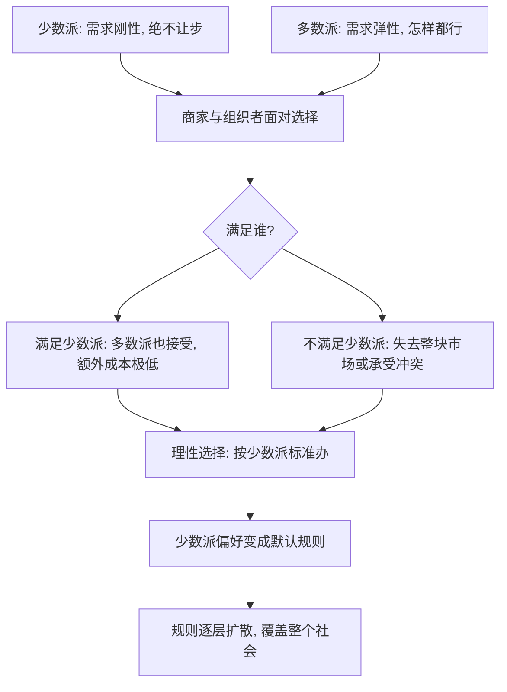

# 07｜为什么一个不宽容的少数派能统治温顺的多数？

> 本文要解决的问题：为什么美国市场上绝大多数饮料都印着犹太洁食认证标志，尽管严格遵守洁食戒律的人只占总人口的百分之二左右？

---

## 一、先说结论

塔勒布把这个现象叫作「少数派统治」（minority rule）：**当少数派的偏好不可妥协、而多数派对此无所谓时，少数派赢。** 市场、餐桌乃至社会规则，会系统性地向最不肯让步的人倾斜——不是因为他们人多，而是因为他们的「不行」比多数人的「都行」更有分量。多数社会规则不是由最多数人写下的，而是由最坚决的少数人写下的；温顺的多数负责接受，不宽容的少数负责立法。

## 二、我们先理解一个问题

先想象一个场景。

办公室十个人聚餐订披萨。其中一个同事是穆斯林，不吃猪肉；另外九个人什么都吃，对披萨上有没有香肠完全无所谓。

结果是什么？每次都点无猪肉的披萨。九个人的「都可以」，输给了一个人的「不可以」——而且没有任何人觉得委屈，因为无猪肉披萨对九个人来说毫无损失，对一个人来说却是能不能吃的区别。

再把同样的问题放大：如果妥协的成本极低，而不妥协的一方绝不让步，那么不管少数派只有百分之一还是千分之一，规则都会向他们收敛。塔勒布说，这不是偶然现象，而是一条支配市场与社会演化的普遍机制。

## 三、作者到底提出了什么观点？

塔勒布认为，多数直觉是错的。我们习惯以为「多数决定规则」，但真实的机制是：**偏好不对称决定规则。**

少数派统治要成立，需要两个条件。

第一，偏好不对称：少数派对某件事「绝不让步」（信条的、健康的、尊严的），多数派对同一件事「怎样都行」。一边的需求是刚性的，另一边是弹性的。

第二，多数派的让步成本足够低：顺着少数派办，多数人不损失什么，或者损失小到懒得计较。

两个条件齐了，结果是数学化的必然：满足少数派，多数派也接受；不满足少数派，就会失去这块市场或引发冲突。于是理性的商家、组织者、制度设计者，统统选择按少数派的标准办——少数派的偏好就这样变成了所有人的默认设置。

塔勒布还把这条机制推到了更远的地方：语言的演化、道德的扩张、宗教的兴衰。他认为，历史上扩张得快的群体，往往是对规则「最不让步」的群体，而不是人最多或最宽容的群体。宽容听起来是美德，但在规则之争里，宽容等于弃权。

## 四、把这个观点翻译成人话

用一句大白话说：**谈判桌上，赢的不是人多的一方，是「没得谈」的一方。**

谁先说「这是我的底线」，规则就围着谁写。底线越硬、越不可商量的人，在博弈里的权重越大——大到可以抵消人数上的绝对劣势。

生活里的对应物比比皆是。家庭聚餐的菜单由最挑食的成员决定；项目排期由最「不接受改期」的干系人锁定；朋友群里选餐厅，永远是那个「这家不行那家也不行」的人行使实质否决权。多数派不是被说服的，是被「麻烦」劝退的——和你争的成本太高，顺着你的成本太低，那就顺着你。

## 五、为什么会这样？

塔勒布描述的机制是这样的：

这套机制背后有三个支点。

第一，**否决权的不对称**。刚性需求本质上是否决权：「这个我不能接受」对决策的杀伤力，远大于九个「我都可以」。在博弈结构里，能掀桌子的人天然比只想坐下吃饭的人更有议价权。

第二，**成本的涓滴计算**。对商家来说，给饮料做洁食认证的成本是几分钱，失去的却是坚持者的全部购买；不做认证，多数派不会夸你，做了认证，多数派也不介意。单向的损益结构，让「向少数派看齐」成为稳赚不赔的选择。

第三，**扩散的滚雪球**。一旦头部厂商按少数派标准做了，行业标准就变了；行业标准一变，后来者只能跟随；跟随者多了，「例外」反而要额外解释成本。少数派的偏好像墨水滴进水里，不可逆地染色整个池子。

## 六、举一个现实生活中的例子

先看饮料货架。历史事实是：美国市场上绝大多数瓶装饮料——可乐、果汁、瓶装水——都带有犹太洁食（kosher）认证标志，瓶身上那个小小的「OU」或「K」字样。而严格遵循洁食戒律的犹太教徒，只占美国人口的百分之二左右。

为什么？因为这两个条件凑齐了：对严守戒律的消费者来说，没有认证的饮料是不可接受的，需求绝对刚性；对其他人来说，瓶子上有无这个标志毫无差别，甚至根本没注意过。对厂商，认证成本微乎其微，不做却意味着放弃一块不肯妥协的市场。于是最理性的选择是把全部产品都认证——百分之二的人的规则，就这样写进了百分之百的人的饮料瓶上。

再看学校食堂。一个孩子对花生严重过敏——对他是可能致命的刚性需求；其他几百个孩子呢？不吃花生，吃点别的，损失几乎为零。于是现实世界中大量学校出台了全校范围的花生禁令：一个孩子的「绝对不行」，改写了全校几百个家庭的购物清单。没有家长觉得需要为此投票，因为让步成本太低，低到没人愿意当那个说「我偏要带花生酱」的人。

塔勒布会说，这两个例子不是「好心照顾少数」的温情故事，而是不对称偏好自动运转的冷冰冰的结果——**就算没有善意，机制照样成立；善意只是顺便。**

## 七、回到书中重新理解

现在再看塔勒布的主张，就更立体了。他说，理解少数派统治，是理解「社会规则从哪来」的钥匙：规则不是公投投出来的，是在无数次微小的不对称博弈里被「最坚决的人」磨出来的。

这也意味着，塔勒布对「不宽容」的评价是双面的。一方面，他冷静地指出机制本身无善恶：不宽容的少数派赢，和他们是花生过敏的孩子还是极端主义者无关——结构只认刚性，不认动机。另一方面，他反而给个人提了一条建议：在无关紧要的事上随和从众，在原则和底线的事上寸步不让。**做那个在大事上「没得谈」的人，而不是那个事事都行、结果事事被动的人。**

## 八、这个观点背后还有什么？

少数派统治背后，藏着三层更深的意味。

第一，它解释了一种反直觉的历史动力学。一些学者认为，历史上的制度变革与信仰扩散，常常不是多数派缓慢共识的产物，而是少数坚决者强行写就的——宽容的、随遇而安的群体，在规则之争中其实是结构性弱者。「好人不争」的美德，在机制层面等于把立法权拱手让人。

第二，它重新解释了市场的「民主性」。我们常说市场按多数人的需求配置资源，但塔勒布指出：市场响应的是**需求的刚性程度**，不是需求的人数。刚性就是力量——这个发现对商业策略的含义是：抓住一小撮「非此不可」的用户，常常比讨好一大片「可有可无」的用户更值钱。

第三，它给「不对称」这个全书主题补上了社会维度。前面几篇讲的是不对称怎么转嫁代价；这一篇讲的是不对称怎么**制定规则**。同一个逻辑：收益与代价、坚持与让步的不对等分布，塑造了世界运行的方式。

## 九、这个观点有问题吗？

有说服力的地方很明显：洁食饮料、清真食品、无障碍设施、过敏原标识的扩散，都符合这个机制的预测，而且它们确实是在没有全民公投的情况下成为默认规则的。「刚性打败弹性」也是一个干净的博弈论推论。

但边界和争议同样清楚。

第一，机制成立需要严苛条件——多数派的让步成本必须足够低。一旦让步变贵，多数派的「无所谓」会迅速变成「很有所谓」：如果全校禁的是肉而不是花生，反弹立刻就来。塔勒布举的例子都挑在成本极低的区间，对高成本冲突（土地、权力、核心价值观），这个机制的解释力会骤降——少数派在那些战场上往往不是赢，是被碾压。

第二，「不宽容者必胜」可能过度推广。历史上坚决的少数派既造就过变革，也大批地被消灭在摇篮里。存活下来的坚决者会被我们看见，死去的不会——这里有明显的幸存者偏差。关于少数派何时能改写规则、何时只会撞碎在墙上，学界存在不同解释，塔勒布提供的是其中一个锋利的切面。

第三，概念上有混淆之嫌。花生过敏者的「不让步」是生理求生，宗教戒律的不让步是信仰，极端主义的不让步是意识形态——塔勒布把三者归入同一机制，这在机制层面成立，但在道德层面把它们抹平了。批评者会认为：我们该捍卫的「坚决」和该警惕的「不宽容」，恰恰需要机制之外的区分。

第四，它有一个隐含悖论：如果人人都学会「在大事上不让步」，而大家的大事彼此冲突，机制给出的答案是什么？塔勒布没有充分回答——两个同样刚性的少数派对撞时，「最不让步者赢」就不再是规律，而是战场。

## 十、今天再看这个观点

以下部分是基于作者思想的现代延伸，不是作者原话。

互联网把少数派统治的引擎加大了几个量级。社交媒体让一小撮高声、坚决、绝不妥协的用户，可以设定整个平台的议程：多数沉默者觉得「不至于争这个」，于是议题、措辞乃至规则，都由最不肯算了的人写下。舆论的「温和多数」在机制上是弃权票。

产品设计也在上演同一出戏：最挑剔的极端用户往往决定了产品迭代方向，「沉默的大多数」的真实需求反而没人代表。算法进一步放大了这一切——它天然偏爱强情绪、强立场的内容，而强立场的持有者，正是分布里最「不让步」的那一截。

反过来看，理解这条机制也是一种自卫：当你发现自己所属的「多数」被一套从未同意的规则支配时，问题通常不是对方人多，而是你的阵营太「无所谓」。

## 十一、这一篇真正应该记住什么？

1. 少数派统治：少数派的偏好刚性 + 多数派的让步成本低 = 少数派赢。
2. 规则不是按人头分配的，是按「坚决程度」分配的——底线最硬的人执笔。
3. 市场响应的是需求的刚性，不是需求的人数；「非此不可」比「可有可无」值钱。
4. 机制本身无善恶：它既让过敏的孩子得到保护，也可能让极端者绑架议程。
5. 对个人的启示：小事随和，大事不让——宽容该有边界，边界之内寸步不退。

## 十二、留一个问题

环顾你的生活：餐桌上的菜单、办公室的制度、社区的规定、平台的规则——有哪些其实是被「最不让步的那个人」写下的？而你自己，有没有在哪件真正重要的事上，做过那个「没得谈」的人？

但「坚决」也可能只是姿态。有人寸步不让是真押上了身家性命，有人高调强硬只是零成本的表演——在一个被不对称支配的世界里，怎么分辨哪个信号是真的？塔勒布的答案很硬核：真信号必须是昂贵的。下一篇我们就从一间外科诊室讲起：为什么选医生，反而要选那个最不像医生的？
