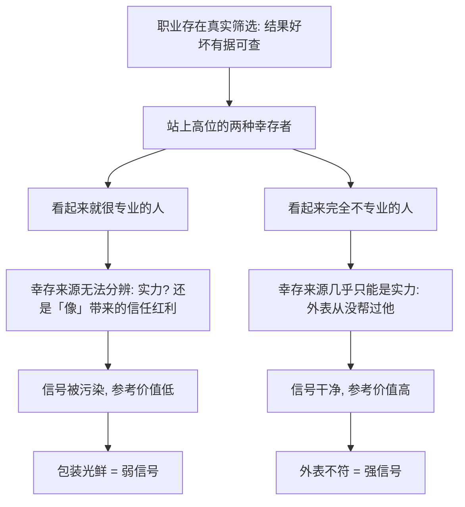

# 08｜为什么选外科医生要选最不像医生的那个？

> 本文要解决的问题：塔勒布为什么说，挑选外科医生这类性命攸关的人选时，应该选那个看起来最不像医生的人？

---

## 一、先说结论

塔勒布给出的反直觉建议是：在两个资质相当的候选人里，选那个外表、谈吐、气质最不像「这一行标准形象」的人。理由不是审美，而是信息——在一个存在真实筛选的职业里，一个外形上完全不占便宜的人能活到最后，说明他的幸存只能靠真本事；而那个从头发丝到皮鞋都像教科书插图的人，你无法分清他的位置有多少是能力挣来的、有多少是「看起来像」赚来的。过度精致的包装，往往是在补偿实力的不足。

## 二、我们先理解一个问题

假设你需要做一次心脏手术，医院给你两个医生选。

第一位，你从走廊尽头看见他就觉得安心：白大褂笔挺，银丝眼镜，说话不疾不徐，履历上全是名校和头衔，交谈中能准确地复述你报告里的每一项指标。

第二位，身材魁梧，面相粗犷，说话磕磕巴巴，白大褂皱巴巴的，与其说像医生，不如说像屠夫。护士悄悄补了一句：他干了二十年。

你的手会伸向哪一位？

几乎所有人本能地选第一位——他满足我们对「好医生」的全部想象。塔勒布说，这个本能恰恰是错的。

## 三、作者到底提出了什么观点？

塔勒布在书中专门讨论了这个问题。他的推理是：外科医生是一个被真实筛选反复过滤的职业——手术台上死人还是活人，是有据可查的硬结果。一个长得像屠夫、不善言辞的人能在这个位置上干二十年，意味着一批又一批病人在他并不讨喜的外表下依然把命交给了他，而他一直活着。他的存在本身，就是实力的证据。

反过来，那个看起来「完全合格」的医生，给你的信息反而是模糊的：他确实可能医术高明，但也可能他只是把「像一个好医生」这门功课修到了满分——筛选他的面试官、引荐他的同行、点头同意的病人，都先被他的外表说服了。

塔勒布认为，这背后是一条普遍的法则：**信号的强度，取决于它穿过真实筛选的难度。**

## 四、把这个观点翻译成人话

大白话版本：真高手不需要长得像高手。

再直白一点：在一个真刀真枪的行当里，「不像样」是昂贵的劣势。一个人背着这么大的劣势还能站在你面前，他一定在别的地方多出了什么——那多出来的，只能是实力。

而包装是另一回事。包装人人都能买，价格透明，产量无限。所以「包装精美」这个信号几乎是免费的：它证明不了任何东西，只证明这个人会去修饰信号。那么问题来了——一个手里真有硬货的人，为什么要把那么多资源花在包装纸上？

## 五、为什么会这样？

塔勒布的推理链条是这样的：

关键在于条件概率。塔勒布问的不是「谁更可能是好医生」，而是「在同样干满二十年的前提下，谁的成功更只能靠医术来解释」。答案显然是那个没有任何外貌加成的人——他每多干一年，都是纯粹靠手艺续命的。

## 六、举一个现实生活中的例子

外科医生的例子之所以成立，是因为外科是少数还保留硬筛选的行业之一：病人死在手术台上，数据在那里，瞒不住。

再看一个反例——管理顾问。一个穿高定西装、做漂亮 PPT、满口术语的顾问，他的「筛选」是什么？是客户满不满意。而客户满不满意，很大程度上取决于他讲得好不好听、像不像专家。这是一个筛选目标被污染的行业：被筛的不是「建议有没有用」，而是「建议听起来有没有用」。

所以在顾问这类行当里，塔勒布的公式要反过来警惕：包装越完美，你越要怀疑他除了包装还剩什么。真正有实力的人往往不靠这些——你见过几个手艺硬到不愁饭吃的匠人，天天精心营销自己的形象的？

## 七、回到书中重新理解

塔勒布这个建议常被误读为「丑人更可靠」「打扮得体是罪」。其实他讲的是信息论，不是美学。

他的完整意思是：外表和能力通常是两个独立的变量，但在有筛选的环境里，「幸存者的外表」会变成一个有信息量的变量。选中那个不占外表便宜的人，等于在你的估计里剔除了「形象溢价」，剩下的净值更接近真实能力。

这也解释了为什么这条建议只在硬筛选行业成立。外科、飞行、竞技体育——结果赤裸可见；而咨询、评论、很多白领岗位——结果模糊、归因困难，「像」本身就能换来生存资源，反着选人没有意义。

## 八、这个观点背后还有什么？

第一，它连着一条更大的理论：可信的信号必须昂贵。昂贵的信号难以伪造，所以可信；廉价的信号人人能发，所以迅速贬值。二十年的手术记录是昂贵信号，一身定制西装是廉价信号。塔勒布整套「信号观」都建立在这个成本结构上。

第二，它其实是风险共担的推论。外科医生为什么被真实筛选？因为他的皮肤在游戏里——病人的结局会算到他头上。筛选的强度，本质上来自后果的对称性。没有入局的岗位，也就没有被筛过的信号。

第三，它提示了一种「反表演」的看人策略：当一个人把所有可见维度都打磨到完美时，要警惕他是不是把预算都花在了可见处——因为不可见的实力，恰恰是最贵、最难造假的。

## 九、这个观点有问题吗？

有说服力的地方很明显：条件推理在数学上是成立的。在筛选真实的领域，「无加成幸存」确实携带信息，一些研究信号理论的学者也认可这一点——信号的有效性取决于伪造它的成本。

但边界同样清楚。第一，它只在「筛选真实存在」时成立；在靠关系、靠包装就能上位的失灵系统里，不像样的人可能真的不行。第二，外表不总是和能力无关：外科医生的整洁度可能反映手卫生的依从性，清晰的表达直接影响医患沟通和治疗配合度——「不像医生」有时是真缺点，不是美德。第三，这个启发式会犯反向错误：刻意选「最不像的」，也可能选到只是混得久的老油条，或把「不修边幅」本身当人设的表演者——毕竟不修边幅也可以是一种包装。第四，关于选人，学界存在不同解释：主流的信号模型并不认为包装必然说明实力不足，对某些岗位而言，得体的外在本身就是生产力的一部分。

所以更准确的用法是：别把包装计入实力，而不是「包装越差实力越强」。塔勒布给的是一个纠偏工具，不是一个可以反过来套用的公式。

## 十、今天再看这个观点

以下部分是基于作者思想的现代延伸，不是作者原话。

今天是一个「包装工业化」的时代。简历有代写，形象有顾问，社交平台上的每个人都「充满激情」，短视频里的专家人设三天就能搭好一套。当包装的边际成本趋近于零，按塔勒布的逻辑，这类信号的价值也就趋近于零——AI 能批量生成流利文字之后，「表达好」这个信号进一步通胀贬值。

这意味着选人的尺子要继续后撤：不看说了什么，不看形象多好，只看那些贵到没法造假的东西——可验证的产出、足够长的时间轨迹、在真实后果里活下来的证据。

## 十一、这一篇真正应该记住什么？

1. 选外科医生选「不像医生」的，逻辑是条件概率：不带外貌加成的幸存，只能靠实力解释。
2. 信号的价值等于伪造它的成本：二十年记录很贵，定制西装很便宜。
3. 这条建议只在筛选真实的行业成立；筛选失灵的地方，别反着套公式。
4. 更稳妥的用法是减法：不把包装计入实力，而不是把「不像样」当成实力。
5. 当一个人所有可见面都完美无缺时，问一句：不可见的那部分，他花了多少预算？

## 十二、留一个问题

下次面试、挑顾问、选合作方的时候，试着把对方「看起来专业」这一项从记分板上划掉，再看看他还剩多少分？

更深一层的问题是：信号之所以有效，是因为背后有筛选在起作用。那么筛选这件事本身的数学结构是什么？为什么同一个「平均存活率」，对群体和对个人是两个完全不同的数字？这就引出了全书最难也最要命的一个概念——遍历性。
