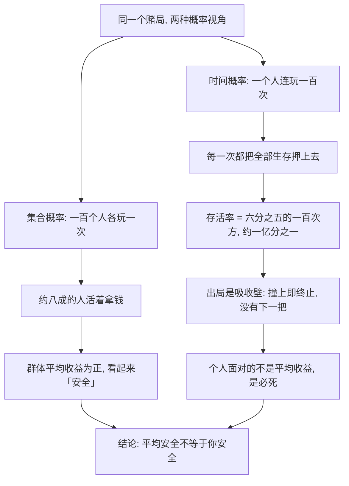

# 09｜遍历性：为什么「平均安全」会要你的命？

> 本文要解决的问题：为什么一百个人各玩一次俄罗斯轮盘赌是「不错的生意」，而一个人连玩一百次等于自杀？同一个赌局，差别到底在哪？

---

## 一、先说结论

塔勒布用「遍历性」戳破一个广泛存在的混淆：集合概率（很多人在同一时刻的平均结果）和时间概率（一个人沿着时间连续经历的结果）是两回事。一百个人各玩一次俄罗斯轮盘，大约八成多的人赚钱离场，「平均收益」漂亮极了；可换成一个人连玩一百次，他几乎必死。只要赌局里存在一个「出局」状态——破产、死亡、清零——重复博弈就会把很小的单次风险放大成必然。结论很硬：先保证永远不出局，才轮得到谈策略。

## 二、我们先理解一个问题

俄罗斯轮盘赌：六发弹巢装一发子弹，对着自己扣扳机，活下来拿一大笔钱。

现在看两种玩法。玩法一：一百个人，每人只玩一次。玩法二：你一个人，连玩一百次。

直觉上这是「同一个赌局」——每扣一次扳机，死亡率都是六分之一。可你的直觉有没有觉得哪里不对劲？玩法一里大约八十三四个人笑着数钱；玩法二里你活下来的概率是六分之五的一百次方——大约一亿分之一。

同一个赌局，为什么对群体是「不错的生意」，对个人是「确定的死刑」？

## 三、作者到底提出了什么观点？

塔勒布认为，概率论从诞生之初就埋下了这个混淆：它研究的多是「一群人的平均」——赌场对一千个赌客的盈亏、保险公司对一万个投保人的赔付——可你我的命不是平均出来的，我们各自只有一条时间线。

他把「出局」状态称为吸收壁：一旦撞上，过程终止，没有下一把。死亡、破产、爆仓都是吸收壁。只要存在吸收壁，这个系统就不满足遍历性——「时间平均等于集合平均」这个前提垮了，之后所有建立在平均收益上的计算，对个人全部失效。

所以他得出的优先级排序是：任何策略的第一约束不是收益最大化，而是永远留在牌桌上。

## 四、把这个观点翻译成人话

大白话：别人的平均分，救不了你的命。

「这个游戏平均年化收益百分之二十」——这个平均，是一百个平行宇宙里的你的平均值。可现实里你只有一条命、一条时间线，你的收益是沿着时间连乘的。连乘的意思是：只要其中任何一项是零，整个乘积归零，后面不再有「下一把」把它赚回来。

更直白地说：出局的风险不做加法，做「必然」。每次六分之一的死亡率，玩一次是赌运气，玩一百次是排队等死。

## 五、为什么会这样？

数学上只有一行：单次存活率是六分之五，重复一百次的存活率约为一亿分之一。集合平均把「死掉的那十几个人」摊薄进了大数；而在时间序列里，死掉的那个人就是你，并且你没有「别人」可以摊。

这就是遍历性失灵的核心：平均抹掉了吸收壁，时间不会。

## 六、举一个现实生活中的例子

还是俄罗斯轮盘。设想一个基金经理发现这个赌局「期望收益为正」：六分之五的概率赚一大笔。他组织一百个客户每人玩一次——年底业绩报告写着「八成以上客户盈利，平均收益率惊人」。这份报告每个字都是真的，每个字也都在撒谎：因为死掉的那十几个客户，不会出现在下一年度的报表里。

再把赌局换成创业。商学院的案例库告诉你「创业公司五年存活率约一半」，听起来像抛硬币，似乎值得搏一把。但对你这一个创始人而言，这个统计数字几乎没有意义：你要面对的不是一次五年赌局，而是几十次连续的「现金流轮盘赌」——这个季度工资发不出就是死，下一轮融资断了就是死，每一次都是一颗子弹。撞上一次，没有任何「平均而言」能把你救回来。

所以真正活得久的创业者有一个共同特征：不是赌得准，而是结构上不死——现金储备厚到熬过任何单季，永远不签会让自己一次归零的对赌条款。他们不是赢在策略，是赢在没出局。

## 七、回到书中重新理解

塔勒布把这个概念放在全书靠后的位置，因为它是对前面所有内容的「终审」：不对称结构之所以可恨，不只是因为不公平，而是因为它把吸收壁推给了别人——银行家赚的是集合概率的钱，把出局风险塞进了你的时间线。

反过来读也成立：为什么他反复强调先做减法、先别做傻事？因为在不遍历的世界里，「正确的策略」排在「活着」后面。一个策略再精妙，只要路径上存在一次归零的可能，重复执行就等于签了一份死刑缓期执行书。

## 八、这个观点背后还有什么？

第一，它给「风险」这个词做了一次截肢手术。我们通常以为风险是「波动」——上上下下总会回来。遍历性指出：波动不可怕，吸收壁才可怕。前者是过程，后者是终点。

第二，它解释了为什么保险、养老金、社会保障这类制度能存在：它们做的正是「把个人时间线里承受不起的冲击，摊到群体集合里去」。集合能吸收的风险，时间序列不能——这是人类设计互助机制背后深层的数学理由。

第三，它与学术前沿有呼应。一些学者（以遍历性经济学一派为代表）认为，经济学两百年来在集合平均上盖楼，地基却用错了；如果改用时间平均重算，很多「悖论」（比如人们为什么对低概率大损失过度厌恶）会自动消失。关于这一问题，学界存在不同解释，这一派目前仍是少数派，但争议本身说明遍历性不是塔勒布一个人的修辞。

## 九、这个观点有问题吗？

说服力很硬的部分：对存在真正吸收壁的场景——死亡、不可逆的毁灭——数学上无可辩驳，六分之五的一百次方就是事实。

但批评也实在。第一，现实里「出局」很少是绝对的：破产可以重组，创业失败可以再来，生病可以康复。吸收壁在现实中常有弹性，把一切损失都按「撞上就死」计算，会系统性高估风险。第二，过度规避风险本身有成本：永远不创业、不投资、不碰任何带尾部风险的事，得到的是另一种确定的输——缓慢而稳定的出局。第三，集合平均并非全无用处：对于「给一万个人做决策」的政策制定者，集合概率恰恰是正确视角；塔勒布的框架主要从个体出发，不能直接推广成「平均值都骗人」。第四，关于遍历性是否构成对经济学的颠覆，学界存在不同解释：期望效用理论的支持者认为，理性人本来就厌恶毁灭性损失，不需要重写整个框架。

所以更准确的读法是：遍历性不是一套新经济学，而是一条优先级规则——先确认你的赌局里没有不可逆的出局项，再谈收益。

## 十、今天再看这个观点

以下部分是基于作者思想的现代延伸，不是作者原话。

遍历性视角几乎是为今天的杠杆社会定制的。高杠杆买房：房价波动两成是集合数据，但你的保证金是一次性的，一次强制平仓就出局。满仓单吊一只股票、裸辞全押创业、把全部身家押进一个流动性差的资产——这些行为的共同结构，都是「把吸收壁搬进了自己的时间线」。

历史上有一个教科书级的注脚：一九九八年长期资本管理公司倒闭。这是历史事实——该公司由诺贝尔经济学奖得主级别的团队运营，模型算的是集合平均意义上的安全，历史数据里那样的极端情形「不该发生」。它发生了，一次就出局。模型不是错在小数点，是错在把可重复实验的概率，当成了单条时间线的保证。

## 十一、这一篇真正应该记住什么？

1. 集合概率不等于时间概率：群体的平均值，救不了任何一条单独的时间线。
2. 吸收壁（死亡、破产、清零）让系统失去遍历性：撞上一次，后面所有的「平均」全部作废。
3. 重复博弈放大出局风险：单次六分之一的死亡率，重复一百次约等于必死。
4. 策略的第一约束是「永远在场」，收益最大化只能排第二。
5. 波动性风险可以扛，不可逆的出局风险一次都不能碰。

## 十二、留一个问题

盘点一下你现在的处境：资产、职业、健康上，有没有哪个环节是「撞一次就再也回不来」的？如果有，它值得你每年为它交多少「保费」？

既然「活下来」是如此硬的约束，下一个问题自然浮现：我们天天挂在嘴边的「理性」，到底该用什么标准来评判？塔勒布的答案出人意料——理性的裁判不是正确，是生存。
