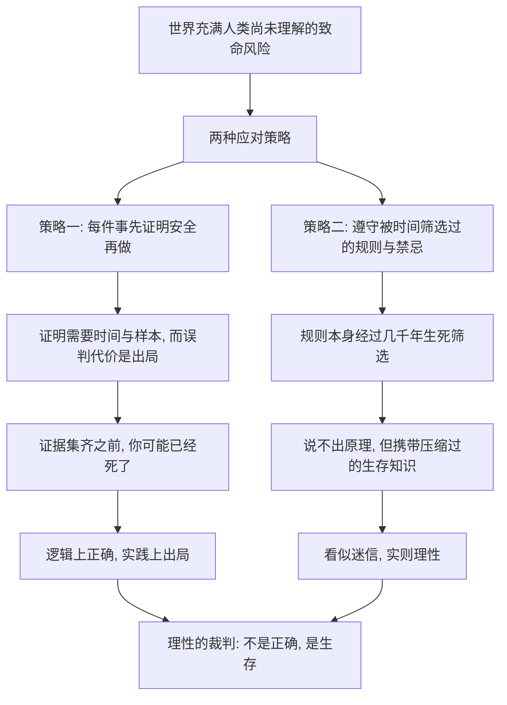

# 10｜塔勒布的理性观：为什么「活下去」才是最高理性？

> 本文要解决的问题：塔勒布凭什么说，评判「理性」的标准不是信念是否正确，而是持有者能不能活下来？

---

## 一、先说结论

塔勒布重新定义了「理性」这个词的裁判标准。我们通常认为：理性等于信念有证据、讲逻辑、合科学。塔勒布说不对——理性的评判对象不应该是信念，应该是行动；而行动的裁判只有一个：它能否让执行者在重复博弈中活下来。一个信念哪怕「不科学」，只要它几千年如一日地让信徒避开了致命风险，它就是理性的；一套理论哪怕「很科学」，照着做的人会死，它就是不理性的。许多被我们嘲笑为迷信的规则，其实是被时间筛选过的生存策略，只是说明书丢了。

## 二、我们先理解一个问题

想象两个人讨论野蘑菇。

祖母说：不认识的蘑菇，一律不吃。问她为什么，说不上来，「祖上就是这么传的」。

年轻人说：这不科学。应该查清楚每种蘑菇的成分，用证据决定吃不吃。

谁的立场更「理性」？

按常识是年轻人。可塔勒布会问另一个问题：谁的子孙活到了今天？祖母的规则没有论文支撑，但它执行起来零成本，并且在过去几千年里让遵守它的每一代人都绕开了毒蘑菇这堵吸收壁。年轻人的方法在逻辑上完美，唯一的小问题是——误判的代价是出局，而他需要做出无数次判断。

## 三、作者到底提出了什么观点？

塔勒布在书中明确提出：理性应该以行动而非信念为评判对象，而行动的检验标准是生存。

他拆开了两个被混为一谈的东西：信念的「真」和信念的「用」。一个信念可以不太真但很有用——「这条河里有神，不许下水」可能是假的，但如果河里有鳄鱼，这个假信念执行出的行为和真知识完全一样。信念的首要功能不是描述世界，是引导生存。

顺着这个逻辑，他重新命名了那些「看似迷信」的传统规则：它们很多是启示性规则——在漫长时间里经过无数代人的生死试错被筛选出来，携带了连持有者自己都不理解的压缩知识。规则活着，就是它的文凭。

## 四、把这个观点翻译成人话

大白话：别问这话对不对，先问照做的人死没死。

再换个说法：传统规则像一个来历不明的黑盒子，说明书丢了，但盒子本身被时间盖过章——它的历代持有者都活下来了，这本身就是最高等级的长期临床数据。

那迷信是什么？塔勒布的回答大概是：很多迷信是过期包装的生存手册。内容物曾经救命，只是写着原理的那一页烂掉了，只剩「别做，会遭报应」这句咒语。你可以嫌它包装土，但直接扔进垃圾桶之前，最好先想想它凭什么活了几千年。

## 五、为什么会这样？

塔勒布的深层理由是遍历性的延续：在存在出局风险的重复博弈里，「先在纸面上证明」是一条来不及走完的路。时间是唯一付得起全样本实验成本的主体——它用几万年、亿万人的生死做完了实验，实验报告就是那些活到今天的习俗。

## 六、举一个现实生活中的例子

饮食禁忌是最好的标本。「不认识的蘑菇不吃」这条规则没有任何科学表述，却在全球各文化里独立出现——原因很简单：抱着「尝一口看成分」态度的人群，大概率没能留下后代。

河豚是更极端的案例。河豚体内含有致命神经毒素，这是被历史事实反复确认过的——处理稍有差池就会致人死亡。于是我们能看到一个有趣的地理分布：在掌握了精细处理技术的地方，河豚是合法美味；在没有这套技术的地方，它干脆成了禁忌——「吃了会遭报应」。两种表述，执行出的生存行为完全一致：不让没技术的人碰它。哪条更「科学」？塔勒布会说这个问题问错了，该问的是哪条让人活着。

宗教斋戒也是类似结构。一些学者认为，斋戒在客观上承担了卫生与自律功能：定期清理饮食、节制欲望、训练延迟满足，其持有者群体在漫长岁月里获得了生存优势。关于这些规则最初为何产生，学界存在不同解释——卫生假说、群体认同假说、社会控制假说并存——但塔勒布的论点不需要断定起源：无论起点是什么，能留存下来并让信徒活过几千年的规则，已经通过了最严苛的实证检验。

## 七、回到书中重新理解

现在再看塔勒布的理性观，就能看清它真正的攻击目标了。它攻击的不是科学，而是「只有能说清楚原理的东西才算数」这种白知标准。

这个标准听起来很现代，实则很危险：它把人类几万年的试错成果视为废纸，只因为持有人无法上台答辩。塔勒布打过一个粗粝的比方：鸟不懂空气动力学，照样飞得很好；祖母不懂毒理学，照样不让你吃野蘑菇。知识有两种存在形态——写在纸上的，和刻在行为里的。后者往往更古老、更昂贵，只是不会演讲。

所以当真理与生存在短期内冲突时，塔勒布站生存：死了的人没有机会继续追求真理。信念是工具，生存是目的——这个顺序不能反。

## 八、这个观点背后还有什么？

第一，它是遍历性的直接推论。前面说过「先活下来才谈得上策略」，这一篇把它升格为定义：理性等于有助于生存的行动。两者是同一枚硬币的两面。

第二，它与演化论形成呼应。一些学者在文化演化研究中指出：习俗、禁忌、宗教规则像基因一样经历变异与选择，存活下来的规则集往往对环境难题给出了「无意识的解答」。塔勒布的贡献是把这套逻辑翻译成了对「理性」的重新定义。

第三，它埋下了一条通往否定的路：这类生存规则几乎全部以「别做」的形式存在——别吃不认识的蘑菇，别碰河豚，别过度饮食。「不该做什么」的知识远比「该做什么」可靠，这种不对称后面还有专门的展开。

## 九、这个观点有问题吗？

说服力所在：它解释了一个长期谜题——为什么那么多「不科学」的传统能顽强存活；文化演化的实证研究也确实发现了不少承担实际功能的禁忌。

但它的问题同样不能回避。第一，存活不等于最优：活人献祭、放血疗法、缠足都曾在人类社会里活了上千年——活得久只证明它不立即致命，不证明它是好的生存策略，更不证明它合乎道德。用「活了多久」为规则背书，有滑向「存在即合理」的风险。第二，环境会变：为寄生虫横行的时代设计的禁忌，在卫生条件已改变的今天可能只剩成本。第三，判断权问题：谁来裁定某条规则是「时间筛选出的智慧」还是「时间筛选漏下的残渣」？这套话术可以被拿来给任何传统辩护，包括坏的。第四，关于禁忌与宗教规则的起源，学界存在不同解释——功能主义（规则服务于生存）只是诸假说之一，符号意义、社会控制、群体边界的解释同样有大量支持者。

所以更稳妥的读法是：塔勒布完成了一次举证责任的翻转——对活了几千年的规则，默认它可能有用，拆解之前先搞懂它；但这不是免检金牌，老规则同样要接受「今天还有没有用」的审查。

## 十、今天再看这个观点

以下部分是基于作者思想的现代延伸，不是作者原话。

这套理性观在今天的主要用处，是一种「对新事物的预防姿态」。面对全新的技术、全新的食品添加剂、全新的行为模式，「没有证据证明有害」不等于「安全」——证据的积累需要时间，而时间实验的样品是我们自己。监管要求新成分经过长期观察期，本质上就是制度化的祖母规则。

但它也有被滥用的现实：反疫苗运动、各种「古法养生」，都自称「老祖宗的智慧」。塔勒布的框架在这里反而给出了试金石——真正的生存规则经过几千年、亿万人的生死筛选；而「我爷爷说」和「网传秘方」没有经过这个筛子。区分二者的办法不复杂：看样本量，看存活时间，看它拦下的代价是不是出局级的。

## 十一、这一篇真正应该记住什么？

1. 塔勒布对理性的定义：不以信念是否「正确」为裁判，以行动是否「利于生存」为裁判。
2. 信念的「真」和「用」是两回事：假信念也可以导出正确的生存行为。
3. 很多迷信是被时间筛选出的生存策略——说明书丢了，盒子还在工作。
4. 时间的筛选是最贵的实证：样本是亿万人的生死，周期是几千年。
5. 但要警惕反向滥用：活得久只证明不立即致命，不证明最优，更不证明道德。

## 十二、留一个问题

你家里有没有一条「祖上传下来、说不出道理、但一直照做」的规矩？它有没有可能是一份丢了说明书的生存手册？

顺着这个问题往下：如果「活得久」可以作为规则可信度的证据，那它能不能推广成一条普遍的判断工具——一本书、一门技术、一种制度，活得越久就越值得期待它继续活下去？这个反直觉的性质有个名字：林迪效应。
