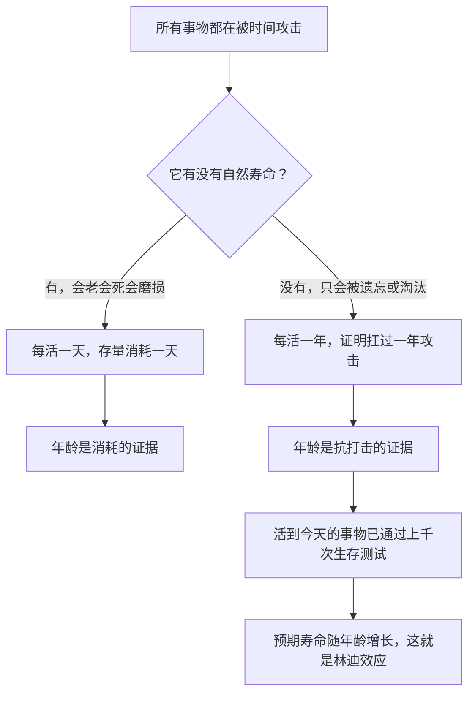

# 11｜林迪效应：为什么活得越久越可能继续活下去？

> 本文要解决的问题：为什么塔勒布说一本流传了两千年的书大概率还能再传两千年？活得久凭什么能当作继续活下去的证据？

---

## 一、先说结论

塔勒布认为，世界上的事物可以按「对时间的反应」分成两类。第一类是有自然寿命的东西：生物会老，机器会磨损，流行会退潮——对它们来说，每多活一天就离终点近一天，剩余寿命只会变短。第二类是没有自然寿命的东西：一个想法、一本书、一种嵌进日常生活的技术——它们不会老死，只会被遗忘、被证伪、被替代。对这类事物，塔勒布认为每多存活一年，预期寿命不降反升。这个规律叫「林迪效应」：对经受住时间筛选的事物而言，年龄本身就是质量最强的代理指标，时间是最好的审判官。

## 二、我们先理解一个问题

先想两个书架。

第一个书架摆在书店最显眼的位置：本月新书，腰封上印着名人推荐，封面是精心设计过的营销品。第二个书架缩在角落：荷马、柏拉图、《史记》，蒙着一层薄薄的冷清。

哪一个书架上的书，十年后还在印？

答案几乎是本能的：第二个。可这很奇怪——新书明明有更新的知识、更贴近时代的表达、更猛的营销，古书什么都没有，只是「活得久」。活得久凭什么算资本？一个人活得久说明他老了，一本书活得久却说明它……什么？

这正是林迪效应要回答的问题。它听上去像句废话——老东西能传下去——但它背后藏着一条反直觉的概率规律。

## 三、作者到底提出了什么观点？

塔勒布的核心断言是：对会消亡的事物，时间是纯粹的敌人；对经受时间筛选而不消亡的事物，时间是持续加分的朋友。

前一类好理解。一只十岁的老狗，剩余寿命显然比两岁的狗短；一辆跑了三十万公里的旧车，离报废只会更近。有寿命的东西，每过一天都在消耗存量。

后一类才是塔勒布的重点。一本书没有内置的死期，它只会被各种意外杀死：战争烧了图书馆，王朝禁了它，新思潮宣判它过时，读者干脆把它忘了。如果它扛过了两千年里所有这些「被杀的机会」，塔勒布认为最合理的推断不是「它快死了」，而是「它真难死」——于是预期寿命随年龄增长。

这个规律有个名字，叫林迪效应。据说最早来自纽约一家叫林迪的熟食店，喜剧演员们在那里观察到一个现象：一个节目还能演多久，最好的预测是它已经演了多久。数学家曼德博后来给过它形式化的表述，塔勒布则把它从剧院搬进了整个知识世界：对不会自然衰老的事物，已存活的时长是预期剩余寿命最可靠的估计。

## 四、把这个观点翻译成人话

用一句大白话说：**时间不长眼，但它下手极狠。**

一本书、一种技术、一个习俗，想连续两千年不被淘汰，意味着它扛过了上千次「被消灭的机会」：被烧过、被禁过、被嘲笑过、被更时髦的东西冲击过——它都活下来了。这样的东西，大概率有点真东西，因为它不是被谁保护着活下来的，是在开放竞争里一刀一枪拼下来的。

反过来，一个新事物还没有经历过任何一轮清洗。它可能极好，也可能只是赶上了风口。你对它几乎一无所知，唯一确定的信息是：它还没被时间碰过。

所以塔勒布的建议近乎冷酷：不知道怎么选的时候，选那个活得久的。不是因为老的东西神圣，而是因为老的东西被现实殴打过，居然还站着。

## 五、为什么会这样？

塔勒布的推理链条大致是这样的：

关键在于两类事物的死亡机制不同。有寿命的东西死于内部积累：细胞老化、零件磨损，时间是慢性毒药，活得越久毒性越深。没寿命的东西死于外部事件：被遗忘、被证伪、被替代，而外部事件的暴露量与时间成正比——活得越久，扛过的攻击越多。

这就像筛子。时间是一张不断摇晃的筛网，孔径是「真实世界的各种攻击」。脆弱的东西先掉下去，每摇晃一年，网上留下的东西就经历过更多轮筛选。所以塔勒布认为，对没有死期的事物，存活时长不是衰老记录，而是体检报告——而且是被现实亲自做的体检。

## 六、举一个现实生活中的例子

对比一下两类书的命运。荷马史诗流传了近三千年：被口头传唱过，被抄写员抄错过，被图书馆的大火威胁过，被一代代「它过时了」的宣判考验过——今天还在印，还在被改编成电影和游戏。再看机场书店里的畅销书：腰封炸裂，名人站台，上月狂销百万册——一年后绝大多数绝迹，连作者的名字都没人记得。两千年后我们还在读荷马，而机场畅销书一年后绝迹，这不是情怀，是林迪效应的算术。

再看技术。椅子的基本设计几百年没怎么变：四条腿、一个面、一个靠背。它不靠营销活着，是靠「解决了真问题」活着——时间已经替它做完了所有用户体验测试，所以它的预期寿命反而越来越长。手机恰恰相反：每一年都在换代，每一代出厂时就开始过时。会消亡的技术每过一天更接近淘汰，这不是悲观，是它的本质——它属于有寿命的那一类，年龄纯粹是消耗。

## 七、回到书中重新理解

现在我们再看塔勒布在书里反复使用的那把尺子，就清楚多了：时间才是最终的裁判。

他不是在说「新的都不好」，而是在说：**没有经过时间筛选的判断，和没有经过代价过滤的观点一样，只是噪音。** 一个理论写在纸上可能无懈可击，但纸面证明不等于生存证明。真正残酷的考试是把它扔进时间里，让它承受遗忘、攻击、替代和一代代人的挑剔——能交卷的，才有资格叫「经典」。

这也解释了塔勒布为什么对传统、习俗、老祖母的智慧抱有一种知识界罕见的尊重：它们可能说不出道理，但它们是林迪的幸存者。讲不出机制和经得起检验，是两回事。

## 八、这个观点背后还有什么？

林迪效应背后藏着三个更深的东西。

第一，它其实是「风险共担」在时间维度上的版本。一个观点的持有人可以零成本输出，但一个观点本身要在时间里活下去，必须持续支付「生存成本」——每天都要重新证明自己不值得被遗忘。存活，就是思想界的入局。

第二，它给「脆弱—坚固—反脆弱」这套框架补上了观察方法。塔勒布在更早的作品里区分过这三类事物：脆弱的怕冲击，坚固的无视冲击，反脆弱的靠冲击变强。林迪效应是判别工具：被时间冲击过无数次还活着的，至少是坚固，多半是反脆弱。

第三，它暗含一种谦逊：我们判断不了未来，但时间已经替我们筛选过一部分过去。承认「活得久是证据」，就是承认单个人的判断力不如两千年的集体淘汰赛。

## 九、这个观点有问题吗？

有说服力的地方很明显。对没有自然寿命的事物，「存活时长反映抗打击能力」在统计上站得住；经典书目、老技术的持续生命力也确实和直觉吻合；作为低成本决策启发式——没时间研究就选活得久的——它便宜且常常有效。

但它的边界同样清楚。第一，林迪衡量的是「能不能继续活」，不是「好不好」——缠足习俗延续了上千年，持久和正当是两回事，幸存只能说明抗打击，不能说明道德正确。第二，存活的原因未必是中立的优胜劣汰：制度扶持、权力钦定、路径依赖都能让平庸甚至有害的东西长寿。关于「活下来是否等于被中立地检验过」，学界存在不同解释——一些学者认为，经典的形成很大程度依赖学校和体制持续选择的结果，而不全是自然淘汰。第三，林迪给的是概率预期，不是保证书：一本传了两千年的书明天照样可能绝版，预期寿命更长不等于永生。第四，这个尺子只量得出「已存活的」，量不出「被冤杀的」——时间筛掉的东西里，也可能有死于运气而非死于错误的好东西。

所以更准确的读法是：林迪效应是**关于「持久」的概率规律，不是关于「好坏」的价值判词**。它告诉你什么大概率还在，不告诉你什么值得在。

## 十、今天再看这个观点

以下部分是基于作者思想的现代延伸，不是作者原话。

放到信息爆炸的今天，林迪效应反而更像生存技能。内容的半衰期越来越短：一条热搜的有效期是几个小时，一条短视频是几天，大部分「必读」的年度盘点明年无人认领。在这样的环境里，用林迪做信息节食是个粗暴但有效的过滤器——优先消费那些已经被时间碰过还没死掉的东西，对新内容保持「让它先活几年再说」的耐心。

也要小心它的适用边界。在变化极快的领域——分子生物学、人工智能、流行病学的最新进展——旧文献的权威性衰减得很快，这时「新」本身就是信息。林迪适用于承诺长期有效的知识（人性、风险、伦理、统计），不适用于有效期本来就只有几个月的快讯。

## 十一、这一篇真正应该记住什么？

1. 事物分两类：有自然寿命的，每活一天剩余寿命变短；没有自然寿命的，每活一年证明抗打击能力更强。
2. 林迪效应：对经受时间筛选的事物，已存活时长是预期剩余寿命的最佳估计。
3. 存活是通过上千次生存测试的体检报告——「活得久」是证据，不是情怀。
4. 林迪量的是持久，不是好坏；幸存者可能只是抗打击，未必正当，也可能受益于制度保护。
5. 它是概率预期不是保证书，也不能替「被时间冤杀的好东西」平反。

## 十二、留一个问题

下次面对一件新事物——一本刷屏的书、一个颠覆性的技术、一套人人叫好的理论——不妨先问一句：它经得起林迪吗？它打算靠什么活过下一轮遗忘？

而一个更实用的问题是：既然时间筛出来的东西可靠，那我们能不能主动做点什么，让自己的判断也变得可靠？塔勒布给出的方法出人意料：别想着加什么，先想着减什么。这就是下一篇要讲的「否定法」。
