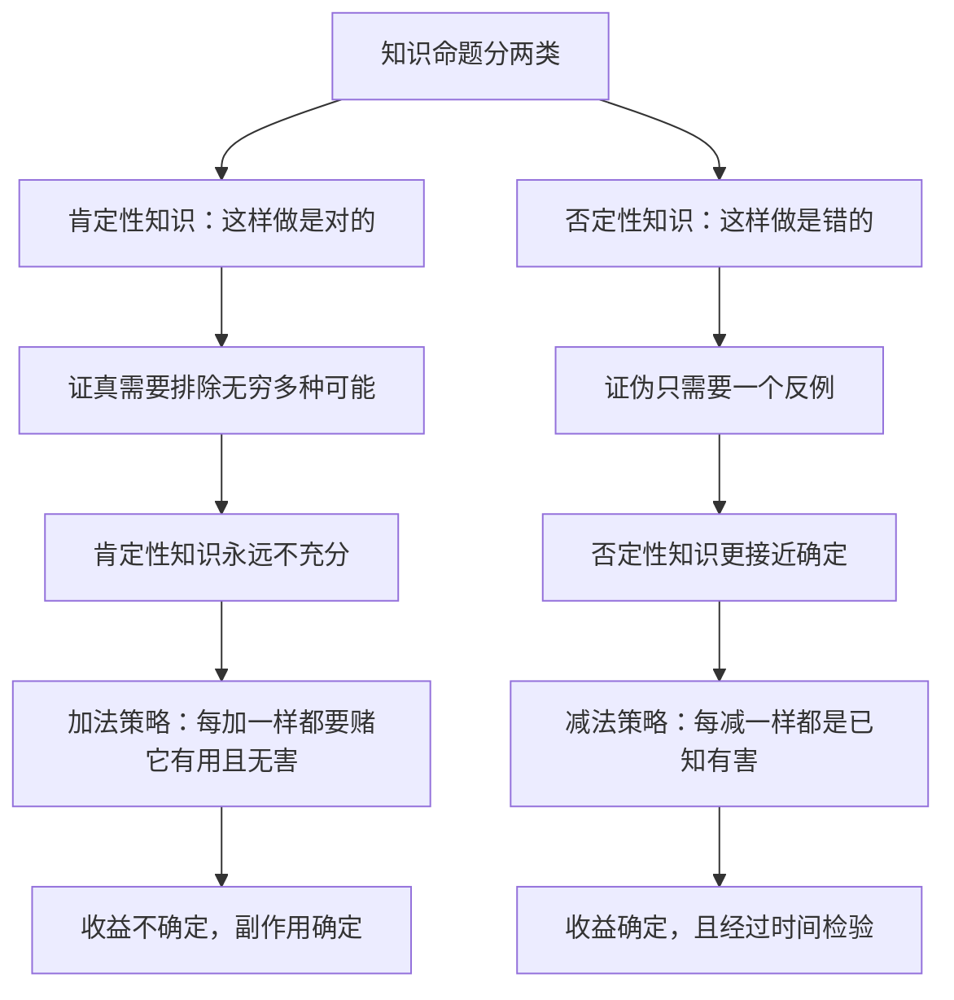

# 12｜否定法：为什么知道「不该做什么」比「该做什么」更可靠？

> 本文要解决的问题：为什么塔勒布认为，智慧和神性都要用「否定」来定义——知道不该做什么，为什么比知道该做什么更可靠？

---

## 一、先说结论

塔勒布认为，人对「什么是错的」的把握，远比对「什么是对的」的把握大。我们知道吸烟有害，却不知道哪种保健品真的延寿；我们知道高杠杆会爆仓，却不知道哪笔投资稳赚。于是他提出一条方法：via negativa，否定法——与其追问「该做什么」，不如先确认「不该做什么」，然后把它从生活里减掉。戒烟带来的确定收益，胜过绝大多数保健秘方承诺的不确定收益。在塔勒布看来，智慧不是掌握更多正确答案，而是能识别并清除错误。

## 二、我们先理解一个问题

想象两个人都想「变得更健康」。

第一个人买回来一柜子保健品：维生素、抗氧化剂、各种名字听起来很科学的配方，每天按时吃十几粒。第二个人只做了一件事：把抽了二十年的烟戒了。

谁的收益更确定？

几乎所有人都会选第二个。但请注意这里藏着的不对称：我们对「戒烟有益」的把握接近铁案——几十年的流行病学证据堆在那里；而对任何一款保健品「有益」的把握，往往只有几篇互相打架的论文和一句印在瓶身上的广告词。

为什么「去掉坏东西」比「加上好东西」更靠谱？这就是否定法要解释的事。

## 三、作者到底提出了什么观点？

塔勒布借用一个神学词汇：via negativa，否定之道。在中世纪的神学传统里，一些神学家认为人类根本无法正面描述神——「神是善的」「神是无限的」这类肯定句都太大、太容易错——但可以相当确定地说神不是什么：不是有限的，不是会朽坏的，不是受时间约束的。用否定来逼近无法正面定义的东西，这就是这个词的本义。

塔勒布把这个思路从神学搬到了知识和生活里。他认为，「什么是错的、什么是有害的、什么是脆弱的」这类否定性知识，远比「什么是对的、什么是有益的、什么是坚固的」这类肯定性知识可靠。

理由很朴素：证明一个命题为假，只需要一个反例；证明它为真，却需要排除无穷多种可能。错的东西暴露得快、死得难看；对的东西头上永远悬着「将来可能被推翻」。这种不对称不是观点，是逻辑结构。

所以他的方法论是：少做错事，比多做好事可靠；减掉毒素，比补充营养可靠；清除脆弱，比追求最优可靠。

## 四、把这个观点翻译成人话

用一句大白话说：**想变好，先别变坏；想健康，先戒烟；想赚钱，先别亏光。**

注意这个顺序。一般人谈「变好」，脑子里想的是加法：多读一本书、多学一个技能、多吃一种补品、多做一个优化。塔勒布让你反过来操作：先盘点身上那些确定有害的东西——烟、熬夜、高杠杆、烂关系——把它们一个一个删掉。

加法的问题在于，你加的每一样东西，都需要单独证明它有用，而这个证明几乎永远不充分；它可能没用，更可能有你没预料到的副作用。减法的好处在于，你减的坏东西往往早就被时间证明过有害——它要是无害，早在林迪效应的筛选里留下了好名声。

所以否定法不是消极避世，是把有限的把握押在确定性强的那一侧。

## 五、为什么会这样？

塔勒布的推理链条大致是这样的：

背后还有一个更隐蔽的不对称：干预本身自带伤害。塔勒布借用医学词汇称之为「医源性伤害」——治疗者造成的伤害。任何「做点什么」都引入新变量，新变量就有出错和副作用的空间；而「什么也不做」至少不会主动添加新的伤害源。这就是为什么在很多场合，不干预不是不作为，而是更优策略——只是它开不出账单，没有人为「建议你别动」收咨询费。

## 六、举一个现实生活中的例子

先看戒烟和保健品的对比。戒烟的收益有几十年的流行病学证据：肺癌风险逐年下降、心血管指标改善、预期寿命延长——收益确定、巨大、免费。保健品的收益大多停留在「可能」「研究显示」「有助于」的措辞里，而不确定的收益之外还跟着确定的东西：确定的价钱，以及确定存在却常常被忽略的副作用。塔勒布会说，前一个是减法，把已知有害的东西拿掉；后一个是加法，往身体里塞进一堆证据不足的新变量。谁更可靠，一目了然。

再看医学史上的一页。从古希腊到十九世纪，放血被欧洲医生当成万灵药，感冒发烧放血，难产放血，连精神错乱也放血。一七九九年华盛顿患喉炎，医生在半天之内给他放掉了超过两升血，他当晚去世——关于放血是不是直接死因，史家存在不同解释，但放血疗法对绝大多数疾病的无效与有害，后来已成定论。这就是医源性伤害的教科书案例：在缺乏证据的年代里，「什么也不做」常常比「做点什么」强，因为病人自身的恢复力未必输给医生手里的柳叶刀。现代医学把这条教训压缩成了一句话：首先，不伤害。

## 七、回到书中重新理解

现在回到《非对称风险》的语境，否定法就不只是养生心得了，它还是一把筛人的尺子。

塔勒布认为，那些热衷建议别人「做点什么」的人，和干预主义者、代理人共享同一个结构：他们提出加法，别人承担代价。顾问建议你扩张，亏了是你的；专家建议你干预，烂摊子是当地人的。加法建议天然有利于提建议的人——它显得有作为、有专业、有产出——而它的风险永远外化。

反过来，「别做」的建议不讨好、不收费、不显本事，但它把风险留在了最低处。所以否定法在塔勒布手里是双重工具：认识论上，它承认否定性知识更可靠；伦理上，它戳穿「为了你好所以你要多做事」的不对称结构。一个真为你好的人，常常说的不是「你该试试这个」，而是「你先把这个停了」。

## 八、这个观点背后还有什么？

否定法背后有三层更深的东西。

第一，它是一种认识论上的谦逊。正面定义神需要什么？需要接近神的知识。正面定义「最优策略」「完美健康」也一样，需要人没有的全知。否定只需要凡人的能力：看到反例，承认反例，删掉错误。塔勒布把它看作有限之人在无限世界里唯一够得着的知识路径。

第二，它把上一篇的林迪效应接成了行动版本。时间已经替我们做完了大量否定性筛选：什么东西有害，历史里堆着尸体和证据。「不该做什么」的清单大部分是时间开好的，人类要做的只是照着执行——戒烟戒酒这类建议之所以硬，正因为它们是被时间反复确认过的否定性知识。

第三，它暴露了一个经济学的秘密：减法不产生账单。「买这个」「加这个」「做这个」都有对应的产品、服务和佣金；「别买」「删掉」「不动」什么都没有。一个奖励加法的商业社会里，减法智慧天然处于话语劣势——它太便宜，没人替它打广告。

## 九、这个观点有问题吗？

有说服力的地方相当扎实。证伪与证真的不对称是逻辑事实；戒烟类案例无法反驳；医学史上放血、反应停事件、早期额叶切除术这些医源性灾难，都支持「先不伤害」的优先级；作为信息不足时的默认策略，减法确实经常优于乱加法。

但它的边界同样清楚。第一，不对称不是绝对的：有些「加法」的收益同样铁板钉钉——疫苗、清洁饮水、抗生素之于细菌感染，都是加上去的好东西，否定法如果被理解成「一切添加皆可疑」，会误伤人类最伟大的成就。第二，「什么也不做」也有代价，机会成本是真成本：急性感染不干预会死人，企业面对颠覆不转型会死，减法用错地方就是不作为。第三，否定性知识本身也会错——历史上「不该给产妇消毒」「不该让女人投票」都曾是被当成常识的「不该」，减法清单需要接受同样的检验。第四，关于医源性伤害在现代社会到底排第几大死因，学界存在不同解释，常被引用的「医疗过失是第三大死因」一类说法本身就有方法论争议，拿它做论据时需要标注不确定性。

所以更准确的读法是：否定法是一条**强烈但不无限的先验偏好**——证据不足时，默认减而不是加；但它不豁免任何具体判断，加法和减法都要过自己的证据关。

## 十、今天再看这个观点

以下部分是基于作者思想的现代延伸，不是作者原话。

放到今天，加法经济达到了历史峰值。健康产业靠「你该补点什么」活着，效率产业靠「你该多装一个工具」活着，内容产业靠「你该再刷一条」活着——整个消费社会的商业模式都建立在加法焦虑上。反向的数字极简、断舍离、戒断社交媒体的流行，可以看作市场对否定法的迟来补课。

用塔勒布的尺子量，一个实用原则浮现出来：面对任何「你该增加X」的建议，先问提建议的人卖不卖X；面对「你该去掉Y」的建议，至少它的提出者大概率赚不到钱。这不是说减法永远对，而是说在一个所有喇叭都在喊加法的时代，主动寻找减法视角本身就是一种纠偏。

## 十一、这一篇真正应该记住什么？

1. 否定法：我们对「什么是错的」远比「什么是对的」确定，因为证伪只需一个反例，证真需要排除无穷。
2. 减法的收益往往确定（戒烟），加法的收益常常不确定（保健品），而副作用却确定。
3. 医源性伤害提醒我们：干预自带伤害，「什么也不做」很多时候优于「做点什么」。
4. 加法建议有利于建议者——它显作为、开得出账单；减法建议廉价，但更可能真为你好。
5. 否定法是偏好不是教条：加法里也有疫苗这样的铁案，减法清单本身也要接受检验。

## 十二、留一个问题

下次面对一个「变得更好」的方案，不妨先做一件事：把里面所有的「加」换成「减」读一遍——不补这个行不行？不学这个行不行？不买这个行不行？如果答案是行，那个加法建议还值多少钱？

而把减法推到极致，会撞上一件更有意思的事：有些东西既减不掉、也说不出来，只能用付代价的方式证明它存在。比如德性——尤其是勇气。下一篇我们看，为什么塔勒布说勇气是唯一无法伪装的德性。
