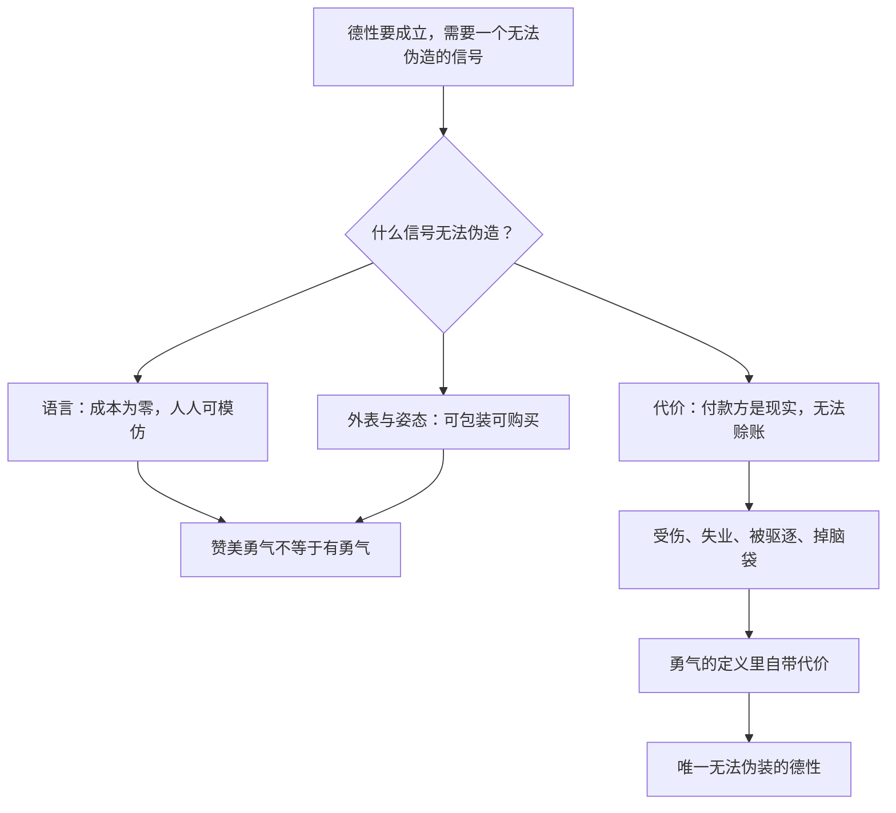

# 13｜勇气为什么是唯一无法伪装的德性？

> 本文要解决的问题：为什么塔勒布说，赞美勇气的人不一定有勇，只有付出代价的人才算数？勇气为什么骗不了人？

---

## 一、先说结论

塔勒布认为，勇气是所有德性里唯一无法用语言伪造的一种。你可以写一篇雄文赞美诚实，同时撒谎；你可以办一场慈善晚宴标榜慷慨，同时避税。但你无法一边「谈论」勇敢一边懦弱——因为勇气的定义里就内置了代价：受伤、丢工作、被驱逐、掉脑袋。勇气的账单写在身体上，不在嘴上。所以塔勒布把它升格为一条普遍的伦理标准：德性不是你想了什么、说了什么，而是你愿意为它付出什么。没有入局，就没有德性。

## 二、我们先理解一个问题

想象一场晚宴。一位评论家痛斥某家公司财务造假，言辞犀利，满堂喝彩。同一座城市里，这家公司的一名会计手里握着造假的内部证据，正在犹豫要不要交给监管机构——他知道代价是什么：丢掉工作、被行业拉黑、打几年官司、全家跟着受苦。

这两个人里，谁的行为称得上「有德性」？

评论家说的话可能完全正确，会计的内心可能充满恐惧。但塔勒布的尺子只量一件事：代价。评论家零成本，会计押上全部。这个区别不是程度问题，是种类问题——一个是表演德性，一个是支付德性。

为什么这把尺子唯独对勇气最灵？往下看。

## 三、作者到底提出了什么观点？

塔勒布认为，德性的成立条件是入局。他在书中反复强调一个意思：高谈德性却不承担任何风险的人，表演的其实是修辞。演说家的勇气是免费的，所以不算数；只有当人把皮肤——字面意义上的皮肤——押进游戏里，行为才配得上「德性」两个字。

为什么勇气在诸德性中地位特殊？因为其他德性在理论上都存在「廉价版」：诚实可以选择性地诚实，慷慨可以拿别人的钱慷慨，智慧可以写书而不必践行。唯独勇气，定义里就包含代价——一件事如果不冒任何风险，按定义它就不算勇敢。说一个人「勇敢地捍卫了毫无争议的观点」，这本身就是病句。

所以在塔勒布的体系里，勇气是检验其他一切德性的试金石：一个声称诚实的人，敢不敢为诚实付代价？一个声称有信仰的人，敢不敢为信仰付代价？不敢，前面的声称全部作废。他甚至把这条标准推到公民资格上：赞美勇气的人不一定有勇，为共同体担过风险的才算数。

## 四、把这个观点翻译成人话

用一句大白话说：**德性的货币不是语言，是代价。**

再直白一点：判断一个人有没有某种德性，别听他怎么评价这种德性，看他为它亏过什么、疼过什么、失去过什么。

这套标准冷酷，但极难作弊。语言可以排练，人设可以包装，简历可以润色——只有代价无法伪造，因为代价的付款方是现实，不接受赊账。说一百遍「我支持说真话」，不如一次「因为说真话被开除」有分量。

生活里我们其实在偷偷用这把尺子。同样一句「这项目靠谱」，从投了钱的人嘴里说出来和从拿咨询费的人嘴里说出来，你给的权重完全不同——那就是你的皮肤在报警。

## 五、为什么会这样？

塔勒布的推理链条大致是这样的：

背后的原理可以叫「昂贵信号」：一个信号只有当伪造它的成本高于收益时，才携带真实信息。语言在博弈论里叫「廉价言说」——无论说话者内心真假，说出来的成本一样低，所以它不区分任何东西。姿态稍贵一点，但可以购买：西装、头衔、精心经营的形象都是商品。

代价不同。被开除是真被开除，坐牢是真坐牢，掉脑袋是真掉脑袋——它没有「表演版」。勇气的特殊性就在于，它是唯一把「昂贵信号」写进定义本身的德性：其他德性可以争论真伪，勇气连争论的余地都没有，因为去掉代价，这个词就不成立了。

## 六、举一个现实生活中的例子

历史上的塞麦尔维斯是教科书级的案例。十九世纪四十年代，他在维也纳总医院做产科医生，发现一个诡异的事实：由医生和医学生接生的病房，产妇死于产褥热的比例远高于助产士病房。他推断原因在于医生常常刚做完尸体解剖就去接生，于是从一八四七年起推行用含氯石灰水洗手，病房死亡率随即大幅下降。

这个故事本该以表彰收场，实际却以驱逐收场。同行们无法接受「医生的手是凶器」这个指控——它等于说我们在杀死产妇。塞麦尔维斯的观点被嘲讽，职位不保，离开维也纳；一八六五年他被送进精神病院，数周后死于院中。直到他死后，巴斯德和李斯特的微生物学说被接受，世人才承认他当年救的是无数条命。他为洗手这件事付出的代价是职业生涯和生命本身；那些驱逐他的同行，付出的成本是零。

再看吹哨人。举报公司造假的员工，通常换来的是解雇、诉讼、行业黑名单和漫长的精神消耗——证据是真的，代价也是真的。而谴责造假的评论家，写文章、上节目、收获掌声，成本为零。同样站在「反对造假」的立场上，塔勒布的尺子会把德性的分数只打给前者：不是因为后者的观点错，而是因为零成本的立场不构成德性。

## 七、回到书中重新理解

现在我们再看塔勒布那句近乎苛刻的话，就清楚多了：德性必须入局，否则只是修辞。

他不是在否认言论的价值，而是在说：**把赞美当成德性，是对德性最大的稀释。** 一个社会如果允许零成本地占据道德高地，高地就会被最擅长表演的人占满，真正付代价的人反而显得笨拙——他不善言辞，他身上有伤，他的履历因为被开除过而「不好看」。按包装的标准他输了，按代价的标准只有他赢了。

这也让前面所有篇目的逻辑在这里合拢：观点要入局才可信托，判断要入局才可靠，如今德性也要入局才算数。风险共担在塔勒布这里从来不只是市场规则，它是一以贯之的诚实标准——而勇气是这个标准在伦理层面的名字。

## 八、这个观点背后还有什么？

勇气背后还有三层东西。

第一，它是整套「风险共担」体系的动力源。知识要靠有人押上判断来更新，市场要靠有人押上资本来纠错，而说真话、纠错、揭发这些动作之所以会发生，是因为有人愿意为它们付代价。没有勇气，前面讲的整个纠错机制会因为没人敢按按钮而停摆。

第二，逃避代价本身就是一种不对称。懦弱的本质是把本该自己承担的风险转嫁给集体：该你站出来的时候你沉默，代价由下一个受害者付。所以塔勒布把勇气当公民义务而非个人美德——它不是锦上添花，是防止系统腐烂的基础设施。

第三，勇气不可转让、不可代理、不可购买。你可以请人替你思考、替你干活，但无法请人替你勇敢——替身付的代价记在替身账上。它是彻底反代理人的德性，这在一个什么都外包的时代格外刺眼。

## 九、这个观点有问题吗？

有说服力的地方很明显。信号理论支持「昂贵的信号才可信」这一底层逻辑；道德史上被记住的名字，确实都是付过代价的人——塞麦尔维斯今天被刻在医学院的墙上，而当年驱逐他的人连名字都没留下；作为识破表演的工具，「看代价」极其锋利。

但边界同样清楚。第一，「唯一无法伪装」更像修辞而非定理：其他德性也有内置代价的版本——真慷慨要出钱，真诚实常常要付后果；塔勒布可以把它们都还原成勇气的变体，但这个还原是否成立，学界存在不同解释。一些学者从美德伦理的角度认为，德性是长期养成的品格与习惯，不是单次付价行为，用一个瞬间的代价给德性盖章，本身也是简化。第二，代价只能证明真诚，不能证明正确：押上性命的狂热者和深思熟虑的勇者付了同样的账单，前者可能是灾难——鲁莽和勇气在行为上难以区分，代价是必要条件不是充分条件。第三，沉默不总是懦弱：要养家的人选择不举报，可能是在履行另一份代价；要求人人时刻付价，忽视了不同人肩上的筹码不同。第四，在无法改变结果的系统里，付代价有时只是无效牺牲，此时谨慎可能比勇敢更合乎伦理。

所以更准确的读法是：勇气是**必要条件式的德性**——零代价的立场不构成德性，但有代价的行为也不自动构成德性。它负责打假，不负责授勋。

## 十、今天再看这个观点

以下部分是基于作者思想的现代延伸，不是作者原话。

社交媒体时代，「零成本表态」达到了历史峰值：转发、签名、换头像、喊口号，道德姿态的批发市场从未如此繁荣。塔勒布的尺子在这里格外好用——一个立场如果不需要任何人付任何代价就能表达，它的德性含量趋近于零，无论它多么正确。

但也有需要小心的新情况。当表达本身开始招致真实的代价——被围攻、被解雇、被封杀——「为言论付价」忽然变得常见。这里要区分两种代价：主动选择的代价是勇气的信号；被动承受的代价是受害，两者常常同时存在却不可混为一谈。吹哨人和网暴受害者都付了价，只有前者是自己买的单。看代价之前，先看这笔账是谁主动签的字。

## 十一、这一篇真正应该记住什么？

1. 勇气是唯一定义里自带代价的德性：去掉风险，勇敢这个词不成立。
2. 判断德性看代价不看语言——赞美勇气不等于有勇气，付款方必须是现实。
3. 廉价言说携带零信息，昂贵信号才区分真假：受伤、失业、被驱逐无法表演。
4. 勇气是纠错系统的动力源：没人敢付代价，说真话、揭发、制衡全部停摆。
5. 代价只证真诚不证正确，只构成必要不构成充分——鲁莽者和勇者付的是同一种账单。

## 十二、留一个问题

下次看到一句漂亮话——无论多正确——不妨先问一句：说这话的人为它押上了什么？如果答案是零，那句话就只值零。

而一个更根本的问题随之而来：如果连德性都必须入局才算数，那比德性更高的东西呢——信仰呢？塔勒布的答案比所有人想的都极端：连神都必须入局。下一篇我们看，为什么他说基督教的神必须真的流血。
