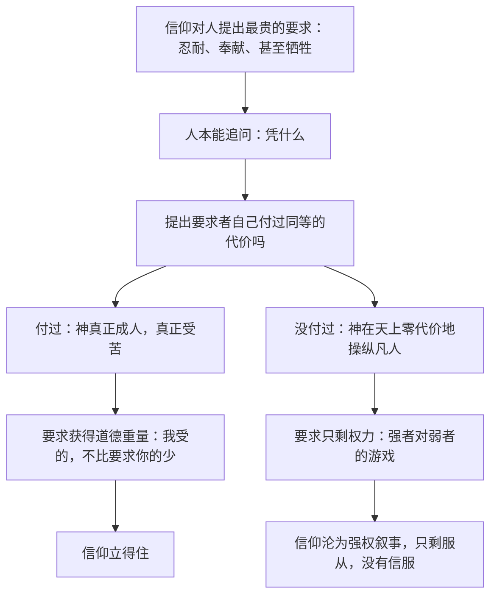

# 14｜为什么连神也必须「入局」？

> 本文要解决的问题：塔勒布为什么认为，耶稣必须真正成为人、真正受苦，基督教在道德上才站得住？

---

## 一、先说结论

塔勒布认为，「风险共担」这条规则没有天花板——它不仅约束股评家、银行家和政客，连神也不例外。在他的解读里，基督教的道德权威有一个硬核前提：耶稣必须真正成人、真正在十字架上受苦。如果一个神只是「假装」疼了一下，他就没有资格要求人类真实地承受苦难。用神学语言说，道成肉身是信仰的入场券；用这本书的语言说，连神也得有 skin in the game。

## 二、我们先理解一个问题

想象两种领袖。

第一种在安全的后方指挥部下达命令：「为了理想，你们去牺牲。」他自己从不靠近战场，阵亡名单上永远不会有他的名字。

第二种站在队伍最前面，第一个跨过壕沟。他要求的每一件事，自己都先做过、先疼过。

同样一句「跟我牺牲」，从谁嘴里说出来才有重量？答案不需要伦理学训练就能给出。

现在把这个直觉推到极限：信仰要求信徒忍耐、奉献、克己，极端情况下甚至要求献出生命——这是人类能提出的最贵的要求。塔勒布的问题于是变成：提出这个要求的那一位，自己付过这个价吗？

## 三、作者到底提出了什么观点？

塔勒布在书中专门讨论过这个议题，他的论点可以拆成三层。

第一层：耶稣必须是「真正的人」。塔勒布认为，如果基督只是披着人形的神、受难只是一场不会真疼的表演，那么十字架就沦为零代价的作秀——神在台上挨鞭子，心里清楚自己死不了。这样的「牺牲」没有付出任何真实代价，也就不能为「要求人类受苦」提供道德担保。

第二层：正因如此，早期教会围绕「基督究竟是不是真的人」发生过激烈争论。历史事实是，公元五世纪的迦克墩公会议确立了基督「完全的神性」与「完全的人性」并存的正统表述，而那些主张基督的人性只是幻影的学说被定为异端。塔勒布认为，教会如此较真「他是不是真的疼」，恰恰说明信仰的核心处压着一块「入局必须真实」的石头——这不是细节之争，是地基之争。

第三层：殉道者是这个逻辑的延伸。在塔勒布看来，早期基督徒面对罗马的竞技场不收回自己的信仰，是在用生命给信仰「报价」。嘴上的信念免费，押上命的信念昂贵——而昂贵的信号才无法伪造。

需要说明的是，以上是塔勒布个人对神学的解读：他拿自己「代价检验」的尺子去量基督教，并不等于教会官方的教义表述。

## 四、把这个观点翻译成人话

一句话：**你叫我忍，你自己忍过吗？**

再白一点：要求别人流血的，自己得先流过血。

职场上我们天天在用这个标准。老板宣布全员降薪共渡难关，第一句话落地之后，所有人都在等第二句：「我自己降多少？」如果他降得比谁都狠，这个要求就有了道德重量；如果他的薪酬包纹丝不动，再动情的发言也只是表演。

塔勒布做的事，就是把这条市井直觉一路推到神学的高度：连神要获得「要求人类受苦」的资格，都得先交出人身，亲自排进受难的队伍。

## 五、为什么会这样？

塔勒布的推理链条是这样的：

背后的机制和整本书一致：**代价是道德权威唯一不能伪造的货币。** 语言可以编造，姿态可以排练，唯独「真的疼过」无法造假。一个信仰若要求信徒付出终极代价，它自己必须先出示终极代价的收据。

这也是为什么「装样子的受难」比「不受难」更糟：不受难的神只是冷漠，装疼的神是在用假币购买真信仰——而塔勒布一生最恨的，就是用免费的东西骗取昂贵的信任。

## 六、举一个现实生活中的例子

塔勒布拿来作对照的，是奥林匹斯山上的古希腊诸神。

历史事实是，在古希腊神话里，宙斯和众神居于奥林匹斯山，永生不死、宴饮作乐，同时随意拨弄凡人的命运：挑起战争、降下灾祸、与凡人纠缠之后转身离开。凡人承受真实的死亡，诸神付出的最高代价通常只是一场不愉快。一些学者认为，希腊人笔下的诸神本来就不是道德楷模，而是力量与欲望的放大版——但这恰好成就了塔勒布要的效果：他们是「零代价决策者」的完美标本，有权力，没有入局。

再看基督教这一侧。教会传统坚持：十字架上的受难是真的——真饥饿、真疼痛、真流血、真死亡，而不是一个死不了的存在体验了一下午不适。塔勒布认为，这是两种叙事最根本的分水岭：一边是不用负责的权力，一边是先把代价付清再开口的资格。

同一个逻辑向下延伸到人：早期基督徒被带进罗马竞技场时，只要当众否认信仰就能活命，许多人选择不否认。无论我们如何评价他们的信念本身，单从信号角度看——当一个人宁可死也不改口，他对自己所说的东西至少是认真的。殉道者用命为信仰背书，这是人类能发出的最贵的信号。

## 七、回到书中重新理解

现在回头看塔勒布的意图就清楚了：他写这一段，首要目的不是讲神学，而是做一次极限压力测试。

他的潜台词是：如果连神想获得道德权威都必须先进游戏、先流血，那么人间那些要求别人承担风险的专家、官员和领袖，凭什么豁免？神学案例是「入局原则」的最强形态——它在最高的位置上都成立，那在任何更低的位置上就更不该松动。

同时要把信息来源分清：塔勒布是在用他的理论重新解释基督教的核心叙事，这是一种个人化的解读视角。关于道成肉身的意义，教会传统与学术界有成体系的教义和多种解释框架，塔勒布只是提供了一个从「代价与信号」切入的切片，不代表这是唯一或标准的解释。

## 八、这个观点背后还有什么？

第一，它再次印证了「昂贵的信号无法伪造」。整本书反复出现这个逻辑：勇气无法伪装，因为代价写在身体上；信念的真伪，靠持有者愿付的价来检验。受难是这套逻辑的顶点——连神的「诚意」，都要靠不可逆的代价来证明。

第二，它把对称性从「制度设计」升级成了「道德权威的来源」。此前的篇章里，风险共担偏工具性：让说话者谨慎、让系统诚实。到了这里，对称性开始回答一个伦理问题——谁有资格要求别人受苦？答案是：自己先受过的人。

第三，它暗中回应了一个古老的指控。宗教批评者常问：一个全能的存在，凭什么审判受苦的人类？按塔勒布的解读，基督教叙事给出的回答是：这位存在并没有坐在审判席上旁观——他自己先上过十字架。审判者先做了受审者。

## 九、这个观点有问题吗？

有说服力的地方：道德权威与「自己付过代价」之间的关联，几乎是跨文化的人类直觉。无论是否接受神学前提，「要求别人牺牲者自己先入局」这条标准，在领导力、司法和战争动员中都反复被验证有效。

争议之处也很明显。第一，关于道成肉身的神学意义，学界存在不同解释：救赎论内部就有赎价说、基督得胜说、道德感化说等多种传统，把道成肉身的主要功能概括为「神买入场券」，是一种相当个人化的压缩，许多神学家不会这样表述。第二，对希腊诸神的处理有些顺手拈来——一些学者认为，希腊神话中的诸神同样受「命运」约束，且希腊人从未指望诸神充当道德榜样，拿他们与基督作「谁更讲道德」的对比，本身可能放错了坐标。第三，殉道者用命背书能证明「真诚」，却证明不了「正确」——极端组织里同样有愿意赴死的人。代价能过滤虚伪，过滤不了错误；入局是必要条件，不是正确性的保证。

所以更准确的读法是：塔勒布提供了一个锋利但不完整的视角——它照亮了信仰中「代价」这一维，却没有、也未必打算解释信仰的全部。

## 十、今天再看这个观点

以下部分是基于作者思想的现代延伸，不是作者原话。

把这个标准从神案头拿下来放到今天，它立刻变成一把领导力量尺。组织要求员工「与公司共患难」，公众要求领袖「与人民同甘苦」——所有人的第一反应都是同一个：你自己担了多少？经济下行时高管是否降薪，危机来临时决策者是否承担与承诺对等的后果，这类问题之所以永远能上头条，是因为「入局检验」写在人的本能里。

它也解释了为什么「廉价的道德表演」在今天格外招恨：悼念、道歉、表态都可以排练且成本为零，而公众越来越会追问一句——你付出了什么不可逆的东西？塔勒布的答案是：没有不可逆的代价，就没有真的诚意。这句话对人成立；按他的解读，对神也成立。

## 十一、这一篇真正应该记住什么？

1. 塔勒布认为，连神要获得道德权威都必须入局：耶稣必须真正成人、真正受苦，基督教的要求才有分量。
2. 代价是道德权威唯一不能伪造的货币——装疼的受难比不受难更糟，因为它用假币买真信仰。
3. 古希腊诸神是完美的对照组：有操纵凡人的权力，没有为凡人付出代价的义务。
4. 殉道者用生命发出最贵的信号：代价能证明真诚，但证明不了正确。
5. 这是塔勒布的个人化解读，不是教会标准教义——关于道成肉身，学界存在多种解释。

## 十二、留一个问题

下一次有人要求你为某个集体、某个理念、某场事业付出代价时，可以先问一句：要求我的人，他自己押上了什么？

而一个更大的问题留在最后：神的代价付在十字架上，人的代价付在各自的选择里——那整个世界的代价呢？如果没有任何人为系统承担尾部风险，风险会消失吗？还是它一直在悄悄转移，等着一个最后的清算者？这个清算者，叫时间。
