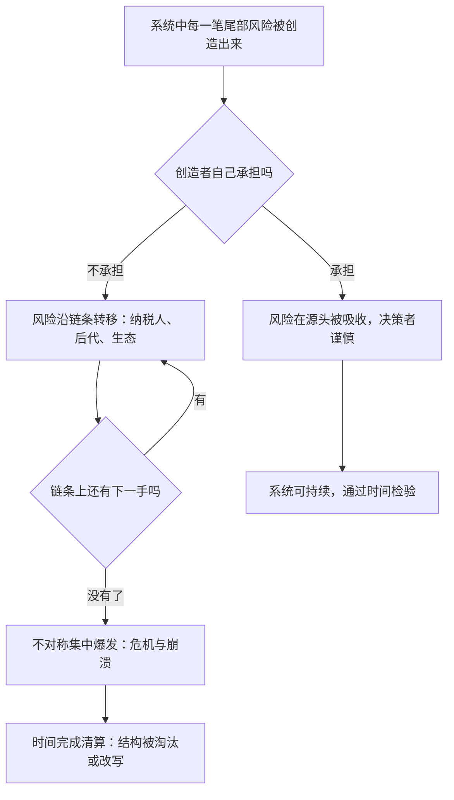

# 15｜谁在为整个世界承担最大的风险？

> 本文要解决的问题：如果没有任何人为系统承担尾部风险，世界会变成什么样？最后是谁在兜底？

---

## 一、先说结论

塔勒布的答案是：风险不会消失，只会转移。每一个不对称结构做的事，本质上都是把代价从自己手里递出去——递给纳税人、递给客户、递给下一代、递给不会说话的自然界。链条总有尽头，尽头处站着的那个兜底者，往往就是你。而在所有人之上还有一个最终的清算者：时间。时间不收游说、不听辩词，它只做一件事——让扛不住重复博弈的东西消失。所以落到个人身上，这本书的最后一句嘱咐是：入局不是可选项，是每个自由人的默认设置。

## 二、我们先理解一个问题

想象一艘漏水的船。

船上分了十几个舱室，每个舱室都在进水。最省力的做法是什么？不是修洞——修洞又慢又累——而是把自己舱里的水舀到隔壁舱去。只要倒得比进得快，自己脚下就永远是干的。

妙处在于：每个人都这么想，而且每个人都「理性」。单看自己舱内的水位，每一瓢都舀得对。直到某个晚上，船整体沉了——没有一个舱室逃得掉，包括舀水技术最好的那个。

这就是塔勒布眼中现代系统的缩影：金融把风险舀给纳税人，当代人把债务舀给后代，人类把污染舀给生态系统。问题从来不是「水去了哪」，而是——这条转移链的末端，站着谁？

## 三、作者到底提出了什么观点？

塔勒布在全书的收尾处，把「风险共担」推到了最大的尺度，观点有三层。

第一层，**风险守恒**。他认为，一笔尾部风险被创造出来之后就一直存在，证券化、奖金递延、危机救助……这些手段改变的是风险的持有者，不是风险的总量。把炸弹传给别人的人很多，但炸弹没拆。

第二层，**系统的崩溃就是清算时刻**。当转移链上找不到下一手时，积累的不对称会以危机的形式一次性结清——银行挤兑、债务违约、生态退化，都是「账单终于寄到」的不同写法。

第三层，**时间是最终的裁判**。塔勒布认为，遍历性在系统尺度上同样成立：任何「收益归自己、风险归别人」的结构，在足够长的时间里都会撞上它转移不掉的那一次。不对称可以赢很多次，时间只需要赢一次。而落到个人层面，他的伦理结论朴素得近乎严厉：自己造成的风险自己扛——这不是高尚，是自由的出厂配置。

## 四、把这个观点翻译成人话

一句话：**账总是要有人付的。**

世界上不存在「消灭风险」这个动作，只存在「换人付账」这个动作。区别只在于账单寄到谁手里、什么时候寄到。

再白一点：别人替你把风险扛走了，不等于风险消失了，只等于你现在看不见它。看不见的风险照样在长利息，而且是复利——拖得越久，到期那天越疼。

## 五、为什么会这样？

塔勒布的推理链条是这样的：

机制的关键在于「转移链是有长度的」。链上每一环都觉得有人接，于是每一环都敢于放大风险——这正是道德风险在系统尺度上的样子。而链条的物理末端是谁？是那些没有谈判筹码、没有转移通道的存在：普通纳税人、还没出生的世代、无法申诉的自然系统，以及链条断裂时恰好在场的所有人。

## 六、举一个现实生活中的例子

先看自然界。生态系统里没有「豁免条款」：一个物种没法把「不适应环境」这份风险转移给谁——准确说，连转移对象都没有，筛选直接作用于自身。科学史的事实是，地球上出现过的物种绝大多数已经灭绝；恐龙曾统治陆地一亿多年，一次小行星撞击就把整个类群清盘。自然不谈判，环境变化就是账单寄到的日子。

再看人造系统——那些被认为「大到不可能倒」的存在。历史事实是：罗马帝国运转了上千年，最终在边界压力、财政枯竭与内部消耗中解体；拜占庭、奥斯曼，每一个都曾是同时代人眼中永恒的秩序。商业世界的节奏更快：雷曼兄弟在倒闭前有一百五十多年历史、被视作金融系统的支柱，一个周末就没了；柯达定义了整整一个世纪的摄影，诺基亚一度占据全球手机市场约四成份额——它们都是在各自最自信的十年里开始消亡的。

注意这些案例共同的结构：它们活着时都被当作「系统本身」或「系统的兜底者」，仿佛手里握着时间的豁免券。可时间的名单上没有豁免栏——它不区分物种、帝国还是公司，只问一句：这个结构扛得住下一个冲击吗？

## 七、回到书中重新理解

现在回看全书，这条线索就合拢了。从股评家到银行家，从干预者到白知，塔勒布一路追猎的是同一种东西：把代价递出去的那只手。而到了最后一层，追猎的对象消失了——因为不管手伸多长，末端永远是同一个收件人：时间。

这也解释了为什么书的后半段反复讲遍历性、林迪效应和否定法：这三个概念其实都是「时间清算」的不同侧面。遍历性说，时间会把出局概率变成出局事实；林迪效应说，时间是唯一可信的质量认证；否定法说，想活得久，少做蠢事比多做聪明事可靠。合起来就是这本书的终审判决：**你骗得了一切人，骗不了重复博弈。**

## 八、这个观点背后还有什么？

第一，风险转移链其实就是权力链。能把代价递出去，本身就是一种特权——位置越高、离后果越远，恰恰是权力在当代最隐蔽的形态。反过来说，追问「这条链的末端是谁」，往往就是追问「这个系统里谁最没有议价能力」。

第二，它对「自由」做了一个不浪漫的定义。塔勒布心目中的自由人，不是想干什么就干什么的人，而是自己给自己兜底的人：赚了是自己的，赔了也是自己的，不向邻居伸手，不向纳税人伸手。自由与自担风险是同一件事的两面——想要前者又不想要后者，得到的只是特权。

第三，它把整本书从批判收回了伦理。前面大量篇幅在拆不对称的伎俩，而这一篇的落点是建设性的：既然末端总要有人站着，不如自己站直了，接住属于自己的那一份——这是唯一永远不会失业的位置。

## 九、这个观点有问题吗？

有说服力的地方：风险转移链引爆的案例在历史上俯拾皆是——金融危机、主权债务危机、生态崩溃，事后复盘几乎都能找到「每一环都理性地递、没有人负责地接」的结构。

但争议同样明显。第一，「风险守恒」是隐喻而非定律：一些学者认为，保险、分散投资、技术创新确实能真实削减风险总量而非仅仅转移它——疫苗与公共卫生系统降低的是全人类的真实风险，不是把风险舀到隔壁舱。把「转移」与「消除」截然二分，忽略了人类制度确实发明过真实的减损手段。第二，「时间是裁判」有循环论证的风险：活下来的未必最优，消失的未必活该——恐龙灭绝是小行星的运气问题而非「清算」，把偶然读成审判，本身就是一种幸存者叙事。第三，把系统崩溃单一归因于不对称有过度简化之嫌：技术范式转移、人口结构变化、外生冲击同样致命，许多帝国衰亡的原因至今在学界存在不同解释。第四，「自担风险即自由」的伦理立场对结构性弱势者可能过于苛刻——一些学者认为，社会保障与公共兜底恰恰是文明的成就，而非不对称的漏洞。

所以更准确的读法是：塔勒布画出了风险转移的骨架图，但现实中「转移」与「消除」常常交织，清算与运气也常常交织——这张图是警示，不是宿命。

## 十、今天再看这个观点

以下部分是基于作者思想的现代延伸，不是作者原话。

放到今天，最大的那条风险转移链可能写在气候议题里：当代排放、后代与生态系统兜底——转移对象甚至还没出生，连抗议的权利都没有。主权债务的代际递延是同一个结构：每一届决策者都有动机把账单往后推，因为接盘的人不投票。

新技术也在开新的链条。AI 系统开始替人做医疗、金融、法律的高风险决策，而「出错时谁负责」至今模糊，开发者、部署方、使用方之间的责任分配仍在博弈；平台经济则把经营风险层层转给零工与骑手。用这本书的尺子量：每一条新链条刚出现时都显得精巧而高效，而它真正的价格，要等时间把账单寄到才知道。

## 十一、这一篇真正应该记住什么？

1. 风险不会消失只会转移——「看不见了」不等于「没有了」。
2. 每一条转移链都有物理末端：纳税人、下一代、自然系统，以及在场的你。
3. 时间是最终清算者：不对称能赢很多次，时间只需要赢一次。
4. 物种灭绝与帝国、大公司的消亡是同一份判决书：没有谁天然豁免于筛选。
5. 自由的出厂配置是自己兜底——入局不是美德秀，是默认设置。

## 十二、留一个问题

读到这里，这个系列只剩一个日常练习可以带走：每当你做成一个决定、拿到一笔收益、输出一个观点，问一句——它附带的风险，最后是我在付，还是我递给了谁？

如果答案是后者，再问一句：链条的末端站着谁？那个人，投过票吗？

## 系列收束

十五篇走下来，从股评家的持仓走到神的十字架，从汉谟拉比的法典走到时间的清算，全系列其实只反复使用了一把尺子：**判断一切，先问代价落在谁身上。**

这句话适用于一句话的可信度、一个专家的资格、一项政策的善恶、一种信仰的诚意，也适用于我们自己每次做决定时的姿态。它不能告诉你什么是正确答案，但能帮你筛掉大量不诚实的错误答案——而这正是塔勒布认为人可靠地做到的事。

最后一点或许最重要：塔勒布从不希望读者把他的话当信条背诵，因为未经自己检验的信念，同样没有入局。这个系列提供的只是一张地图，真正的检验在你自己的生活里——下一次面对断言、建议与要求时，先问代价落在谁身上，然后，形成你自己的答案。
