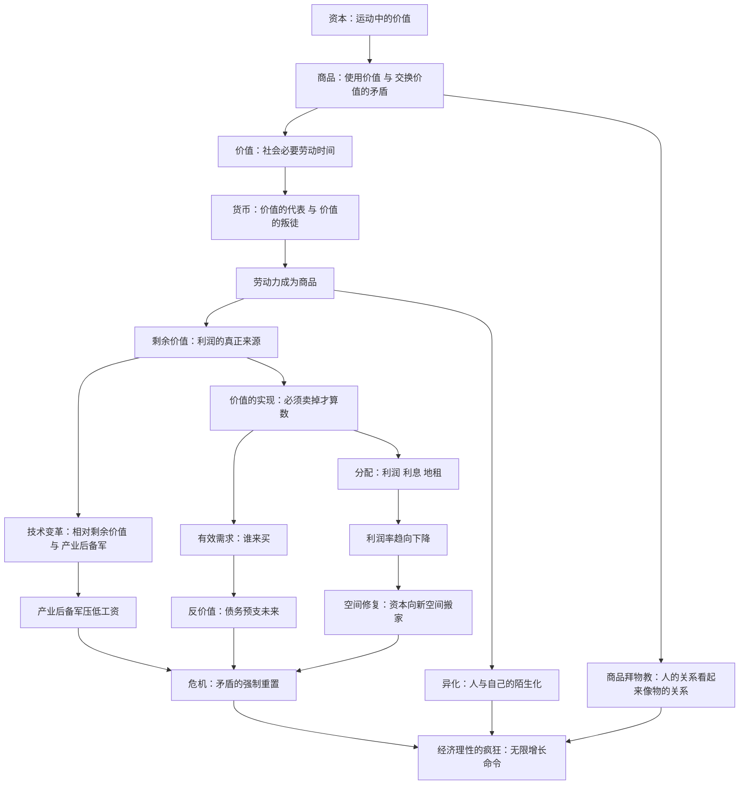

# 00｜《马克思与〈资本论〉》系列拆解与目录

> 大卫·哈维五十年讲授《资本论》的浓缩导览：资本不是一堆钱，而是一种停不下来的运动

---

## 系列简介

《马克思与〈资本论〉》（*Marx, Capital and the Madness of Economic Reason*，2017）是英国地理学家大卫·哈维的导读性著作。哈维在纽约城市大学讲授《资本论》超过四十年，他的在线课程是全球传播最广的马克思文本细读之一。这本书不是对《资本论》三卷的逐章注释，而是哈维自己的提炼：他把三卷合成一个整体——第一卷讲价值的**生产**，第二卷讲价值的**实现**，第三卷讲价值的**分配**——然后用“运动中的价值”“反价值”“空间修复”“经济理性的疯狂”这些概念，回答一个问题：为什么一个看似精密、理性、不断创造财富的经济系统，会周期性崩溃、制造不平等、并把整个地球拖进风险之中？

这本书值得读，不是因为它能让你“读懂马克思原著”（它做不到，也不承诺做到），而是因为哈维给出了一套用来拆解当代经济的扳手：住房、债务、外卖骑手、产业转移、金融危机，都可以用同一套逻辑解释。

本系列不按原书章节走，而是按认知顺序重新组织为 18 篇：先弄清“资本是什么”，再追“利润从哪来”，然后看“价值如何在流通中生存或死亡、如何被分配”，接着看资本扩张的两条腿——空间与剥夺，最后抵达全书的标题——经济理性的疯狂。

---

## 全书核心问题

| 层次 | 核心问题 | 对应篇目 |
|---|---|---|
| 认知层 | 资本、商品、价值、货币到底是什么？ | 01–04 |
| 机制层 | 利润从哪里来？技术与劳动的关系是什么？ | 05–07 |
| 机制层 | 价值如何实现？谁来买？剩余价值怎么分？ | 08–12 |
| 机制层 | 资本靠什么扩张：空间与剥夺扮演什么角色？ | 13–14 |
| 评价层 | 异化、拜物教、危机、“疯狂”意味着什么？ | 15–18 |

---

## 全书知识地图

---

## 全系列目录

### 第一部分：起点——资本到底是什么

#### 01｜为什么说资本不是一个“东西”，而是一种“运动”？

核心问题：为什么哈维反复强调资本是“运动中的价值”，而不是一堆钱或一排厂房？

核心观点：哈维认为马克思对资本最核心的定义是“运动中的价值”——货币购买商品、经过生产、再变成更多货币的循环；只有处在这种循环中的价值才是资本，躺在保险箱里的钱不是。这把资本从“物”改写成了“过程与关系”。

理解难度：★★☆☆☆

关键词：运动中的价值、循环、资本的定义、过程而非物

---

#### 02｜一件商品为什么会有两个“灵魂”？

核心问题：为什么马克思要从“商品具有使用价值和交换价值两重性”开始分析整个资本主义？

核心观点：每个商品都要同时满足“有用”和“能卖钱”两个方向相反的要求，这对矛盾不可消除、只能转移；哈维认为它是整部《资本论》的发动机，住房是它最扎眼的当代化身。

理解难度：★★☆☆☆

关键词：使用价值、交换价值、两重性、矛盾的发动机

---

#### 03｜价值到底从哪里来？

核心问题：马克思的劳动价值论到底在说什么，为什么“社会必要劳动时间”而不是“劳动”是关键？

核心观点：价值量不由生产者的辛苦程度决定，而由社会平均条件下所需的劳动时间决定；哈维提醒，价值是一种社会关系，不是商品身上的物理属性，看不见摸不着却支配一切。

理解难度：★★★☆☆

关键词：劳动价值论、社会必要劳动时间、抽象劳动、社会关系

---

#### 04｜钱为什么既是价值的代表，又是价值的叛徒？

核心问题：货币为什么一方面让价值可衡量、可流通，一方面又不断脱离真实劳动？

核心观点：货币解决了物物交换的不便，却给价值造了一个可以独立积累、投机、虚构的外壳；价值要求货币忠于劳动，货币却总在追求自己繁殖——这是“反价值”的伏笔。

理解难度：★★★☆☆

关键词：货币、价值尺度、价值的代表、信用货币、反价值萌芽

---

### 第二部分：利润的秘密

#### 05｜“自由”的工人为什么其实不自由？

核心问题：工人可以自由签约、自由辞职，为什么哈维说这种“自由”恰恰是被支配的条件？

核心观点：马克思说劳动力成为商品需要双重自由：自由地出卖劳动力，以及“自由地”不占有任何生产资料；哈维补充，劳动力的再生产成本——吃饭、住房、教育——被巧妙地推给了家庭和社会。

理解难度：★★★☆☆

关键词：劳动力商品、双重自由、生产资料、劳动力再生产

---

#### 06｜利润的真正来源藏在哪里？

核心问题：如果市场交换大体是等价的，剩余价值到底从哪里冒出来？

核心观点：劳动力这种商品很特别——它一天能创造的价值大于维持它一天所需的价值，差额被资本家无偿占有，这就是剩余价值；延长工时得到绝对剩余价值，提高生产率得到相对剩余价值。

理解难度：★★★☆☆

关键词：剩余价值、绝对剩余价值、相对剩余价值、等价交换之谜

---

#### 07｜机器真的在替人干活吗？

核心问题：自动化为什么一边减轻体力劳动，一边制造失业和更低的工资？

核心观点：哈维指出技术变革不是中立的进步，而是资本获取相对剩余价值的武器：机器把工人的技能吸进资本，抛出“产业后备军”压低工资；谁控制技术方向，本身就值得追问。

理解难度：★★★☆☆

关键词：技术变革、相对剩余价值、产业后备军、机器与人

---

### 第三部分：价值的生死场——实现、消费与分配

#### 08｜生产出来还不算数：价值为什么必须被“实现”？

核心问题：商品生产出来只是第一步，为什么卖不掉就一文不值？

核心观点：哈维强调把《资本论》三卷当整体读：第一卷讲价值生产，第二卷讲价值在流通中的实现；能生产出来和能被买走是两回事，生产与实现的结构性张力是危机的第一现场。

理解难度：★★★☆☆

关键词：价值的实现、流通、三卷一体、生产与实现的张力

---

#### 09｜谁来买：消费为什么成了资本的结构性难题？

核心问题：商品要实现就必须有人掏钱买，购买力从哪来，为什么这成了资本的天生缺陷？

核心观点：哈维读第二卷的独到发现：价值实现要求“有效需求”——不是想要，而是买得起的需求；而压低工资恰恰削减需求，资本在自己脚下挖坑。消费主义、信贷消费、郊区化，都是被造出来填这个缺口的。

理解难度：★★★☆☆

关键词：有效需求、消费主义、社会再生产、第二部类

---

#### 10｜债务为什么是资本离不开的“毒药”？

核心问题：信贷让整个经济转得更快，为什么又不断积累成炸弹？

核心观点：哈维提出“反价值”概念：债务是对未来劳动和价值的索取权，它填补了生产与实现之间的缺口，但必须靠未来持续增殖来偿还；资本因此永远欠着明天，债务链一断就是危机。

理解难度：★★★★☆

关键词：反价值、信贷、债务链、未来劳动的索取权

---

#### 11｜剩余价值为什么会被切成利润、利息和地租？

核心问题：剩余价值生产出来后并不全归工厂主，为什么还要分给银行家和地主？

核心观点：第三卷讲分配：剩余价值在产业利润、商业利润、利息、地租之间被瓜分；哈维特别强调地租与建成环境——地主不参与生产，靠对稀缺位置的垄断分走一块，分配领域是与生产领域同样激烈的战场。

理解难度：★★★★☆

关键词：分配、商业利润、利息、地租、第三卷

---

#### 12｜利润率为什么倾向往下掉？

核心问题：技术进步提高生产率，为什么反而可能压低利润率？

核心观点：马克思的利润率趋向下降规律：资本有机构成提高（机器占比上升、活劳动占比下降），而剩余价值只来自活劳动，利润率因此长期承压；反作用因素存在但只能延缓不能逆转。哈维承认这个张力，却反对把它当成唯一的危机理论。

理解难度：★★★★☆

关键词：利润率趋向下降、资本有机构成、反作用因素、危机理论之争

---

### 第四部分：资本的两条腿——空间与剥夺

#### 13｜资本为什么永远在“搬家”？

核心问题：全球化产业转移和大规模基建，为什么是同一个逻辑的延伸？

核心观点：哈维的“空间修复”：过剩资本通过涌向新空间、投资建成环境来吸收盈余、推迟危机；修一座新城和把工厂搬到越南，本质上是同一种处置过剩资本的方式。

理解难度：★★★★☆

关键词：空间修复、资本过剩、建成环境、地理扩张

---

#### 14｜资本的“第一桶金”真的靠勤劳吗？

核心问题：马克思的“原始积累”讲的是什么，为什么哈维说它到今天还在发生？

核心观点：原始积累——圈地、殖民、剥夺——不是资本主义史前的一次性事件；哈维把它升级为“剥夺式积累”：私有化、征地拆迁、金融掠夺今天仍在继续，是资本积累的另一条腿。

理解难度：★★★☆☆

关键词：原始积累、剥夺式积累、私有化、圈地

---

### 第五部分：理性的疯狂

#### 15｜为什么劳动让人与自己越来越陌生？

核心问题：异化到底指什么，为什么它是马克思批判体系的哲学底色？

核心观点：源自马克思早期手稿的异化概念——人与产品、与劳动过程、与类本质、与他人的四重异化——被哈维用来给《资本论》的政治经济学批判垫底：资本的运动把人的创造力变成外在的、反过来支配人的力量。

理解难度：★★★☆☆

关键词：异化、劳动的异化、类本质、创造力的倒转

---

#### 16｜我们为什么把人与人的关系看成了物与物的关系？

核心问题：商品拜物教到底在说什么，为什么它是马克思最深的批判之一？

核心观点：市场把一切社会关系以“物的价格”呈现，我们看不见商品背后的劳动和人；拜物教不是主观错觉，而是资本主义日常运作的结构——哈维认为它比任何辩护词都更深地遮蔽了剥削。

理解难度：★★★☆☆

关键词：商品拜物教、货币拜物教、社会关系的遮蔽

---

#### 17｜经济危机为什么总是反复发作？

核心问题：为什么危机不是意外事故，而是资本主义的内置功能？

核心观点：哈维把危机理解为多重矛盾的总爆发与强制重置：生产与实现的断裂、债务链的绷紧、过剩资本无处安放、工资的周期波动；危机不是系统的失败，而是系统自我续命的残酷方式。

理解难度：★★★★☆

关键词：危机、多重矛盾、强制重置、2008 金融危机

---

#### 18｜什么是“经济理性的疯狂”？

核心问题：为什么每个参与者都按规则理性行事，整个系统却走向集体的疯狂？

核心观点：这是全书标题的答案：资本要求无限复利式增长——3% 的增长意味着 25 年翻一倍——债务堆积、生态透支、人的异化都是这个命令的账单；哈维呼吁以“政治理性”回应“经济理性的疯狂”。

理解难度：★★★★☆

关键词：经济理性的疯狂、无限增长、指数增长、政治理性

---

## 推荐阅读顺序

**主线（从头读到尾）**：01 → 18，按认知难度爬升设计。

按难度分段：

- **入门段（01–04）**：建立概念地基——资本是运动、商品有两重性、价值来自社会必要劳动时间、货币是带叛性的代表。读完这 4 篇，后面所有讨论才有词汇表。
- **进阶段（05–07）**：进入利润机制——劳动力为什么是特殊商品、剩余价值从哪来、机器扮演什么角色。这是全书技术密度最高的部分之一。
- **展开段（08–12）**：把视野拉出工厂——价值要实现、需求是结构性难题、债务是反价值、剩余价值怎么被瓜分、利润率为什么承压。这是三卷一体的核心地带。
- **扩张段（13–14）**：哈维作为地理学家的独门贡献——空间修复与剥夺式积累，资本积累的两条腿。
- **综合段（15–18）**：回到总体批判——异化、拜物教、周期性危机、“经济理性的疯狂”。读到这里可以回头重读 01，会发现“运动中的价值”这个开头定义已经完全不同了。

按需求的入口：

- **只想抓骨架**：01 → 06 → 08 → 18，四篇串起“资本是什么—利润哪来—危机怎么发生—结局是什么”。
- **对当代问题感兴趣**：02（住房）→ 05（外卖骑手）→ 09（消费主义）→ 10（债务）→ 13（产业转移）→ 17（金融危机）。
- **对政治经济学硬核感兴趣**：03（劳动价值论）→ 11（分配与地租）→ 12（利润率趋向下降）→ 17（危机）。
- **练习批判阅读**：每篇第九节都列出争议；重点看 03（劳动价值论的百年论战）、07（技术与就业之争）、12（利润率规律的学术公案）、14（剥夺式积累的边界）。

---

## 全系列状态

本系列 **18 篇正文已全部完成**。每篇独立成文、结构统一：先说结论 → 提出问题 → 作者观点 → 翻译成人话 → 推理链 → 现实例子 → 回到书中 → 深层逻辑 → 争议 → 现代延伸 → 核心结论 → 留一个问题；均严格区分「哈维/马克思的观点」「历史事实」「学界争议」与「现代延伸」。

建议从 **01｜为什么说资本不是一个“东西”，而是一种“运动”？** 开始，依次读到 **18｜什么是“经济理性的疯狂”？**——末篇会回扣首篇的定义，完成整个系列的闭环。
