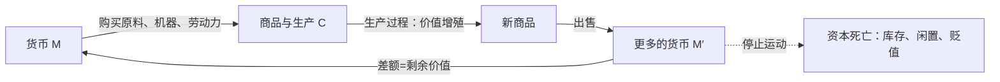

# 01｜为什么说资本不是一个“东西”，而是一种“运动”？

> 哈维读《资本论》的第一个动作：把资本从名词改成动词

---

## 一、先说结论

哈维认为，马克思对资本最重要的定义不是“资本家的钱”，而是**“运动中的价值”**。资本不是一个东西，而是一个过程：货币被投出去买原料和劳动力，经过生产变成商品，商品被卖掉换回更多的货币——只有在这个不停旋转的循环里，价值才成其为资本。钱一旦停下来，只是钱，不是资本。这个定义看似抽象，却改变了我们看待经济的整个方式：问题不再是“谁拥有多少”，而是“这个运动要往哪里去、为什么停不下来、停下来会发生什么”。

---

## 二、我们先理解一个问题

先问一个看似简单的问题：什么叫资本？

日常语言里，资本大概是“本钱”“钱”“资产”。一个老板说“我投了五百万资本”，意思是五百万块钱或值五百万的厂房设备。

但这里面藏着一个奇怪的现象：同样是一百万块钱，放在保险箱里和投进工厂里，性质完全不同。保险箱里的钱放十年还是一百万（算上通胀还缩水了）；投进工厂的钱，按理说一年后应该变成一百一十万。

这个差别是怎么来的？钱自己不会生钱。那中间发生了什么？

---

## 三、作者到底提出了什么观点？

哈维在全书开头就强调：马克思把资本定义为一个公式——**M-C-M′**。

- M：货币（money），资本家手里的一笔钱；
- C：商品（commodity），用这笔钱买来的原料、机器、劳动力；
- M′：更多的货币，商品卖出后收回的钱，比原来的 M 多出一截。

多出来的那一截，就是剩余价值。这个循环转一圈，资本就“长大”一点；资本家再把 M′ 投回去，开始下一圈，越滚越大。

哈维的关键提醒是：**资本只存在于这个运动之中**。钱躺在床垫底下，不是资本；机器生了锈不开工，不是资本；商品堆在仓库里卖不掉，也不是资本——是资本的死胎。资本是价值处在流动状态时的样子，就像“跑步”不是一个物件，而是腿在做的一件事。

---

## 四、把这个观点翻译成人话

可以这样想：资本像一辆必须永远行驶的自行车。

自行车只有在骑起来的时候才能保持平衡。骑起来，它能载人、能走远路；停下来，它就倒了。资本也一样：只有钱→货→更多的钱这个轮子不停转，它才“活”着；轮子一停，厂房变成废铁，库存变成垃圾，钱变回纸。

所以我们平时说的“资本家”，在马克思的定义里其实是“人格化的资本”——不是那个人有多贪婪，而是他坐在自行车上，不蹬就会摔。这个系统给每个参与者都下了同一个命令：**让价值继续运动，不许停**。

这个视角一旦建立，很多现象就变了味道：为什么企业宁可亏本也要维持现金流？因为流动本身就是命。为什么经济“不增长”就被叫做“危机”？因为对自行车来说，不动就是倒地。

---

## 五、为什么会这样？

哈维的推理链是这样的：资本主义生产和过去的生产有一个本质区别——**生产的目的不是使用，而是交换；不是“做出东西”，而是“把东西变成更多的钱”**。

每一个环节都是一次“惊险的跳跃”：钱要花得出去，原料要变成卖得掉的商品，商品要真的有人掏钱买。任何一环卡住，价值就“冻”在那里，资本就局部死亡。

这也就解释了为什么哈维坚持**“价值只有在运动中才是价值”**：价值不是锁在商品里的固体，而是必须在一次次交换中被重新确认的关系。一瓶水在生产线上值多少，要等它被卖出去才知道。

---

## 六、举一个现实生活中的例子

想象一杯你早上买的咖啡。

咖啡豆在埃塞俄比亚的农场被采摘——这是一段物流运动；运到烘焙厂，烘焙师和机器把它变成熟豆——这是一段生产运动；豆子进入门店，店员把它做成拿铁卖给你——又是一段交换运动。每一站，价值都在变换形态：从货币变成商品，从商品变成服务，从服务变回货币。

现在做个思想实验：这批咖啡豆如果运不出去，烂在仓库里，它还是资本吗？不是，它是一笔损失。如果门店开不了张，咖啡机闲置，它还是资本吗？也不是。

整条链条上没有任何一个“静止的点”可以称为资本——**资本是这条流动的河本身，而不是河里的任何一滴水**。星巴克资产负债表上的数字，只是这条河在某个瞬间的水位读数。

---

## 七、回到书中重新理解

现在回头看哈维的处理，就能明白他的用意。

《资本论》第一卷大部分篇幅在讲生产——车间里发生了什么、剩余价值怎么被榨出来。如果孤立地读第一卷，很容易得到一个印象：资本=工厂里的剥削机器。哈维反复纠正这一点：马克思讲资本，从来是把它放在 M-C-M′ 的完整循环里讲的。生产只是循环中的一段，流通、交换、消费是同样不可或缺的段落。

这也解释了这本书的副标题式的总问题：如果资本是运动，那么**什么力量会让这个运动失控、卡死、发疯**——这正是后面关于实现、债务、危机的所有讨论的地基。

---

## 八、这个观点背后还有什么？

这个定义背后藏着几个不容易注意到的东西。

第一，**时间是资本的内生变量**。循环转得越快，同样的本钱一年能滚的次数越多。所以“缩短流通时间”——更快的物流、更快的付款、更快的周转——不是技术细节，而是资本增殖的核心战场。哈维把这叫做“时空压缩”的伏笔。

第二，**资本天然地敌视一切让它停下来的东西**。库存、闲置产能、甚至“够用就好”的消费观，都是对资本的威胁。这解释了资本主义文化中那种根深蒂固的焦虑：不增长就是失败。

第三，也是最深的：**资本是一种社会关系**。钱是人和人之间的索取凭证，商品的“价值”反映的是生产它的人之间的社会关系。说资本是“运动中的价值”，等于说资本是“运动中的人与人之间的关系”——这一点会在讲拜物教的时候显出全部的分量。

---

## 九、这个观点有问题吗？

这个定义很有解释力，但也有值得推敲的地方。

**有说服力的地方**：它惊人地预言了现代金融。今天的资本越来越脱离实体商品，直接在 M-M′ 之间打转（金融衍生品、高频交易），如果用“资本=生产资料”的旧定义会无法理解，用“运动中的价值”则一目了然：运动本身被金融工程抽象化了。

**存在争议的地方**：一些学者认为，哈维把“流通”提到和生产并列的高度，偏离了马克思的本意——马克思毕竟用了第一卷整整一卷强调生产领域的优先性。价值到底主要在车间里创造、还是在市场上被共同决定，马克思主义内部至今有争论。

**可能过度简化的地方**：“不动就不是资本”是个漂亮的口号，但现实中资本也存在于等待、囤积、投机的静止状态里——炒房客把房子空着等升值，房子“不动”却在发挥资本功能。哈维自己也承认这类矛盾，但这说明“运动”模型需要补丁，而不是字面成立。

---

## 十、今天再看这个观点

以下部分是基于哈维思想的现代延伸，不是作者原话。

平台经济把这个定义推到了极致。外卖平台不拥有餐厅、不拥有电动车、甚至不雇佣骑手，它拥有的是**让价值运动加速的调度权**——谁能把“钱—服务—钱”的循环转得最快、最密，谁就掌握资本。传统工厂的资本运动以天为单位，算法平台的资本运动以秒为单位。

加密资产则是另一个极端：一种纯粹靠“运动会继续”的信念维持的价值形态。比特币没有任何生产环节，它是不是资本，完全取决于它能不能继续进入 M-M′ 的运动——这几乎是马克思定义的思想实验版。

而“躺平”“低欲望社会”这些现象，用哈维的眼光看就有了新的政治含义：当一部分人选择退出“更多、更快”的运动时，他们退出的不是消费，而是资本的循环本身。

---

## 十一、这一篇真正应该记住什么？

1. 哈维的核心定义：资本是**运动中的价值**（M-C-M′），不是静止的财物；钱只有进入“买—产—卖—更多钱”的循环才是资本。
2. 资本像自行车：必须永远运动才能存在，停止即死亡——库存、闲置、不增长都是资本的局部死亡。
3. 这个定义把焦点从“谁拥有”转向“运动往哪去、为何停不下来”，是全书后面所有危机讨论的地基。
4. 时间、速度、流通是资本增殖的内生变量；资本天然敌视一切让它停下来的东西。

---

## 十二、留一个问题

如果资本只有在“被交换”时才算活着，那么驱动这一切循环的最基本的那个东西——商品本身——到底是什么？一件普通的商品，为什么能够承载“既要对人有用、又要能卖出价钱”这两个方向相反的要求？

下一篇我们就来看看，马克思为什么把整部《资本论》的地基，打在一对矛盾上。
