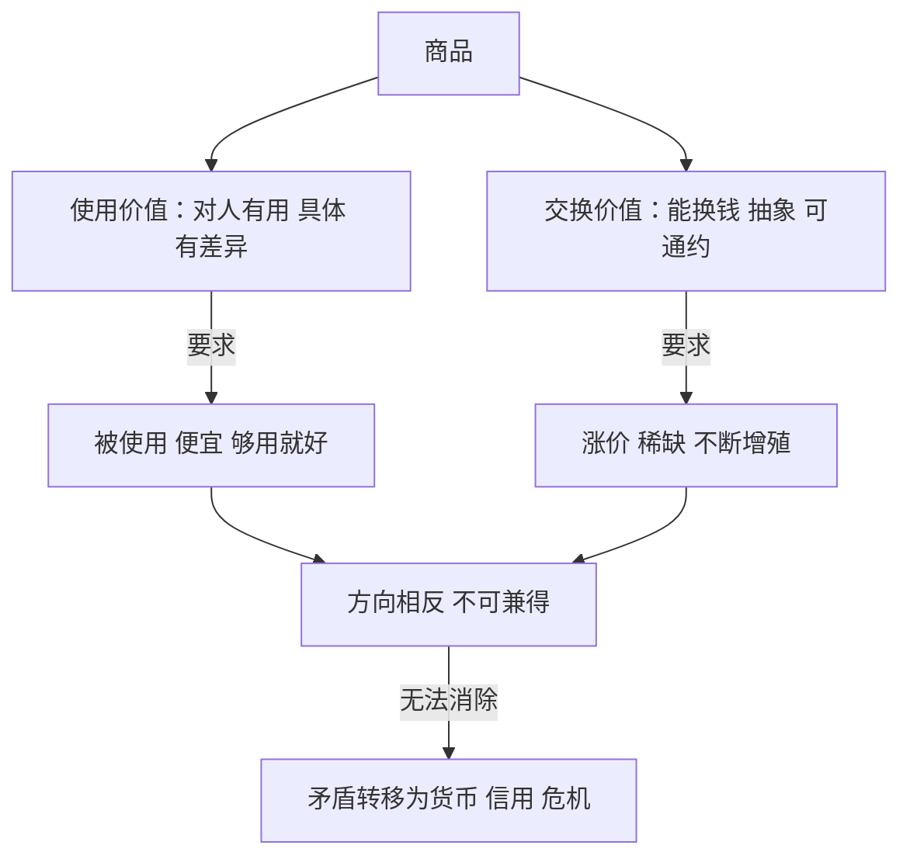

# 02｜一件商品为什么会有两个“灵魂”？

> 马克思为什么把整部《资本论》的地基，打在商品身上的一对矛盾上

---

## 一、先说结论

哈维认为，《资本论》从商品的两重性开场绝不是偶然：每个商品都必须同时是“有用的东西”（使用价值）和“能换钱的东西”（交换价值）。这两个要求方向相反——一个指向物的具体用途，一个指向抽象的市场数字——却又不可分割地绑在同一件东西上。马克思认为这对矛盾不可能被消除，只能被转移、被掩盖、被推迟；哈维则把它称为整部《资本论》的发动机：后面所有关于货币、债务、危机、拜物教的讨论，都是这对矛盾的一次次变身。

---

## 二、我们先理解一个问题

先从一个最朴素的问题开始：一个东西为什么能卖钱？

常识的回答是“因为它有用”或者“因为有人要”。但再想一步就会发现漏洞：空气最有用，却不卖钱；一幅画几乎没什么“用”，却能拍出天价。有用和值钱之间，并不是一条直线。

更要命的是，同一个东西在“用”和“卖”之间经常打架。开发商希望房子涨价，住户希望房子便宜好用；面包师希望面包卖出高价，饥饿的人希望它免费。一件商品到底该服从哪个要求？这个问题看起来是讨价还价的小事，马克思却看出了它是整个系统的地基。

---

## 三、作者到底提出了什么观点？

马克思在《资本论》第一章就指出，商品是一个“二重物”：

- 使用价值：它能满足某种需要——面包能吃饱，房子能住人，这是具体的、千差万别的；
- 交换价值：它能按一定比例换到别的商品或货币——这是抽象的、可比较的、最终化约为一个数字的。

哈维强调的重点是：**这两者不是并列的两个属性，而是一对矛盾**。使用价值要求商品是具体的、有差异的、为人服务的；交换价值要求商品是抽象的、可通约的、为市场服务的。一件商品必须同时讨好两个方向相反的主人。

更关键的是哈维指出的第二点：这对矛盾**不能被解决，只能被转移**。当“用”和“卖”的冲突激化时，它不会消失，而是会换一个地方爆发——变成货币问题，变成债务危机，变成空置与无家可归并存的荒诞景观。

---

## 四、把这个观点翻译成人话

可以把商品想象成一个签了双重合同的员工。

一份合同上写着：“你的职责是切实解决人的问题。”另一份合同上写着：“你的职责是给公司赚到钱。”这两份合同偶尔一致，更多时候冲突：最能解决问题的方案未必赚钱，最赚钱的做法未必解决问题。

商品就活在这两份合同之间。它的“使用价值人格”说：我存在的意义是被使用；它的“交换价值人格”说：我存在的意义是被卖掉、卖出高价。一件商品永远无法彻底满足其中一方而不得罪另一方——这就是“两个灵魂”的意思。

而一旦整个社会把越来越多的东西交给这种双重人格来管理——粮食、住房、教育、医疗——冲突就不再是个别商品的毛病，而是整个系统的结构性紧张。

---

## 五、为什么会这样？

哈维的分析链条大致是：

为什么会这样？因为在资本主义里，生产的目的不是使用而是交换。一个东西被造出来，首先是为了“卖得掉、卖得好”，“有用”只是“卖得掉”的必要条件之一。于是使用价值被降格成了交换价值的载体——东西好不好用是次要的，能不能变现才是主要的。

但交换价值又不能彻底甩掉使用价值：没人会买完全无用的东西。两个灵魂谁也离不开谁，谁也压不服谁——矛盾因此是永久性的，只能靠不断转移来“管理”。

---

## 六、举一个现实生活中的例子

最能看清这对矛盾的当代商品是住房。

一套房子，使用价值的一面清清楚楚：遮风避雨、离学校近、给家人一个安稳的窝。它交换价值的一面也清清楚楚：可以抵押、可以升值、可以传给下一代的一笔资产。

问题在于：作为“住”的房子，你希望它便宜、够用、价格稳定；作为“炒”的房子，你希望它稀缺、升值、不断涨价。同一套房子被迫同时满足两个相反的要求。当交换价值那一面占上风时，结果我们都见过：房价被推到远超居住成本的高度，年轻人买不起也租不起，而与此同时大量房子被空置着——因为它们作为“增值资产”的功能，已经压倒了“住人”的功能。

哈维在他几十年的写作里反复拿住房开刀：一个社会一边有空置的房子，一边有无家可归的人，这不是某个道德失败的个案，而是商品两重性矛盾最扎眼的化身。矛盾没有被解决，只是被转移成了“住不起”这个社会问题，再转移成房贷、债务和一生的月供。

---

## 七、回到书中重新理解

回头再看马克思为什么把商品放在第一章。

如果《资本论》从“剥削”或者“阶级斗争”开场，它会变成一本控诉书；从商品开场，它变成了一本解剖书。马克思要证明的是：资本主义的一切大毛病，不是从外面污染这个系统的，而是从商品这个最小的细胞里长出来的——病毒就写在基因里。

哈维把这称为矛盾方法的示范：**不是“商品有个缺点”，而是“商品本身就是矛盾”**。之后的每一章都可以看成这对矛盾的展开：货币是矛盾的一次“外置解决”（同时制造了新的麻烦），劳动力商品是矛盾的加深，危机是矛盾的总爆发。抓住开头这两个灵魂，后面整本书就有了贯穿的线索。

---

## 八、这个观点背后还有什么？

第一，**“有用”本身被市场重新定义了**。一件东西的“用处”不再是它的自然属性，而成了“能支撑多少交换价值”的附属品。保健品被做成礼品，课程被做成简历的装饰——使用价值在给交换价值打工。

第二，这为商品拜物教埋下了伏笔。当我们只看价格、不看用途和来历时，人与人的关系就穿上了物的外衣——这一点在讨论拜物教的那一篇会显出全部的分量。

第三，哈维从这里发展出他终身的关怀：建成环境。房子、城市、基础设施是商品两重性斗争最惨烈的战场，因为它们同时是生活空间和大额资产，两个灵魂的撕扯在这里最为血腥。

---

## 九、这个观点有问题吗？

**有说服力的地方**：“矛盾只能转移不能消除”这个判断，解释力惊人。它预言了资本主义的“问题迁移”特征——住房问题变成金融问题，金融问题变成危机，危机变成公共债务，债务再压回普通人身上。每一步都是矛盾换了身衣服重新登场。

**存在争议的地方**：一些学者认为，把“使用价值—交换价值”上升为统摄一切的元矛盾，是哈维和西方马克思主义传统的发挥，马克思本人的分析更谨慎、更历史化。非资本主义社会同样有商品、同样有两重性，矛盾并不必然演变成危机——是资本主义的整套制度安排让这对矛盾变成了灾难，商品本身也许不该背全部的锅。

**可能过度简化的地方**：现实中存在大量“调和机制”——保障房、价格管制、合作社——矛盾并非永远只能转移，有时也能被制度性地缓和，哪怕不彻底。把所有住房问题归因于商品两重性，可能低估了政策选择、文化差异和权力斗争的作用。

---

## 十、今天再看这个观点

以下部分是基于哈维思想的现代延伸，不是作者原话。

数字时代给这对矛盾添了新变种：数据。你的社交关系对你是“使用价值”（联系朋友、获取信息），对平台是“交换价值”（可出售的广告位）。同一份数据有两个灵魂，而两个灵魂的冲突正以“隐私争议”的形式爆发——这和住房的逻辑一模一样。

还有“会员经济”的怪象：视频内容对你是使用价值，但平台的利润要求它不断制造“稀缺”——付费墙、独家、限时——人为地把使用价值扣住，好让交换价值最大化。商品的第二灵魂，一直在学着怎么绑架第一个灵魂。

---

## 十一、这一篇真正应该记住什么？

1. 商品是二重物：使用价值（有用、具体）与交换价值（能换钱、抽象）方向相反却又不可分割，这是《资本论》全书的起点。
2. 这对矛盾不能被消除只能被转移——它会变身成货币问题、债务问题和周期性危机，哈维称之为驱动整部《资本论》的发动机。
3. 住房是当代最扎眼的化身：同一套房既被要求“住得起”又被要求“涨得快”，空置与无家可归并存就是矛盾的显形。
4. 在资本主义中，使用价值被降格为交换价值的载体：一个东西好不好用是次要的，能不能卖得掉、卖出价才是主要的。

---

## 十二、留一个问题

商品“能换钱”这一点我们已经接受了。但接下来的问题更根本：交换价值背后到底用什么来度量？为什么一件衬衫值两百而不是两万？价格背后那个看不见的“价值”，究竟是从哪里长出来的？

这个问题的答案，是马克思最著名也最富争议的理论——劳动价值论。带着“两个灵魂”的线索，我们去看看 03｜价值到底从哪里来？中那把尺子是怎么造出来的。
