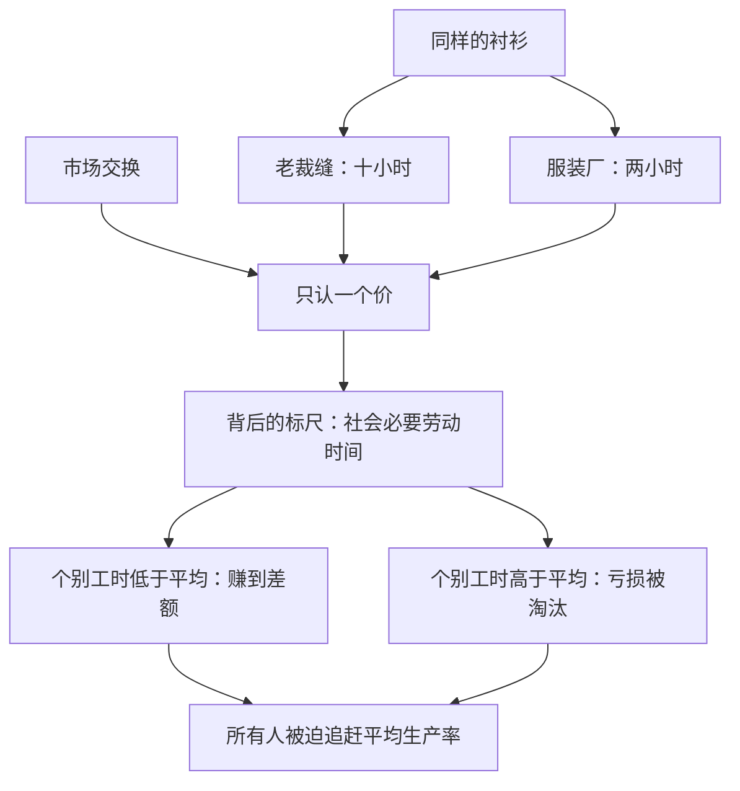

# 03｜价值到底从哪里来？

> 劳动价值论的关键不在“劳动”，而在“社会必要劳动时间”——价值是一种社会关系

---

## 一、先说结论

马克思的劳动价值论说的不是“干活辛苦所以值钱”，而是：商品的价值量由生产它所需要的**社会必要劳动时间**决定——在现有的正常生产条件、平均熟练程度和平均强度下，制造一件商品所花的劳动时间。你做得慢、做得笨，多付出的工夫不会被承认；社会只认平均数。哈维强调由此引出的关键点：价值不是商品的物理属性，而是一种社会关系——看不见摸不着，却通过交换比例支配着一切。

---

## 二、我们先理解一个问题

先问一个经济学最古老的问题：东西的价格从哪来？

直觉的回答有三种：“因为它有用”——但水最有用却最便宜；“因为它稀有”——但沙粒也独一无二，海边的沙子却不值钱；“因为成本”——那成本的价格又从哪来？问题在原地绕圈。

更麻烦的一层：两个工人做出一模一样的两件产品，一个花两小时，一个花十小时，凭什么卖同一个价？如果“劳动创造价值”按个人花的时间算，那懒惰反而创造更多价值——这显然荒谬。马克思的高明之处，就在于把这个荒谬堵住。

---

## 三、作者到底提出了什么观点？

马克思在《资本论》中的说法是：形成价值的不是随便什么劳动，而是**抽象劳动**——抽掉了具体形式（是裁缝还是木匠），只剩下“人类劳动力的一般耗费”的劳动。而价值的量，由**社会必要劳动时间**决定：在正常的生产条件下、以社会平均的熟练程度和强度，生产一个使用价值所需的劳动时间。

这意味着三件事：

- 价值是**社会**决定的，不是个人决定的。你慢，社会不等你；你快，社会也只按平均价付你。
- 价值是**关系**，不是属性。一件衬衫的“价值”不在布料里，而在它与其他所有商品、与生产它的整个社会劳动之间的比例关系里。
- 价值只有在**交换**中才现形。它像引力一样看不见，只能通过“一件衬衫换两条裤子”这样的比例间接显现。

哈维特别提醒：别把劳动价值论当成一个“定价公式”。马克思用它做的不是会计，而是解剖——解剖一个社会里劳动如何被组织、被衡量、被支配。

---

## 四、把这个观点翻译成人话

想象一个巨大的、看不见的“社会记账本”。

整个社会每年耗费的劳动时间是一个总数。这个记账本给每样东西都记了一笔：“造一辆汽车，全社会平均摊下来值多少小时”“做一件衬衫值多少小时”。价格只是这笔账在柜台上的潦草翻译。

关键在“平均”二字。这个记账本不认个人：你手艺差、磨洋工，账本只按行业标准记；你的工厂用了新机器把工时砍半，账本就要重新记——全行业的价值标准被你一个人拉低。这就是为什么资本家拼命革新：不是为了“多生产”，而是为了**让自己的个别劳动时间低于社会必要劳动时间**，赚中间的差额。

所以“价值”更像一个不断刷新的社会排行榜，而不是刻在商品上的固定价签。

---

## 五、为什么会这样？

为什么偏偏是“社会必要”而不是“实际花费”？

逻辑在于：交换是匿名的、大规模的、强制性的。买家不知道也不关心你做了多久；市场把所有同种商品扔进同一个比较器，逼它们对齐到同一把尺子上。这把尺子只能由社会的平均生产条件决定——因为决定“一件衬衫值多少”的，不是你家的缝纫机，而是整个社会缝衬衫的方式。

哈维从这里点出劳动价值论的锋芒：**价值法则是一只看不见的手，但它指挥的不是价格，而是劳动**。它惩罚落后者、奖励革新者、不断重排整个社会的劳动分工——而这一切没有人下令、没有人负责，是通过一次次交换自动执行的。

---

## 六、举一个现实生活中的例子

回到两个裁缝的故事。

老甲在写字楼地下室开了个小裁缝铺，手艺普通，做一件衬衫要一整天。街对面的服装厂用流水线，工人平均两小时一件。两件衬衫挂在同一个商场里，标价都是两百九十九元。

按“辛苦程度”算，老甲理应卖得贵好几倍；但市场不认。顾客摸一摸，料子差不多、版型差不多，凭什么为你的慢买单？老甲的一天劳动，在市场上只能换到别人两小时的报酬——他多花的那些钟头“蒸发”了，不被社会承认为价值。

反过来，如果服装厂引进了新设备，把工时压到一小时，它就能按两百九十九元卖出只“值”一小时劳动的衬衫，赚取超额利润——直到全行业都换上新设备，社会必要劳动时间整体下调，衬衫价格跟着跳水，超额利润消失，下一轮竞赛重新开始。资本主义技术进步这台永动机的燃料，就藏在这个差额里。

---

## 七、回到书中重新理解

哈维读《资本论》时反复强调一个容易读丢的层次：马克思讲价值，讲的不是“价格怎么定”，而是“这个社会为什么用劳动时间来组织一切”。

在别的社会形态里，劳动的分配靠习俗、靠命令、靠血缘——种多少粮、养多少兵，总有人说了算。只有在资本主义里，亿万人的劳动是靠“商品交换的比例”这个匿名机制来协调的。价值规律就是这个匿名协调器的运行法则。所以劳动价值论的矛头不是指向一个定价理论，而是指向一个社会事实：**我们把协调人类劳动的权力，交给了市场这只看不见的手**。

---

## 八、这个观点背后还有什么？

第一，**抽象劳动是个残酷的发明**。要让劳动可以互相比较，就得把“这个工人此刻的、带着技艺与尊严的具体劳动”压扁成“若干小时的一般劳动”。人的差别被抹平了——这为后来劳动力成为商品、人被当成“工时容器”埋下了伏笔。

第二，**价值有一个时间维度**。社会必要劳动时间是“当下”的平均水平，所以你仓库里的存货会悄悄贬值——不是东西坏了，而是社会跑得更快了。哈维注意到，资本因此永远在跟“价值的贬值”赛跑。

第三，**价值只在交换中现形**意味着：生产出来不等于价值成立。卖不掉的东西，其中凝结的劳动不被社会承认——这直接通向后面要谈的“价值的实现”问题。

---

## 九、这个观点有问题吗？

劳动价值论是经济学史上争议最持久的话题之一，值得公平地摆开来看。

**有说服力的地方**：它抓住了资本主义的一个深层事实——一切交换的底层确实是人类劳动时间的分配；它也漂亮地解释了技术竞赛的强制性（不革新就死），以及利润与劳动投入之间那种统计学上的关联。

**存在争议的地方**：这场论战已经打了一百多年。第一，边际效用学派自十九世纪七十年代起就提出了替代解释——价格由消费者的边际评价决定，与劳动时间无关，主流经济学今天基本站在这一边。第二，著名的“转型问题”：马克思需要证明“价值”如何系统地转化为“生产价格”，这个数学转换是否成立，经济学家吵了一个世纪，至今没有公认的了结。第三，经验层面，资本密集型行业（炼油、软件）里劳动投入和价格的对应关系相当弱。

**可能过度简化的地方**：把“价值”单挑出来作为根本尺度，可能低估了效用、稀缺、权力、制度在价格形成中的作用。土地、品牌、平台垄断造成的“租金”，用劳动时间很难解释干净。一些学者——包括不少同情马克思的人——认为劳动价值论最好被理解为一种**社会批判工具**而非精确的定价理论：它揭示“谁在支配谁的劳动”，远比预测“某商品卖多少钱”有力。

---

## 十、今天再看这个观点

以下部分是基于哈维思想的现代延伸，不是作者原话。

数字时代给劳动价值论出了难题，也送了弹药。难题是：一个算法训练一次、服务十亿人，“劳动时间”几乎为零，价值从哪算起？弹药是：平台经济背后是海量隐形劳动——数据标注员、内容审核员、仓库分拣工——价值没有消失，只是被藏进了全球供应链的阴影里。

还有一层延伸：如果价值是社会必要劳动时间，那么“无偿劳动”——家务、照护、为爱发电的内容生产——为什么不被计入？女性主义经济学家早就指出，劳动价值论的“社会承认”机制，恰好暴露了它对哪些劳动装瞎。

---

## 十一、这一篇真正应该记住什么？

1. 商品的价值量由社会必要劳动时间决定——即平均生产条件、平均熟练程度下的工时，个人的慢与笨不会被市场承认。
2. 价值是社会关系而非物理属性：它看不见摸不着，只通过商品交换的比例间接显现，却支配着整个社会的劳动分工。
3. 个别劳动时间与社会必要劳动时间之间的差额就是超额利润的来源，这正是资本家拼命进行技术革新的内在发动机。
4. 劳动价值论处在百年论战的中心：边际效用革命与转型问题都是未了的争议，它作为社会批判工具远比作为定价公式有力。

---

## 十二、留一个问题

价值是看不见的社会关系，可我们每天都在摸它——以钱的形式。一张印着数字的纸，凭什么代表“多少小时的劳动”？货币到底是价值的忠实仆人，还是一个总想自己当家的代表？

这个“代表会不会叛变”的问题，正是 04｜钱为什么既是价值的代表，又是价值的叛徒？要拆开的下一层。
