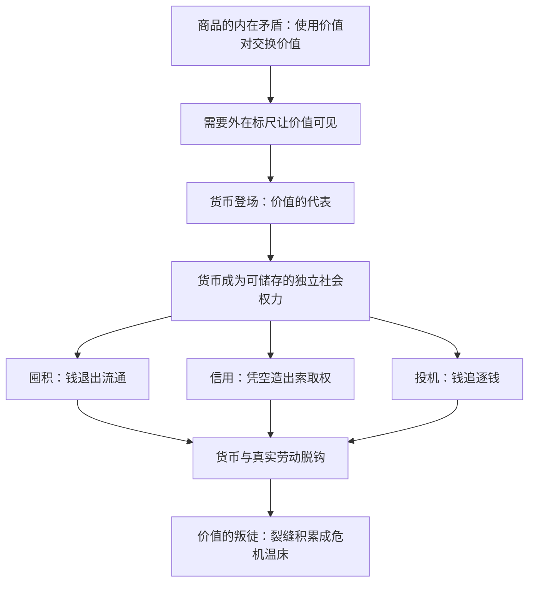

# 04｜钱为什么既是价值的代表，又是价值的叛徒？

> 货币让价值可衡量、可流通，也给价值造了一个可以自己繁殖的外壳

---

## 一、先说结论

哈维用一个漂亮的悖论概括马克思的货币理论：货币是价值的**代表**，也是价值的**叛徒**。作为代表，它把看不见摸不着的价值变成可掂量的数字，让亿万种商品互相通约——没有它，市场一天也转不动。但作为代表，它一旦站稳脚跟就开始自立门户：钱可以被囤积、被放贷、被投机、被凭空创造（信用），它越来越像一种独立的权力，而非忠实的仆人。价值要求货币忠于背后真实的劳动，货币却总在追求自我繁殖——这道裂缝，正是哈维后来“反价值”概念的萌芽。

---

## 二、我们先理解一个问题

先回到没有货币的世界想一想：以物易物为什么这么难？

我有羊，想换你的斧子，但你只要布——我得先找到有布的人换到布，再来换斧子。每一笔交换都要凑齐“需求的双重巧合”，成本高到大部分交换根本不会发生。货币的出现是天才的解决方案：把所有商品都先换成一种“通用商品”，再拿它去换任何东西。

但请注意这个解决方案的结构：为了解决“商品不好换商品”的矛盾，我们造出了一个**站在所有商品对面的东西**。一个新角色登场了——它既服务于交换，又独立于交换。问题就从这里开始。

---

## 三、作者到底提出了什么观点？

马克思在《资本论》中给货币安排了好几个职能，哈维把它们归纳为两组互相拉扯的角色：

- **价值的代表**：货币是价值尺度（给商品标价）、流通手段（让交换运转）。在这个角色里，货币应该像一面镜子，如实反映商品背后的社会劳动。
- **独立的力量**：货币又是贮藏手段、支付手段、世界货币。在这些角色里，钱可以退出流通被攒起来，可以赊账和讨债，可以跨国流动——它不再“代表”什么，它自己成了目的。

哈维指出其中的紧张：价值是一种社会关系，本应永远绑在“具体劳动—具体商品”上；货币却把这种关系抽象成一个符号、一个数字。而符号一旦被造出来，就有了自己的生命：它可以多印（通胀），可以无中生有（信贷），可以自我复制（利息）。**货币是解决商品矛盾的方案，同时也是这个矛盾的升级版**——矛盾没有被消除，只是从商品内部搬到了一个更大、更危险的舞台上。

---

## 四、把这个观点翻译成人话

把货币想象成一个被雇来的翻译官。

价值说的是一种没人听得懂的语言（社会劳动关系），需要翻译官把它译成大家能懂的语言（价格）。翻译官起初很称职：衬衫两百九十九、咖啡三十五，井井有条。

但翻译官干久了开始出问题。第一，他开始自由发挥——翻译不再忠实原文，他自己改写句子（价格波动、通胀）。第二，他发现自己的身份本身就能卖钱——不用真的翻译，光是“翻译官的名片”就有人愿意收（信用、票据）。第三，也是最要命的：人们渐渐只认翻译官，不认原文了。大家追求的不是“有价值的劳动成果”，而是翻译官本身——钱从手段变成了目的。

这就是“叛徒”的意思：货币没有辞职不干的选项，但它的忠诚从此不可保证。

---

## 五、为什么会这样？

为什么代表必然变成叛徒？哈维的分析分几步：

第一，**货币能储存，商品不能**。牛奶会坏、衬衫会过时，钱却“永葆青春”。于是理性的选择是握住钱——但人人都握钱，流通就停了。贮藏职能天生和流通职能打架。

第二，**货币可以先行、可以赊欠**。一旦有了“支付手段”，买卖和时间就脱钩了：先交货后付钱，或先付钱后交货。信用由此诞生，而信用意味着货币的数量不再受“实际劳动成果”约束——它开始漂浮。

第三，**钱能生钱的幻象**。钱直接变更多钱，看起来连商品环节都可以跳过。金融资本主义的整座大厦，就盖在货币的这次叛变之上。

---

## 六、举一个现实生活中的例子

想一个最日常的画面：你用一张一百元纸币买一顿饭。

这张纸本身几乎一文不值——纸张加印刷成本几毛钱。它能换到米饭、蔬菜和厨师的劳动，是因为全社会都接受一个约定：这张纸“代表”一定量的价值。此刻，货币是忠实的代表，干着价值尺度的本职工作。

但同样这张纸，换个场景就露出叛徒的面孔。它可以不流向任何一顿饭，而是流向一套房子的首付、一笔网贷的本金——在那里，它不再“代表”已完成的劳动，而是变成**对未来劳动的索取权**：房贷是你未来三十年劳动的抵押，利息是钱向钱收的租。

货币的两副面孔每天都在我们钱包里共存：上午它是工资，是劳动的报酬、价值的镜子；下午它变成月供，是对未来的锁链、权力的凭证。同一张纸，既是代表，又是叛徒。

---

## 七、回到书中重新理解

哈维读《资本论》前几十页时提醒大家注意马克思的叙述顺序：商品，到价值，再到货币。这不是从简单到复杂的教学安排，而是**矛盾的层层外化**。

商品内部的矛盾（使用价值对交换价值）无法自我解决，于是被外化到货币身上：交换价值从商品里“独立”出来，变成一个站在所有商品对面的特殊商品。所以货币不是矛盾的答案，而是矛盾的制度化——它把原本藏在商品里的裂缝，升级成了社会规模的裂缝：一边是真实劳动和真实财富，一边是它们的货币影子，而影子可以膨胀、可以破灭。

这也解释了马克思为什么紧接着要讲“货币转化为资本”：钱一旦可以独立存在，就有人专门让钱生孩子——资本正是从货币的叛变中登场的。

---

## 八、这个观点背后还有什么？

第一，**货币天然带有社会权力的属性**。握钱等于握着对他人劳动的普遍索取权——能调动任何商品，就等于能调动任何人。哈维注意到，货币把权力洗得很干净：它看起来匿名、中立、谁都可以用，事实上却高度集中。

第二，**信用货币把裂缝撕到了极限**。当银行可以凭空放贷、央行可以量化宽松时，货币与“已完成的劳动”之间的联系几乎只剩信仰。这不是货币的故障，而是货币逻辑的终点。

第三，这对矛盾为全书后半部埋下了最重要的伏笔：**反价值**。当货币形式彻底脱离价值实体、变成纯粹的索取权链条（债务），哈维称那个东西为反价值——它吞噬未来的劳动来喂饱现在的循环。这个话题到债务那一篇会正式登场。

---

## 九、这个观点有问题吗？

**有说服力的地方**：“代表与叛徒”的双面结构极好地解释了现代金融的暧昧性——金融既被说成“服务实体经济”（代表功能），又不断自转、膨胀、引爆（叛徒功能）。二〇〇八年危机里，正是那些最“抽象”的货币衍生品断了链条，真实经济跟着陪葬——货币与价值的裂缝，被用最昂贵的方式演示了一遍。

**存在争议的地方**：第一，马克思的货币理论写在金本位的背景下，今天的纯信用货币体系是否还适用他的框架，学者之间有分歧；后凯恩斯主义的“内生货币”理论给出了另一种解释——货币从来就是信用和债务，“先有劳动成果、后有货币代表它”的次序本身可能就反了。第二，“货币应该忠于价值”暗含一个规范判断，但一些学者认为货币本来就是社会约定和权力的产物，谈不上“背叛”一个先于它存在的实体。

**可能过度简化的地方**：把一切金融现象归为“货币脱离劳动”，容易低估金融的真实功能——期限转换、风险分散、为创新融资。信用不全是虚构和投机；问题可能不在于“钱脱离了劳动”，而在于**谁在控制钱脱离劳动的方向和收益**。

---

## 十、今天再看这个观点

以下部分是基于哈维思想的现代延伸，不是作者原话。

比特币是“叛徒”问题的极限测试：它声称要解决货币的忠诚问题——总量封顶、规则写死、谁也不能多印——用最极端的方式强迫货币“忠于”一个固定尺度。讽刺的是，它恰恰因为无法成为稳定的“代表”（价格波动剧烈、几乎没人用它标价）而退化成了纯投机物：一种只做叛徒、不做代表的“货币”。

另一个延伸：主权数字货币和稳定币正在重演老戏码——试图用技术缝合货币与价值之间的裂缝。但哈维的逻辑提示我们：裂缝不是技术缺陷，而是结构自带的；换一套账本技术，矛盾大概率换个地方再出现。

---

## 十一、这一篇真正应该记住什么？

1. 货币是商品内在矛盾的外化方案：它给交换价值一个可见的身体，让亿万种商品互相通约，是价值不可缺少的代表。
2. 但货币能贮藏、能赊欠、能自我投机——这些职能使它脱离真实劳动、自立门户，原本忠实的代表由此变成了叛徒。
3. 货币的叛变不是系统故障而是逻辑的展开：信用、利息、金融资本全都从“钱可以独立存在”这道裂缝中生长出来。
4. 货币与价值之间的裂缝是“反价值”概念与危机理论的伏笔：债务本质上是对未来劳动的索取权，链条一断就是崩盘。

---

## 十二、留一个问题

到这里，商品、价值、货币都登场了，但还差最后一个环节资本才完整：谁在生产价值？答案指向一种最特殊的商品——劳动力。一个工人走进人才市场，合同自愿签、辞职随你便，看起来是市场里最自由的人。哈维却问：这种“自由”，会不会恰恰是枷锁的另一种形式？

这个疑问就留给 05｜“自由”的工人为什么其实不自由？——马克思对这份自由的拆解，是全书最辛辣的一页。
