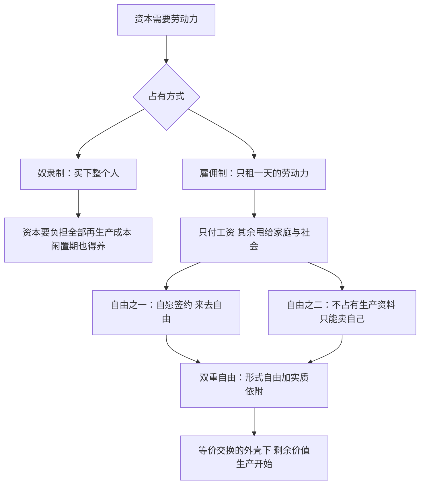

# 05｜“自由”的工人为什么其实不自由？

> 劳动力成为商品需要“双重自由”：自由地出卖自己，以及“自由地”一无所有

---

## 一、先说结论

马克思在《资本论》中提出了一个冷峻的概念：**双重自由**。劳动力要能成为商品在市场上买卖，工人必须同时具备两种自由：第一，他是自由人，有权把自己的劳动力当商品卖给出价者，而不像奴隶和农奴那样人身被占有；第二，他“自由地”不占有任何生产资料——没有土地、没有工具、没有原料，除了出卖劳动力一无所有。第二种“自由”其实是剥夺换了个说法：你不是被迫走进工厂，但你别无选择。哈维还补了一刀：劳动力的再生产成本——吃饭、住房、教育、养老——被巧妙地推给了家庭和社会，资本只按“日租金”付费。

---

## 二、我们先理解一个问题

先看一个日常悖论。

一个外卖骑手（或者写字楼职员）在法律意义上是自由的：合同是自愿签的，没人拿鞭子逼他，干得不爽理论上可以辞职走人。比起奴隶制、封建徭役，这当然是巨大的历史进步——马克思本人从不否认这一点。

但再看另一面：他不干活吃什么？房租谁付？他“自由地”选择雇主，却没法“自由地”选择不就业。他的选项集是“给甲干活还是给乙干活”，里面没有“不干活也活得下去”这一项。

那么问题来了：一种排除了最重要选项的自由，还算不算自由？马克思的回答很微妙：这种自由是真实的，也是真实的束缚。这正是“双重自由”锋利的地方。

---

## 三、作者到底提出了什么观点？

马克思的论点可以拆成两半。

第一半：**劳动力是一种商品**。和衬衫、咖啡一样，劳动力有使用价值（它能干活、能创造价值）和交换价值（工资）。它要在市场上流通，就得满足商品流通的前提——买卖双方是平等的、自由的产权主体，按等价交换的原则成交。

第二半：这个前提是历史地造出来的，需要**双重自由**：

- 自由之一：工人能自由处置自己的劳动力，按期限出售——卖八小时而不是卖终身，否则就是奴隶制，不是资本主义。
- 自由之二：工人被“解放”成了无产者——土地被圈走、手艺被机器废掉、没有任何生产资料可以独立谋生。

哈维强调的不是这个框架的新颖，而是它的当代版本：第一，剥夺生产资料的过程没有结束（他的“剥夺式积累”概念会展开这一点）；第二，**劳动力再生产的成本被外部化了**——一个人要吃饭、住房、受教育、养病、养老，明天才能继续来上班，但这笔账资本只付“工资”这一格，其余全推给家庭、社区和国家。所谓自由劳动者，是一个由全家和社会在背后垫资的商品。

---

## 四、把这个观点翻译成人话

打个不太舒服但准确的比方：自由工人像一辆“自带燃料来应聘”的车。

租车公司（资本）只付使用费：你跑一天，我给一天的租金。至于这辆车怎么加油、怎么保养、晚上停在哪、报废了怎么办——合同里没写，也不归公司管。车的“维护”发生在另一个看不见的账本上：家里的厨房、父母的积蓄、公立学校、医保系统。

双重自由就是这份合同的两条小字：第一条写着“你自愿出租，来去自由”；第二条写着“你名下没有任何其他资产，不出租就熄火”。第一条是真的，第二条也是真的——它俩加在一起，构成了一种不需要镣铐的绑定。

所以马克思说工人“自由得像鸟”——哈维那一代人会补一句：鸟也得自己找食。

---

## 五、为什么会这样？

为什么资本需要工人“自由”，而不是直接占有他？

第一，**租比买便宜**。奴隶主得为奴隶的整个人生买单，包括干不了活的年月；雇主只为在岗时间付费，生病失业的成本归零——由谁承担？由工人和社会。哈维指出的“再生产成本外部化”说的正是这个：医院、学校、家庭厨房，都是资本不用付费的后勤部。

第二，**自由是竞争的前提**。劳动力市场要运转，必须有很多人可以互相替换、互相压价。人身依附做不到这一点，自由身做得到——失业的风险本身就变成了纪律工具。

第三，**法律上的平等掩盖了结构上的不平等**。合同双方名义平等，但一方不出卖劳动力就会挨饿，另一方不买这个还可以买那个。“自由”的形式恰恰是不平等得以持续的外壳——这是马克思最辛辣的辩证法之一。

---

## 六、举一个现实生活中的例子

外卖骑手把这个逻辑演到了当代极致。

骑手和平台之间签的往往不是劳动合同，而是“合作协议”“众包协议”——平台说这叫灵活就业：想跑就跑、时间自由、多劳多得。听起来，双重自由的第一条被加粗放大、印在了广告页上。

但把协议翻过来看另一面。骑手不占有生产资料吗？表面上看电动车是自己的、手机是自己的——这正是高明之处：连生产资料都让劳动者自带，平台的固定资产几乎为零。而骑手“自由地”不拥有的是更要紧的东西：没有底薪、没有完整社保、没有议价权，更没有“不接单也能活”的底气。算法就是车间，超时罚款就是工头。

再生产的账也被推得干干净净：骑手的吃住、伤病、养老、被淘汰后的出路，都不在平台的成本里。摔伤了，保险是有条件的那一份；跑不动了，“自由”地退出即可——下一个骑手已经在注册。马克思笔下“除了劳动力一无所有”的工人，换上了冲锋衣和保温箱。

---

## 七、回到书中重新理解

回到《资本论》的结构，会发现“劳动力成为商品”这一章是个枢纽：此前的一切（商品、价值、货币）都是铺垫，此后的核心问题——剩余价值从哪来——全靠这块基石撑着。

马克思特意强调，他要找的不是“不公平交易”（克扣工资、强买强卖），而是**在完全公平、等价交换的前提下，利润如何可能**。买卖双方都守规矩：工资按劳动力的“价值”付——这个价值就是维持和再生产这个劳动者所需的生活资料的价值。一切合法合规，剥削却照样发生——因为它发生在合同签完之后的生产车间里。形式上的自由与平等，同实质上的支配，在同一笔交易里共存。

哈维把这一点讲得很透：资本主义的支配不需要违法，它本身就是合法的。批判的矛头因此不该指向个别“黑心老板”，而该指向这套把双重自由写进地基的制度安排。

---

## 八、这个观点背后还有什么？

第一，**“自由”的历史是暴力的历史**。双重自由的第二条不是天上掉下来的：圈地运动、殖民掠夺、行会解体，把人与生产资料强行分离，才造出了“自由劳动者”这个物种。哈维把这件事拉到今天：失地农民进城、城中村拆迁，都是“制造双重自由”的当代版本——剥夺式积累是持续进行时，不是史前故事。

第二，**再生产的外部化有性别**。谁在厨房里、病床前、摇篮边承担劳动力的保养？历史性地，是女性的无偿劳动。女性主义马克思主义者把这一点发展成了对“劳动力成本”的重要修正：工资单上那个数字，从来只支付了账单的一半。

第三，**自由的第二条也在升级**。今天一个人即便有点积蓄、有台电脑，也未必摆脱依附——住房按揭、教育贷款会把“有点资产”的人也锁回劳动力市场。生产资料的定义在变（土地？机器？算法账号？平台流量？），但不占有者的处境没变。

---

## 九、这个观点有问题吗？

**有说服力的地方**：“双重自由”一针见血地解释了为什么资本主义不需要公开的强制就能维持支配——失业恐惧、债务压力就是足够有效的纪律。它也解释了为什么福利国家的每一笔社会支出都会被资本侧目：那都是在把外部化的成本“内包”回去。

**存在争议的地方**：第一，一些学者认为马克思低估了工人的真实能动性——集体谈判、罢工、福利制度确实部分“内化”了再生产成本，双重自由不是铁板一块，而是斗争的战场。第二，“不占有生产资料”在今天的边界模糊了：程序员自带技能、持股计划让员工也有了一点“产”，无产者的定义需要更新，争议也随之而来。第三，自由主义者会反驳：比起任何替代方案，能自由签约的市场仍然是穷人处境改善最快的通道。

**可能过度简化的地方**：把“自由”完全还原为“被迫”，会滑向另一种失真——工人在劳动力市场上的流动性、议价技巧、用脚投票，都是真实的权力来源，只是分布不均。哈维自己也承认形式自由有真实分量（没有它就没有政治博弈的场地），问题不在于“自由是假的”，而在于**自由在结构上被掏空到只剩形式**。

---

## 十、今天再看这个观点

以下部分是基于哈维思想的现代延伸，不是作者原话。

“灵活就业”“零工经济”“自由职业”这套话语，可以说是双重自由第二条的营销版：把“你没有保障”翻译成“你获得自由”。平台算法把马克思的逻辑执行得比十九世纪的工厂更纯粹——连雇佣关系都省掉了，只剩一纸“合作”。

另一个延伸是“新生产资料”问题：一个内容创作者“自由地”不占有流量分配权，一个网约车司机“自由地”不占有派单算法——生产资料从土地机器变成了平台和数据，双重自由的剧本原样重排。

还有全球尺度：发达国家的消费者享受廉价商品，而制造这些商品的工人被安置在劳动保护最弱的地区——双重自由的第二条，被全球产业链分摊到了最没有退路的人身上。

---

## 十一、这一篇真正应该记住什么？

1. 劳动力成为商品需要双重自由：能自由出卖劳动力（人身自由），同时“自由地”不占有任何生产资料（实质剥夺）。
2. 第二种自由其实是强制换了个说法：不出卖劳动力就无法生存，自由签约的市场交换形式恰恰构成了被支配的条件。
3. 哈维的补充：劳动力再生产的成本——吃住、教育、养老、伤病——被推给家庭和社会，工资只覆盖“日租金”。
4. 剥削发生在等价交换完成之后、生产过程之中——因此批判的对象是整个制度结构，而不是个别黑心老板的道德水平。

---

## 十二、留一个问题

现在所有演员都到齐了：商品、价值、货币、劳动力。交易是自由的、等价的、合法的——那么最大的谜题就来了：如果一切按规矩来，利润到底从哪冒出来的？公式里多出来的那一截，藏在哪一道手续里？

答案在生产车间里，在劳动力这种商品“买价”和“产出”之间的差额里。06｜利润的真正来源藏在哪里？我们去车间里找。
