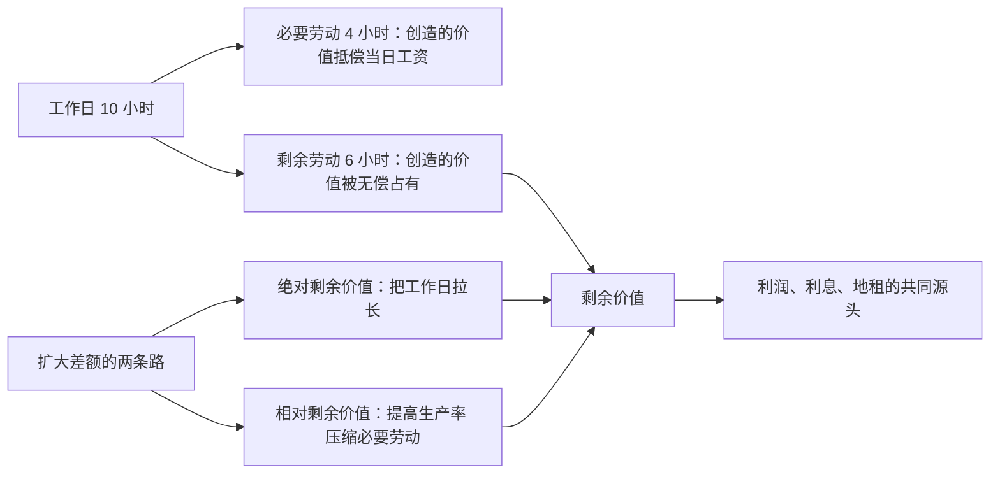

# 06｜利润的真正来源藏在哪里？

> 如果市场上人人等价交换，利润这个多出来的东西，到底是从哪道工序里长出来的？

---

## 一、先说结论

哈维认为，马克思解开了古典经济学一直没解开的死结：利润不来自交换中的低买高卖，而来自生产过程中一种特殊商品的使用——劳动力。劳动力按自身的价值出售，工人拿到维持生活所需的工资；但它的使用能创造出比自身价值更大的价值，多出来的差额被资本家无偿占有，这就是剩余价值。想扩大这个差额只有两条路：把工作日拉长，得到绝对剩余价值；把生产率提高，得到相对剩余价值。整部《资本论》第一卷，几乎就是在解剖这个差额。

---

## 二、我们先理解一个问题

先接受一个常识：市场上的交换大体是等价的。一斤苹果十块钱，是因为买卖双方都认可它值十块钱。

那么问题来了：如果每笔交易都是等价的，你给我十块钱价值的苹果，我给你价值十块钱的货币——谁也没有占到便宜——那整个社会的财富为什么能增长？资本家的利润从哪来的？

常见的回答都不太经得起推敲。说“低买高卖”吧，你占的便宜就是别人吃的亏，全社会加起来是零，解释不了整体的利润。说“利润是给资本家承担风险的报酬”吧，那这笔钱对应的劳动在哪里？钱自己躺在账上不会生出小钱。

马克思把这个死结表述为一个谜团：剩余价值既不能从交换中产生，又必须在交换之后才出现。这话听起来自相矛盾，解开它的钥匙，只有一种商品。

---

## 三、作者到底提出了什么观点？

马克思在《资本论》中指出，解开谜团的关键是劳动力这种特殊商品。它身上有两条线，而这两条线并不重合：

- 劳动力的价值，由维持工人生存和繁衍所需的生活资料决定——吃饭、住房、养家、训练技能，折算成一天的工资；
- 劳动力的使用价值，是它被使用时能创造价值——而且能创造出比自身价值更多的价值。

假设维持一个工人一天的生活，需要 4 小时的社会劳动，那么日工资就对应这 4 小时的价值；但工人一旦进厂，资本家可以让他干 8 小时、10 小时。前 4 小时创造的价值抵偿工资，马克思称之为必要劳动时间；之后几个小时创造的价值分文不给，被资本家拿走，这是剩余劳动时间——产出的那部分就是剩余价值。

哈维特别提醒：这一切完全可以在等价交换的前提下发生。工人按劳动力的公平价值拿到了工资，资本家按公平价格卖出了商品，谁也没骗谁——剩余价值不是在市场上偷来的，而是在车间里生产出来的。剥削不靠欺骗，靠的是结构。

---

## 四、把这个观点翻译成人话

可以这样想：劳动力像一台租金封顶、产出不限的机器。

假设你租一台咖啡机，一天租金五十块，它一天能做多少杯咖啡全归你。它只能做五杯，你就亏；能做五十杯，你就赚。关键在：租金是按“这台机器的身价”定的，产出是按“这台机器干了多少活”算的——这是两笔不同的账，而差额全归租机器的人。

当然，人比机器特别：人会累，会反抗，会组织工会。所以资本家想把工作日拉长一点，工人想把它缩短一点，工作日这条边界本身就成了战场。历史上围绕八小时工作制的斗争、今天关于“996”的争吵，争的都不是“有没有被剥削”，而是那个差额到底切多大。

---

## 五、为什么会这样？

哈维的推理链是：工人除了劳动力一无所有，只能按天出卖它；资本家付清了一天的工资，就取得了这一天劳动力的全部使用权；而“使用”发生在生产过程里，发生在合同签完之后、市场管不着的地方。

所以剩余价值的来源不是“市场不公平”，而是劳动力这个商品身上价值与使用价值的天然裂缝。等价交换只管买卖成交的那一瞬，管不了进厂之后发生了什么。

这也就解释了马克思为什么把批判的重心从市场移到车间：市场交换是平等自由的门面，生产过程才是差额被悄悄切走的地方。

---

## 六、举一个现实生活中的例子

算一家奶茶店一天的账。

店员小李，日薪两百块，一天干十个小时。这一天她做了四百杯奶茶，平均每杯卖十五块，流水六千。扣掉原料、杯子、水电、设备损耗和房租分摊，每杯硬成本大约八块，四百杯是三千二。流水减去硬成本，剩下两千八。

这两千八，是这一天店里新创造出来的价值。小李的工资两百块从这里出，剩下的两千六进了老板的账。注意，这里没有任何人作弊：小李的工资是当地劳动力市场的公道价，奶茶的售价也是消费者认可的公道价——交换全部等价，两千六的差额照样产生了。

当然，这两千六不全是利润，还要摊掉管理费、营销费和前期投入。但从解剖学意义上说，新增价值的大头来自小李那十个小时的手，而不是那台封口机——封口机不会自己多摇一杯奶茶。

如果老板把营业时间延长两小时却不加薪，那是在榨取绝对剩余价值；如果店里上一套自动点单系统，小李一小时能多摇五十杯，那是在榨取相对剩余价值。同一家店，两种切法。

---

## 七、回到书中重新理解

现在回头看哈维的处理，就能明白他的用意。

“等价交换之谜”是《资本论》第一卷的核心戏剧：马克思先陪你走完交换领域，承认那里人人平等、自由、公道；然后带你跨过车间的门槛，说一句“好戏在这里”。哈维强调，这个结构安排极其讲究——剥削不靠欺骗，意味着改善服务态度、规范市场秩序、严惩奸商，都动不了它的根基。剥削发生在生产的正常进行之中，是系统按规则运转的结果，而不是运转失灵。

哈维认为，这是马克思比各种“奸商批判”深刻得多的地方：他要解释的不是坏人为什么坏，而是守规则的人为什么在好规则之下，生产出一个倾斜的世界。

---

## 八、这个观点背后还有什么？

第一，剥削在马克思这里是结构概念，不是道德指控。资本家个人可以很慷慨、很体面，但只要他按规则经营，差额就在——他不是罪犯，而是“人格化的资本”。

第二，工资这条线是社会历史地划出来的。什么叫“维持工人生存所需”，马克思说其中包含“历史的和道德的要素”：一个社会认为工人该有空调房、该有智能手机，必要劳动的线就往那边挪。工资高低的背后，是劳资力量的拉锯，不是自然规律。

第三，相对剩余价值解释了资本主义为什么是个永不停歇的技术狂人。延长工时有生理极限和法律极限，提高生产率几乎没有极限——于是每个资本家都被逼着不断创新，不是为了造福人类，而是为了在同样的工作日里切走更大的一块。这一点，正是下一篇“机器”问题的入口。

---

## 九、这个观点有问题吗？

有说服力的地方：它第一次给出了不依赖欺骗和偶然的系统性利润解释，而且预言力惊人——围绕工时的斗争、围绕生产率的竞赛、围绕“该不该加班”的争吵，两百年来确实始终是劳资冲突的主轴。

存在争议的地方：剩余价值理论建立在劳动价值论上，而劳动价值论自从边际革命以来就受到主流经济学的围攻——价格由边际效用和稀缺性决定，不必绕道“价值”概念。马克思主义内部的“转形问题”，即价值如何转化为生产价格，争论了一百多年，至今没有公认的了结。

可能过度简化的地方：把新增价值的来源全部归于劳动，容易看轻组织、风险承担、稀缺资源这些因素——一张独家配方带来的溢价，和工人多摇五十杯带来的增量，在账本上是混在一起的。一些学者认为，断言剩余价值“只”来自劳动，是把分配结论先装进了定义里。

---

## 十、今天再看这个观点

以下部分是基于哈维思想的现代延伸，不是作者原话。

看看“996”争议就知道，绝对剩余价值这条战线从未停火——争的依然是工作日这条边界画在哪里。而各种效率软件、算法排班、绩效考核系统，则是相对剩余价值的当代形态：不让你干得更久，而是让同样一小时里挤出的产出更多。

知识经济还带来一个新难题：当创意、设计、代码成为主要产品，“必要劳动时间”该怎么算？一个程序员三小时写出值百万的功能，差额理论照样适用，但那条分割线变得几乎看不见——剥削变得更安静了。

---

## 十一、这一篇真正应该记住什么？

1. 剩余价值不来自低买高卖，而来自劳动力这种特殊商品：它一天创造的价值大于维持一天所需的价值，差额被无偿占有。
2. 剥削是结构而非欺骗：等价交换的市场与剩余价值的生产可以同时成立，这正是马克思解开谜团的方式。
3. 扩大剩余价值只有两条路：延长工作日是绝对剩余价值，提高生产率是相对剩余价值，两种切法贯穿整部经济史。
4. “必要劳动”的边界是社会力量划出来的，不是自然规律——八小时工作制和 996 之争，都是这条线上的拉锯战。

---

## 十二、留一个问题

如果提高生产率是榨取相对剩余价值的利器，那么机器在这场游戏里到底扮演什么角色？流水线、自助结账机、智能客服——它们究竟是在替人干活，还是在替资本干活？

下一篇我们就来问一个看似简单的问题：机器真的在替人干活吗？
