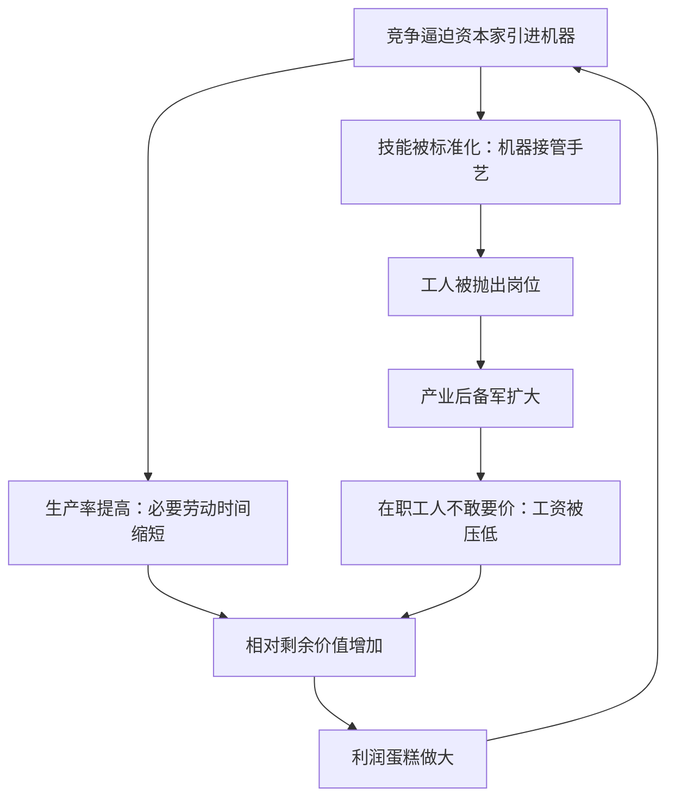

# 07｜机器真的在替人干活吗？

> 自动化承诺解放双手，现实却是失业与涨不动的工资——哈维追问：机器到底在为谁工作？

---

## 一、先说结论

哈维认为，马克思对机器的看法比“技术进步好不好”深刻得多：在资本主义里，机器不是中立的工具，而是资本榨取相对剩余价值的武器。机器把工人身上几百年攒下的技能吸进资本，让活劳动降级为机器的附属品；同时把一批批工人抛出岗位，形成“产业后备军”，这支失业大军反过来压低在职工人的工资。机器确实减轻了体力负担，但它减轻的是资本的成本，不是工人的命运。所以哈维追问道：谁决定技术往哪个方向走，本身就是政治问题。

---

## 二、我们先理解一个问题

技术进步听起来是纯粹的好事：机器干重活、干危险的活，人干轻活、干聪明的活。一百年前就有人预言，自动化会让人类每周只工作十几个小时。

现实却是：机器越来越多，人并没有更闲。流水线上的工人被机械臂替代，收银员被自助结账替代，客服被智能系统替代——而留下来的人，工时没有缩短，工资还涨不动。

这就奇怪了：如果机器让整个社会的生产率一路飙升，每个人需要干的活本该变少才对。为什么生产率涨了几十年，普通人的工作时间几乎没降，失业的焦虑反而越来越重？机器省下来的那些劳动，到底去哪了？

---

## 三、作者到底提出了什么观点？

马克思在《资本论》里专门解剖过机器，结论很反常识：机器本身不创造价值，它只是把自身的价值一点点转移到产品里去，创造价值的仍是活劳动。那么资本家为什么抢着买机器？

哈维总结了马克思的回答——机器的真正功能，是榨取相对剩余价值，而且它从三个方向同时发力：

- 机器提高生产率：同样的工人一小时产出更多，必要劳动时间被压缩，工作日里无偿占有的那部分随之变大；
- 机器夺走技能：手艺不再长在老师傅身上，而是长在机器里，工人从“使用工具的人”降级为“伺候机器的人”；
- 机器替代工人：制造出源源不断的失业者，马克思称之为产业后备军。这支后备军悬在在职者头上——你敢提加薪？门外有人排队。

哈维指出，这三件事是同一台机器干的。所以技术变革在资本主义里从来不是中立的：往哪个方向创新、替代谁、省什么成本，都是资本按自己的利益选的。

---

## 四、把这个观点翻译成人话

可以这样想：机器像一把剪刀，而握剪刀的那只手不是工人的。

想象一场拔河。绳子中间那条线，是工资与利润的边界。机器登场时名义上是来“帮大家省力”的——但它同时把对面那头的力气加了一倍。生产率提高了，蛋糕做大了，可切蛋糕的刀握得更紧了。

更微妙的是技能的转移。以前的老师傅是稀缺资源，老板得哄着；机器把手艺标准化之后，谁来按按钮都一样。工人从不可替代，变成随时可替换——机器没有把人的本事消灭掉，而是把它没收了，装进了资本的口袋。

---

## 五、为什么会这样？

哈维的推理链是这样的：每个资本家都面对竞争压力，谁先上机器，谁的单位成本就低，谁就活下来——所以上机器不是选择，是命令。但机器普及之后，会发生两件事。

注意这个循环的两头：机器一边让在岗的人产出更多，一边让下岗的人不敢要价——两头都在给剩余价值加码。这就是为什么生产率和工资可以长期脱钩：增长的果实往哪流，取决于力量对比，而机器恰恰改变了力量对比。

哈维特别强调马克思的一个洞察：机器战胜的不是人的体力，而是人的谈判地位。

---

## 六、举一个现实生活中的例子

去超市看看收银台。

十年前，一家大超市要二十个收银员。熟练工记得住几百个商品编码，高峰期手速飞快，还要分辨假币、控制节奏——这是实打实的技能。今天同一家超市只留四五个收银员，旁边立着一排自助结账机：顾客自己扫码、自己装袋、自己付款。

先看第一个变化：这台机器没有创造新价值，它只是把原来收银员做的劳动，转移给顾客无偿完成，超市的成本降了。收银员的技能——记编码、辨真伪、控节奏——被压缩成屏幕上的几个按钮。

再看第二个变化：被裁掉的十几个收银员去了哪？大多流入其他低技能岗位——保洁、送餐、理货。这些岗位的劳动供给突然多了，工资自然被压低。而留下的那几个收银员，看着外面排队找工作的人，也很难开口提加薪。

超市的账本上，这叫“降本增效”；用哈维的词汇说，这是一台机器同时完成了两件事：挤出相对剩余价值，并扩充产业后备军。自助结账机不是坏人，但它的设计目标从来不是“让收银员更轻松”，而是“让收银员更便宜”。

---

## 七、回到书中重新理解

现在回头看哈维的用意。他反复强调，马克思不是勒德分子——不是反对机器本身。机器能把人从繁重劳动里解放出来，这本来是技术最人道的承诺。

问题在于：在资本掌握技术方向的制度里，“解放人”从来不是研发的考核指标，“省成本”才是。哈维指出，马克思区分了机器的两个维度——作为减轻劳动的技术潜力，和作为资本武器的现实形态。我们看到的自动化是后者：为了压低劳动成本、瓦解工人议价权而被设计和部署的机器。

这就解释了那个悖论：机器完全有能力替人干活，但“替人干活”从来不是它的任务书。

---

## 八、这个观点背后还有什么？

第一，技术的方向本身是政治性的。同样一笔研发经费，可以投向“替代人”的机器，也可以投向“增强人”的工具——智能系统可以是替医生看片子的助手，也可以是替老板裁员的刀。哈维认为，问“技术好不好”不如问“谁在选择技术路线”。

第二，产业后备军不是失败，而是功能。马克思的冷峻之处在于：失业不是系统的漏洞，而是系统维持工资纪律的机制。充分就业对工人是好事，对资本却是坏消息——工资涨得太快会吃掉剩余价值。

第三，相对剩余价值是看不见的加班。它不需要打卡机多响两小时，工人在同样的八小时里产出更多、拿同样的钱——差额在不知不觉中扩大了。这让剥削比延长工时隐蔽得多，也高效得多。

---

## 九、这个观点有问题吗？

有说服力的地方：生产率与工资长期脱钩，是发达经济体半个世纪以来的事实；主流经济学里的“技能偏向型技术变革”理论，也确认了机器对劳动者议价权的侵蚀。哈维的框架解释了为什么会这样，而不只是承认它发生了。

存在争议的地方：一些学者认为，马克思—哈维的叙事低估了技术创造新岗位的能力——收银员消失了，但数据分析师、运维工程师出现了，历史上每次技术革命后总就业量并没有萎缩。争议的核心是：新岗位补得上吗？补得够快吗？补给的还是同一批人吗？

可能过度简化的地方：把机器完全说成“资本的武器”，容易忽略技术的自主性——有些自动化源于工程师文化、消费者偏好甚至人口结构，不全是为压榨而设计。而且同样的机器在不同国家产生完全不同的工资结果，说明制度安排比机器本身更关键——这一点哈维自己也承认。

---

## 十、今天再看这个观点

以下部分是基于哈维思想的现代延伸，不是作者原话。

平台经济把“产业后备军”机制做到了原子级：外卖骑手没有“被解雇”一说，系统只是不再派单——后备军不再站在工厂门口，而是躺在算法的派单列表里，随时待命、随时闲置。

生成式智能则把战场第一次推进了白领领域：文案、翻译、初级代码、客服话术——这一轮被吸进机器的，是脑力技能。哈维的框架会问：在这轮技术路线的排序里，“替代昂贵的人类劳动”排在第几位？

而“人机协作”的叙事值得多问一句：协作的产出归谁？如果机器让一个人干五个人的活，省下的四个人去了哪里——这仍然是马克思的问题。

---

## 十一、这一篇真正应该记住什么？

1. 哈维认为机器在资本主义中不是中立工具，而是获取相对剩余价值的武器：提生产率、压必要劳动，同时瓦解工人的议价权。
2. 机器不创造价值，只把自身价值转移到产品中；它真正的功能是改变劳资力量对比——技能被没收，人变成附属品。
3. 产业后备军是功能而非事故：失业大军压低在岗工资，机器两头都在给剩余价值加码。
4. 该问的不是“技术好不好”，而是“谁在选择技术方向、为谁省成本”——这本身就是政治问题。

---

## 十二、留一个问题

机器让商品以更低的成本、更大的规模被生产出来——可是生产出来就完了吗？如果商品堆在仓库里卖不掉，凝结在里面的那些价值和剩余价值，还算数吗？

《资本论》第二卷要回答的正是这个问题。下一篇我们离开车间，走进流通的生死场：价值为什么必须被“实现”才算数。
