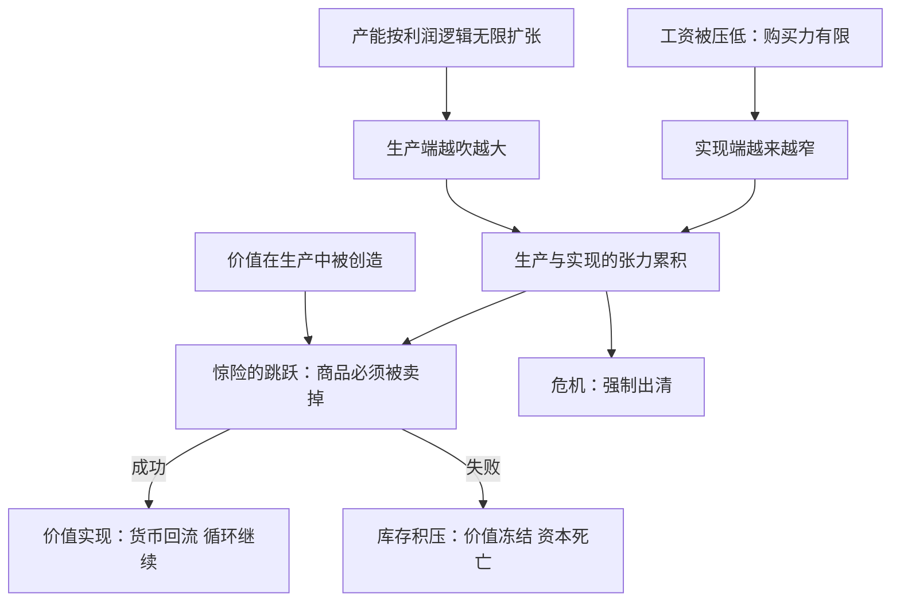

# 08｜生产出来还不算数：价值为什么必须被“实现”？

> 商品走下流水线只是走完了半程——哈维提醒我们，卖不掉的价值等于没有价值。

---

## 一、先说结论

哈维解读《资本论》时最强调的方法论是：三卷必须当成一个整体来读。第一卷讲价值的生产，第二卷讲价值在流通中的实现——商品生产出来只是潜在的价值，必须在市场上真的被买走，价值才算落了地。能生产出来和能被买走是两回事，中间隔着马克思所说的一次“惊险的跳跃”。这道跳跃不是经营问题，而是结构性张力：生产能力由利润逻辑驱动，可以无限扩张；购买力却主要由被压低的工资构成，始终有限——生产与实现之间的这道缝，就是危机的第一现场。

---

## 二、我们先理解一个问题

问一个几乎没人问过的问题：生产出来的东西，凭什么算“有价值”？

直觉的答案是：东西造出来了，价值就在里面了。一车衣服、一仓库手机、一栋封顶的楼盘——劳动都实实在在花进去了，怎么会没价值？

但现实里天天发生这样的事：牛奶倒进河里，楼盘空置十年，过季库存论斤清仓。这些商品里凝结的劳动一点没少，可它们的价值蒸发了。这说明“价值”不是造出来就锁死在商品里的固体——它好像还需要某种确认，缺了这个确认，前面投进去的劳动全部白费。

这个确认是什么？为什么生产只是半程？

---

## 三、作者到底提出了什么观点？

哈维认为，要理解这一点，必须把《资本论》三卷连起来读：

- 第一卷讲价值的生产：车间里发生了什么，剩余价值怎么被榨出来；
- 第二卷讲价值的实现：商品怎样走完流通过程，重新变回货币；
- 第三卷讲价值的分配：实现了的价值如何在利润、利息、地租之间切开。

只读第一卷的人会以为故事在车间里就结束了——剥削完成，价值到手。哈维反复纠正：不对。工人确实在生产中创造了价值和剩余价值，但那只是“潜在的价值”。商品必须被卖掉、换回货币，价值才算真正实现。马克思把这一步称为惊险的跳跃——跳不过去，摔坏的不是商品，而是商品生产者。

哈维强调，生产与实现之间隔着整个流通领域：要有人想买、要有人买得起、要及时送到、要比对手先到——这中间每一环都可能断裂。

---

## 四、把这个观点翻译成人话

可以这样想：价值像一张支票，生产只是开票，实现才是兑付。

你在车间里造出再多东西，都只是往账上记了一笔“应收款”——只有顾客真的掏钱，这笔钱才到账。账面应收款再多，现金流一断照样倒闭。

更深一层在于，这个系统自带一个结构性矛盾：资本家为了利润最大化，天然倾向压低工资、扩大产能——可压低工资恰恰压低了社会的购买力，扩大的产能恰恰需要更多购买力来消化。每个资本家都希望“我的工人少拿点，别人的工人多买点”，但所有人的工人，就是所有人的顾客。生产这头吹得越大，实现那头接得越吃力——这不是谁经营不善，是系统自带的裂缝。

---

## 五、为什么会这样？

哈维的推理链：资本主义生产的目的是价值增殖而非使用——所以产能不受“社会实际需要多少”约束，只受“有没有利润”约束；而社会的购买力主要来自工资，恰恰是被资本压制的那个变量。

这张图的关键在于：产能扩张和购买力受限不是两个独立的问题，它们长在同一棵树干上——压低工资既是利润的来源，又是实现困难的原因。哈维指出，这就是马克思所说的那种矛盾：系统给自己埋的雷，正是自己的增长引擎。

---

## 六、举一个现实生活中的例子

看看那些盖好却卖不掉的商品房。

某个三四线城市的新区，几十栋住宅楼封顶了，外立面做好了，绿化也种上了——建筑工人的劳动一分不少地凝结在里面。按第一卷的逻辑，巨大的价值已经“生产”出来了。

可是没人买。年轻人去了省城，本地人不缺房，投资客在观望。于是这些楼里的“价值”就那样晾着：水泥在风化，电梯在生锈，物业在贴钱。开发商账面上写着几十亿资产，实际上几十亿钢筋水泥正在变成负资产——因为没人接盘，连建筑成本都收不回来。

这不是孤例。服装厂换季积压的库存、电子产品过时后的清仓、面包店晚上扔掉的面包，都是同一个故事：生产环节里劳动扎扎实实投进去了，实现环节里价值真真切切蒸发了。

哈维会提醒：开发商的麻烦不是“房子质量不好”，而是跳那次惊险的跳跃时踩空了。而当一座城市里成片楼盘空置时，这道缝就不再是某个人的失误，而是结构性的——生产端往前冲的惯性，与实现端接不住的体量，越来越不匹配。

---

## 七、回到书中重新理解

现在回头看哈维为什么坚持“三卷一体”。

只读第一卷，会得到一个生产主义版本的马克思：剥削在车间，斗争在工厂，解决方案是占领生产资料。哈维说这漏掉了一半的故事。第二卷里马克思画的资本循环图——货币资本、生产资本、商品资本三种形态不停轮换——告诉我们价值每时每刻都在“转场”，而每一次转场都可能卡壳。

哈维甚至说，很多经济危机的第一现场根本不在工厂，而在流通领域：不是东西造不出来，而是造出来卖不掉；不是生产力不足，而是购买力不足。这使批判的靶心从“谁剥削谁”扩展到“整个循环怎么运转”——也为后面关于债务、空间和危机的讨论铺了路。

---

## 八、这个观点背后还有什么？

第一，“卖不出去”会反过来咬“生产”。实现的失败不是故事结尾的遗憾，而是下一轮生产的灾难：库存积压导致资金断链，资金断链导致裁员减产，裁员减产导致工人收入下降，购买力因此更加不足——张力的累积是螺旋式的。

第二，流通领域会被系统疯狂扩建来堵漏。广告、营销、消费主义文化、电商促销节——资本主义花天价只为一件事：让那次跳跃跳过去。哈维指出，这些流通成本本身也成为吞噬剩余价值的黑洞。

第三，这条缝会逼着系统向外找补丁。购买力不够，能不能借钱让人买？商品卖不动，能不能卖到更远的地方？这两个答案——信贷与空间扩张——正是接下来两篇要谈的主题：债务，和资本的“搬家”。

---

## 九、这个观点有问题吗？

有说服力的地方：它预言了资本主义的长期宿命——产能过剩与消费不足的两难在每次危机中都会重演，而“刺激消费”“扩大内需”这类政策语言，本质上就是在给那道缝打补丁。

存在争议的地方：一些学者认为“生产过剩—消费不足”的解释过于简单——危机也可能由金融过度、技术断代、外部冲击引起，未必都经过“工资低、买不动”这条线。凯恩斯学派同样重视有效需求不足，但开出的药方是政府补足需求，与马克思的结构性诊断并不相同。

可能过度简化的地方：现代经济中“实现”的形态比马克思时代复杂得多——订阅、服务、广告变现的商品，往往不靠一次性卖出实现价值；国家的福利与转移支付也部分弥合了工资与购买力之间的缺口。说张力必然爆发为危机，可能低估了系统自我修复的能力——尽管哈维会反问：修补的方式本身，是不是正在积累更大的矛盾？

---

## 十、今天再看这个观点

以下部分是基于哈维思想的现代延伸，不是作者原话。

平台时代的“实现”变得更惊险：流量经济里，商品先免费送出换注意力，再把注意力卖给广告商——价值实现绕了两道弯，跳跃的距离更远、落地更不确定。一场直播带货的销量神话，和仓库里退回来的货，常常是同一批商品的两面。

“促销费”“扩内需”成为政策关键词也不是偶然——当外部需求接不住产能时，那道缝会逼着整个经济体想办法让商品跳过去。消费券、以旧换新这些工具，用哈维的话说，都是在给“实现”端临时输血。

---

## 十一、这一篇真正应该记住什么？

1. 哈维强调《资本论》三卷一体：第一卷生产价值，第二卷实现价值——商品必须被卖掉，价值才算落地。
2. 生产与实现之间隔着“惊险的跳跃”：卖不掉的商品，凝结其中的劳动全部蒸发，跳不过去摔死的是生产者。
3. 张力是结构性的：压低工资既是利润的来源，也是购买力不足的原因——系统一边造产能，一边拆需求。
4. 实现的困难逼着系统找补丁：信贷让人借钱买，空间扩张让人找新市场——两条出路都标好了代价。

---

## 十二、留一个问题

卖不掉，归根到底是个“谁来买”的问题。商店里不缺想要的人，缺的是买得起的人——“想要”和“买得起”之间隔着一道结构性的裂缝。这道裂缝从哪来？为什么资本一边压低工资，一边又指望工人把商品买回去？

下一篇我们跟着哈维去读《资本论》最少人细读的第二卷：谁来买：消费为什么成了资本的结构性难题？
