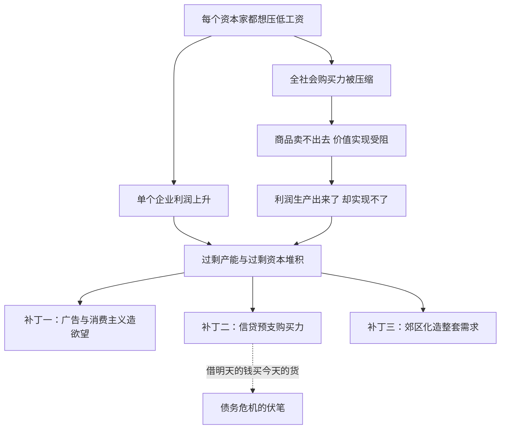

# 09｜谁来买：消费为什么成了资本的结构性难题？

> 哈维读《资本论》第二卷的独到发现：资本的麻烦不是没人想要商品，而是没人买得起。

---

## 一、先说结论

哈维认为，马克思《资本论》第二卷藏着一个被长期忽视的发现：价值要真正实现，必须存在“有效需求”——不是“想要”，而是“买得起且愿意掏钱”的需求。而资本主义有一个内在悖论：每个资本家都想压低工资来提高利润，可工资恰恰是全社会最大的一块购买力。压低工资等于削减需求，资本在自己脚下挖坑。消费主义文化、信贷消费、战后郊区化，这些看似无关的现象，都是被系统性造出来填这个缺口的补丁。

---

## 二、我们先理解一个问题

接着上一篇往下问：商品必须卖掉，价值才算实现。那么一个朴素的问题来了——买东西的钱从哪来？

在一个以雇佣劳动为主的社会里，绝大多数人的收入就是工资。工人拿工资，再买回自己参与生产的商品，听起来是个闭环。但这里有个缺口：工人生产的总价值大于他们拿到的工资总额——差额就是剩余价值。也就是说，全社会商品的标价里，天然有一截超出了工资能覆盖的范围。

这一截谁来买？资本家可以买奢侈品，但他们人数有限；资本家也可以继续投资买机器，可机器最终还是要帮着造出消费品卖出去。缺口不会自动消失，它只是被挪来挪去。

---

## 三、作者到底提出了什么观点？

哈维指出，《资本论》第二卷是三卷中被读得最少的一卷，却极为关键。马克思在那里做了两件事。

第一件，他画了著名的“再生产图式”：把整个经济分成两大部类——第一部类生产生产资料（机器、钢材、原料），第二部类生产消费资料（面包、衣服、住房）。两部类之间必须按恰当的比例交换，工人和资本家各自拿着收入去第二部类买回生活资料，第一部类的资本家之间再互相买卖机器设备。任何一边比例失衡，整个循环就会卡死。

第二件，他反复追问一个被古典经济学回避的问题：实现剩余价值所需的购买力，到底从哪里来？马克思证明这不是小事——工人买不起自己生产的全部产品，是结构性的，不是哪个老板经营失误。

哈维据此给出他的独到解读：马克思在这里实际上讲的是“有效需求”问题。需求分两种——想要的，和买得起且愿意买的。资本主义的麻烦不在前者，欲望永远够用；麻烦在后者，因为购买力由工资、就业和收入分配决定，而这些恰恰是资本最想压缩的东西。

哈维还强调第二卷里一条暗线：工人阶级的“社会再生产”——工人吃饭、住房、养孩子、受教育，这些维持劳动力的费用由谁承担、花多少钱，直接决定工人能拿出多少购买力去接住第二部类的商品。

---

## 四、把这个观点翻译成人话

一句话版本：每个老板都希望自己的工人少拿工资，又希望别人家的工人多拿钱——好来买自己的东西。

但所有人的工人，就是所有人的顾客。每个老板单独看都很理性：工资是成本，压一点利润就厚一点。可当所有老板一起压的时候，整个社会的购买力就被压扁了——你的产品卖给谁？

所以资本主义必须不断给消费“打补丁”。广告负责造欲望：让你觉得你需要本来不需要的东西；信贷负责造购买力：让你花明天还没挣到的钱；城市形态负责造需求：把你安置在必须开车、必须买家电的生活方式里。这些都不是“人心变贪了”的道德故事，而是结构缺口的填充物。

---

## 五、为什么会这样？

哈维的推理链是这样的：同一份工资，在单个企业的账本上是成本，在整个经济的账本上是需求。微观上越少越好，宏观上越少越糟——这是个体理性与集体结果的正面冲突。

这张图里最要紧的一点：压低工资既是利润的来源，又是实现困难的原因。补丁打的不是别人挖的坑，正是资本自己挖的坑。所以哈维说，有效需求不足不是外部冲击，而是资本积累的内生产物。

---

## 六、举一个现实生活中的例子

哈维本人最爱用的例子，是美国战后的郊区化。

二战结束，美国面临一个巨大的实现难题：军工产能要转民用，上千万退伍军人要就业，工厂如果开不出订单就是成片倒闭。怎么办？答案是系统性地“造”出一种生活方式。

历史事实是：联邦政府出资修建州际高速公路网，政府担保的退伍军人贷款和联邦住房保险让普通工人第一次买得起独栋住宅，开发商成片建起郊区社区。而郊区独栋房这个东西妙就妙在——它不是一种商品，而是一台“需求发生器”：住得远就必须买车，房子大就必须买齐家电家具，草坪还得配割草机。一个人买房子，拉动的是汽车、钢铁、橡胶、家电、石油一整条产业链。

哈维用这个例子说明：当有效需求不足威胁到整个循环时，资本和国家会联手造出一个完整的消费市场。郊区化不是消费者自发选择的结果，而是一次全国规模的“需求工程”——它确实成功吸收了几十年的过剩产能，也把美国人锁定在一种高消耗的生活方式里。

---

## 七、回到书中重新理解

现在回头看，就能明白哈维为什么在第二卷上花那么多力气。

只读第一卷的人容易得到一个生产主义版本的马克思：矛盾在车间，出路在生产资料公有制。哈维说这漏掉了故事的另一半——第二卷里马克思已经把问题摆出来了：就算剥削顺利完成了，价值实现了没有？拿什么实现？

再生产图式表面上是两张部门间的交换表，实际上是个敏感性分析：它告诉你这个系统的循环对“比例”和“购买力”多么挑剔。第一部类扩得太快，机器卖不出去；第二部类扩得太快，面包没人买得起。而工资的每一次被压低，都在同时改动两个部类的平衡条件。

这也让“消费”在哈维的框架里换了位置：它不再是个人生活方式的选择题，而是资本循环的一个结构性工位——消费者是价值实现的最后一道工序的操作工，只不过这道工序没人给发工资。

---

## 八、这个观点背后还有什么？

第一，消费主义是结构必需，不是道德堕落。哈维提醒，当系统必须让人“想买、敢买、不停地买”才能活下去时，欲望本身就会被工业化生产。责备消费者虚荣，是把结构问题翻译成了人品问题。

第二，工人阶级的社会再生产是整个循环的隐形地基。工人能不能买得起房、看得起病、养得起孩子，直接决定第二部类能不能转得动。而资本主义的一个长期趋势，是把这些成本推给家庭、推给无偿的家务劳动——女性主义学者后来把这条暗线发展成了完整的“社会再生产理论”。

第三，两大部类的比例失调本身就是危机的一种形态。问题不只是“总量上买不起”，还有“结构上配不上”——该生产面包的生产了游艇，该修公路的钱全进了楼盘。实现难题有时间维度，也有空间维度，后者会通向哈维后来讲的“空间修复”。

---

## 九、这个观点有问题吗？

这个解读很有锋芒，但争议也最大。

有说服力的地方：如果马克思在十九世纪六十年代的手稿里就系统讨论了有效需求，那他实际上先于凯恩斯七十年看到了同一个问题——总需求不足可以让经济在产能过剩中陷入危机。战后福利国家、消费信贷爆炸、住房金融化，都可以被读成给这个缺口打的三次大补丁。

存在争议的地方：把马克思读成“消费不足论者”，在马克思主义内部就是一场百年论战。罗莎·卢森堡认为剩余价值根本无法在资本主义内部实现，必须靠对外扩张和非资本主义市场来吸收；保罗·斯威齐和《每月评论》学派倾向于消费不足解释；而列宁则明确反对——第一部类可以靠资本互相买设备自我扩张，危机不必经过“工人买不起面包”这条线。哈维自己的立场更微妙：他不是单一因果论者，他说的是有效需求是一个真实的张力，不是危机的唯一原因。

可能过度简化的地方：投资需求也是需求，资本家买设备同样能吸收产出；工资之外还有利润消费、政府支出、出口。现实经济中“买不起”的缺口会被多种力量弥合或掩盖，说它是结构性难题成立，说它必然致命则过强。

---

## 十、今天再看这个观点

以下部分是基于哈维思想的现代延伸，不是作者原话。

“扩大内需”成为政策高频词，本身就是有效需求难题的当代回声：当外部市场接不住产能、工资在国民收入中的份额长期偏低时，消费券、以旧换新、刺激楼市，都是在给“买得起”这一端输血。

直播带货和算法推荐则可以看作欲望工业化的升级版：广告不再广撒网，而是按你的焦虑定制推送——把“想要”持续转化为“下单”，维系着实现环节的高转速。

还有一个更微妙的例子：企业一边用降薪裁员压成本，一边指望同一个消费市场消化库存——两家公司的员工互为顾客，每个公司裁员时都在给对方的货架增加灰尘。个体理性与集体疯狂的距离，就是这么近。

---

## 十一、这一篇真正应该记住什么？

1. 哈维读第二卷的核心发现是“有效需求”：资本主义缺的不是欲望，而是买得起且愿意买的购买力。
2. 悖论在于结构：工资对单个企业是成本、对整个经济是需求，压低工资等于资本在自己脚下挖坑。
3. 消费主义、信贷、郊区化不是文化堕落，而是被造出来填实现缺口的系统补丁。
4. 再生产图式提醒我们：两大部类的比例和工人阶级的社会再生产，是循环能否转动的隐形条件。

---

## 十二、留一个问题

如果“买不起”是结构性的，那这套系统是怎么撑过一百多年的？补丁之一是广告和消费主义，但最强的那个补丁是另一样东西：让你花还没挣到的钱——信贷。

借钱消费补上今天的缺口，可借的钱是要连本带息还的，等于把明天的需求也预支了。这个把未来抵押给现在的机制，哈维给它起了一个专门的名字：反价值。下一篇我们就来看它：**10｜债务为什么是资本离不开的“毒药”？**
