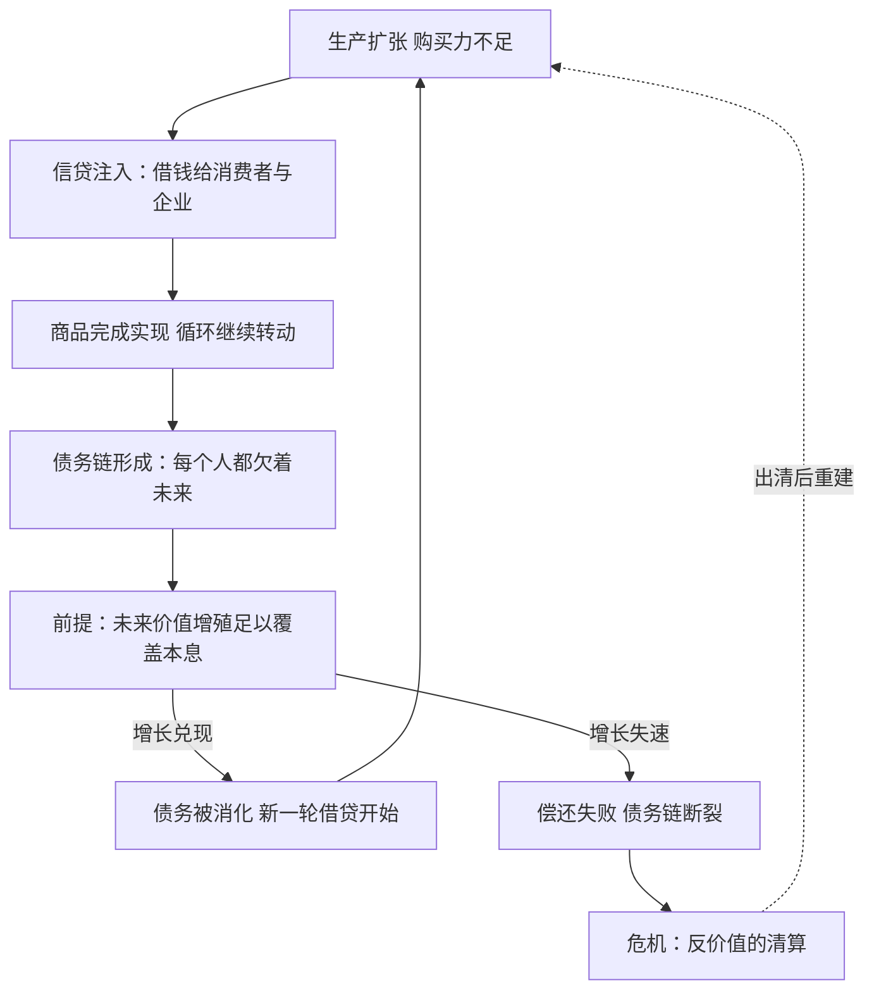

# 10｜债务为什么是资本离不开的“毒药”？

> 信贷让商品跳过了惊险的一跃，却把炸弹埋进了明天——哈维给它起了一个很冷的名字：反价值。

---

## 一、先说结论

哈维把债务称为“反价值”：债务本身不是价值，而是对未来劳动和价值的索取权——它承诺“明天的劳动会创造出价值，来还今天的钱”。这个功能对资本不可或缺：商品生产出来卖不掉，信贷就借钱给消费者来接盘，替商品完成惊险的跳跃。但毒药就长在药性里：债务必须靠未来持续的增殖来偿还，一旦明天的增长接不住今天的承诺，债务链一断就是危机。哈维的判断是：资本主义不是“用了”债务，而是离不开债务——同时也永远还不清债务。

---

## 二、我们先理解一个问题

信贷在日常生活里是个温和的东西。刷信用卡买手机，办按揭买房，企业贷款扩产——金融让“想要的”和“买得起的”之间的时间差消失了，整个经济因此转得飞快。

可是几乎每隔若干年，就会有一场由债务引爆的灾难：某个环节还不上钱，恐慌顺着借条传染，然后所有人一起紧缩。繁荣期加的杠杆，萧条期变成绞索。

矛盾就在这里：如果信贷只是把未来的钱挪到现在用，为什么它会周期性爆炸？借的钱总是要还的——还钱的那个“未来”，凭什么保证会有足够的价值？这套系统为什么一边离不开债务，一边不断被债务炸伤？

---

## 三、作者到底提出了什么观点？

哈维的“反价值”概念是这本书里最锋利的一把刀。他的论证分三层：

- 债务是对未来的索取权。银行借给你一笔钱，本质上是签发了一张“未来劳动的凭证”——它赌的是未来几年里会有真实的劳动创造出真实的价值来兑付。债务本身不创造任何价值，它只是预支了对未来价值的所有权。
- 债务填补了生产与实现之间的裂缝。商品造出来没人买得起？借钱给买方。产能闲置没人投资？借钱给企业。信贷让那次惊险的跳跃垫了一块弹簧板——但跳过去的账，记在明天头上。
- 债务必须靠未来的增殖偿还，而增殖没有保证。资本的循环要求每一圈都长出剩余价值，债务等于把这个要求提前写成了合同：未来必须增长，必须产出足够的剩余价值覆盖本息。未来不配合，索取权就变成废纸，链条从最脆的那一节断起。

哈维的结论很直白：资本永远欠着明天。债务不是系统的装饰，是系统的承重墙——也是系统最大的裂缝。

---

## 四、把这个观点翻译成人话

可以这样想：债务像一种时间搬运术，把明天的收成搬到今天下锅。

问题在于，明天的收成还没长出来。你搬来的是一张“明天会有的”期票——明天真的丰收，今天这顿饭就吃得名正言顺；明天歉收，今天的饭就成了透支。更要命的是，搬一次就要搬第二次：今天借的钱靠明天的增长还，明天要增长又得借更多的钱——借钱这件事自己会繁殖。

“反价值”这个名字起得很精确：价值是劳动已经创造出来的东西，反价值是对还没发生的劳动下的扣押令。整个金融系统就是一座巨大的扣押令交易所，而我们每个人的未来劳动，都在不知不觉中被人提前质押了。

---

## 五、为什么会这样？

哈维的推理链接着上一篇的张力往下走：产能无限扩张，购买力有限增长，惊险的跳跃越来越难过。信贷恰好是填补这条缝的工具——它凭空造出购买力，让商品跳过去。但这份购买力是借来的，要连本带息还回去。

这张图的关键在那个判断节点上：债务把整个系统押在了“未来必须增长”上。哈维指出，这解释了资本主义为什么对增长有病态的执着——不只是贪婪，而是借条上写着：不增长，就违约。债务链把每个人都拴在了同一辆不能停的车上。

---

## 六、举一个现实生活中的例子

看看一个普通年轻人的手机。

月薪八千的小王，消费分期里欠着两万：新手机分十二期，上月的账单还没还完，这个月又办了张信用卡周转。他并不觉得自己在做什么激进的事——身边人都这样，“先享后付”甚至被包装成一种生活方式。

用哈维的框架看：小王的每一笔分期，都是一张对自己未来劳动的索取权。他承诺接下来十二个月每月拿出一部分工资——也就是他未来的劳动价值——兑付给今天的消费。手机厂完成了惊险的跳跃，商品实现了，资本循环转了一圈；代价是小王未来一年劳动产出的一部分，已经被提前切走了。

房贷是同一逻辑的放大版：三十年按揭，是把三十年劳动收入的索取权一次性卖给了银行。对系统来说这是伟大的发明——没有按揭，商品房那次跳跃根本跳不过去；对个人来说，这意味着未来三十年的劳动，在签字那天就已经部分不属于自己。

哈维会提醒：注意这个结构的脆弱性。小王的分期建立在“明年工资照发、最好还涨”的预期上。一旦失业——比如被某台机器挤掉了岗位——所有指向未来的索取权会同时失效，而失效会传染：他还不上，平台的坏账多一笔，平台背后的资金链就紧一分。反价值的清算从来不是一个人的事。

---

## 七、回到书中重新理解

现在回头看，就能明白哈维为什么用“反价值”这么重的一个词。

在马克思那里，货币已经是“价值的代表”，而信贷把这个代表又推远了一层：货币代表已经实现的价值，信贷代表还没被创造出来的价值。哈维认为，《资本论》第三卷关于信用与虚拟资本的讨论，是全书最容易被低估的部分——马克思已经看到，资本主义会发展出一个“建立在债券上的世界”，这个世界的估值可以完全脱离底层劳动，膨胀成一套自我繁殖的索取权体系。

哈维把这条线接进自己的总体框架：债务是资本处理“生产与实现矛盾”的主要工具，也是把矛盾推向未来的方式——问题没有被解决，只是被预支了。这正是他反复说的：危机从来不是被消除的，只是被搬了家。

---

## 八、这个观点背后还有什么？

第一，债务把增长从愿望变成了强制。没有债务的系统里，增长慢一点只是慢一点；背着债的系统里，增长慢就是违约、断链、清算。“必须增长”的命令是被合同写死的。

第二，债务链天然不平等。对个人，欠债不还意味着失信、拍卖、破产；对系统重要性机构，欠得太多反而意味着“大而不能倒”，会有人来接盘。反价值的代价从来不是均摊的——链条断裂时，摔得最重的往往是最弱的那一环。

第三，债务在时间上挪用，也会在空间上搬家。一个地方还不上的债，可以转移到另一个地方的资产上；过剩的资本会涌向新的城市、新的国家，去寻找还能增殖的土壤——这正是哈维“空间修复”的起点，也是下一篇的主题。

---

## 九、这个观点有问题吗？

有说服力的地方：它解释了信贷的双重性格为什么不可分割——同一笔债既是润滑剂也是炸药，繁荣和危机不是两种状态，而是同一过程的早晚两班。近几十年“债务积压”成为主流经济学的常用词，某种程度上印证了这个框架。

存在争议的地方：一些学者认为哈维把债务描述得过于宿命——现代央行制度、存款保险、债务重组机制，都是在给“反价值”上保险；主权货币国家的本币债务甚至可以永续滚动。争议在于：这些保险是真的拆了引信，还是只是把爆炸的级别调得更大了？

可能过度简化的地方：“反价值”把信贷的功能单一化为“填补实现缺口”，但信贷也真实地为创新、为跨期资源配置服务——没有借贷的创业生态难以想象。把债务统统看作毒药，容易忽略它同时是基础设施。哈维的诊断指出了病症，但“多大剂量的信贷是药、多少是毒”，他并没有给出可操作的刻度。

---

## 十、今天再看这个观点

以下部分是基于哈维思想的现代延伸，不是作者原话。

消费金融把“未来劳动的索取权”做到了毛细血管级：每一笔分期都是一份微型债券，被打包、评级、转手——亿万人的明天，变成了今天可交易的资产。

国家债务遵循同一逻辑：基建、刺激计划、救市资金，都是向未来预支的购买力。哈维的框架会问一个让人不舒服的问题：我们习以为常的“明天会更好”，有多少是预期，有多少其实是借条上的还款计划？

而“先享后付”文化的另一面是：当未来被过度质押，年轻人对“未来”本身的信任也在透支——低欲望、不婚不育，部分是对这种质押的无声违约。

---

## 十一、这一篇真正应该记住什么？

1. 哈维把债务称为“反价值”：不是价值本身，而是对未来劳动和价值的索取权——明天的劳动被提前质押了。
2. 债务是填补生产与实现裂缝的工具：借钱给人买，商品才能跳过惊险的一跃——但跳跃的代价记在明天的账上。
3. 债务必须靠未来增殖偿还，这迫使整个系统“必须增长”——增长不再是愿望，而是合同条款。
4. 债务链一断就是危机：反价值的清算顺着借条传染，代价从不均摊，最弱的一环摔得最重。

---

## 十二、留一个问题

债务说到底是一张索取权的票：放贷的人不碰生产，却能连本带息地从剩余价值里抽走一块。这就引出一个容易被忽略的问题——榨出来的剩余价值从来不是老板一个人独吞的：银行要利息，房东要地租，商人要利润。这块蛋糕到底怎么分？凭什么不直接参与生产的人也能上桌？

下一篇我们进入《资本论》第三卷的地盘：剩余价值为什么会被切成利润、利息和地租？
