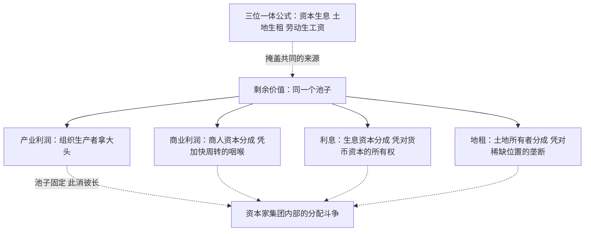

# 11｜剩余价值为什么会被切成利润、利息和地租？

> 第三卷的问题：蛋糕在车间里烤出来之后，一群拿着不同票据的人围上来分刀。

---

## 一、先说结论

哈维认为，《资本论》第三卷讲的是分配：剩余价值生产出来之后，并不会全归工厂主，而是在产业利润、商业利润（商人资本的分成）、利息（生息资本的分成）、地租（土地所有者的分成）之间被瓜分。关键在于——这些人分的是同一个池子，所以资本家集团内部也在激烈斗争。哈维特别看重地租：地主不参与任何生产，只靠对稀缺位置的垄断就能分走一块，而城市与建成环境正是地租最庞大的机器。分配领域的斗争，和生产领域的斗争同样激烈。

---

## 二、我们先理解一个问题

先看一个直觉上的困惑。

按照前面几篇的逻辑，剩余价值是工人在车间里创造的、被工厂主无偿占有的。那故事似乎应该到这里为止：剥削完成，利润落袋。可随便观察一家真实的企业就会发现，老板赚到的钱根本留不住——银行贷款要还利息，店面要交租金，渠道商要抽成，供应商要账期。

一个开工厂的人会说：利润是我组织生产、承担风险挣的。银行说：没有我的贷款你开不了工。房东说：没有我这个位置你的店开不起来。每个人都觉得自己的那一份天经地义。

那么问题来了：剩余价值明明只在一个地方被生产出来，为什么有这么多人能理直气壮地来分？他们分的依据是什么？

---

## 三、作者到底提出了什么观点？

马克思在《资本论》第三卷把这个问题系统地处理了。他的思路是：先承认剩余价值只有一个来源——生产中无偿占有的劳动；然后分析这块剩余价值如何在不同形态的资产所有者之间被切开。

- **产业利润**：组织生产的产业资本家拿的那一份，它是整个池子的源头；
- **商业利润**：商人资本（批发商、零售商、渠道商）虽然不生产剩余价值，但帮产业资本加快了周转、完成了实现，因此要按平均利润率从池子里分一份；
- **利息**：生息资本——银行家、放贷人——凭借对货币资本的所有权，从产业利润里再切走一块。借钱本身就是一种可以收费的权力；
- **地租**：土地所有者什么都不生产，但土地是生产绕不开的投入，位置又天然稀缺，凭所有权就能收租。

哈维强调两点。第一，这些人分的是同一个蛋糕，池子只有那么大，你多一块我就少一块——所以资本家集团内部的斗争和劳资斗争同样真实，只是被“大家一起发财”的表象盖住了。第二，作为地理学家，他特别盯住地租：地主不建房子、不开工厂，只凭对稀缺位置的垄断分走剩余——而整个城市建成环境，就是一部规模惊人的地租收割机。

马克思还顺手拆穿了一个幻觉：在分配层面，“资本产生利息、土地产生地租、劳动产生工资”看起来各得其所、天经地义——他把这叫作“三位一体公式”，认为这是掩盖剩余价值真正来源的最完美的外衣。

---

## 四、把这个观点翻译成人话

打个比方：剩余价值是一锅汤，但厨房里只有工人一个厨师。

汤熬好了，进来四个人。掌勺的（产业资本家）说：我组织的局，我喝大头；跑堂的（商人资本）说：没有我端出去客人喝不到，我分一勺；放贷的说：锅都是我借钱给你买的，先扣利息；房东说：厨房在我的地盘上，租金另算。

厨师不在分汤的名单里——他的工资在熬汤之前就当成本付掉了。

这个图景解释了政治经济里一种常见的错觉：我们以为矛盾是“老板对工人”一条线，实际上分汤桌上自己先打得不可开交。老板骂银行吸血、骂房东涨租，听起来像受害者，可他们争的只是同一块剩余价值的切法——蛋糕是从哪来的，桌上没人提。

---

## 五、为什么会这样？

哈维的推理链：剩余价值虽然在生产中创造，但资本的循环要经过流通、需要启动资金、需要占据空间——每一个环节都有人握着一张“没有我就别想转”的门票。分蛋糕的凭据不是劳动，而是对循环中某个咽喉要道的控制权。

为什么非分不可？因为产业资本家离不开这些咽喉：没有商人渠道，商品实现不了；没有信贷，循环启动不了也加速不了；没有土地和位置，生产连个落脚的地方都没有。马克思的洞察在于：这些“贡献”不是创造价值，而是**让渡价值索取权**——你握着循环的瓶颈，就能分一杯羹。而瓶颈越多、越稀缺，分走的份额越大。这也是哈维盯住地租的原因：位置是天然稀缺品，城市化越猛，这个咽喉收的钱越狠。

---

## 六、举一个现实生活中的例子

看一条商业街上的餐厅。

假设一家餐厅月营收三十万。账面上这是老板挣的钱，但月底结账时，这笔钱被切成三块：食材人工水电扣掉之后，先要还银行贷款的利息——开店的装修钱是贷的，每月几万雷打不动；再交房租——旺铺位置稀缺，房东签三年约、年年有涨租条款，地段越好租金越狠；最后剩下的，才是老板的产业利润。

注意这三块的性质完全不同。老板的利润对应他组织经营、承担风险；银行的利息对应它对货币资本的所有权——它没炒过一盘菜，但合同保证它旱涝保收，餐厅亏本利息照付；房东的租金对应位置垄断——他同样没炒过菜，铺面本身甚至越老旧越值钱，因为值钱的不是建筑，是脚下那几平方米的人流。

哈维会指出，这条街就是第三卷的缩影：剩余价值在厨房里被生产出来，然后被票据——贷款合同、租约——切成若干份流走。更妙的是，餐厅之间打得死去活来的时候，银行和房东的收入反而最稳：谁赢谁输无所谓，反正都要借钱、都要租房。这也是为什么哈维说，地租和建成环境是理解现代资本主义的钥匙——整条街的地主，才是这条街最稳的赢家。

---

## 七、回到书中重新理解

现在回头看第三卷的位置，就能理解哈维为什么说三卷必须一起读。

第一卷讲的是池子怎么蓄满：剩余价值从劳动中被榨取。第二卷讲池子怎么不被蒸干：价值要穿过流通被实现。第三卷才讲池子怎么被分掉：实现了的剩余价值，按各种资本形态和所有权关系切开。

这个顺序还解开一个第一卷留下的谜：为什么现实中“利润”看起来不像剥削的产物？因为在分配层面它被切碎了——利息像资金的价格，租金像位置的市价，利润像企业家才能的报酬，每一块都披着“公平交易”的外衣。马克思说，要穿透这层外衣，只能回到源头问一句：所有这些收入流，追到底是从哪口锅里舀出来的？

哈维由此推进一步：分配斗争有时比生产斗争更能决定一座城市、一个行业的命运。金融和地产能不“生产”而支配经济，靠的不是造蛋糕，而是握着分蛋糕的刀。

---

## 八、这个观点背后还有什么？

第一，利息是遮蔽性最强的收入形态。产业利润好歹还挂着“经营”的名，利息干脆连伪装都不需要——钱“生”钱，在资产负债表上自然得像重力。哈维认为这正是“三位一体公式”最深刻的地方：最远离生产的那块收入，看起来最理所当然。

第二，地租把地理拉进了政治经济学。土地不稀缺，稀缺的是位置——市中心、地铁口、学区。哈维作为地理学家的独门眼光在于：城市建成环境本质上是凝固的收租权，谁控制了位置，谁就能对一切经济活动收税。这个思路后面会通向他的“空间修复”。

第三，分蛋糕的规则会反过来决定烤蛋糕的方式。如果利息和租金涨得比产业利润快，资本就会从开厂转向放贷和囤地——分配格局会重塑生产格局，金融化的种子就埋在这里。

---

## 九、这个观点有问题吗？

有说服力的地方：它解释了一个主流经济学不太好解释的现象——为什么金融和地产能在“不生产”的情况下拿走经济中越来越大的份额。“分蛋糕凭的是对循环咽喉的控制”这个框架，把利息、租金、平台抽成放进了同一条逻辑。

存在争议的地方：地租理论本身有个老难题——位置租金和土地改良投资在现实中几乎分不开。房东涨租，是因为地段垄断，还是因为他前期装修改造投了钱？马克思区分了土地和“土地资本”，但到了具体的一间铺面，这条线常常画不清。

另一个争议是：“分蛋糕”框架是否低估了金融业真实创造的部分。一些学者认为，银行提供的流动性、风险定价、支付清算是有真实功能的服务，利息不纯粹是再分配；把它全部归入“切走剩余”，可能把所有金融活动一概污名化。哈维的回应思路是：功能可以是真的，凭功能收取超额索取权也是真的——两者不矛盾，但批评者认为这其中的边界他划得不够细。

---

## 十、今天再看这个观点

以下部分是基于哈维思想的现代延伸，不是作者原话。

平台抽成是这个框架的完美现代样本：外卖平台不炒菜、不送餐（骑手甚至不是雇员），却凭对流量入口和调度系统的垄断抽取百分之十几到二十几的佣金——它同时像商人资本（加快实现）和地主（垄断位置），只是铺面搬到了应用商店的首屏。

商业地产的逻辑也没有变：机场、高铁站、购物中心的铺位租金，收的仍然是“稀缺位置税”，只是位置的制造者从自然地理变成了基础设施规划者。

而每当利率上升周期到来，全社会都能看到“同一个池子”的残酷：利息份额膨胀，企业利润被挤压，家庭可支配收入被房贷吸走——分配格局的每一次变动，都是无声的斗争结果。

---

## 十一、这一篇真正应该记住什么？

1. 第三卷讲分配：剩余价值被切成产业利润、商业利润、利息、地租，分的是同一个池子。
2. 分蛋糕的凭据不是劳动，而是对循环咽喉的控制——渠道、信贷、稀缺位置各收一份。
3. 哈维强调地租与建成环境：地主不生产却凭位置垄断分成，城市是最大收租机器。
4. “三位一体公式”让利息、地租、利润看似各得其所，掩盖了它们共同的来源。

---

## 十二、留一个问题

蛋糕怎么分是一回事，蛋糕本身好不好烤是另一回事。如果池子里的水本身就涨得越来越慢——如果投入的资本越来越多，赚回来的比率越来越低——那分蛋糕的斗争再激烈，也只是争一个缩水的饼。

技术进步明明让生产率越来越高，为什么利润率反而可能往下掉？这是马克思最著名也最有争议的一条规律。下一篇：**12｜利润率为什么倾向往下掉？**
