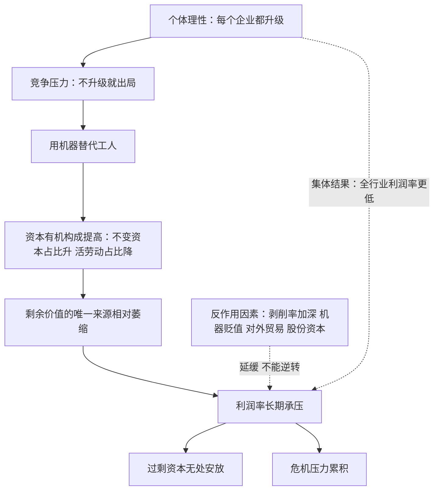

# 12｜利润率为什么倾向往下掉？

> 马克思最有争议的一条“规律”：技术进步提高生产率，为什么反而可能拖垮利润率。

---

## 一、先说结论

马克思在《资本论》第三卷提出利润率趋向下降的规律：随着竞争逼着每个资本家用机器替代人，资本有机构成提高——机器、原料这些不变资本占比上升，能创造剩余价值的活劳动占比下降；而剩余价值只来自活劳动，于是利润率长期承压。马克思自己也列了一串反作用因素：剥削率加深、不变资本贬值、对外贸易、股份资本等，它们能延缓却不能逆转这个趋势。哈维的立场要讲清楚：他承认这个张力真实存在，但坚决反对把它当成唯一的危机理论——他主张多重矛盾共同作用。

---

## 二、我们先理解一个问题

先把这个问题的反直觉之处摆出来。

技术进步明明是好事：自动化让一家工厂用一半的人产出两倍的产品。第一个引进机器人的老板赚翻了——成本比对手低，售价跟着市场价走，差额全进自己口袋。

但故事有个下半场：对手也会引进机器人。等全行业都换上了新设备，先发优势消失，售价被竞争压到新成本附近。这时候奇怪的事情发生了——每家工厂的效率都更高，设备投入都更大，但利润率反而可能比技术改造之前更低。

单个资本家理性的选择，叠加成全行业不想要的结局。这到底是怎么回事？

---

## 三、作者到底提出了什么观点？

马克思在第三卷给出了一个技术性论证。他把资本分成两块：投在机器、厂房、原料上的叫不变资本（记作 c），投在工资上的叫可变资本（记作 v）——之所以叫“可变”，是因为只有活劳动能在生产中创造出超出自身价值的新价值，也就是剩余价值 s。利润率就是 s 除以（c 加 v）。

现在引入“资本有机构成”：c 相对 v 的比重。机器越先进、自动化程度越高，这个比值越大。而分子 s 只由 v 产生——机器再贵，也只是把自己已有的价值转移到产品里，不会多创造一分。于是出现一个结构性压力：分母越来越大，能造分子的那部分却相对萎缩，利润率被趋势性地往下压。

马克思自己并不武断。他紧接着列了反作用因素：剥削率可以提高（s 变大）；机器本身会变便宜（c 贬值）；对外贸易能找来廉价原料和新的市场；股份资本对回报率的要求较低，也能承受更低的利润率。所以这是一只“趋向”的箭，不是直线下坠。

哈维在这里的态度很关键：他认为这个张力是真实的，但他批评那些把利润率下降当成资本主义危机唯一解释的人——他主张多重矛盾共同作用：实现困难、债务积累、空间失衡、劳动斗争，危机是它们合流的结果，不是一个公式的必然产物。

---

## 四、把这个观点翻译成人话

打个比方：利润像果汁，而活劳动是那台榨汁机。

机器设备再多，也只相当于更贵的杯子——杯子能装更多果汁，但自己不产汁。整个行业疯狂升级杯子的结果是：花在杯子上的钱越来越多，榨汁机的数量却没跟上，摊到每块钱本钱上的出汁率自然往下走。

更形象一点：第一个用机器人的老板，赚的是“我有人无”的时间差，不是机器人本身创造了新价值。当所有人都有机器人，时间差消失，而每个人背上的设备账单都更重了——全行业为一场军备竞赛付了钱，却没有人为果汁付更多钱。

---

## 五、为什么会这样？

哈维的推理链：竞争不留活路——不更新设备的企业先死，所以更新设备不是选择而是命令；但更新的方向恰恰是把资本从“能造价值的部分”挪向“只转移价值的部分”。

这里的核心机制又是个体理性与集体结果的冲突：每个企业升级设备都对，加起来却压低了全行业的利润率。哈维提醒注意机器贬值这条反作用因素的暗面——旧设备贬值意味着已有资本被抹掉，这既是利润率的缓冲，也是以破坏存量为代价的“重置”，危机的影子已经露出来了。

---

## 六、举一个现实生活中的例子

看这几年的新能源汽车价格战。

这是个重资产行业：一座现代化整车工厂动辄几百亿投资，车间里机械臂比工人多，电池产线、压铸设备、智能工厂，资本有机构成高得惊人。每家车企都被同一个逻辑驱赶：不投新技术就没有竞争力，投了就要摊薄成本——摊薄就要上量，上量就要降价抢市场。

于是行业呈现一个典型的悖论式景观（以下是公开报道中的事实）：2023 年起中国市场爆发多轮价格战，头部车企带头降价，全行业跟进；多家新势力车企持续亏损，整个行业利润率一路走低，低于规模以上工业平均水平；与此同时产能规划远超实际销量，过剩产能成为行业共识。

用马克思的框架读这个例子：活劳动占比被压缩到很低，巨额不变资本摊在每一辆车上，一旦销量达不到摊薄线，利润率立即击穿。各家都知道价格战伤利润，但没有一家敢先停——先停的先死。个体理性逼出的集体结果，正是利润率趋向下降规律最生动的当代样本。当然，这个案例还可以有别的解释，我们放到第九节再讨论。

---

## 七、回到书中重新理解

现在回头看马克思本人的表述，会发现他比后来的追随者谨慎得多。

他用的词是“趋向”规律——不是“必然”定律。反作用因素那一整章不是在凑数，而是在承认：这个箭头的方向和速度取决于很多变量，现实中它可能几十年都不显形。马克思的兴趣不在预测某年某月利润率崩掉，而在揭示一个结构张力：资本用来解决利润问题的手段（技术升级、扩大资本投入），恰恰是恶化利润率的手段。自我颠覆是内置的。

哈维接着这个谨慎往前走了一步。在他的框架里，利润率下降不是危机的发动机，而是多重矛盾中的一条线索：利润率承压的资本会疯狂寻找出路——压工资（加剧实现困难）、借债扩张（加剧债务链）、涌向新空间（这就是下一篇的“空间修复”）。利润率下降更像一个压力源，它把系统推向别的矛盾，而不是直接引爆危机。

---

## 八、这个观点背后还有什么？

第一，它又是个体理性与集体结果的冲突。这一点贯穿全书：每个资本家都理性地压低工资（埋了实现的雷）、理性地升级设备（埋了利润率的雷）——系统级的问题从不出现在任何一张单个的资产负债表上。

第二，资本贬值是隐形的重置按钮。新设备让旧设备一文不值，意味着存量资本被定期抹掉——“创造性破坏”从利润率角度看不是进步叙事，而是危机机制的温和版：系统靠不断销毁旧资本来给新资本腾利润空间。

第三，股份资本这条反作用因素有现代回声。马克思注意到，当资本以股份形式存在、股东只拿股息时，利润被切成企业主收入和利息两块，利润率下降可以被“利息部分变大”掩盖掉——金融化不只是分配问题，也参与了对这个规律的遮蔽和缓冲。

---

## 九、这个观点有问题吗？

这是政治经济学最大的学术公案之一，必须把争议摆足。

有说服力的地方：机制本身是清晰的——如果剩余价值真的只来自活劳动，而技术替代的方向又不可逆，那么利润率承压就是逻辑必然。资本密集行业反复出现的产能过剩、价格战、回报率递减，至少在现象层面和这个规律相容。

争议最大的地方是经验数据。一百多年来，经济学家测量各国利润率，结论始终莫衷一是：有的研究找到长期下降趋势，有的找到的是周期性波动，有的发现利润率在特定时期（比如新自由主义时代）显著回升。数据口径、不变资本怎么估值、算不算金融部门，都能改变结论。

理论上还有更尖锐的反驳。置盐定理（置盐信雄，1961）证明：在实际工资不变的前提下，理性的资本家只会采用能降低成本的技术，而降低成本的技术选择本身会提高而非降低一般利润率——换句话说，技术选择不可能导致利润率下降。马克思学派的回应是：置盐假设了价格充分调整和特定竞争结构，现实中竞争逼着企业在利润率已经下滑后仍继续投资。此外，机器贬值是否真能抵消有机构成上升、危机理论里该给它多大权重，至今没有共识。哈维的“多重矛盾”立场，某种程度上就是对这场僵局的态度：与其把全部赌注押在一个规律上，不如把它当作压力之一。

---

## 十、今天再看这个观点

以下部分是基于哈维思想的现代延伸，不是作者原话。

人工智能行业提供了一个正在进行的观察样本：算力军备竞赛中，各家公司投入的不变资本（芯片、数据中心、电力）以惊人速度膨胀，而能创造价值的环节越来越依赖极少数顶尖人才——有机构成的图景被推向极端，回报能否覆盖资本开支，是这个行业悬在头顶的利润率之问。

芯片本身的快速贬值（新一代出来旧一代折价）则是“不变资本贬值”这条反作用因素的高速版：系统靠更频繁地销毁存量资本维持运转，代谢越来越快。

另一个延伸是“内卷”这个流行词：价格战、产能过剩、利润摊薄，正是利润率承压在产业层面的日常体感——当所有人都被迫在同一个方向上加注，收益递减就不是抽象规律，而是每个经营者的报表。

---

## 十一、这一篇真正应该记住什么？

1. 马克思的规律：资本有机构成提高（机器占比升、活劳动占比降），而剩余价值只来自活劳动，利润率长期承压。
2. 马克思自己列了反作用因素——剥削率、机器贬值、外贸、股份资本——能延缓不能逆转，所以是“趋向”不是“定律”。
3. 机制本质又是个体理性与集体结果冲突：每个企业升级都对，加起来压低全行业利润率。
4. 哈维承认张力真实，但反对把它当唯一危机理论——它是把系统推向其他矛盾的压力源。

---

## 十二、留一个问题

利润率承压之后，资本手里剩下一堆“无处安放”的钱：再投回老本行只会加剧过剩，压工资会恶化实现难题。这些过剩资本要去哪？

马克思的时代答案是殖民地，今天的答案藏在地图里——把工厂搬到成本更低的地方，或者把钱砸进新城、高铁、开发区，向空间要出路。哈维把这套机制叫做“空间修复”，这是他作为地理学家对马克思最重要的补充。下一篇：**13｜资本为什么永远在“搬家”？**
