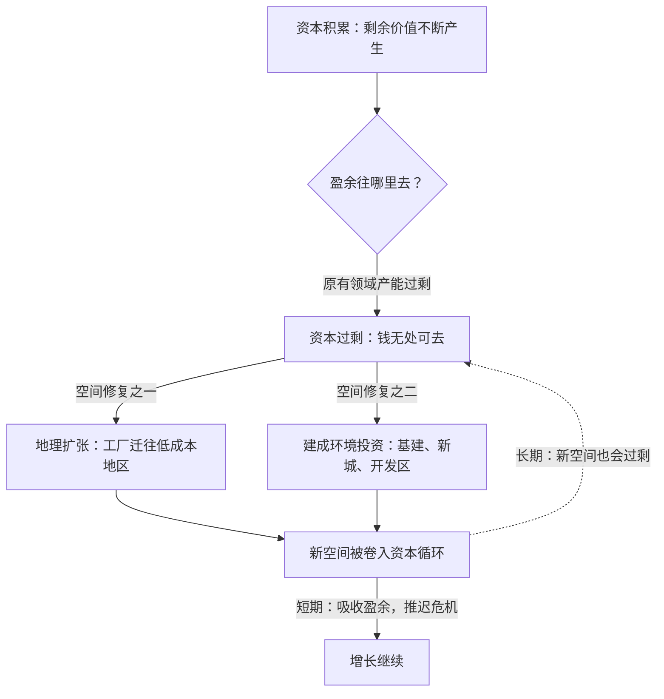

# 13｜资本为什么永远在“搬家”？

> 工厂为什么要搬去越南，城市为什么要修高铁新城——哈维说，这是同一个答案

---

## 一、先说结论

哈维认为，资本有一种与生俱来的“搬家冲动”，他给它起了个名字——**“空间修复”（spatial fix）**。当资本在一个地方积累得太多、找不到足够赚钱的出口时，它不会停下来休息，而是涌向新的空间：把工厂搬到工资更低的国家，把资本投到尚未开发的土地上去修公路、港口、新城。制造业外迁和大规模基建这两个看似无关的现象，在哈维眼里是同一种处置过剩资本的方式：用空间吸收盈余，用地理扩张推迟危机。哈维是地理学家出身，这是他给马克思理论补上的最独特的一块。

---

## 二、我们先理解一个问题

先从一个新闻里常见的画面说起。

过去二十年，“中国制造”悄悄变成了“越南制造”“孟加拉制造”。耐克关了在中国的工厂，把产能挪到胡志明市郊区；三星把手机生产线铺到越南北宁省。媒体解释这件事时通常说：中国工资涨了，越南更便宜。

几乎同一时间，中国国内在干另一件事：修高铁、建新城、铺开发区。一座座“高铁新城”在三线城市的农田上拔地而起，挖掘机开到哪里，哪里就变成工地。

一个向外搬，一个向内建。这两件事有什么关系？教科书会分别给你两个解释：比较优势、城市化。但哈维问的是一个更根本的问题：**这些钱为什么非动不可？**

---

## 三、作者到底提出了什么观点？

哈维把马克思的框架接到了地图上。他的推理起点是“资本过剩”：资本增殖的速度太快，生产出来的剩余价值太多，多到原有的投资渠道装不下了。工厂不需要更多机器，商品已经堆满仓库——钱趴在账上无处可去，对资本来说就是等死。

这时候资本有两条出路，哈维称之为两种“修复”：

- **时间修复**：把钱借给未来，用债务把明天的购买力提前到今天——这是“反价值”那条线，讲债务时已经见过；
- **空间修复**：把钱投向新的地理空间——在新地方建工厂、修基础设施、造新城，用空间的扩张为过剩资本开闸泄洪。

空间修复的关键载体是**建成环境**：道路、港口、桥梁、住宅、工业园。这类投资体量巨大、回报周期极长，恰好能吞下海量的过剩资本和过剩劳动，还能在账面上制造几十年的“增长”。

哈维的锋利之处在于他指出：空间修复**不解决问题，只是推迟和转移问题**。新城修好了，如果没人来住，过剩资本只是换了一种形态趴在那里；工厂搬到越南，越南的产能过剩只是时间问题。空间能赢得时间，但赢不了规律。

---

## 四、把这个观点翻译成人话

打个比方：资本像一个食量越来越大的人。

这个人每顿必须吃得比上一顿多——这是复利增长的要求。家里的米缸很快见底了，怎么办？他不能不吃，不吃就是危机，于是有两条路：一是跟邻居借米，承诺以后加倍还，这是债务，向时间借；二是开垦后院还没种过地的荒地，甚至买下整条街来种，这是空间修复，向地理借。

开荒能撑很久。荒地有的是——地球那么大，总有没被资本“消化”过的角落。但开荒本身要花钱：修铁路、建港口、盖厂房，这些投入又进一步消耗过剩资本，形成一个自我循环——**资本过剩驱动空间扩张，空间扩张又吸收资本过剩**。

所以“资本永远在搬家”不是哪个老板的偏好，而是系统的生存方式：不动就死，动到哪里，就把哪里卷进循环。

---

## 五、为什么会这样？

哈维的机制分析是这样的：资本积累存在一个“盈余吸收”问题——每一轮循环产生的剩余价值，都必须找到下一轮循环的出口。

这里有一个精妙的细节。修一条高铁、建一座新城，需要十年二十年才能收回投资——**回报慢恰恰是优点而不是缺点**：周期越长，过剩资本被“冻结”在钢筋水泥里的时间越久，危机就被推得越远。建成环境是资本的时间胶囊。

但代价也是结构性的：被冻结的资本难以变现，一旦新空间没有产生预期回报——新城没人住、港口没货走——这笔资本就从“修复”变成新的危机源头。

---

## 六、举一个现实生活中的例子

把开头的两个画面连起来看。

**向外看**：一家运动品牌关掉东莞的工厂，把生产线搬到越南河内郊区。对资本来说，这一搬同时解决好几个问题：越南工资更低，利润率回升；在越南买地建厂本身又是一笔投资，吸收了账上无处可去的现金；配套工业园、公路、港口跟着建起来，又是一轮吸收。过剩资本换了个空间，继续增殖。

**向内看**：一座中部三线城市在高铁站旁边规划新城，投资几百亿修站前广场、写字楼、住宅、学校。钱从哪来？很大一部分是债务——但债务的投向是空间：把农田变成建成环境。项目开工的几年里，产值、就业、土地出让金全都好看了，过剩的钢铁、水泥、劳动力都有了去处。

两个例子，方向相反、逻辑相同：**用空间的转换来处置过剩的资本**。搬到越南，是把资本安置在“别人的空间”；修新城，是把资本埋进“自己的空间”。哈维说，这就是空间修复的一体两面。

---

## 七、回到书中重新理解

明白空间修复，再回头看这本书的结构，会发现哈维埋了一条暗线。

《资本论》大部分篇幅在一个“无空间的工厂”里展开——马克思抽象掉了地理差异，假定所有交换发生在同一个平面上。哈维作为地理学家，把这张平面图重新立了起来：他指出马克思在论述殖民贸易和世界市场时其实已经意识到空间维度，只是没有展开；而《资本论》第二卷关于固定资本、周转时间的讨论，换个角度看就是空间问题的理论化。

在哈维的体系里，空间修复和债务是同一枚硬币的两面：一个向地理预支，一个向未来预支，都是为了给过剩资本争取时间。这也解释了为什么大规模基建往往伴随大规模债务——新城既是空间的修复，也是时间的修复。

---

## 八、这个观点背后还有什么？

空间修复背后藏着几层更冷的东西。

第一，**空间从来不是空的**。资本“搬进去”的地方，原本有人、有生活、有不按资本逻辑运转的存在方式。空间修复往往意味着把原来的用途清空——村庄变成开发区，稻田变成工业园。这就为后面要讲的“剥夺式积累”埋下了伏笔。

第二，**空间修复制造了新的不平等地图**。资本从什么地方搬出、向什么地方搬入，决定了哪些地区繁荣、哪些地区被掏空。锈带和新兴工业区，是同一次搬家的两端。

第三，也是最深的：**地球是有边界的**。空间修复的前提是总有“外部”可以吸纳过剩。当资本的循环覆盖几乎整个地球，“外部”越来越小，修复的余地就在收缩——这个困境会在讲危机和“经济理性的疯狂”时浮出水面。

---

## 九、这个观点有问题吗？

空间修复是哈维最有影响的原创概念，但它并非没有争议。

**有说服力的地方**：它第一次给全球化提供了一个非技术性的解释——产业转移不只是“比较优势”的自然结果，而是过剩资本找出口的强制性运动。它也很好地解释了为什么巨型基建和债务危机总是结伴出现。

**存在争议的地方**：一些学者认为，哈维把空间修复描述得太像一个“系统自我设计”的机制——仿佛资本有个中央大脑在规划搬家。现实中企业的搬迁决策是分散的、被无数具体因素驱动的，把它们全部归因于“吸收过剩”有目的论的嫌疑。也有经济学家质疑：产业转移中利润率的考量是主因，“过剩资本”究竟是解释，还是同义反复？

**可能过度简化的地方**：高铁新城这类投资还叠加着财政体制、地方竞争、土地制度等复杂因素，单用“空间修复”概括会漏掉很多因果链条。哈维本人也承认，空间修复是一个分析视角，而不是机械的因果律。

---

## 十、今天再看这个观点

以下部分是基于哈维思想的现代延伸，不是作者原话。

空间修复在今天有了新形态。数字资本看似摆脱了地理——云计算、远程办公、跨境电商，资本好像不再需要“搬家”。但仔细看：数据中心要建在电费便宜的地方，海底光缆在重画全球地图，芯片厂向亚利桑那和熊本迁移——**资本对空间的重组从未停止，只是搬的东西从工厂变成了算力**。

气候变化则是空间修复的终极边界问题。海平面上升正在消灭可投资的海岸线，极端天气在摧毁建成环境，资本第一次面对一个不再有“新边疆”的地球。

而“近岸外包”“友岸外包”这些新词说明，地缘政治正在接管空间修复的方向盘——搬到哪里去，越来越不由利润率单独决定。

---

## 十一、这一篇真正应该记住什么？

1. 哈维的“空间修复”：过剩资本通过涌向新空间、投资建成环境来吸收盈余、推迟危机，是资本积累的内生机制。
2. 工厂搬越南和修高铁新城是同一种逻辑——一个向外转移、一个对内吸收，都在为无处可去的资本找空间出口。
3. 空间修复与债务修复是一体两面：一个向地理预支、一个向未来预支，都在为过剩资本争取时间。
4. 空间修复推迟而非消除危机：冻结在新城和工业园里的资本，一旦回报落空就成为新的危机源头。

---

## 十二、留一个问题

空间修复有一个隐藏的前提：资本搬进的地方，原来的土地和人要先被“腾空”——他们的生产资料得先交到资本手里。那么这些让资本得以起步、到今天仍在继续的“腾空”动作，是怎么发生的？资本最初的积累，真的像传说里那样，是靠勤劳和节俭攒出来的吗？
