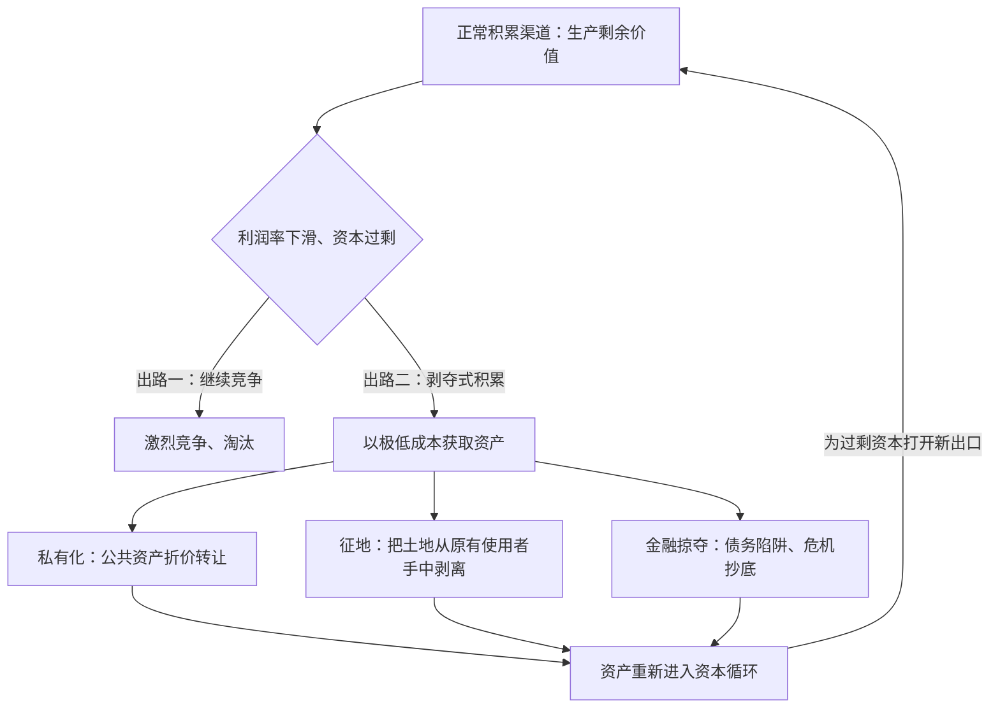

# 14｜资本的“第一桶金”真的靠勤劳吗？

> 马克思撕开了一个温情的故事：资本的起点不是节俭，而是剥夺——哈维说，这件事今天还在发生

---

## 一、先说结论

马克思在《资本论》第一卷末尾讲了一个黑暗的故事：资本的“第一桶金”不是勤劳节俭攒出来的，而是抢来的——圈地、殖民、掠夺、奴隶贸易，把人和土地强行分开，制造出第一批一无所有的工人和第一笔可以投资的财富。传统解读把这段历史当成资本主义出生前的“史前事件”。哈维不同意。他把这个机制升级为**“剥夺式积累”（accumulation by dispossession）**，并指出：私有化、征地拆迁、金融掠夺、公共资源圈占——剥夺从未停止，它和工厂里的剩余价值榨取一起，构成资本积累的两条腿。

---

## 二、我们先理解一个问题

先听一个标准版本的故事，我们从小到大都听过它。

很久以前有两个人：一个勤劳、节俭、有远见，攒下钱买了工具、雇了人，成了资本家；另一个懒惰、挥霍，最后只能给人打工，成了工人。这个故事暗示：财富是美德的报酬，贫穷是懒惰的代价。

马克思在《资本论》里把这个故事称为田园诗式的神话，然后用整整一个部分的篇幅，讲历史上的“第一桶金”到底是怎么来的。

他的答案很直接：靠抢。

---

## 三、作者到底提出了什么观点？

马克思说的“原始积累”，指的是资本主义生产开始之前必须准备好的两个条件：

- 一批**除了自己的劳动力之外一无所有的人**——他们必须失去土地和生产工具，才会“自愿”走进工厂；
- 一笔**集中的财富**——它可以变成购买原料、机器和劳动力的第一笔资本。

这两个条件都不是靠节俭攒出来的，而是靠暴力制造出来的。马克思列举的手段包括：圈占公有土地、殖民掠夺、奴隶贸易、国债和税收体系。“资本来到世间，从头到脚，每个毛孔都滴着血和肮脏的东西”——这句名言就出自这个部分。

哈维在此基础上往前走了一步。他指出，主流解读把原始积累当成一次性的、已经翻篇的历史，但只要看看今天的世界：国企私有化、征地拆迁、水资源和基因资源被注册成专利、金融危机中普通家庭的资产被低价收走——**剥夺不是资本主义的过去式，而是它的进行时**。哈维把它改名为“剥夺式积累”，意在强调：这不是“原始的”，而是与剩余价值生产并行的、持续至今的第二条积累通道。

他甚至观察到一种功能上的联系：当正常积累渠道堵塞时——资本过剩、利润下滑——剥夺式积累就会加速。用更低的成本抢夺资产，是过剩资本泄压的另一种方式。

---

## 四、把这个观点翻译成人话

用打麻将打个比方。

正常版本的资本主义游戏规则是：每个人带着自己的筹码上桌，按规则输赢——工人出劳动力，资本家出本钱，交换大体“公平”。马克思前二十几章分析的就是牌桌上的规则：剩余价值是怎么在“公平交换”中产生的。

原始积累问的是一个更靠前的尴尬问题：**桌上这些筹码当初是怎么分配的？为什么有人带着满手筹码上桌，有人空着手只能打工？**

答案是：开局之前，有人把另一些人的筹码直接抢走了。抢完之后大家坐回桌边，开始按“公平规则”玩——而被抢的人除了出卖自己，别无选择。

哈维的补充是：抢筹码这个动作不是开局前干完就完了。**牌局进行中，只要正常赢钱的路子不顺，就有人持续在场边抢**——把公家的资产私有化，把农民的地征走，把破产者的房子法拍收走。剥夺和剥削，是同一台机器的两套齿轮。

---

## 五、为什么会这样？

为什么剥夺必须持续存在？哈维的推理分两层。

第一层是马克思的历史观察：劳动者和生产的客观条件——土地、工具——在漫长历史中原本是结合在一起的，农民有自己的地。要让资本主义运转，必须用外力把这二者撕开。

第二层是哈维的理论推演：资本积累永远面对过剩问题，而剥夺式积累提供了一条便宜的泄压通道。

剥夺式积累的“吸引力”在于成本极低：不需要组织生产、不需要技术创新，只需要把原本不属于市场的东西强行拉进市场——公地、住房、水、知识。**每一次“把非商品变成商品”，都是一次低价进货**。

---

## 六、举一个现实生活中的例子

历史的例子：**英国圈地运动**。

从十五世纪到十九世纪，英国议会通过了数千项圈地法案。原本农民共同使用的公有地——放牛的草场、拾柴的林地——被一道道栅栏围起来，变成大地主的私产。农民失去土地，也就失去了不打工就能活命的全部条件，只能涌进城市，成为曼彻斯特棉纺厂里的第一批产业工人。马克思在《资本论》第一卷用了整整一章追踪这个过程，他的结论是：这些工人不是被“雇”出来的，是被“赶”出来的。

现代的例子：**城中村拆迁**。

一座城市扩张，要拆掉一片城中村。村民原本住在自己的宅基地上，房租、小生意、菜地构成他们的生计。一纸征地公告下来，宅基地被收回，补偿按某种标准折算；土地转手进入招拍挂市场，盖起商品房和写字楼。村民拿到一笔补偿款——不少，但远远够不着原地段的房价——然后搬进安置房，其中相当一部分人从此只能靠打工生活。

注意这里的结构对称：和圈地运动一样，**一块原本按非市场逻辑运转的土地被转换成纯粹的商品，一群原本握有生产资料的人变成了纯粹的劳动力出售者**。哈维会指着这一幕说：原始积累没有结束，它只是换了法律文书。

---

## 七、回到书中重新理解

把原始积累放回《资本论》的整体结构，会发现马克思安排它的位置极有讲究。

《资本论》第一卷前二十五章都在“等价交换”的框架内讲剩余价值如何产生——工人出卖劳动力，资本家按价值付工资，一切看起来公平合法。然后马克思在结尾突然掀开底牌：**这个“公平”的牌局，是用一场公开的抢劫开的局**。这个结构本身就是一种修辞：先让你相信规则是中立的，再告诉你规则建立在中立之前的那次不公之上。

哈维在这个位置接棒。他认为马克思写的是十六到十八世纪的故事，但机制本身没有年代：只要还有东西没被资本占有，只要积累的正常渠道会堵塞，剥夺就会反复发生。他把剥夺式积累分成若干类型——私有化、金融掠夺、危机操控、国家再分配——每一种都能在当代新闻里找到对应版面。

这也让“空间修复”和“剥夺式积累”连上了线：资本搬家需要空间，而空间里住着人——**为资本腾空地方这件事，本身就是剥夺**。

---

## 八、这个观点背后还有什么？

这个概念背后有几层容易被漏掉的含义。

第一，**“自由”的劳动力是被制造出来的**。劳动力成为商品需要“双重自由”，剥夺式积累回答了这种自由是怎么来的：被剥夺到一无所有，才“自由”到只能卖自己。

第二，**法律不站在剥夺的对立面，而常常是它的工具**。圈地法案是议会通过的，征地公告是依法发布的，专利是律师注册的——剥夺式积累大多是“合法”的。合法性与正义性之间的裂缝，是这个概念最尖锐的地方。

第三，**剥夺的对象可以是任何“还没被定价”的东西**。公共教育、公共医疗、基因组、个人数据——当它们被变成可交易资产时，都可以从这个视角重新审视。

---

## 九、这个观点有问题吗？

剥夺式积累是哈维最有影响、也最受批评的概念之一，两边的理由都值得摆出来。

**有说服力的地方**：它解释了为什么私有化浪潮、次贷危机中的止赎潮、发展中国家的征地冲突，呈现出惊人的结构相似性——把分散现象收进同一副图景，是好理论的标志。

**存在争议的地方**：批评者认为这个概念的外延被拉得过宽——私有化、汇率操纵、知识产权、福利削减，甚至通货膨胀，几乎一切“让人感觉被抢了”的事情都能往里装，最后变成一个有解释力但没有边界的箩筐。一些学者认为，哈维把“剥夺”从制造无产者的严格定义，泛化成了“一切不公平的转移”，牺牲了概念的精确性。还有马克思主义者担心：过度强调剥夺会稀释马克思的核心论点——剥削发生在生产领域，而不是交换和分配环节。

**可能过度简化的地方**：城中村拆迁里的安置补偿、村民的博弈策略、地方财政的结构性压力，远比“剥夺”两个字复杂；把不同法律体系、不同发展阶段的土地冲突用同一概念概括，容易抹平真正重要的差异。哈维近年也在补充，承认剥夺式积累有不同的强度和形态。

---

## 十、今天再看这个观点

以下部分是基于哈维思想的现代延伸，不是作者原话。

数字时代的剥夺式积累有了新形态：**数据圈地**。我们的行为轨迹、社交关系、购物偏好，原本是生活的一部分，不是商品；平台把它们收集起来，打包成广告资产和用户画像出售。这个过程不需要栅栏和议会法案——只需要一份没人读完的用户协议。

气候议题下也出现了新的剥夺：碳排放权被创造成一种可交易资产，谁能排放、排放多少变成市场问题；而排放权最初的分配，本身就是一次巨大的无偿赠予。

器官、代孕、水资源、种子专利——“把原本不该卖的东西变成商品”的边界战争，是剥夺式积累概念的当代前线。

---

## 十一、这一篇真正应该记住什么？

1. 马克思的原始积累：资本的起点靠的不是节俭，而是把人与土地、生产资料暴力分离——圈地、殖民、掠夺制造出第一批工人和第一笔资本。
2. 哈维把它升级为“剥夺式积累”：剥夺不是史前的一次性事件，私有化、征地、金融掠夺今天仍在继续，是资本积累的第二条腿。
3. 剥夺式积累与正常积累有功能联系：正常渠道堵塞时剥夺加速——过剩资本靠低价抢夺资产泄压。
4. 这个概念的最大争议是边界：它收编了太多现象，可能牺牲精确性——但“剥夺仍在继续”这个核心判断很难被推翻。

---

## 十二、留一个问题

剥夺和剥削说的都是人对人的夺取——但马克思还往更深的地方问了一层：被夺走的不仅是土地和工钱，还有劳动本身的意义。一个工人在流水线上耗尽一天，产品不属于他、过程不由他定、创造成了苦役——劳动本该是人的自我实现，为什么到了资本手里变成了自我丧失？

下一篇我们回到马克思批判体系的哲学底色：为什么劳动让人与自己越来越陌生？
