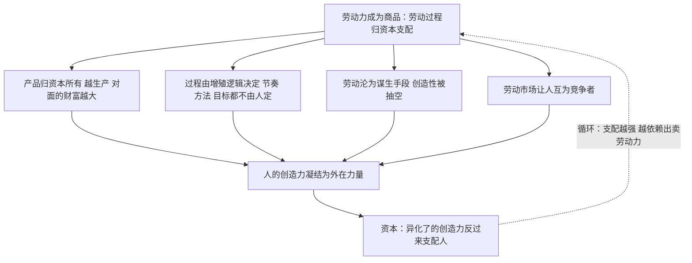

# 15｜为什么劳动让人与自己越来越陌生？

> 异化是马克思批判体系的哲学底色：哈维用它给《资本论》的政治经济学垫底。

---

## 一、先说结论

异化指的是这样一个过程：人创造出来的东西脱离人的控制，变成外在的、反过来支配人的力量。这个概念主要出自马克思1844年的早期手稿，他列出了四个维度：人与自己的产品异化（产物变成异己的力量）、与劳动过程异化（干活不是自我实现而是受刑）、与类本质异化（创造性活动这一人的本性被剥夺）、与他人异化（同事变成竞争者）。哈维用它为《资本论》的政治经济学批判垫底：资本作为运动中的价值，本质上就是人的创造力被异化之后形成的、反过来支配人的外在力量——异化是这套政治经济学的人文底色。

---

## 二、我们先理解一个问题

先承认一个普遍的体验：大多数人对工作的感受是“熬”。

周一盼着周五，上班盼着下班，工作八年最深刻的记忆是通勤。这种体验我们一般用“工作嘛，都这样”来解释——好像劳动天然就是苦的，只是有人耐受度高一点。

但细想会觉得奇怪：劳动明明是人类最本真的活动。人通过动手改造世界来确认自己的存在——做出一个东西、解决一个问题、看到别人用你造的东西，这些本来是最深的满足感来源。为什么同一件事，到了雇佣关系里就变成了纯粹的消耗？

是老板太坏吗？是行业太累吗？还是说，劳动在这种制度里被做成了某种必然让人难受的形状？

---

## 三、作者到底提出了什么观点？

先交代出处：异化理论主要来自马克思1844年的《经济学哲学手稿》，那时的马克思还是个二十多岁的青年，语言是哲学的而非经济学的。哈维的有意之举是把早期马克思和写《资本论》的成熟马克思缝在一起——用异化概念为政治经济学批判提供人性地基。

马克思列了劳动异化的四个维度：

- **与产品异化**：工人造出的东西不归工人，越造得多，站在他对面的异己财富就越大；
- **与劳动过程异化**：干什么、怎么干、什么节奏，都由资本的需要决定，劳动不是自我表达，而是被迫出售的时间；
- **与类本质异化**：“类本质”指人区别于动物的本性——自由自觉的创造性活动。当劳动沦为谋生手段，人被剥夺的恰恰是最像人的那一部分；
- **与他人异化**：劳动市场上人与人互为竞争者，同事之间是绩效排名的对手而非协作的伙伴。

哈维的观点是：把《资本论》读透了会回到这个哲学起点。资本是运动中的价值，而这个价值的全部来源是人的劳动、人的创造力——也就是说，资本本质上是人的创造力被异化之后凝结成的、反过来支配人的外在力量。人亲手造出了一个支配自己的系统，还把它当作自然规律。

---

## 四、把这个观点翻译成人话

异化最形象的版本是弗兰肯斯坦：人造出一个东西，那东西活过来，反过来掐住造它的人。

放到日常里：你烤的蛋糕不归你（产品异化）；烤几层、用什么配方、几分钟出炉，都轮不到你定（过程异化）；烤蛋糕这件事本来可以是你手艺的表达，现在只剩打卡计件（类本质异化）；和你一起烤蛋糕的人不是你的伙伴，是月底排名里要被你挤下去的人（他人异化）。

四层加在一起，就是马克思那句最狠的描述：工人只有在劳动之外才感到自在，在劳动中感到不自在。下班才是人生的开始——这句话之所以引起共鸣，是因为它准确描述了人的活动被掏空之后的样子。

---

## 五、为什么会这样？

哈维的推理链：异化不是个别坏老板的恶行，而是劳动力成为商品之后的必然结果——一旦劳动被卖掉，整个劳动过程的支配权就随合同移交给了资本。

这张图的闭环是要点：异化不是一次性事件，而是自我再生产的循环。你越被支配就越不得不出卖劳动力，越出卖劳动力，支配你的那个力量就越壮大。资本增殖的每一圈，同时是异化加深的一圈——这正是哈维说的“人文底色”：《资本论》里那些冰冷的范畴，底下垫着的是人被自己造物统治的处境。

---

## 六、举一个现实生活中的例子

看预制菜的中央厨房。

传统厨师是个典型的“非异化劳动”样本：选材、调味、火候，每一环都是技艺的表达；一道菜出锅，师傅能认出是自己的手艺，食客认得出是哪家馆子。劳动产品带着劳动者的印记，劳动过程就是自我实现。

中央厨房把这一切拆开重写。配方由研发部门标准化成克数表，火候由设备参数固化，切配、腌制、炒制各拆成独立工位——每个工人只负责流水线上的一段。到了终端门店，原本的“厨师”不再掌勺：撕开料理包，复热，装盘，出餐。技艺被从人身上剥离出来，吸进标准化流程和设备里。

用四个维度对照：菜品不属于他，甚至配方他都不知道全貌（产品异化）；工序的节奏由出餐计时器决定（过程异化）；十年厨艺经验在新的工位上毫无用武之地，创造性的判断被克数表取代（类本质异化）；工位之间计件考核互为对手（他人异化）。

哈维会补一句更深的：被吸进标准化流程里的那些技艺，并没有消失——它们变成了资本的组成部分。厨师的手艺以机器参数和操作手册的形式，反过来支配着厨师本人。这就是异化最精确的当代形态：不是技艺没了，是你的技艺变成了管你的东西。

---

## 七、回到书中重新理解

现在回头看，就能明白哈维为什么坚持把早期手稿和《资本论》缝在一起。

孤立读《资本论》，得到的是一套冷冰冰的机制：价值、剩余价值、有机构成、利润率。这套机制解释力极强，但它自己回答不了一个问题——这一切为什么是不好的？剥削证明了分配不公，可是人为什么应该在乎？

异化概念补上的正是这块地基：它说劳动不只是收入来源，还是人之为人的活动本身；资本不只是拿走了钱，还拿走了人的创造性生活，并把它铸造成了统治人的东西。哈维的意思很清楚：《资本论》里的每一个范畴——商品、货币、资本——都是异化了的劳动的化身。“运动中的价值”转得越快，人的本质力量被抽空得越多。

这也解释了为什么这本书的结尾要落到“经济理性的疯狂”：一个由人的创造力驱动、却反过来把创造者当燃料的系统，本身就是异化逻辑走到尽头的样子。

---

## 八、这个观点背后还有什么？

第一，“类本质”是整套理论的人性预设。马克思假定人有一种本性：自由自觉的创造性活动。异化之所以是“异化”，是因为有一个未被异化的参照——人本来可以成为的样子。没有这个预设，异化就退化成了普通的“工作体验差”。

第二，异化比剥削更深。剥削说的是分配不公：你创造的被拿走了多少。异化说的是存在受损：你在这个过程里变成了什么样的人。涨工资可以缓解剥削的痛感，却治不了异化——工资翻倍的流水线工人照样说不出自己造了什么。

第三，异化是后面两个概念的暗线。拜物教讲的是这种支配如何被遮蔽成“物与物的关系”——异化是主体的体验，拜物教是它看不见的机制。而“反价值”与“经济理性的疯狂”，说的都是异化力量壮大到支配整个系统时的状态。

---

## 九、这个观点有问题吗？

有说服力的地方：它把政治经济学批判从“分钱不公”提升到“人被自己造物统治”的层面，解释了一种普遍却难名的现代体验——物质丰富了，人却更空虚了。四层维度的划分至今仍是分析劳动处境最趁手的框架。

争议最大的是理论地位之争。法国哲学家阿尔都塞提出著名的“认识论断裂”论：青年马克思的人本主义（异化、类本质）是前科学的意识形态词汇，成熟马克思的科学批判恰恰建立在抛弃这套词汇之上；把两者缝合，等于用人道主义污染了科学。哈维明确站在人道主义马克思主义一边——他认为手稿和《资本论》是连续的，异化是贯穿始终的底色。这个立场有哲学后果：它承认了“人的本性”这个无法实证的预设。

另一个质疑：这个预设本身成立吗？存在主义和后结构主义会反问——为什么假定人有固定本质？会不会“异化”描述的只是某些劳动形态，而有些人就在计件工作里自得其乐？批评者还指出，哈维把异化上升为系统规律时，容易低估劳动者的能动性——人会在异化的结构里挤出意义、技艺和小小的抵抗空间。这些质疑不改变结构的分析力，但提醒我们：异化是趋势和处境，不是人的宿命判决。

---

## 十、今天再看这个观点

以下部分是基于哈维思想的现代延伸，不是作者原话。

AI 时代给异化添了新形态：大模型的训练数据标注员每天给成千上万条语料打分贴标签，他们喂养的系统学会的技能，恰恰可能让标注岗位本身消失——人用自己的判断训练出取代自己判断的机器，产品异化被推到字面极致。

算法管理则是过程异化的升级：过去是工头盯着工人，现在是系统给每个人派单、计时、打分——支配者甚至不是人，而是一段人写的代码，异化的力量变得更抽象、更无从谈判。

还有一个更深的现象：当 AI 开始替人写作、绘画、谱曲，争论“它有没有创造力”之前，异化框架先问另一个问题——这些能力原本是从谁身上学来的？如果是从无数人的创造性劳动中剥离、凝结、再以商品形式卖回给人，那这就是类本质异化的最新一章。

---

## 十一、这一篇真正应该记住什么？

1. 异化指人创造的东西脱离控制、反过来支配人；概念主要出自马克思1844年早期手稿。
2. 四个维度：与产品异化、与过程异化、与类本质异化、与他人异化——层层递进。
3. 哈维用它给政治经济学垫底：资本就是异化了的创造力，是人的力量倒转成的支配力量。
4. 异化比剥削更深：剥削是钱被拿走，异化是人在劳动中被掏空——它回答的是“这一切为什么不好”。

---

## 十二、留一个问题

异化描述了主体的体验：人感到被自己造的东西支配。但还有一个更诡异的问题没回答——这种支配为什么在日常生活中根本看不见？

我们在超市扫码付款时，看到的是商品和价格，不是背后的人和劳动关系。人的关系披上了物的外衣，支配戴上了市场的面具——马克思把这个遮蔽机制叫做拜物教。下一篇：**16｜我们为什么把人与人的关系看成了物与物的关系？**
