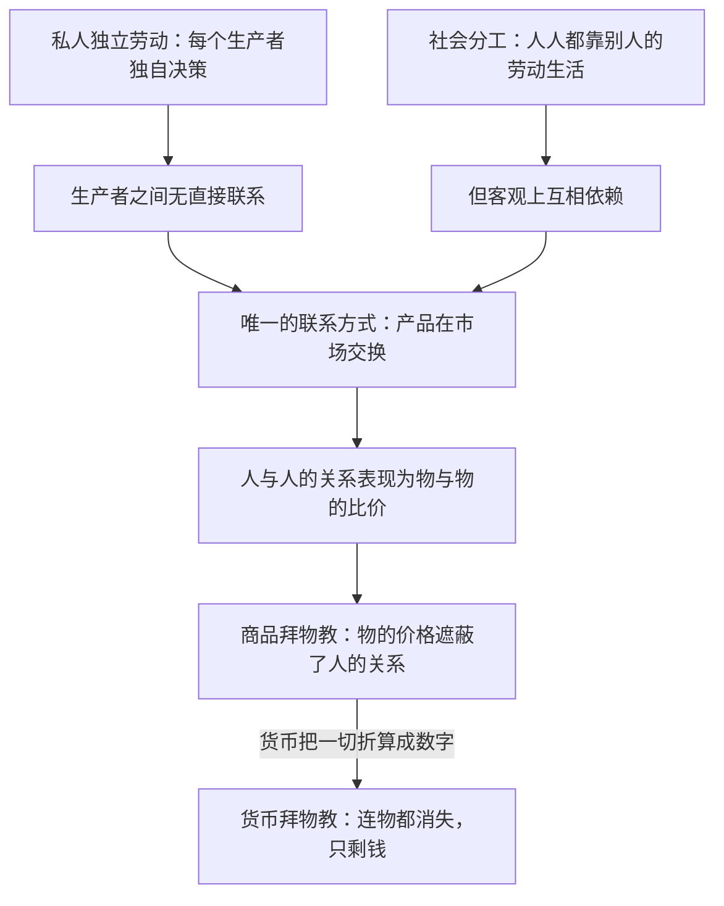

# 16｜我们为什么把人与人的关系看成了物与物的关系？

> 商品拜物教不是迷信，而是资本主义每天自动执行的障眼法

---

## 一、先说结论

马克思在《资本论》第一章就指出：商品有一种奇特的“拜物教”性质。一件商品的价格、品牌、市值，看起来像它自己的属性——就像重量和颜色一样自然；但实际上，价格是**人与人之间社会关系的化身**：谁的劳动、谁榨取了谁、谁的技能被算作值钱、谁的被算作廉价。市场把这些关系翻译成“物与物的关系”——这双鞋值多少钱、那套房涨了多少——于是我们每天都在和无数陌生人发生关系，却只看见物，看不见人。哈维强调：这不是我们愚蠢或被洗脑，而是市场运作本身就把真相藏在了物的外表之下。

---

## 二、我们先理解一个问题

去商场看看价签。

一双球鞋标价一千九百九十九元，一件白T恤标价九十九元。你看着这两个数字，不会觉得有任何奇怪——东西有贵有贱，天经地义。

但现在问一个问题：这两个数字到底是什么？

直观答案是“东西的属性”——鞋的材料好、设计好，所以值这个价。可是仔细想：皮革值多少钱？橡胶值多少钱？把它们拆成原材料加起来，可能不到标价的十分之一。

那多出来的一千多块，买的是什么？如果你说“品牌”，那品牌又是什么？品牌不是物，摸不着、称不出。这一千多块背后其实藏着一整张人与人之间的关系网——只是它穿了一件“价格”的外衣，看起来就像东西自己的属性。

---

## 三、作者到底提出了什么观点？

马克思在《资本论》第一卷第一章讨论“商品的拜物教性质及其秘密”。他的论证大致是这样的：

在商品生产社会里，每个生产者都独立劳动，他们之间本没有直接的社会关系——鞋匠不认识咖啡农，程序员不认识纺织工。把这些人连成一张网的，是他们生产的物在市场上的交换：你的劳动值多少，不由你的人品、辛苦或技艺决定，而由你的产品在市场上能换回多少别的产品决定。

于是奇妙的事情发生了：**人与人之间的社会关系，以物与物之间关系的形式出现在人面前**。我干了多少活、你干了多少活、我们的劳动如何被比较折算——这些本来是人与人之间的事，却表现为“这件商品值多少钱”这种物与物之间的比值。物成了关系的面具。

马克思借用了“拜物教”这个词——原始宗教里人们把灵力归于木头石头；在商品社会里，我们把社会权力归于物本身：钱能生钱、房价在涨、黄金保值。

哈维的解读要点是：**拜物教不是认知错误，而是结构性遮蔽**。它不是商人编出来骗我们的谎言，而是市场每天实际运作的方式——只要商品交换在进行，这层遮蔽就在自动生成。也正因为如此，它比任何辩护词都更深地掩盖了剥削：剥削不需要被掩盖，它从来就不可见。

---

## 四、把这个观点翻译成人话

打个比方：商品的价格像聊天软件里的头像。

你在网上和一个陌生人聊天，你看到的不是这个人——他的长相、口音、家境、心情——而是一个头像、一个昵称、几行文字。头像“代表”了这个人，但头像会反过来塑造你对他的全部印象：你开始把头像当成本人。

商品的价格就是这个头像。一件商品背后站着一整条链上的人：种棉花的、纺纱的、缝制的、染色的、运输的、设计的、营销的。这些人的劳动、他们的生活、他们之间谁分得多谁被压得低——所有这些关系，最后只呈现为一个数字：标价。

而数字反过来统治我们：我们开始相信“贵的就是好的”，相信价格涨跌是物自己的脾气，相信工资只是“市场行情”——**物的语言把人的故事整个吞掉了**。这就是拜物教：不是我们相信木头有灵，而是我们把人与人的关系，活活看成了物与物的关系。

---

## 五、为什么会这样？

为什么社会关系必须以物的形式出现？马克思的推理根子在生产的社会结构上：

关键在于：这个遮蔽不是主观幻觉，而是**市场的客观运作方式**。你无法通过“想明白”来消除它——就像你无法通过知道地球自转来消除日出日落。只要交换继续，拜物教就每天被重新生产出来。

货币是拜物教的极致形态。在货币身上，连“物”都消失了，只剩一个纯粹的数字；而这个数字可以买到一切——包括别人的劳动、别人的时间、别人的服从。钱的社会权力大得惊人，却表现得像它自己的自然属性——这是拜物教逻辑推到顶点的产物。

---

## 六、举一个现实生活中的例子

想想一双球鞋：为什么一个 logo 能让它卖到四位数？

把一双名牌球鞋拆开看：皮革来自制革厂，橡胶鞋底来自化工厂，缝制在东南亚代工厂完成——女工坐在流水线前，一天缝几十双鞋面。算上材料、人工、运输，这双鞋的成本也许两三百元。它卖出两千，中间的差额归谁？归品牌、归营销、归代言球星、归渠道、归利润。

现在看看这个 logo 起的作用：它把整条劳动链条压缩成一个符号。消费者穿上这双鞋，感受到的是“身份”“潮流”“认同”——这些感受是真实的，但它们由广告和符号制造，**与鞋里凝结的那个女工的十几个小时完全无关**。她缝这一双鞋挣到的钱，可能不够买这双鞋的零头。

这就是拜物教的现场教学：我们看得见 logo，看得见价格，看得见广告里的球星——**唯独看不见把鞋缝出来的那个人**。不是有人故意把她藏起来，而是市场机制本身把她折算成了“成本”栏里的一个数字。她的劳动、她的生活、她和这双鞋的真实关系，全部被“物”的外表覆盖了。

哈维讲课时常常让学生做一件事：拿起手边任何一件商品，追问“谁造了它、在什么条件下造的、每个环节的人分到了多少”。这个追问就是拜物教的解药——而解药之所以难找，恰恰因为遮蔽是结构性的。

---

## 七、回到书中重新理解

回到《资本论》的结构，会发现马克思把拜物教放在第一章不是偶然的。

整部《资本论》其实都在做同一件事：把物与物的关系还原成人与人的关系。价值不是商品的属性，而是社会必要劳动时间的凝结；货币不是天然值钱的东西，而是社会关系的凭证；资本不是一堆机器和钱，而是支配他人劳动的权力关系。**拜物教是敌人替全书写好的说明书**：马克思要拆穿的，正是这个把社会关系打扮成物的属性的系统。

哈维在导读里反复强调：读懂拜物教，才能读懂为什么马克思说资本是“一种社会关系”。资本看起来像厂房、像账户上的数字——全是物；但它实质上是“一部分人能够支配另一部分人的劳动”这种关系。拜物教把这种关系藏得严严实实，以至于连被支配的人自己也只看见物，看不见关系。

这也解释了为什么马克思的批判比普通的“贫富差距批判”深得多：他批判的不是分配不公，而是**这个系统让不公变得不可见的方式本身**。

---

## 八、这个观点背后还有什么？

拜物教概念背后，还藏着几个更深的推论。

第一，**拜物教保护剥削而不需要撒谎**。意识形态辩护需要论证、需要说服力；拜物教什么都不用说——它只是把真相翻译成物的语言，让人连“该怀疑什么”都想不到。哈维认为这比任何宣传都有效。

第二，**我们也是拜物教的日常执行者**。每天比价、砍价、看性价比、刷商品评价——这些再正常不过的行为，都在参与把人的关系折算成物的数字。拜物教不是坏人施加给好人的，而是我们共同生活在其中的结构。

第三，**拜物教有一个货币极致**。当物本身消失、只剩价格时，钱成了万能等价物，连人的尊严、时间、情感都可以被折算——货币拜物教是商品拜物教的高纯度版本。

---

## 九、这个观点有问题吗？

拜物教是马克思最深也最难验证的批判之一，争议同样深刻。

**有说服力的地方**：它精准预言了当代消费社会的核心景观——品牌崇拜、价格崇拜、流量崇拜；也解释了为什么血汗工厂被曝光几十年，购买行为却很少改变——不是人们不知道，而是“知道”无法穿透购物行为的结构。

**存在争议的地方**：批评者认为拜物教理论暗含“少数人看清真相、多数人活在幻觉中”的精英视角——凭什么你看见了关系，别人就被遮蔽了？人类学家还指出，消费者对商品的理解远比理论假设的丰富：很多人买球鞋时清楚地知道自己在为符号付费，是“清醒的拜物教徒”，这层自觉在马克思的框架里没有位置。也有学者质疑：拜物教把市场描述成自动遮蔽的系统，但市场中也有产地溯源、公平贸易的实践，遮蔽并非不可穿透的铁幕。

**可能过度简化的地方**：把所有商品消费都解释为“被遮蔽的关系”，容易低估物本身的物质属性——鞋的缓震科技确实更好，口感确实有差异。拜物教理论有时把使用价值一笔带过，走向另一个极端：好像物的有用性全是幻觉。

---

## 十、今天再看这个观点

以下部分是基于哈维思想的现代延伸，不是作者原话。

数字平台把拜物教升级到了新阶段。以前遮蔽的是生产链条，现在连“物”都开始消失——你买的不是商品，是“服务”、是“会员”、是“体验”。外卖软件上，你看到的是评分和配送时长，骑手的劳动关系、社保状况、事故率全部被折叠进一个倒计时数字里。遮蔽没有减弱，反而更彻底了。

算法推荐是拜物教的技术强化版：你看到的每个价格、每个排序，都是为你单独计算的——商品与人的关系被进一步个性化地包裹，连“市场价”这个公共参照物都在消失。

区块链溯源、供应链透明化、公平贸易认证则是反向的努力：试图把被遮蔽的关系重新挖出来。这些实践的存在本身就说明——拜物教描述的遮蔽是真实的，而且人们能感觉到它。

---

## 十一、这一篇真正应该记住什么？

1. 商品拜物教：人与人的社会关系以“物的价格”呈现，我们看得见标价，看不见商品背后的劳动和人——这是市场的结构性遮蔽，不是主观错觉。
2. 遮蔽的机制：私人独立劳动加上社会分工，使交换成为人际关系的唯一联系方式，关系只能借物的外壳出场。
3. 货币拜物教是其极致：物消失、只剩数字，而数字却拥有支配他人的真实权力。
4. 拜物教比意识形态更深：它不需要撒谎，只是自动把真相翻译成物的语言，让剥削变得不可见。

---

## 十二、留一个问题

拜物教把一切关系都藏在物的价格下面——可当价格系统本身开始发疯的时候呢？房价一年翻倍又腰斩，股市暴涨又崩盘，债务堆到天文数字又突然断裂。这些被我们当成“行情”的数字暴动背后，那套人的关系到底发生了什么？为什么危机总是隔一阵就回来一次？
