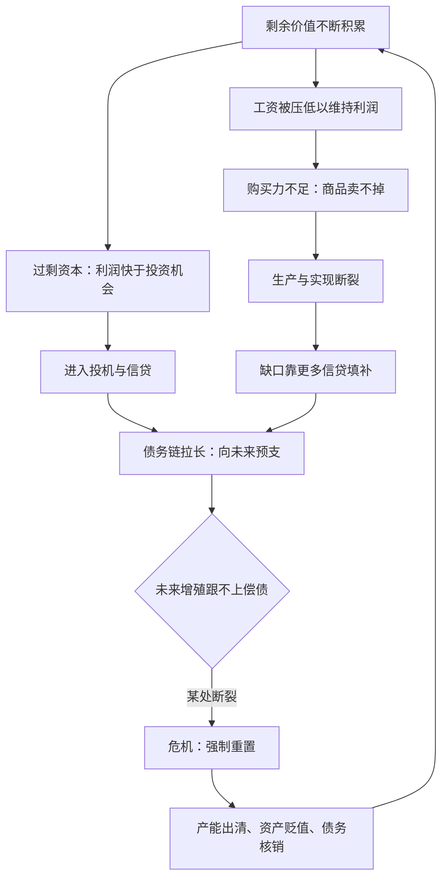

# 17｜经济危机为什么总是反复发作？

> 危机不是资本主义的故障，而是它自我修复的方式——以一种最残酷的方式

---

## 一、先说结论

哈维认为，经济危机不是资本主义的意外事故，而是这个系统的**内置功能**：它是多重矛盾积累到极限后的总爆发，也是系统给自己做的强制重置。生产与实现的断裂、债务链的绷紧、过剩资本无处安放、工资被周期性地压低——这些矛盾平时各自潜伏、互相转移，直到某一天一起引爆。危机清掉过剩产能、蒸发纸面财富、把资产打折卖给幸存者，让积累重新开始。所以哈维的判断冷峻而准确：危机不是系统失败了，而是系统在以它唯一会的方式自我修复——至于代价由谁付，那是另一个问题。

---

## 二、我们先理解一个问题

2008年9月，雷曼兄弟倒闭，全球金融市场在几周内蒸发掉数万亿美元。事后所有人都在问同一个问题：谁搞砸的？

答案五花八门：贪婪的银行家、失职的评级机构、放松管制的政府、乱加杠杆的对冲基金，甚至“买不起房却硬要借钱的人”。每种答案都指向一个“肇事者”，仿佛危机是一场交通事故，找到责任人就能防止下次发生。

但哈维提醒我们注意一个奇怪的事实：资本主义有记录以来的两百年里，危机从未停止——19世纪反复爆发，1929年大萧条，1973年石油危机，1997年亚洲金融危机，2008年全球金融危机，2020年疫情冲击……肇事者换了无数批，危机却像钟摆一样准时回来。

如果每次危机都是“有人犯错”，为什么两百年里没人学会不犯错？会不会“犯错”本身就是系统的一部分？

---

## 三、作者到底提出了什么观点？

哈维的危机理论建立在一个前提上：《资本论》三卷要合在一起读，危机不是某一个环节的病，而是整个循环的病。他把危机理解为**多重矛盾在同一时刻的总爆发与强制重置**。

这些矛盾包括：

- **生产与实现的断裂**：商品被生产出来，不等于能被卖掉；卖出去需要购买力，而购买力恰恰被压低工资的逻辑持续侵蚀——资本一边榨取剩余价值，一边挖掉自己的市场；
- **债务链的绷紧**：信贷填补了生产与实现之间的缺口，但债务是对未来价值的索取权，必须靠未来持续增殖来偿还——链条越拉越长，绷得越紧；
- **过剩资本无处安放**：利润积累快于投资机会，过剩资本只能进入投机、债务和空间修复——每一项都在为下一次危机储料；
- **工资的周期波动**：危机中失业大军压低工资，复苏后工资回升又侵蚀利润，为下一轮压工资创造条件。

哈维的关键论断是：危机来临时，系统通过它来**强制重置**——过剩资本贬值或蒸发，债务被核销，资产以骨折价转手，劳动力被重新压价。危机清空了积累的障碍，让下一轮循环得以开始。所以危机不是系统的失败，而是系统的续命术：用集中的毁灭，换取继续运转的可能。

---

## 四、把这个观点翻译成人话

把资本主义想象成一口高压锅。

锅里的蒸汽是积累产生的能量——剩余价值不断产生，利润不断滚动，资本不断膨胀。安全阀有三个：债务（向未来借空间）、空间修复（向地理借空间）、压低工资（向工人借空间）。三个阀门轮流放气，让压力不超限。

问题是：**每个阀门只是把压力转移到别处，并没有真正排掉**。借的债要还，新空间会填满，工资压到极限就没人买得起锅里的东西。于是压力在系统内部持续积累、持续转移，直到三个阀门同时失灵——轰。

爆炸的时候看起来很惨：工厂倒闭、资产贬值、失业潮。但从系统角度看，爆炸完成了几件事：把过剩产能炸掉，把虚高价格炸回原位，把还不掉的债务炸成坏账核销——**压力被强行释放了**。然后锅重新架回炉子上，开始下一轮加压。

所以哈维说危机是“功能”而非“故障”：故障是机器坏了，功能是设计里就有的一部分。高压锅的设计者知道它会炸，他们只是没设计出不炸的办法。

---

## 五、为什么会这样？

为什么矛盾必然积累到爆发，而不是被逐个化解？哈维的分析核心是：这些矛盾互相缠绕，化解一个往往加剧另一个。

注意这个图里的循环：购买力不足用信贷补，信贷让债务更长，债务要求更高的未来增长，增长压力又回头压工资——**每个“解决方案”都是下一轮问题的种子**。系统不是在解决问题，而是在把问题从一种形态兑换成另一种形态，直到兑换链条断裂。

哈维还指出危机有空间维度：矛盾不仅在时间上积累，也在地点之间传导——一地危机通过贸易、资本流动、货币体系扩散到全球。危机从来不是局部事故。

---

## 六、举一个现实生活中的例子

2008年金融危机，是哈维理论几乎逐条兑现的现场。

先看矛盾如何积累。21世纪初的美国，工资长期停滞，普通人的购买力跟不上房价上涨——生产与实现之间出现裂缝。谁来补这个裂缝？信贷。银行向偿付能力不足的购房者发放“次级贷款”，让他们用明天的钱买今天的房。

再看债务链怎么绷紧。次级贷款被打包成证券，再切割成更复杂的衍生品，卖给全球的养老基金、保险公司、主权基金。每一层打包都把“未来的还款”变成“今天的资产”，债务链从底特律的购房者一路拉到挪威的养老基金。链条越长，每一环越相信风险被别人承担了——实际上风险只是被稀释到看不见，并没有消失。

然后看引爆。2006年起美国房价停止上涨，次贷违约率上升，链条最脆弱的一环断裂。证券价值瞬间重估，持有它们的机构连环失血，雷曼破产，全球信贷冻结——**几个月内，危机从美国房贷市场传导到冰岛的国家破产、希腊的债务危机、中国出口工厂的倒闭潮**。

最后看重置。危机干了什么？数万亿美元纸面财富蒸发；数百万房屋被止赎、低价转手；失业大军压低工资；央行用天量流动性把债务从私人部门搬到公共部门。十年后资产价格回升，积累重新开始——**上一轮危机中被低价收走的资产，成了下一轮利润的种子**。

哈维会指着这整条链条说：不是哪个人搞砸了系统，是系统按自己的逻辑，走到了它必然走到的地方。

---

## 七、回到书中重新理解

把危机放回哈维的整体框架，会发现它是前面所有概念的汇合点。

资本是运动中的价值——危机是运动的强制重启；价值必须被实现——危机是生产与实现断裂的爆炸形态；债务是反价值——危机是反价值向价值的强制清算；空间修复吸收过剩——危机证明过剩终有吸不动的一天；剥夺式积累是积累的暗面——危机让暗面浮到明面：止赎、清算、低价抄底，本身就是剥夺的加速。

马克思在《资本论》里没有写出一个完整的危机理论——相关论述散见于三卷各处，有时甚至互相矛盾。哈维的工作是把这些碎片拼成一张图：不是单一原因导致危机，而是**多重矛盾互相转移、积累、共振**。这张图的好处是，它能同时解释为什么危机总有不同的直接诱因，又总有相同的深层结构。

---

## 八、这个观点背后还有什么？

危机理论背后还有几层值得细看的东西。

第一，**危机有阶级分配效应**。强制重置从不平均：资产贬值时持有现金的人可以抄底，失业时工人承担全部代价，债务核销时大机构获得救助、小债主自认倒霉。哈维反复强调，危机是财富和权力重新集中的加速器。

第二，**危机有空间传导机制**。一地危机通过贸易链、资本流动、汇率体系向外扩散——2008年是美国的房贷，2010年变成希腊的主权债务，随后变成新兴市场的资本外流。危机在地图上搬家，和空间修复是同一个逻辑的反面。

第三，**危机的“功能”恰恰是最危险的地方**。如果危机是系统的自我治疗，那么系统就有结构性动力把矛盾推到爆发点——不是谁的阴谋，而是每个局部理性都在往悬崖边走。这个系统的“解药”就是它的“病”。

---

## 九、这个观点有问题吗？

哈维的危机理论解释力很强，但争议同样不少。

**有说服力的地方**：它能同时容纳多种危机形态——债务型、房地产型、货币型、新兴市场型——而不需要为每种危机发明新理论；它对2008年的解释深度，远超“银行家贪婪”的通俗版本。

**存在争议的地方**：主流经济学把危机解释为信息不对称、激励扭曲、监管失误——这些解释虽然浅，但能推出具体政策（提高资本金、加强披露）；哈维的结构性解释把危机归因于系统本身，政策含义只能是“换系统”，很多人觉得这不实用。马克思主义内部也有分歧：坚持利润率下降规律的一派认为，多重矛盾论把危机讲得太散，丢掉了马克思的理论硬核；凯恩斯主义者则质疑，哈维低估了需求管理和制度设计的调节作用——有些资本主义经济体几十年没有大危机，说明系统内部并非没有缓冲。

**可能过度简化的地方**：把每次危机都讲成“矛盾的强制重置”，容易把不同机制压成同一个模子。2008年的衍生品危机、1973年的石油冲击、2020年的疫情停摆，成因差异很大；结构性解释长于共性、短于个性。哈维自己也承认，危机理论是《资本论》中马克思留下的最大未完成工程。

---

## 十、今天再看这个观点

以下部分是基于哈维思想的现代延伸，不是作者原话。

2008年之后的十几年，哈维的框架显得更锋利了。央行天量放水，本质上是用公共债务置换私人债务——债务链没有消失，只是从银行搬到了政府的资产负债表上；利率压到零附近，过剩资本被驱赶进股市、房地产、加密资产——空间修复在数字资产里找到了新大陆。

新冠疫情展示了危机的另一种形态：不是内生矛盾自然爆发，而是外生冲击把内在矛盾一次性点燃——供应链断裂、债务展期、失业飙升，所有潜伏的张力被同时激活。用哈维的话说，疫情是“触发点”而非“原因”：锅里的气压早就满了。

而当下的债务高企、地缘冲突、去全球化，正在制造一个更复杂的局面：多重矛盾不再能像以前那样充分地向空间和未来转移——修复的阀门在收窄。

---

## 十一、这一篇真正应该记住什么？

1. 哈维把危机理解为多重矛盾的总爆发与强制重置：生产与实现断裂、债务链绷紧、过剩资本无处安放、工资周期波动，互相转移直到同时引爆。
2. 危机是系统的内置功能而非故障：它强制出清过剩产能、蒸发纸面财富、压价资产与劳动力，让积累重新开始。
3. 2008年金融危机是典型案例：工资停滞、信贷补缺口、债务链全球化、一环断裂全链引爆、资产低价重置。
4. 危机的“解”就是它的“病”：每个化解矛盾的阀门只是把压力转移，危机是兑换链条断裂的时刻。

---

## 十二、留一个问题

危机一次次爆发，系统一次次重启，每次重启都需要更大的债务、更猛的增长、更深的剥夺。参与者其实没有疯——银行家放贷时是理性的，企业扩张时是理性的，购房者加杠杆时也是理性的。那为什么每个环节都“理性”的系统，整体却在走向不可持续？这种“理性的疯狂”，到底是怎么回事？
