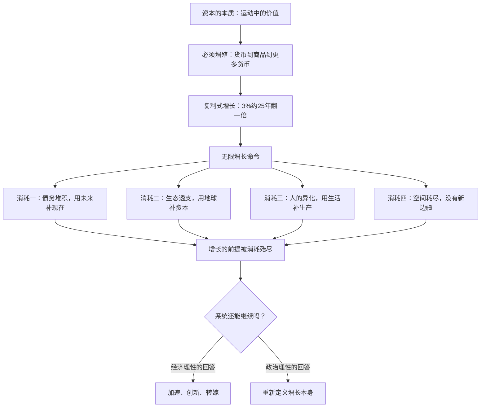

# 18｜什么是“经济理性的疯狂”？

> 每个人都按规则理性行事，整个系统却走向集体的疯狂——这是哈维给全书标题的答案

---

## 一、先说结论

哈维这本书的标题里藏着一个悖论：经济理性的疯狂。他的答案是：资本主义是一个**每个参与者都理性、但整体走向疯狂**的系统。疯狂的根源是一条不容商量的命令——资本必须无限复利式增长。按3%的年增长率算，经济总量约25年翻一倍；以今天全球经济的体量，这意味着每四分之一世纪就要多吸收一座“新地球”规模的资源和商品。债务堆积、生态透支、人的异化、危机反复发作，都是这条命令开出的账单。哈维的结论是：经济理性的疯狂不能靠更好的经济理性来治，只能用**政治理性**去回应——重新讨论我们要什么样的社会，而不只是要多少增长。

---

## 二、我们先理解一个问题

先从一道算术题开始。

如果一个经济体每年增长3%，它多久翻一倍？大约24年。如果一直保持3%，一百年后它是原来的多少倍？大约19倍。两百年呢？约370倍。

现在把这个数字放回地球。今天全球经济一年产出约百万亿美元的商品和服务。按3%复利增长，二十几年后我们要再创造一个同规模的体量，五十年后是四倍。商品不是数字——它们是钢铁、水泥、粮食、能源、水，是被开采的矿山、被砍伐的森林、被排进大气的碳。

地球只有一个。

这道算术题没有立场，它只是数学事实。但它逼出一个问题：**一个要求无限复利增长的系统，如何在一个有限的星球上无限运行？**

---

## 三、作者到底提出了什么观点？

哈维把这个悖论命名为“经济理性的疯狂”。他的论证分两步。

第一步，增长命令是结构性的，不是选择性的。资本是运动中的价值，运动的方向只有一个：增殖。3%不是目标是底线——低于它，资本就过剩，过剩就找出口，找不到就危机。企业不扩张就被对手吞掉，国家不增长就债务失控、失业飙升。**没有人命令谁增长，但谁不增长谁先死**。

第二步，每个理性选择加总成了集体疯狂。银行家放贷是理性的，企业扩产是理性的，消费者透支是理性的，政府刺激经济是理性的——但所有人理性的结果，是债务堆积、生态透支、产能过剩、危机周期、贫富分化。这就是“理性的疯狂”：**局部最优的加总等于全局灾难**。

哈维进一步指出，这条命令正在吞噬它自己的前提。增长需要可雇佣的劳动、可开发的资源、可扩张的市场、可吸收过剩的空间——而无限增长正在消耗这些前提：劳动被榨到难以再生产，资源逼近枯竭，市场只能靠债务维持，空间被覆盖到没有“外部”。系统在吃掉自己的地基。

哈维给出的对策只有一个词：政治理性。经济理性回答“如何增长更快”，政治理性回答“我们要什么样的生活、什么样的社会、什么样的地球”。前者的疯狂，只能用后者来治。

---

## 四、把这个观点翻译成人话

想象一架没有刹车、只有加速杆的飞机。

机上每个人都做得很好：机长严格按手册操作，工程师精心维护引擎，乘客安静坐好。每个人都专业、尽职、理性。但这架飞机的设计只有一个模式：**越飞越快**。

一开始加速是好事——更快、更稳、更高。但引擎要更多燃料，机身承受更大压力，航线越来越挤。机组发现问题，解决方案仍然是加速：燃料不够就透支备用油箱，机身过热就开更大功率冷却，航线堵了就要求空管腾出更多空域。

终于有一天，有人提出一个“不理性”的问题：我们能不能减速？

这就是经济理性的疯狂。飞机上的每个人都对，错的不是任何一次操作，而是飞机本身——**它被设计成只能加速，不加速就是坠毁**。而政治理性就是那个提出减速的人：他不讨论怎么把引擎修得更好，他问的是——这架飞机要不要换一种设计？

---

## 五、为什么会这样？

哈维对“疯狂”的机制分析，核心是复利数学与有限世界的碰撞：

注意四个“消耗”是并行且互相加剧的：债务堆积要求更高增长来偿还，生态透支压缩未来增长的空间，人的异化削弱劳动力再生产的能力，空间耗尽关闭过剩的出口。**四个方向同时收窄，就是疯狂逼近临界点的时候**。

哈维特别强调，这不是道德批判。他不是指责谁贪婪，而是指出这是一个数学结构问题——**指数曲线和有限平面相交，必然有一个断裂点**。

---

## 六、举一个现实生活中的例子

快时尚是无限增长命令的完美样本。

传统服装业一年两季上新：春夏、秋冬。快时尚把节奏改成**每周上新**，头部品牌能做到从设计到上架两周、一年推出上万个款式。为什么要这么快？不是我们需要的衣服变多了——人的穿衣需求几十年没变——而是增长命令要求：必须让消费者觉得上周买的已经过时，必须让衣柜永远缺一件新款。

这个系统的“理性”无懈可击：更快的周转意味着更高的资本回报率，更短的流行周期意味着更高的购买频次，便宜的单价让消费者不再犹豫——一切都是教科书式的商业成功。

但看账单：一件衣服平均被穿几次就被丢弃；全球每年产生上亿吨纺织废料，大部分进入填埋或焚烧；棉花种植消耗巨量淡水，印染是工业污染大户；代工厂工人以极低的计件工资维持着“每周上新”的节奏。

每个参与者都是对的。品牌做了正确的商业决策，消费者做了正确的性价比选择，代工厂接了养厂活人的订单。**但加总起来的结果是：一个为了增长而生产、为了生产而废弃、为了废弃而再生产的循环——衣服不再是衣服，而是资本增殖的载体**。

这就是“理性的疯狂”最纯粹的形态：没有人做错什么，但结果没有人为它负责。

---

## 七、回到书中重新理解

走到这里，可以把哈维整本书的逻辑串起来了。

他从一个定义开局：资本是运动中的价值。运动的方向是增殖，增殖的数学形态是复利，复利的终点是无限——“经济理性的疯狂”的种子在第一章就埋下了。然后他一层层展开：商品的两重性让矛盾内生，劳动价值论揭示增殖的来源，货币和信贷把增长延伸到未来，空间修复把增长延伸到地理，剥夺式积累补充另一条通道，拜物教让这一切不可见，危机是矛盾的强制重置。

而“经济理性的疯狂”是这座大厦的屋顶：**前面所有机制，最终都在服务同一条命令——无限增长**。读懂这一条，前面的概念才连成完整图景：资本为什么必须运动、必须扩张、必须搬家、必须剥夺、为什么必然危机——因为它必须无限增殖，而我们住在一个有限的星球上。

哈维在最后把批判翻转为呼吁：马克思写《资本论》不只是为了让我们理解世界，而是为了让我们改变它。理解“疯狂”的结构，是为了找到减速的可能——这就是政治理性的起点。

---

## 八、这个观点背后还有什么？

这个标题背后，藏着哈维对马克思最终的敬意。

第一，**哈维把马克思读成了一个数学家**。不是道德家，不是预言家，而是一个发现“指数函数必然撞墙”的分析者。马克思笔下的资本规律是运动定律而非道德判断——哈维继承了这种冷静。

第二，**“疯狂”是对理性的内部批判**。哈维不说资本主义“坏”，他说它“疯”——意思是它的逻辑自身推翻了它自己。这是辩证法的精髓：批判不是从外部喊口号，而是指出系统的内在矛盾让它无法自洽。

第三，**政治理性不是经济理性的敌人，而是它的边界**。哈维不是主张退回某种旧体制，而是主张：增长的目标、方向、速度，应当是社会公开讨论的政治议题，而不是资本自动运行的技术参数。把“要不要无限增长”从必然性问题变回选择性问题，是走出疯狂的第一步。

---

## 九、这个观点有问题吗？

这是哈维最宏大也最受争议的论断，两边的理由都值得摊开。

**有说服力的地方**：它用一条简单的数学事实——复利增长——解释了为什么经济危机、生态危机、社会危机会同步加剧。三大危机在“无限增长”这个根源上汇合，这种整合力度是其他理论做不到的。

**存在争议的地方**：经济学家反驳的核心是“脱钩”——增长可以不再依赖资源消耗，服务经济、数字经济、效率提升可以让单位产出的资源强度持续下降；绿色增长论者认为，问题不是增长本身而是增长的方式。一些学者认为哈维低估了技术进步的弹性：农业时代的人也想象不到工业能养活八十亿人。马克思主义内部也有质疑：把矛头指向“增长”这个抽象命令，反而稀释了对剥削关系的具体批判——问题也许不是增长太多，而是增长归谁。

**可能过度简化的地方**：把生态、债务、社会问题都归因于“3%复利”这一条线，解释力虽强，却会漏掉每个领域的具体机制——气候变化还涉及能源结构与代际正义，债务问题还涉及金融体系设计。哈维的框架是一张总图，不是每个战场的地图。

---

## 十、今天再看这个观点

以下部分是基于哈维思想的现代延伸，不是作者原话。

今天这个论断比成书时更刺眼了。全球债务总额早已超过全球产值的三倍；气候报告每年都在修正“临界点”的预测；主要经济体的生育率全部跌破更替水平——人的再生产本身，正在增长命令下萎缩。

人工智能给这个问题添了新变量：如果生产率爆炸式提升，复利曲线的斜率会更陡；如果劳动不再是价值的唯一来源，马克思的框架本身都需要更新。哈维的“疯狂”命题遇到了终极测试：**当增长可以不依赖人，这个系统还需要我们吗？**

而“去增长”“福祉经济”“甜甜圈经济学”这些新思潮，是从不同路径走向哈维提出的问题：如果无限增长不可能，那么“足够”是什么？谁来定义“足够”？这些讨论还年轻，但它们都在哈维画出的框架之内。

---

## 十一、这一篇真正应该记住什么？

1. “经济理性的疯狂”：每个参与者都理性行事，但无限复利式增长的系统命令把局部理性加总成集体灾难——债务、生态、异化、危机都是账单。
2. 3%的增长意味着约25年翻一倍，这是数学事实而非政治立场；有限的星球承载不了无限的增长。
3. 疯狂是结构性而非道德性的：问题不是谁贪婪，而是系统被设计成不增长就死——批判必须指向结构而非个人。
4. 哈维的对策是“政治理性”：把增长的速度、方向、目标从资本的自动运行，变回社会公开讨论的政治议题。

---

## 十二、留一个问题

读完哈维的论证，一个真正的问题浮现出来：他说经济理性的疯狂只能用政治理性回应——但“政治理性”是什么？谁来定义它？它不是又一个抽象概念，而是“要不要减速、往哪里转、付出什么代价”的具体回答。这个回答不在书里，而在每一个读完这本书的人身上——你打算怎么回答它？

---

## 系列收束

从开篇到这篇，整个系列其实只讲了一个词：**运动**。

资本是运动中的价值——哈维用这个定义开局，然后展开它的全部含义：运动的方向是增殖，运动的形式是循环，运动的动力是矛盾，运动向未来延伸出债务、向地理延伸出空间修复，运动的暗面是剥夺，运动的遮罩是拜物教，运动的极限是危机，运动的终点是“理性的疯狂”。

回头看开篇那句“资本像一辆必须永远行驶的自行车”，现在可以补上最后一块：**这辆自行车不仅停不下来，而且必须越骑越快**。这是整部《资本论》、也是哈维这本书最深的忧虑。

马克思在一百五十年前写下的分析，今天为什么依然锋利？因为那条命令没有变：价值必须增殖，增殖必须无限，无限必然撞墙。哈维讲了五十年《资本论》，最后浓缩成一句提醒：理解这个系统不是为了理解它，而是为了找到改变它的可能。

这个系列到此收束。但那个问题还开着：如果运动必须继续，它能不能换一种方式继续？哈维没有给答案，马克思也没有——它等着被写出来。
