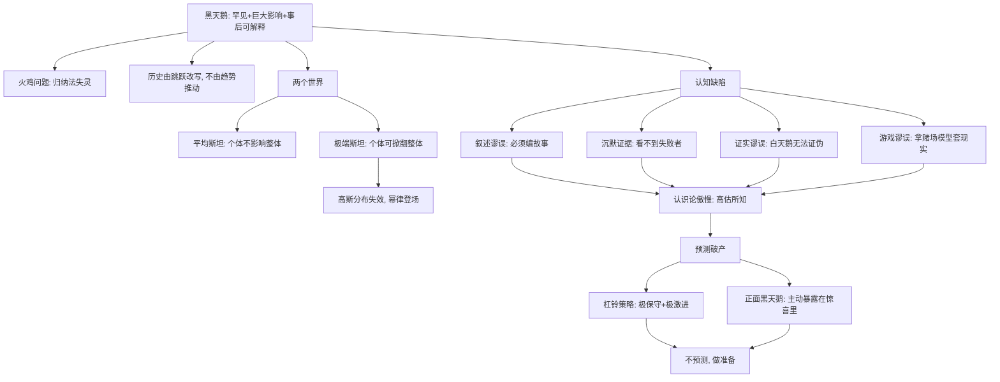

# 00｜系列拆解与目录

> 《黑天鹅》（The Black Swan）深度解读系列的总目录与知识地图。

## 系列简介

《黑天鹅》是纳西姆·塔勒布「不确定性」系列中最负盛名的一本。它要回答的问题看似简单：**为什么那些真正改变世界的事件，事先几乎没人预测到，事后却人人都觉得理所当然？**

塔勒布给出「黑天鹅」的三重定义：罕见、影响巨大、事后才可解释。第一次世界大战、互联网、九一一、崩盘——历史不是被平缓的趋势推动的，而是被这些跳跃式的意外反复改写。问题在于，我们的大脑装了一套专门欺骗自己的软件：给随机事件编故事、只看幸存者不看墓场、用一万只白天鹅「证实」没有黑天鹅、拿赌场的概率模型去套真实世界。更糟的是，我们高估自己知道的，于是专家预测年复一年地失败，却年复一年地继续预测。

这本书的价值在于它不只是泼冷水：它教你在两个世界里认路（平均斯坦与极端斯坦），教你识别大脑的四类认知骗局，教你用杠铃策略把「被黑天鹅毁灭」换成「被黑天鹅拯救」。本系列按「概念 → 两个世界 → 认知缺陷 → 预测破产 → 共处之道」五段递进，拆成 15 篇，每篇只讲清一个问题。

## 全书核心问题

| 层次 | 核心问题 |
|---|---|
| 概念层 | 什么是黑天鹅？为什么历史由它而不是趋势推动？ |
| 结构层 | 平均斯坦和极端斯坦的分界在哪？高斯分布为什么失效？ |
| 认知层 | 叙述谬误、沉默证据、证实谬误、游戏谬误分别怎样骗过我们？ |
| 预测层 | 认识论傲慢如何让专家预测持续失败？黑天鹅到底能不能预测？ |
| 生存层 | 杠铃策略、正面黑天鹅和「不追火车」的心态，如何让我们与不确定性共处？ |

## 全书知识地图

## 全系列目录

### 第一部分：什么是黑天鹅

#### 01｜什么是「黑天鹅事件」，为什么它统治着历史？

核心问题：黑天鹅的三重属性是什么，为什么说历史由它推动？
核心观点：罕见、极端影响、事后可解释三者齐备的事件才是黑天鹅；几乎一切重要的社会变革都符合这个定义，历史在跳跃中前进。
理解难度：★★☆☆☆
关键词：黑天鹅、罕见性、极端影响、事后可解释

---

#### 02｜火鸡问题：为什么一千天的经验挡不住第一千零一天的屠杀？

核心问题：为什么经验越多，有时反而越危险？
核心观点：火鸡用一千天「证实」农场主的善意，却在感恩节前夜被屠杀；归纳法的致命弱点在于，历史数据恰恰可能是风险的来源。
理解难度：★★☆☆☆
关键词：火鸡问题、归纳法、经验陷阱、意外

---

#### 03｜为什么我们只能在事后解释黑天鹅？

核心问题：黑天鹅为什么永远披着「早知道」的外衣？
核心观点：三重迷雾让我们误以为自己理解世界——理解的错觉、回顾的扭曲、对事实信息的高估；事后解释是认知的自动补全，不是真理解。
理解难度：★★★☆☆
关键词：三重迷雾、回顾性扭曲、解释冲动、后见之明

---

### 第二部分：两个世界——平均斯坦与极端斯坦

#### 04｜平均斯坦与极端斯坦：为什么有些意外能掀翻一切？

核心问题：为什么一个异常个体有时无关紧要，有时却能改变总量？
核心观点：在平均斯坦，极端值被平均稀释（如身高）；在极端斯坦，单一个体可以掀翻整体（如财富、书销量）。判断自己在哪个世界，决定一切风险管理的前提。
理解难度：★★★☆☆
关键词：平均斯坦、极端斯坦、可规模化、分布

---

#### 05｜钟形曲线的诱惑：为什么高斯分布在现实里处处失效？

核心问题：为什么教科书最爱的高斯分布恰恰是危险来源？
核心观点：高斯分布只属于平均斯坦；把它带进极端斯坦，会系统性地低估极端事件的概率，把千年一遇算成百万年一遇。
理解难度：★★★★☆
关键词：高斯分布、幂律、肥尾、模型风险

---

### 第三部分：我们的大脑如何欺骗我们

#### 06｜叙述谬误：为什么我们总想给随机事件编故事？

核心问题：为什么我们受不了「事情就这样发生了」这个解释？
核心观点：大脑需要因果故事来压缩信息，叙述让复杂世界显得有序，但故事越流畅离随机性越远；叙述是我们最大的认知弱点之一。
理解难度：★★★☆☆
关键词：叙述谬误、因果冲动、信息压缩、事后归因

---

#### 07｜沉默的证据：为什么成功学大多在误导你？

核心问题：为什么我们看得见成功者，看不见失败者？
核心观点：失败者不说话——墓地里躺满了「做法相同但运气不同」的人；基于幸存样本的成功学，系统性高估方法的作用、低估运气的作用。
理解难度：★★★☆☆
关键词：沉默证据、幸存者偏差、运气与技能、墓场

---

#### 08｜证实谬误：为什么一万只白天鹅证明不了没有黑天鹅？

核心问题：为什么确认次数再多也挡不住一次反例？
核心观点：证实和证伪不对称——看到一万只白天鹅只增加信心，看到一只黑天鹅就推翻全部；负面经验比正面经验更有信息量，知道「什么错了」比知道「什么对了」可靠。
理解难度：★★★☆☆
关键词：证实谬误、证伪、不对称、波普尔

---

#### 09｜游戏谬误：为什么赌场概率模型会害了真实世界？

核心问题：为什么把概率当骰子算的人，会死在概率之外？
核心观点：赌场和游戏有确定的规则与枚举空间，真实世界没有；用骰子的随机性模型去套现实，会漏掉规则本身都不确定的那类风险。
理解难度：★★★☆☆
关键词：游戏谬误、规则不确定性、骰子模型、Fat Tony

---

### 第四部分：预测的破产

#### 10｜认识论傲慢：为什么我们总高估自己知道的？

核心问题：为什么我们对未来的自信远超实际能力？
核心观点：我们系统性高估所知、低估未知；越是专家越容易陷入认识论傲慢——知道得越多，越以为自己知道。
理解难度：★★★☆☆
关键词：认识论傲慢、过度自信、盲区、专家

---

#### 11｜专家的预测为什么和抛硬币差不多？

核心问题：为什么经济学家、战略家的长期预测基本无效？
核心观点：泰特洛克的研究表明专家预测与随机猜测相差无几，刺猬型专家（一个大理论解释一切）比狐狸型更糟；但没人因预测失败付出代价，所以游戏继续。
理解难度：★★★☆☆
关键词：预测失败、泰特洛克、刺猬与狐狸、无代价预测

---

#### 12｜黑天鹅到底能不能被预测？

核心问题：黑天鹅不可预测，是不是意味着我们什么都不能做？
核心观点：单次黑天鹅不可预测，但风险的暴露结构可以管理；曼德博的分形思路让一部分「灰天鹅」变得可估算——我们预测不了事件，但能改造自己面对事件的姿势。
理解难度：★★★★☆
关键词：可预测性边界、灰天鹅、曼德博、暴露结构

---

### 第五部分：与黑天鹅共处

#### 13｜杠铃策略：为什么最保守加最激进反而最安全？

核心问题：为什么把 90% 放最安全、10% 放最投机，比中庸配置更抗黑天鹅？
核心观点：杠铃策略避开「中等风险」这个最危险的模糊地带：用极度保守保住底线，用极度激进去捕获正面黑天鹅；不预测，只布置姿势。
理解难度：★★★☆☆
关键词：杠铃策略、双峰、中庸陷阱、抗风险

---

#### 14｜正面黑天鹅：为什么有些机会值得你用一生去等？

核心问题：为什么在某些领域，等待本身就是策略？
核心观点：出版、科研、风险投资是正面黑天鹅行业——一次成功覆盖全部失败；主动暴露在惊喜里、抓住一切机会、别因短期无回报撤退，希望前厅的煎熬是入场费。
理解难度：★★★☆☆
关键词：正面黑天鹅、意外好运、希望前厅、风险行业

---

#### 15｜既然无法预测，我们该如何生活？

核心问题：在一个由黑天鹅统治的世界里，怎样才算活得明白？
核心观点：接受不可预测，然后做两件事——防御负面黑天鹅，暴露给正面黑天鹅；错过火车只有追它才痛苦，把尊严留在自己身上而非结果上。
理解难度：★★★☆☆
关键词：不可预测、准备而非预测、尊严、收束

---

## 推荐阅读顺序

**主线顺序**：01 → 15，按认知难度分五段。

- **第一段（01–03）**：建立黑天鹅概念、火鸡问题的归纳陷阱、三重迷雾。
- **第二段（04–05）**：分清两个斯坦与高斯分布失效，这是全书的技术地基。
- **第三段（06–09）**：拆解四类认知骗局——叙述、沉默证据、证实、游戏。
- **第四段（10–12）**：预测的破产与预测的边界，全书最难也最过瘾。
- **第五段（13–15）**：从批判转向行动——杠铃策略、正面黑天鹅、如何生活。

**不同读者的入口**：

- 想抓骨架：01 → 04 → 06 → 11 → 15。
- 对认知偏差感兴趣：03 → 06 → 07 → 08。
- 对投资与风险感兴趣：04 → 05 → 12 → 13。
- 练习批判阅读：每篇第九节「这个观点有问题吗？」集中呈现了观点的边界与争议。

## 全系列状态

全系列共 **15 篇**，已全部写完。
