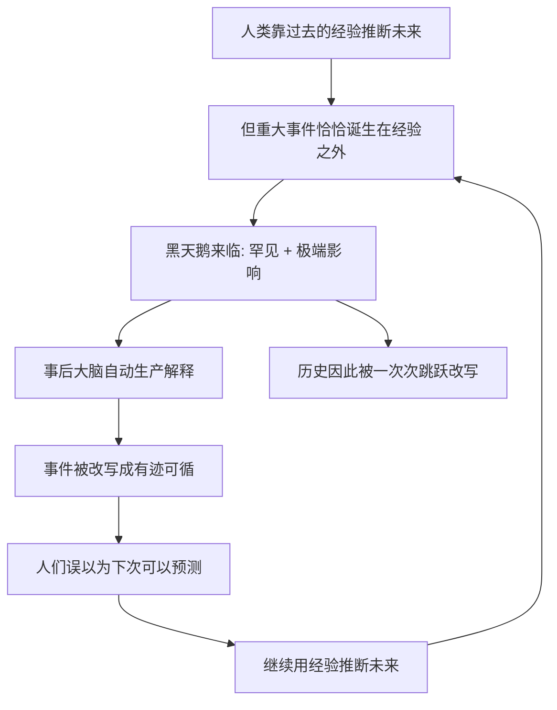

# 01｜什么是「黑天鹅事件」，为什么它统治着历史？

> 本文要解决的问题：塔勒布所说的「黑天鹅」到底是什么，为什么他认为历史是被这种事件而不是被平缓的趋势推动的？

---

## 一、先说结论

黑天鹅事件是同时满足三个属性的事件：**罕见**（超出常规预期）、**影响巨大**（改变历史进程）、**事后才可解释**（发生之后人人都能编出它「本来就该发生」的理由）。塔勒布认为，几乎一切真正重要的社会事件——战争、崩盘、技术革命、帝国的兴亡——都是黑天鹅。我们以为历史像河水一样平缓流动，其实它是一次次跳跃：黑天鹅不常来，但每一次来，都重新定义一切。

## 二、我们先理解一个问题

在发现澳大利亚之前，欧洲人坚信一个「常识」：所有天鹅都是白色的。

这个结论有极强的证据——几百万年的观察，亿万只天鹅，无一例外全是白的。任何一位博物学家都会把它写进教科书。然后，一六九七年，探险家在澳大利亚看到了一只黑天鹅。

一只鸟，推翻了几百万次确认。

现在把这个逻辑搬到更大的事情上。二〇〇一年九月十日，如果你问任何一位美国安全专家「明天两架飞机撞塌双子塔的概率有多大」，得到的答案会趋近于零——这不是因为专家们笨，而是因为这件事在所有人的经验之外。九月十一日之后，同一个事件忽然变得「可以理解」了：情报失误、宗教极端主义、防空漏洞，事后分析做得头头是道。

这就是黑天鹅最狡猾的地方：事前隐形，事后必然。

## 三、作者到底提出了什么观点？

塔勒布给黑天鹅下了三重定义，缺一不可。

第一重是**罕见性**：事件在常规预期之外，没有任何过去的数据能直接指向它。

第二重是**极端影响**：不是小小的意外，而是足以改写局面的冲击。市场上跌百分之一是波动，跌百分之五十是黑天鹅——量级完全不同。

第三重最容易被忽略：**事后可解释性**。事件发生之后，人类会立刻生产大量分析、报告、回忆录，证明它「其实有迹可循」。这种事后叙述让我们产生「未来是可以预测」的错觉，于是下一次黑天鹅来临时，我们照样毫无防备。

塔勒布的激进主张在于：满足这三条的事件不是偶然事故，而是历史的主要驱动力。他干脆点说——历史和社会不是缓慢爬行的，是一跳一跳的，每一次跳跃都是黑天鹅。

## 四、把这个观点翻译成人话

用一句大白话说：**真正改变世界的，不是「意料之中」的累积，而是「想不到」的那一下。**

再想一个生活版本。一个人每天上班、下班、还贷，以为自己的人生由月薪决定；然后一次裁员、一场大病、一个突然爆红的机会，十年的规划全部作废。事后他会说「其实当时已经有征兆了」——但征兆是在事后才被看见的。

黑天鹅的隐喻还有一层意思：白色代表「已知世界的秩序」，黑色代表「秩序之外的那一次」。问题不在于黑天鹅多不多，而在于**整个系统的命运是由它决定的**。平均的日日夜夜攒不出历史，一只黑天鹅就够了。

## 五、为什么会这样？

塔勒布的推理链条大致是这样的：

关键在于一个不对称：**对历史进程的影响而言，黑天鹅的权重远超日常。** 一千个普通交易日的涨跌加起来，可能不如崩盘那一天的零头。所以塔勒布说，研究「常规」是浪费时间——常规只是两次黑天鹅之间的休息时间。

而事后解释机制又保证了这套错觉永续运转：每次黑天鹅落地，我们立刻把它织进故事里，告诉自己「这次懂了」。懂了的是这一只，下一次来的永远是另一只。

## 六、举一个现实生活中的例子

九一一事件是教科书级的黑天鹅，三个属性全部拉满。

罕见性：在二〇〇一年九月十日之前，民航客机被劫持后当作导弹撞向摩天大楼，不在任何人的风险评估表里——情报机构有各种碎片信息，但「两架飞机撞塌双子塔」作为一个具体事件，没有任何模型给出过它。

极端影响：它直接改写了美国外交政策、中东格局、全球机场安检制度，催生了两场战争和一个全新的监控时代。一件事的后果以十年为单位扩散。

事后可解释性：事件发生几周内，「原因」就被找齐了——情报部门失职、极端主义的温床、美国对中东政策的反弹、航空安检漏洞。国会调查、九一一委员会报告、无数本书，都在论证「它本来可以被预见」。可悖论就在这：如果它真的可预见，它就不会是黑天鹅。

塔勒布想让你注意的正是这种循环：事前，我们活在「天鹅都是白的」的安稳里；事后，我们活在「早知道会有黑天鹅」的错觉里——两个幻觉接力，保证下一次照样措手不及。

## 七、回到书中重新理解

现在我们再看塔勒布反复强调的那句话，就清楚多了：历史不是缓慢爬行，是一跳一跳前进的。

他不是否认趋势和积累的存在，而是在纠正权重：我们花在「平缓部分」的注意力太多，花在「跳跃部分」的防御太少。报纸头条关心的是连续的日常，但塑造你生活的是那些上不了预测模型的断裂——技术革命、市场崩盘、战争、你遇见的某个改变一生的人。

所以黑天鹅这个概念的杀伤力不在「有些事想不到」，而在「想不到的事恰恰是最重要的事」。理解这一点，是进入这本书的门票：后面所有的批判——对预测、对专家、对高斯分布——都建立在这个前提之上。

## 八、这个观点背后还有什么？

黑天鹅背后还藏着三层东西。

第一，它是对「知识是什么」的重新界定。塔勒布暗示：我们所谓的知识，大部分是「对已发生事件的合理化整理」，而不是「对未来事件的覆盖」。真正的未知不在知识的空白处，在知识的边界外——我们甚至不知道自己不知道。

第二，三重属性里的「事后可解释」其实是个陷阱预警。塔勒布把人类定义为「寻找解释的动物」：我们无法容忍一个没有原因的事件，所以会编造原因。这个倾向本身是更深层认知缺陷的入口——叙述谬误、沉默证据、证实谬误，都是这台「解释机器」的不同零件。

第三，黑天鹅重新定义了「读历史有什么用」。如果历史由跳跃构成，那么学历史的正确姿势不是找规律预测未来，而是理解「哪些事曾经完全没人想到」——用过去的意外，给未来的意外留座位。

## 九、这个观点有问题吗？

有说服力的地方很明显：二十世纪以来的重大事件清单——两次世界大战、苏联解体、互联网、九一一、金融危机——几乎全是事前无人预测、事后解释成堆的案例。黑天鹅框架对「为什么预测总是失败」给出了统一解释。

但边界同样存在。第一，「事后才可解释」是个有点滑头的标准：一些学者认为，很多事件事前并非完全无迹——九一一前情报系统内部确实有警报被忽视，金融危机前也有少数分析师持续警告。把「没被主流采信」等同于「不可预测」，可能把制度失灵错当成认识论必然。第二，黑天鹅的判定依赖事后的影响评估，而小概率高影响的定义边界模糊——影响多大算「巨大」？事前怎么区分一只黑天鹅和一只普通灰天鹅？第三，「历史由跳跃推动」是定性断言而非可检验命题，学界对历史动力的解释本就存在不同看法——渐进的制度演化论者会反驳说，黑天鹅只是点燃引线的火星，柴是积累出来的。第四，这个框架解释力强于预测力强：它能告诉你为什么会错，但给不出「下一次什么时候来」的任何线索——这也是塔勒布自己承认的，但读者容易把「解释力强」误读成「可以用」。

所以更准确的读法是：黑天鹅是**对历史结构的诊断**，不是预测工具。它的用处在于拆掉你对预测的自信，而不是给你新的水晶球。

## 十、今天再看这个观点

以下部分是基于作者思想的现代延伸，不是作者原话。

放到今天，黑天鹅的频率感似乎在加快。新冠疫情是近十年最典型的案例：罕见、全球停摆级的影响、事后人人都在分析「早有预警」。生成式 AI 的爆发也有相似结构——ChatGPT 上线前夜，绝大多数专家没有给出「几个月内改变全行业」的预测，事后「深度学习发展必然如此」的叙事立刻就位。

但要注意一个倾向：当「黑天鹅」变成流行词，它有被滥用的风险——任何意外都被贴上黑天鹅的标签，反而稀释了概念。塔勒布的标准其实苛刻：必须是预期之外且改写局面的，普通的坏消息不算。概念越流行，越值得回去核对三重定义。

## 十一、这一篇真正应该记住什么？

1. 黑天鹅 = 罕见 + 极端影响 + 事后可解释，三条缺一不可。
2. 历史由跳跃改写而非趋势累积——一只黑天鹅的权重超过千万只白天鹅。
3. 事后解释是认知补全，不是理解；它制造的「下次可预测」错觉保证我们一再失手。
4. 黑天鹅是对历史结构的诊断，不是预测工具——它拆掉自信，不给水晶球。
5. 判断一个意外是不是黑天鹅，先问事前是否真在预期之外，而不是事后听故事。

## 十二、留一个问题

下一次当你听到「这件事的发生是必然的」——不妨先查一下：事件之前，谁写下了它必然发生的预测？如果找不到，那个「必然」是谁、在什么时刻生产出来的？

而一个更贴身的问题是：如果黑天鹅最擅长的地方就是「经验告诉你的恰恰是最危险的」，那我们凭什么信任经验？塔勒布用一只火鸡把这个问题讲透了——它用一千天证明了农场主的善意。下一篇，我们看火鸡错在哪。
