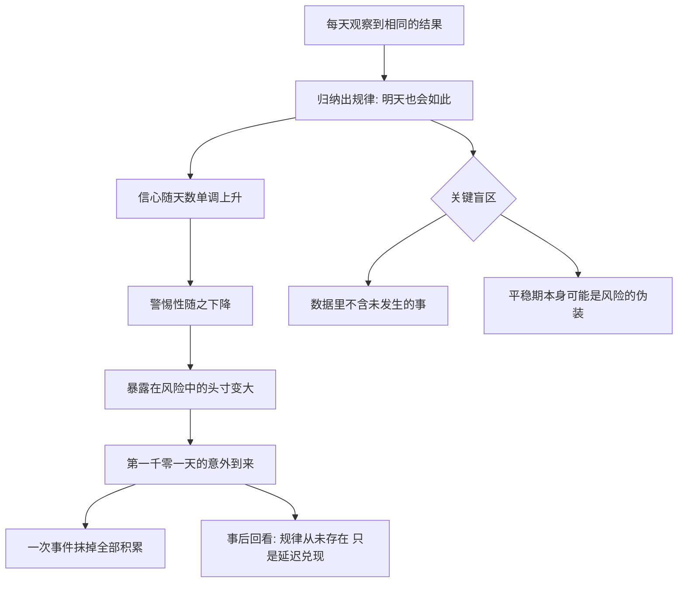

# 02｜火鸡问题：为什么一千天的经验挡不住第一千零一天的屠杀？

> 本文要解决的问题：为什么经验积累得越多，有时反而让我们离危险更近？

---

## 一、先说结论

塔勒布借哲学家罗素的火鸡讲了一个残酷的寓言：一只火鸡被农场主喂养了一千天，每一天的喂食都「证实」了农场主的善意——直到感恩节前夜，它被宰了。归纳法的致命弱点在于：过去的数据只能告诉你过去发生了什么，不能保证未来照旧；更阴险的是，**越长的平稳历史，越可能是在为一次大的意外蓄能**。经验不是护身符，有时候它恰恰是风险的来源。

## 二、我们先理解一个问题

设想你是那只火鸡。

第一天，农场主给你喂食，你有点警惕。第十天，你开始放松。第一百天，你已经在鸡群里成了「农场主是好人」理论的权威——你有一百天的数据支持。第一千天，你的信心达到顶峰：一千次观察，无一例外，农场主每天准时出现、带来食物。统计学意义上，你对「农场主爱火鸡」这个命题的信心已经接近满分。

然后，感恩节前两天，农场主又来了——这次没带食槽，带的是刀。

问题不是火鸡笨。问题是它用的推理方式，我们每天都在用：拿过去的规律推断未来。哲学家把这叫归纳法，塔勒布把它的崩塌叫「火鸡问题」。一千天的数据里，没有任何一天包含「会被宰」这个信息——可恰恰是这条信息决定了火鸡的命运。

## 三、作者到底提出了什么观点？

塔勒布认为，火鸡问题不只是一个哲学趣味题，而是现代风险管理的真实写照。他的观点可以拆成三层。

第一层，**归纳法的结构性盲区**。从「过去每天喂食」推出「明天还会喂食」，这个推理没有任何逻辑担保——休谟三百年前就指出了。塔勒布的贡献在于把它从哲学拉回现实：银行的风险模型、保险公司的精算表、你对工作的安全感，本质上都是火鸡式推理。

第二层，**历史数据可能是风险的来源，而非风险的度量**。火鸡的一千天不是降低了风险，而是掩盖了风险——甚至喂养本身就是屠宰计划的一部分。塔勒布认为，金融领域最危险的时刻恰恰是波动率最低的时刻：长期平静不代表系统安全，代表压力在积累。

第三层，**置信度与真实风险可以反向运动**。火鸡的风险在最后一天达到最大值，它的信心也在那一天达到最大值——两条曲线完美反向。这是火鸡问题最毒的结论：你最确信安全的时候，可能正是你最危险的时候。

## 四、把这个观点翻译成人话

一句话：**「一直以来都没事」不是「会一直没事」的证据，有时候它恰恰是「快要出事」的证据。**

换个生活版本。一个人在一家公司干了十年，年年考评不错，于是他把「公司不会裁我」当成了定律——证据就是过去十年。但决定他命运的不是过去十年的考评，而是明年公司要不要砍这条业务线；这件事在他的十年数据里，一个字符都没有。

火鸡的真正教训不是「经验没用」，而是：**经验只覆盖「发生过的情况」，而杀死你的永远是「没发生过的那种情况」**。拿经验的厚度去对抗意外的宽度，是拿错了武器。

## 五、为什么会这样？

归纳法失效的机制，塔勒布的解释大致是：

核心是一个不对称：**过去的数据包含关于过去的一切信息，但只包含关于未来的部分信息——甚至可能是误导性信息**。对火鸡来说，「被喂食」和「被宰」不是两个对立的可能，而是同一个饲养计划的两个阶段。它观察得越仔细，对这个计划的前半段了解得越深，就越不可能想象后半段。

塔勒布因此提出一个反直觉的判断标准：考察风险时，别只数「过去出事的次数」，要问「过去没出事的日子，是不是恰恰在为出事蓄能」。

## 六、举一个现实生活中的例子

第一个例子就是火鸡本身——它是全书的招牌隐喻。一千天喂食建立的信任曲线一路向上，感恩节前的一刀一次把它清零。注意细节里的残忍：喂食不是善意被辜负，喂食就是屠宰流程的一部分。火鸡用自己的数据「证明」的那个结论，恰恰是杀死它的计划所需要的。

第二个例子搬到金融市场。塔勒布反复指出一个现象：市场长期风平浪静时，风险不但没消失，反而在积累。逻辑链条是这样的——波动率低，投资者就敢加杠杆；杠杆上去，系统对冲击的承受力就下降；于是下一次波动到来时，幅度被杠杆放大成灾难。二〇〇八年前夜的美国房地产市场就是这个剧本：「房价从未全国性地下跌过」是被写进模型的前提，几十年的数据支持它，而恰恰是这个前提的崩塌引爆了全球危机。长期平静不是安全的证据，是脆弱性在暗处长大的证据——火鸡长得越肥，感恩节越近。

## 七、回到书中重新理解

现在重看塔勒布的安排就清楚了：他把火鸡问题放在全书前部，是在给后面所有批判埋炸药。

他后面会批判金融模型、批判专家预测、批判高斯分布——但这些批判的弹药库是同一个：**用历史数据推断未来的方法，在冲击幅度无界的领域里结构性失灵**。火鸡问题是这个方法论缺陷的最小样本：一千个数据点，一次证伪，全部清零。

所以这一篇要抓住的不是「火鸡好惨」，而是这个推理结构的普遍性：你的房贷安全感、公司的「稳健经营」、政府的「局势可控」，本质上都是那条火鸡信心曲线。塔勒布甚至把「感觉最安全的时刻，就是风险最大的时刻」当成经验定律——听上去像鸡汤，其实是归纳法的数学缺陷在日常中的投影。

## 八、这个观点背后还有什么？

火鸡问题背后还藏着三层东西。

第一，它悄悄改写了「学习」的定义。我们通常认为学习就是积累数据、提炼规律；火鸡问题说明，存在一种方向相反的学习——**识别「哪些规律只是暂时没被打破而已」**。从数据里提炼出的规律越多，需要提防的「尚未到来的反例」可能也越多。

第二，它给「稳定」重新定了价。传统思维里稳定是好的、波动是坏的；塔勒布提示了一种反转：小波动可能是系统在释放压力，长期零波动反而像憋着的弹簧。这个思路后来会长成他的「反脆弱」概念——这里先记住朴素版：不晃的桥不一定结实，也可能只是在等一辆足够重的车。

第三，火鸡问题暴露了「证据」这个词的陷阱。火鸡不是没有证据，它的证据极其充分——问题出在证据的采集范围上。凡是只在「系统正常运转期间」采集的证据，都无法覆盖「系统不运转」的情形。这是结构性缺陷，补再多数据也补不上。

## 九、这个观点有问题吗？

有说服力的地方很硬：归纳法无法证明自身，这是从休谟到波普尔的哲学共识；「长期平静积累风险」在金融史上也反复上演——长期资本管理公司用几年的漂亮数据证明了模型正确，然后一次俄罗斯债务危机把它清零，教科书级的火鸡。

但要诚实指出几处边界。第一，「经验可能危险」不能被推成「经验无用」：在规则稳定、冲击有界的领域——比如工程学和医学的很多分支——归纳法仍然好用；塔勒布批的是在规则本身会变、冲击无界的领域里滥用它。第二，火鸡寓言是思想实验，不是经验研究：现实里很少有人能拿到「一千天纯平稳然后一次性毁灭」的干净样本，很多火鸡在半路就跑了——也就是说，真实的人并没有寓言里那么被动。第三，关于平稳期与危机的关系，学界存在不同解释：一些经济学家认为长期平稳期的积累是真实增长而非伪装的风险，把一切平静都读成暴风雨前夜，可能犯了过度概括。第四，这套框架擅长事后诊断——崩盘之后回看，平静期全是信号；但事前你怎么区分「健康的平静」和「伪装的平静」？塔勒布给的答案更多是姿态性的（永远为意外留余地），而不是一个可操作的识别器。

所以准确的读法是：火鸡问题是**对归纳法适用边界的警告**，不是对归纳法的死刑判决。它要拆的是「数据多＝安全」这条等式，不是让你从此不信任何经验。

## 十、今天再看这个观点

以下部分是基于作者思想的现代延伸，不是作者原话。

今天的火鸡问题有了新的放大器：算法和人工智能让我们把归纳法用到了前所未有的规模。推荐系统靠你的历史行为推断偏好，风控模型靠历史违约推断未来违约——模型越精致，对「训练数据里没出现过的情况」越盲。二〇二〇年三月新冠疫情冲击市场时，一大批靠「常态数据」训练的量化模型同时失灵，就是一个群体火鸡时刻。

另一条延伸在组织管理里：一家公司连续几个季度达标，管理层对模式的信心达到顶峰，而恰恰在顶峰期，公司最不愿意为「没发生过的坏情况」留预算。火鸡问题给管理者的提醒很具体——别把「上一季度没事」写进下一季度的安全假设里。

## 十一、这一篇真正应该记住什么？

1. 火鸡用一千天「证实」善意，第一千零一天被宰——归纳法保证不了任何「明天照旧」。
2. 历史数据可能只是风险的前半段：喂食本身就是屠宰计划的一部分。
3. 信心曲线与真实风险可以反向运动——感觉最安全时，可能正是最危险时。
4. 长期平静不是安全的证据，可能是脆弱性在积累——尤其在市场和组织里。
5. 批判的对象是「滥用归纳法」，不是经验本身——先分清你在规则稳定的世界还是会变的世界。

## 十二、留一个问题

假设你正在经历一段长期的平稳——工作顺利、账户稳定、身体无恙。你拿什么区分，这是「健康的平静」还是「感恩节前的平静」？火鸡答不出来，因为它的全部数据都来自同一个饲养计划。

而更奇怪的事情还在后面：当第一千零一天的刀落下来之后，围观的鸡群会说什么？它们会说「其实早该看出来的」——然后细数那些「被忽视的征兆」。意外发生前无人想到，发生后人人觉得必然。这台「事后解释机器」是怎么运转的？塔勒布叫它三重迷雾。下一篇，我们拆开它。
