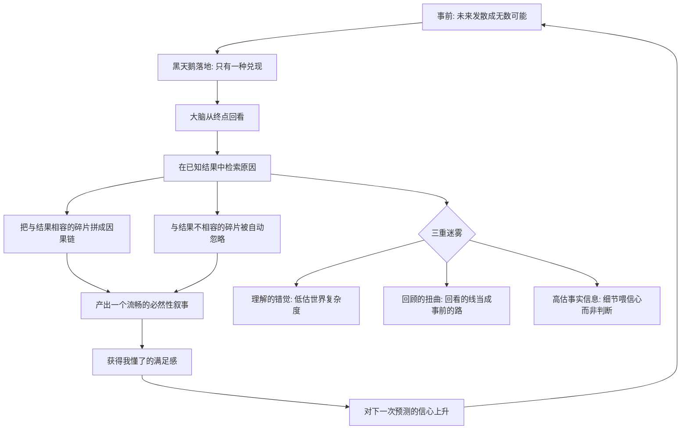

# 03｜为什么我们只能在事后解释黑天鹅？

> 本文要解决的问题：为什么黑天鹅事前无人预料，事后却人人都觉得「早该料到」？

---

## 一、先说结论

塔勒布认为，我们对历史事件的理解被三重迷雾笼罩：**理解的错觉**（以为自己理解的世界远比实际简单）、**回顾的扭曲**（事后看一切都显得有规律、有因果）、**对事实信息的高估**（信息越多越自信，判断却未必更准）。三重迷雾合谋，制造了一个认知骗局：事后解释不是真理解，是大脑对空缺的自动补全。黑天鹅永远披着「早知道」的外衣——因为我们的记忆和叙述系统会主动替它缝制这件外衣。

## 二、我们先理解一个问题

做一个思想实验。一九一四年六月，斐迪南大公在萨拉热窝遇刺。如果你在六月二十八日之后问欧洲各国的战略家：「这会引发一场持续四年、死上千万人的世界大战吗？」——几乎没人会说是。各国军事推演桌上摆的版本是「几周内结束的有限冲突」。

四年之后：战壕、毒气、索姆河、凡尔登，帝国倒了四个。这时再翻开报纸和回忆录，「必然性」的分析铺天盖地——同盟体系的结构性矛盾、军备竞赛的惯性、民族主义的火药桶。每一条都说得通，每一条都「解释」了为什么这场战争不得不打、不得不打成这样。

问题来了：如果原因这么清楚、这么必然，六月二十八日那天它们在哪？

塔勒布备好的答案是：那些「必然的原因」，大部分是事后才生产出来的。事前它们不在任何人的脑子里，事后它们住进了每一本教科书。

## 三、作者到底提出了什么观点？

塔勒布把「事后才懂」这个现象拆解为三重迷雾，一层比一层隐蔽。

第一重是**理解的错觉**：我们生活在一个比想象中复杂得多的世界里，却以为自己理解它。世界由无数变量和随机碰撞驱动，但大脑只肯接受因果链条——于是我们把「复杂」误译成「我没认真分析」，而不是「它本来就无法被当时的任何人算清」。

第二重是**回顾的扭曲**：事后看历史，一切都有模式。塔勒布提醒我们注意一个方向性的差别——站在时间轴上往前看，未来是发散的无数可能；站在终点往回看，历史是收拢的一条线。大脑几乎只在「往回看」的模式里工作，所以它看见的永远是那条收拢的线，并且误以为事前也该看得见它。

第三重是**对事实性信息的高估**：我们以为掌握的事实越多，理解就越深。但塔勒布指出，细节的增加主要提升的是「信心的感觉」，而不是判断的质量——知道得越多，故事讲得越流畅，而流畅的故事离真实的因果可能更远。

三重迷雾的合谋结果是：世界看上去比它实际的样子更有序、更可预测、更好理解。我们误以为自己理解世界，而真正发生的事情是——我们给世界套了一个事后缝制的罩子。

## 四、把这个观点翻译成人话

一句话：**「事后看明白」不等于「事前能料到」，大脑最擅长的，就是把「没料到」修成「早知道」。**

一个生活版本：你买了一只股票，它跌了百分之四十。跌完那天你打开分析文章——果然，现金流早有问题、行业天花板明显、管理层减持是信号，每一条都「本该看见」。但诡异的是，同一个你在买入那天面对同样的信息，得出的结论是「值得买」。变化的不是信息，是你的位置：买入时你站在时间轴上往前看，无数种可能；割肉后你站在终点往回看，只剩一条路——发生过的那一条。

塔勒布说，人类是「寻找解释的动物」。我们受不了「事情就这样发生了」，大脑会自动补一个因果故事填上去，补得又快又真——真到我们自己都分不清，哪些是事前看见的，哪些是事后缝上去的。

## 五、为什么会这样？

事后解释机器的运转流程，大致是：

机制的核心是**方向性**。预测是从现在往未知走：信息不完备，分支开放；解释是从已知往过去走：结果已经给定，只需要挑配合的证据。这两件事难度天差地别，但大脑把后者获得的流畅感误记成前者的能力——「我能解释」被偷换成「我本可预测」。

塔勒布还指出一个残酷的细节：这台机器不受教育程度影响，越聪明的人补的故事越精致。事后解释不是知识的缺乏，是认知结构的出厂设置。

## 六、举一个现实生活中的例子

第一个例子就是第一次世界大战本身，塔勒布在书里专门拿它开刀。事前：一九一四年夏天，欧洲主要国家的军政精英没有一家预测到「四年堑壕战、四个帝国垮台、上千万人死亡」这个版本的未来——就算有人预警冲突，想的也是十九世纪式的短期战争。事后：历史学家把同一组事实——同盟体系、军备竞赛、巴尔干局势、参谋部的动员时间表——重新排列，写成一条通向大战的必然轨道。同一批证据，事前撑不起一个预测，事后撑起了一整套「不可避免」。

第二个例子是历史教科书的写法。塔勒布提醒我们注意它的工序：历史是**倒着写出来的**。作者知道结局，然后从结局出发往回挑材料——挑中的是与结局相容的事件，略去的是当时同样合理、但没有兑现的可能性。于是我们读到的历史像一条河，从源头直奔入海口；而当时的人活着的历史更像一片沼泽，四面八方都是可能的流向。塔勒布有个说法：历史像一部倒放的电影——放映时因果流畅，倒回拍摄现场，满地都是被剪掉的、同样可能发生的故事。

这两个例子合起来说明一件事：「必然」不是历史自带的属性，是事后写作工序的产品。

## 七、回到书中重新理解

现在重看黑天鹅的第三个属性——「事后可解释性」，分量就完全不一样了。

黑天鹅的三重定义里，这一条表面上在描述事件，实际上在描述我们的认知缺陷。事件本身并不要求可解释，是大脑强制要求它可解释——这台解释机器太强大，以至于一切发生过的事最终都显得「有迹可循」。塔勒布甚至认为，我们巨大的解释冲动，让我们以为自己生活在一个可理解的世界里——这是一个比任何单只黑天鹅都大的错觉。

所以「为什么只能在事后解释黑天鹅」的答案分两半：一半在事件端——黑天鹅在经验之外，事前没有指向它的数据；另一半在我们端——就算事前无人料到，事后大脑也一定会把解释补出来。两端合谋，「早知道」的外衣永远合身。

## 八、这个观点背后还有什么？

三重迷雾背后还有三层东西。

第一，它重新给「信息」定了价。常识说信息越多越好；第三重迷雾说，信息的边际收益可能先正后负——过了某个点，新增信息喂养的主要是信心和故事，而不是判断。这对「多看几份研报就敢加仓」这类行为是一记直拳。

第二，它解释了为什么「读了很多历史」不等于「更会应对未来」。如果教科书里的历史是倒放的电影，那么读史训练出来的主要是解释能力，不是预判能力——除非你有意识地把每段历史倒回「事前视角」重读，追问「当时的人看见了什么、没看见什么」。读史的坑不在读得少，而在用事后的框架读。

第三，它给「复盘」划了一条隐蔽的边界。复盘有价值，但复盘的产出必须打一道折扣：从结果倒推出的因果链，天然高估其中「本可预见」的部分。不打折扣的复盘，会把运气记成眼光、把巧合记成规律，为下一次失手备好弹药。

## 九、这个观点有问题吗？

有说服力的部分证据扎实：心理学对「后见之明偏差」的研究是一条独立的实验传统——心理学家费施霍夫从二十世纪七十年代起的实验反复表明，被告知结果之后，人们会系统性高估自己事前的预测能力，而且就算被提醒「别受结果影响」也没用。塔勒布的三重迷雾与这条实证线索高度吻合；「历史必然性是叙事产品」也得到了历史学方法论内部的支持。

但边界同样要摆出来。第一，「一切解释都是事后补全」说得过重：有些领域的事后分析确实沉淀出了前瞻能力——航空事故调查就是事后解释，但它改写了明天的安全规则。事后解释不全是幻觉，关键在于它有没有被拿去检验过。第二，「无人预测」是个强度可调的说法：一战前确实有评论家——比如伊万·布洛赫——预言过工业化战争会变成消耗与僵局，只是没有成为主流。把「主流没预测」说成「无人能预测」，是把分布问题说成了全或无的问题。第三，关于一战是否「不可避免」，学界本就存在不同解释：强调结构因素的学派与强调偶然决策的学派争了一百年，塔勒布的框架站在强调偶然与叙事的一侧，但把它当成盖棺定论就过头了。第四，还存在反向风险：把「一切必然都是事后编的」推到极致，可能滑向另一个错觉——「历史纯属偶然，研究原因没有意义」。偶然与结构之间不是二选一，这个分寸塔勒布自己有，但口号化的版本容易丢。

准确的读法是：三重迷雾是**给「理解」打的折扣率**，不是「理解不可能」的判决书。它要你警惕的是解释的来源，而不是解释本身。

## 十、今天再看这个观点

以下部分是基于作者思想的现代延伸，不是作者原话。

社交媒体时代，事后解释机器开到了全速。任何大事件发生两小时内，「早该料到」的分析就铺满时间线——而且算法偏爱确定、流畅、情绪饱满的因果故事，平台机制放大的恰恰是回顾性扭曲。信息越多，三重迷雾反而越浓：细节喂饱了信心，判断力原地踏步。

另一条延伸在人工智能领域：大语言模型是终极的事后解释器——它能给任何结果编出流畅的因果链，因为它见过的「历史」几乎全是倒放版本。把模型的流畅解释误认为预测能力，是三重迷雾在新技术外壳下的复活。

## 十一、这一篇真正应该记住什么？

1. 三重迷雾：理解的错觉、回顾的扭曲、对事实信息的高估——合谋生产「早知道」。
2. 事前往前看是发散的无数可能，事后往回看是收拢的一条线——别把回看的线当成事前的路。
3. 解释流畅不等于预测有效：后见之明是认知出厂设置，越聪明补的故事越精致。
4. 教科书的历史是倒放的电影——必然性是被剪出来的，当时的人站在沼泽里。
5. 用三重迷雾给理解打折，而不是取消理解：警惕解释的来源，不必放弃解释。

## 十二、留一个问题

下次复盘任何一件「已成定局」的事——一次崩盘、一场败局、一段关系的结束——试着做一个练习：把时钟拨回事前那一刻，列出当时同样合理的其他结局。如果列不出来，你看到的「必然」，有多少是事件自带的，多少是你的大脑缝上去的？

而解释力之外还有一个更实际的问题：黑天鹅这同一种「意外」，为什么落到不同领域，杀伤力天差地别？一次异常在有的世界只是涟漪，在有的世界能掀翻整个总量。塔勒布为此造了两个国家。下一篇，我们去平均斯坦和极端斯坦办签证。
