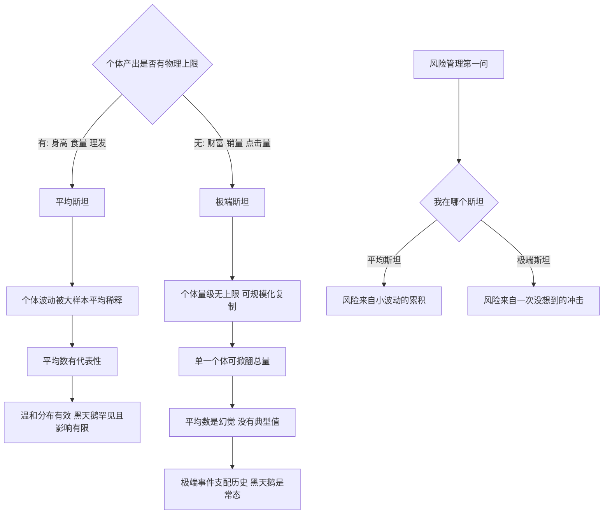

# 04｜平均斯坦与极端斯坦：为什么有些意外能掀翻一切？

> 本文要解决的问题：为什么同样一个异常个体，有时对整体毫无影响，有时却能掀翻整个总量？

---

## 一、先说结论

塔勒布把世界分成两个国度。**平均斯坦**：个体再极端也会被平均稀释——身高、体重、食量，任何一个人都改变不了总体的量级。**极端斯坦**：单一个体可以掀翻整个总量——财富、图书销量、城市规模、金融市场。他认为，判断一件事属于哪个斯坦，比预测它什么时候发生更重要：在平均斯坦，平均数让你可以安心思考；在极端斯坦，平均数是危险的幻觉，黑天鹅才是常态。这是一切风险管理的前提题：先搞清楚自己站在哪个世界。

## 二、我们先理解一个问题

做两个实验。

实验一：随机抽一千个人，测身高，算平均值，大约一米七。现在让全球最高的人——就算两米四——走进这个样本。一千零一个人的新平均值是多少？还是一米七，小数点后动一点点。一个极端个体来了，总量几乎没感觉。

实验二：还是这一千个人，算他们的财富总额和平均值。现在让一位顶级富豪走进来。新的平均财富会是原来的几百倍——他一个人的财富可能超过其他一千人的总和。极端个体来了，总量直接改写。

同样一个「极端值加入样本」的动作，一边纹丝不动，一边天翻地覆。塔勒布说，这不是程度差别，是**两种世界**的差别：身高住在平均斯坦，财富住在极端斯坦。而人间的悲剧，一半来自在极端斯坦里用平均斯坦的方法思考。

## 三、作者到底提出了什么观点？

塔勒布的观点分三层。

第一层，**存在两种本质不同的随机性**。平均斯坦里，个体的波动有上限——人不会长到一百米，一天吃不下一吨饭；极端值再大，被大样本一平均就没了脾气。极端斯坦里，个体的量级没有内在上限——一个人的财富可以是另一个人的亿倍，一本书的销量可以是另一本的千万倍；单个观察值可以支配总量。

第二层，**分界的关键是「可规模化」**。极端斯坦的行业几乎都有一种性质：产品或服务可以近乎零成本复制放大。作家写一本书，卖一万册和卖一亿册的劳动量一样；歌手录一首歌，听的人翻一百倍他不用多唱一遍。可规模化让「赢家通吃」成为可能，个体差异因此被放大到没有天花板。身高不可规模化——你没法把长个子的能力复制给别人。

第三层，**两个斯坦要用两套思维**。平均斯坦里，平均数、正态分布、大数定律全都好使，温和的意外会被系统吸收；极端斯坦里，这些工具全部失灵——平均数被单一个体绑架，「典型值」根本不存在，一次黑天鹅可以抹掉全部历史积累。**最危险的不是身处极端斯坦，而是拿着平均斯坦的地图在极端斯坦里开车。**

## 四、把这个观点翻译成人话

一句话：**有些事是「大家分蛋糕」，蛋糕再大也撑不死谁；有些事是「赢家通吃」，一个人能把整张桌子搬走。**

一个生活版本：小区门口两种营生，理发师和做短视频的博主。理发师再努力，一天能剪的头有上限——剪刀、时间、一个脑袋，不可复制；他的收入分布注定是平均斯坦的，好也有限、差也有限。博主拍一条视频，一百个人看和一亿个人看，工作量是同一条视频——可规模化；他的收入分布是极端斯坦的，可能长期颗粒无收，也可能一条视频顶理发师十年。

两个斯坦没有好坏之分，是**规律不同**：平均斯坦拼的是稳定和累积，极端斯坦拼的是暴露和运气。拿理发师的思路做博主（「我这个月比上个月多挣了百分之十」），会误判自己的位置；拿博主的思路管理理发店的财务，会死得很惨。

## 五、为什么会这样？

两个斯坦的分化机制，大致是：

机制的轴心是**总量对个体的脆弱性**。平均斯坦里，总量是「很多小份的总和」，拿走最大那份，剩下的还在；极端斯坦里，总量可能「约等于最大的那几份」，样本代表不了总体，总体被一个点劫持。塔勒布的结论是方向性的：在极端斯坦，「平均而言」这个词几乎不提供信息——你说「平均每个作者卖一万册」，真相可能是一千个作者各卖五百册，加一个超级畅销书作家卖几亿册。

所以风险管理的第一问不是「风险多大」，而是「这个游戏里，极端值能不能支配总量」——这个答案决定了后面所有工具的可用性。

## 六、举一个现实生活中的例子

第一个例子是塔勒布的原版对照：随机抽一千人算平均身高，然后把姚明加进来——平均值动都不会动，身高的物理上限保证了任何个体都无法掀翻总量。同样的操作换成财富，把比尔·盖茨加进这一千人，平均财富瞬间翻几个数量级，他一个人的身家比其他人加起来还多几个级别。同一个「加入极端个体」的动作，在平均斯坦是涟漪，在极端斯坦是海啸。这个对照的力量在于它的简单：不需要任何统计知识，肉眼可见「平均数」在两个世界里的含义完全不同——一个代表典型，一个纯属误导。

第二个例子是图书市场，塔勒布用它说明极端斯坦的行业形态。全球每年出版几十万种书，绝大多数作者一年卖几百到几千册；而一位 J.K.罗琳的「哈利·波特」系列全球销量以亿计——她一个人的销量可以超过数百万作者的总和。写书的劳动能复制吗？写一遍，印刷和电子传播近乎零成本放大——这就是可规模化。于是图书市场呈现极端斯坦的标准形态：一小撮头部吃掉绝大部分总量，长尾庞大而稀薄。对想入行的人，这个分布的含义冰冷而清晰：平均收入毫无意义，你面对的不是「稳步上升」的坡道，是「要么很少、要么通吃」的赌桌。

## 七、回到书中重新理解

现在重看黑天鹅的定义，就明白塔勒布为什么必须发明这两个斯坦了。

黑天鹅事件——罕见、影响巨大——在哪个斯坦里才可能存在？只有极端斯坦。平均斯坦里没有黑天鹅，只有白天鹅的胖瘦波动：再高的人走进样本，也改写不了什么。**黑天鹅是极端斯坦的土特产。** 这个对应关系是全书的技术地基：「历史被跳跃改写」之所以成立，前提是历史的很多领域本来就住在极端斯坦——战争伤亡、金融市场、技术创新、城市规模，都是个体可以掀翻总量的分布。

所以两个斯坦不只是统计分类，它是黑天鹅理论的坐标系。判断一个领域在哪个斯坦，等价于判断它会不会被单一事件改写——这比「下一个事件是什么」更基础，也更可回答。塔勒布有句狠话：在极端斯坦里使用平均斯坦的工具，不是误差，是范畴错误——拿错了整个世界的说明书。

## 八、这个观点背后还有什么？

两个斯坦背后还有三层东西。

第一，它重排了「预测」的优先级。常识顺序是：先预测会发生什么，再做准备。两个斯坦的框架把顺序倒了过来：先判断你在哪个斯坦——这决定意外能不能掀翻总量——再决定要不要预测、用多大力气预测。在平均斯坦，预测误差会被稀释，粗糙的模型够用；在极端斯坦，预测误差可以被一次事件放大到无穷，必须把精力从「猜得准」转到「扛得住」。

第二，它解释了为什么「赢家通吃」越来越普遍。可规模化的行业一直在扩张——软件、内容、金融、平台经济都是零边际成本复制——这意味着越来越多的领域从平均斯坦迁入极端斯坦。塔勒布写作时这还是一个趋势，今天看已经接近现实：分布的「中间部分」在塌缩，两端在膨胀。

第三，它给「公平」话题加了一个统计视角。极端斯坦里的悬殊分布——一个罗琳对百万作者——不完全是能力的悬殊，很大一部分是可规模化结构加运气放大的结果。能力差异可能只是倍数级的，可规模化把它放大成了数量级差异。这不回答「公平与否」，但提醒了一件事：悬殊的产出差距，不等于悬殊的投入差距。

## 九、这个观点有问题吗？

有说服力的地方很清楚：两个斯坦的划分直击一个真实的统计事实——不同变量的分布形态差异巨大，身高近似正态、财富近似幂律，这不是观点，是可检验的数据事实。而「在极端斯坦误用平均斯坦工具」的诊断，也确实命中了金融风险管理在二〇〇八年暴露的核心病灶。

但边界同样要摆出来。第一，二分法存在过度简化：真实分布是一个连续谱，很多变量处在中间地带——既不温和正态、也不极端幂律，强行二选一可能制造新的误判。第二，斯坦归属并不永远固定：一个领域可能常态期像平均斯坦、危机期像极端斯坦——市场平时波动有限，崩盘时相关性结构突变，「你在哪个斯坦」的答案会随时间漂移，这比静态划分更麻烦。第三，「可规模化」只是进入极端斯坦的一条路径：网络效应、反馈循环、资源吸附都能制造赢家通吃，用单一标准划线会漏掉其他机制。第四，一些学者认为极端斯坦里的幂律参数本身可以被估计和建模——也就是说「极端斯坦不可预测」可能被说得太死：不是完全不可测，而是需要另一套工具，这与塔勒布自己在别处引用的研究其实存在张力。

准确的读法是：两个斯坦是**判断分布形态的思维框架**，不是给世界切的整齐两半。它的价值在于逼你先问「极端值能不能支配总量」，而不是给你一张非黑即白的地图。

## 十、今天再看这个观点

以下部分是基于作者思想的现代延伸，不是作者原话。

平台经济把极端斯坦变成了日常。一个主播一晚带货可以超过一家商场一年的流水，一个应用的用户量可以超过一个国家的人口——可规模化叠加网络效应，把赢家通吃推到了塔勒布写作时想象的更远处。对个人的含义很现实：选职业时先问这个行当在哪个斯坦——稳定累积型的工作在平均斯坦，赔率温和；可规模化、赢家通吃的行当是极端斯坦，赔率高但分布残酷，需要完全不同的财务和心理准备。

同时，「极端斯坦化」也给监管出了难题：当财富、流量、数据的分布都变成幂律，用平均数制定的政策——平均收入、平均税负、平均风险——会系统性失真。看懂两个斯坦，是读懂当代不平等争论的统计前提。

## 十一、这一篇真正应该记住什么？

1. 平均斯坦：个体被平均稀释，平均数有代表性；极端斯坦：单一个体可掀翻总量，平均数是幻觉。
2. 分界轴是可规模化——零成本复制让赢家通吃成为可能，差异因此失去天花板。
3. 黑天鹅是极端斯坦的土特产；平均斯坦里只有白天鹅的胖瘦波动。
4. 风险管理第一问不是「风险多大」，是「我在哪个斯坦」——它决定所有工具的可用性。
5. 两个斯坦是连续谱的两极，不是整齐两半——归属可能随时间漂移，判断永远是前提题。

## 十二、留一个问题

把你此刻最关心的一件事——收入、流量、所在行业、手里的资产——放到两个斯坦的坐标上问一句：如果明天冒出一个「极端个体」，它只是被平均稀释掉，还是能掀翻整个总量？你的答案，比任何预测都先决定你该用什么姿势活着。

而如果答案是极端斯坦，下一个问题自然来了：那里的分布到底长什么样？反正不是教科书里那条优雅的钟形曲线——高斯分布是平均斯坦的本地法律，拿到极端斯坦就是伪钞。下一篇，我们看塔勒布怎么给钟形曲线开死亡证明。
