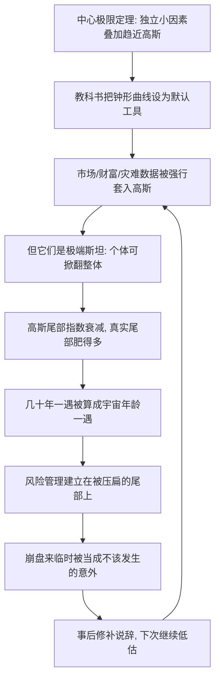

# 05｜钟形曲线的诱惑：为什么高斯分布在现实里处处失效？

> 本文要解决的问题：为什么被教科书当作默认工具的高斯分布（钟形曲线），在塔勒布眼里恰恰是危险的来源？

---

## 一、先说结论

高斯分布没有错，错在把它用在不属于它的世界里。塔勒布认为，钟形曲线只在「平均斯坦」成立——那里个体再极端也撼不动总量，比如身高、体重。而在「极端斯坦」——财富、市场、书销量、灾难损失——极端个体可以直接掀翻整体，分布更接近幂律，尾巴远比钟形曲线肥。拿高斯模型去度量极端斯坦，误差不是随机噪声，而是系统性的单向低估：它会把「几十年一遇」的崩盘算成「宇宙年龄一遇」，让你在自以为安全的模型里裸奔。

## 二、我们先理解一个问题

为什么整个科学界、工程界、金融界都爱死了钟形曲线？

因为它太方便了。一条曲线两个参数——均值和方差——就把一整堆数据收拾干净。中心极限定理还给它撑腰：大量独立的小因素叠加，结果趋近高斯分布。于是考试成绩画成钟形，零件误差画成钟形，智商、身高、血压画成钟形，最后连股票收益也被画成钟形。它不仅是工具，还成了一种审美：偏离均值三个西格玛以上叫「异常」，六个西格玛以上叫「不可能」。

问题来了：世界是独立小因素的温和叠加，还是会被单个大爆炸改写？这个前提不核对，曲线画得再漂亮也白搭。

## 三、作者到底提出了什么观点？

塔勒布的观点分三层。

第一，高斯分布有明确的适用边界：它描述的总体必须由「谁也不重要的个体」组成。在平均斯坦里，样本再加一个极端值，均值只挪一点点——姚明走进房间，平均身高只涨几厘米。这时钟形曲线是合格的近似。

第二，在极端斯坦，高斯假设直接破产。盖茨走进房间，平均财富翻几百倍——单点决定整体，「平均」这个词都失去意义。塔勒布追随曼德博的判断：这类世界的分布是幂律形态，可规模化，不存在「正常大小」这回事。

第三，也是杀伤力最大的：把高斯带进极端斯坦，错误的方向是固定的——永远低估尾部。高斯分布的尾部按指数衰减，十个西格玛之外的偏离在公式里概率趋近于零；而幂律尾部按多项式衰减，极端值虽然罕见却始终有戏。模型越小看尾部，使用者就越敢加杠杆、越敢裸奔——模型风险不在误差的大小里，在误差的方向里。

## 四、把这个观点翻译成人话

用大白话说：**高斯分布是一把只适合量「平均事物」的尺子，我们却拿它去量地震。**

再想一个生活版本。你给一个沿海城市设计防洪堤，手里有两套模型：一套说「这种规模的洪水是百万年一遇」，另一套说「大概几十年就来一次」。按第一套，你把堤坝修得很省；按第二套，你多花几倍预算。高斯分布就是第一套——它把极端值当成统计噪音抹掉，给你一个「风险已经计算清楚」的幻觉。等大水真的来了才发现，错的不是洪水，是尺子。

## 五、为什么会这样？

高斯假设失效的传导链条大致是这样的：

关键机制在尾部的衰减速度。高斯分布里，偏离均值六个西格玛的事件概率是十亿分之一量级——按交易日折算，相当于数百万年一遇。可现实市场里，这种级别的波动几年就来一回。塔勒布认为，这不是「黑天鹅太多」，而是尺子从一开始就量错了世界：你用平均斯坦的算法，给极端斯坦定价。

## 六、举一个现实生活中的例子

先看「六西格玛」。在高斯假设下，日收益率偏离均值六个标准差的概率大约是十亿分之二，折算成交易日相当于数百万年一遇——比股票市场存在以来的全部历史还长几个数量级。然而事实是：在主要市场上，六西格玛、十西格玛级别的单日波动每隔几年就出现，股灾、闪崩、熔断轮番上演。公式说「不可能」，行情说「又来了」。

再看一九八七年十月十九日，黑色星期一。这是历史事实：道琼斯指数单日下跌百分之二十二点六，是二十世纪最惨烈的单日崩盘。一些学者按高斯模型计算过：如果市场收益真的服从正态分布，这一天的跌幅相当于二十个左右西格玛的偏离，其概率小到即使宇宙从大爆炸至今反复生灭无数次，也不该发生一次。公式给出的答案几乎等于零，历史给出的答案是一个真实的交易日。

塔勒布想让你注意的不是「这次崩盘有多惨」，而是事后的反应模式：教科书没有因此淘汰高斯，分析师只是说「这是异常值」——把现实开除出模型，而不是把模型开除出教科书。

## 七、回到书中重新理解

现在再看塔勒布那句尖刻的话，就明白他为什么说钟形曲线是一场「智力骗局」。

他批判的从来不只是一个数学公式，而是公式背后的整个产业：资产定价模型、风险价值法（VaR）、以正态假设打底的诺贝尔级金融理论、六西格玛质量管理——大厦的地基是同一条曲线。如果地基只属于平均斯坦，那么上面所有精确的百分数、置信区间、风险评级，在极端斯坦里都是精确地错。

更要命的是错觉结构：模型给出的数字越精确，人越安心；尾部被压得越小，仓位越敢放大。也就是说，高斯分布不只是低估风险——它亲自参与了风险的制造。这才是「模型风险」的真正含义：最大的风险源，恰恰是那本告诉你「风险可控」的风险手册。

## 八、这个观点背后还有什么？

第一，高斯的诱惑力部分来自数学的懒惰。两个参数概括一切，尾部干净利落地归零，计算上无比顺手。塔勒布暗示：学界爱它未必因为它真，而是因为它好算——可处理性冒充了真实性。

第二，曼德博的替代方案打开的是另一扇门：幂律世界没有「正常规模」，大地震和小地震是同一机制的不同量级，「异常值」这个概念本身被取消——所谓异常，只是你拒绝承认的常态。接受幂律还意味着承认「方差」都可能不存在，传统统计的一堆工具随之失效。塔勒布认为这比高斯诚实：它先把「我们不知道什么」摆在桌面上。

第三，模型与现实的关系被倒转过来审视。通常我们问「数据符不符合模型」，塔勒布逼我们问「模型配不配得上生成数据的那个世界」。判断自己在哪个斯坦，先于选择哪条曲线——这一步走错，后面全是精确的错误。

## 九、这个观点有问题吗？

有说服力的部分很扎实。历史事实是：曼德博早在二十世纪六十年代就用棉花价格数据证明真实分布的肥尾；一九八七、二〇〇八以及历次闪崩的频率，确实与高斯预测的「宇宙年龄一遇」差了无数个数量级。肥尾是经验事实，争议不大。

但边界也在。第一，一些学者认为塔勒布批判的接近稻草人：严肃的金融风险从业者早就知道收益非正态，行业里存在跳扩散、随机波动率、厚尾分布等修正工具——「整个金融业都信高斯」有过度简化之嫌。第二，幂律也不是免死金牌：尾部指数的估计本身极不稳定，用幂律替代高斯可能只是把模型风险换了个型号——关于收益究竟服从什么分布，学界存在不同解释，机制切换、混合分布等方案各有支持者。第三，高斯在其适用域内仍是好工具：质量控制、测量误差这些真正的平均斯坦场景里，钟形曲线工作得很好，塔勒布自己也不否认，但读者容易泛化式弃用、造成误伤。第四，「几十年一遇算成宇宙年龄一遇」的戏剧化表达依赖事后挑选的极端案例；事前你同样无法从幂律里算出崩盘何时来——它拆掉了旧自信，但没有兑现新预测。

更准确的读法是：塔勒布攻击的不是曲线，而是越界使用曲线的制度与心态。

## 十、今天再看这个观点

以下部分是基于作者思想的现代延伸，不是作者原话。

二〇〇八年金融危机像是给这一章做的现场实验：事后披露的风险模型几乎都建立在正态或近似正态假设上。一个有名的细节是，高盛的首席财务官曾感叹市场「连续几天出现二十五个标准差的波动」——在高斯世界里，二十五个西格玛的概率连「宇宙年龄一遇」都不足以形容。这句话本身就是口供：错的显然是模型里的宇宙，不是宇宙。

延伸到更广处，「西格玛语言」今天仍然活跃：媒体每逢股灾、疫情、供应链中断就惊呼「多少年一遇」。塔勒布的逻辑提醒我们：当一个「百万年一遇」年年出现，该更新的不是年份计数器，而是分布假设。机器学习、气候风险、平台经济里大量默认正态的处理方式，都在重复同一个动作——用平均斯坦的尺子，量极端斯坦的世界。

## 十一、这一篇真正应该记住什么？

1. 高斯分布只属于平均斯坦：个体不影响整体的地方，钟形曲线才成立。
2. 在极端斯坦套高斯，错误方向固定——永远低估尾部，几十年一遇被算成宇宙年龄一遇。
3. 一九八七年黑色星期一按高斯概率约等于零，但它真实发生了：该被开除的是模型。
4. 模型风险不在误差大小，在误差方向；精确的错误比模糊的诚实更危险。
5. 选分布之前先选世界：先问自己在哪个斯坦，再决定用哪条曲线。

## 十二、留一个问题

下一次听到「这是多少年一遇的事件」时，不妨追问一句：这个「多少年」是从哪个分布里算出来的？如果那条分布的尾巴天生就压扁了极端值，这个数字本身就是事故的一部分。

不过说到底，分布选错还是个技术问题——换把尺子就能修正。塔勒布认为更深层的麻烦在我们脑子里：就算数据摆在面前，大脑也会自动把它编成因果故事，把随机性熨平成「本来就该如此」。这台停不下来的编故事机器，叫叙述谬误，是下一个要拆的零件。
