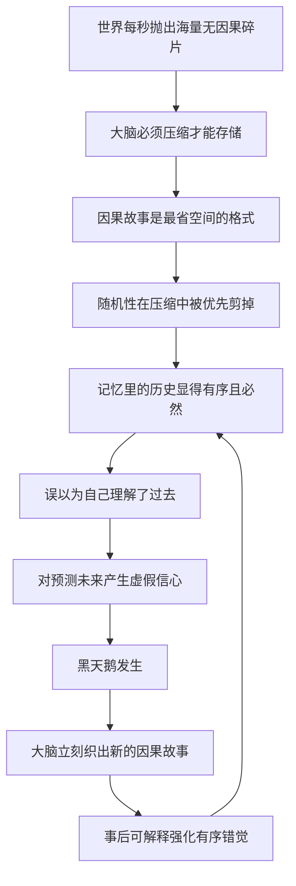

# 06｜叙述谬误：为什么我们总想给随机事件编故事？

> 本文要解决的问题：为什么面对一件已经发生的事，我们的大脑无法忍受「它就是随机发生了」这个解释，必须编出一个因果故事？

---

## 一、先说结论

塔勒布把「叙述谬误」定义为一种我们无法克制的冲动：把看到的事件串成因果链条，让世界显得有序、可理解、可预测。大脑这么干有它的理由——原始信息是洪水，因果故事是最省空间的压缩格式。但代价是致命的：故事越流畅，离随机性越远；叙述把「事后讲得通」包装成「事先看得见」，让我们对过去的理解力虚高，对未来的掌控感虚胖。塔勒布认为，这是我们最大的认知弱点之一——黑天鹅之所以能一再偷袭，一半靠事件本身，一半靠我们事后把它编圆了。

## 二、我们先理解一个问题

先看一个记忆实验的日常版本。给你念一串毫无关联的词：雨伞、发票、大象、刹车、十七。过一天再问，你能记住一半就不错。

现在换成一句话：「下雨天大象急刹车，把十七张发票弄湿了。」信息还是那些信息，但你大概率一个月后还记得。

差别只有一个：第二种版本给了因果和画面。原始事件是散装货物，大脑存不下；打上「因为……所以……」的包装带，才能入库。叙述不是娱乐，是大脑的存储协议。

问题随之而来：压缩必有损耗。被压掉的是什么？绝大多数时候，是随机性。

## 三、作者到底提出了什么观点？

塔勒布所说的叙述谬误，包含三个递进的判断。

第一，叙述是信息压缩的必要手段。世界每秒抛给我们海量碎片，不串成故事就无法存储、无法复述、无法传给下一代。因果链是人类最早的「数据压缩算法」。

第二，压缩的代价由随机性买单。把事件塞进因果链，等于强行删除了「没有理由、就是发生了」这种可能性。于是我们回头看历史，看到的永远是动机、趋势、必然——那个庞大而沉默的「碰巧」，被剪掉了。

第三，故事的可信度和真实度脱钩。一条因果链越流畅、越具体、越有画面感，我们越信它——哪怕它解释的是纯粹的随机结果。塔勒布认为，这就是为什么新闻、传记、分析报告能持续生产却极少预测：它们的产品不是真相，是流畅。

## 四、把这个观点翻译成人话

用大白话说：**我们的大脑是一台停不下来的编故事机器，它宁可要一个错误的解释，也不要没有解释。**

再想一个贴身版本。你某天面试失败，复盘时大脑会立刻给出原因：「因为准备不够」「因为我和这个行业气场不合」。真实原因可能是面试官那天胃痛、另一个候选人是他校友、或者纯粹是抽签的运气。但「随机」这个答案进不了脑子——它不产生教训，不产生安全感，不产生「下次该怎么办」。大脑要的是可操作的因果，不是诚实的混沌。

所以我们对世界的理解，从来不是世界的形状，而是故事的形状。

## 五、为什么会这样？

叙述谬误的生成机制大致是这样的：

还有一层更深的硬件原因。一些学者对裂脑病人的研究发现，大脑左半球里似乎住着一个「解释器」：给右半身下达左脑不知道原因的指令，左脑会当场编出一个毫不迟疑的理由，并且真心相信它。塔勒布引用这类研究想说明：编故事不是我们学会的坏习惯，是出厂配置——因果冲动先于理性存在。

## 六、举一个现实生活中的例子

第一个例子来自每晚的财经新闻。今天股市涨了，主播说「受某某利好消息推动，大盘走高」；明天跌了，同一个利好还在，说法变成「受市场对某某前景的担忧拖累，大盘回落」。塔勒布在书里记载过一个真实版本：萨达姆·侯赛因被捕当天，美国国债价格先涨——媒体的标题是「萨达姆被捕提振风险资产吸引力」；随后价格转跌——标题立刻换成「萨达姆被捕未必能遏制恐怖主义」。同一条新闻，先解释上涨，再解释下跌。市场需要理由，媒体按小时供货；至于理由是否成立，不在服务条款里。

第二个例子在每个家庭里。孩子从三四岁开始连环轰炸「为什么」：为什么天黑了？为什么要睡觉？为什么月亮跟着我走？大人必须给答案——给一个，追问下一个，直到大人词穷，搬出「因为就是这样」。这个停不下来的追问不是孩子气，是因果冲动的裸机状态：我们每个人的大脑从童年就内置了「万事皆有原因」的默认设置，成年后只是编造得更体面而已。

塔勒布想让你看见的是同一个零件：新闻主播和孩子在干同一件事——拒绝接受「事情就这样发生了」。

## 七、回到书中重新理解

现在再看黑天鹅的第三重属性「事后可解释」，就知道它是从哪台机器里生产出来的——正是叙述谬误。

黑天鹅之所以「事前隐形、事后必然」，不是事件变了，而是大脑在事件落地后启动了故事生产线：动机、征兆、必然性，一天之内全部补货。理解了叙述谬误，就理解了一个循环——随机性被剪掉，所以历史显得可预测；历史显得可预测，所以我们不设防；我们不设防，所以下一只黑天鹅落地时，又得靠叙述来安抚。

塔勒布甚至给这个弱点排了座次：在我们所有的认知缺陷里，叙述可能是最深的一个，因为它不是偶尔出错的模块，而是操作系统本身。

## 八、这个观点背后还有什么？

第一，叙述谬误解释了「为什么越详细的故事越危险」。具体性制造可信度：一个包含因果细节的版本，比「概率上就是这样」更能征服听众。塔勒布暗示，在法庭、急诊室、董事会上，最流畅的叙述者常常击败最准确的数据——说服力向故事倾斜，不向真相倾斜。

第二，它给「知识」重新定了价。我们以为自己存的是事实，实际存的是事实的压缩包；而压缩格式本身有偏好——保留因果，删除偶然。这意味着记忆里的历史，比真实的历史更「讲道理」，也更误导。

第三，叙述还有一个隐秘的守门功能：它决定什么信息能进入公共讨论。没有故事形状的事实传不出去，「随机波动」四个字撑不起一条新闻。于是媒体生态天然过滤掉随机性——整个社会看到的样本，是被叙述筛过一遍的样本。

## 九、这个观点有问题吗？

有说服力的部分相当硬。裂脑研究中的「左脑解释器」、记忆心理学里「记主旨不记事实」的大量实验、媒体对同一事实的正反双向解读，都支持「编故事是自动行为」的判断。它统一解释了太多现象：阴谋论的流行、传记的误导性、「事后诸葛亮」的普遍性。

但边界必须划清。第一，关于叙述究竟是缺陷还是能力，学界存在不同解释：一些学者认为因果推断恰恰是人类智能的核心，有认知科学家把讲故事视为人类区别于其他动物的关键适应——塔勒布可能把「必要的认知工具」说成了「缺陷」。第二，因果并不总是虚构：有些事件确实有可验证的原因，「全是随机」和「全是因果」同样是谬误——叙述谬误警告的是过度归因，不是归因本身。第三，可操作性成问题：你不可能关掉叙述模式去生活，「警惕流畅的故事」这条建议正确却难执行——事前拿什么区分「好解释」和「编故事」？塔勒布给的检验多半是事后的。第四，对媒体行业的批判有以偏概全之嫌：优质的财经分析会明确标注不确定性和假说性质，真正该被批判的更像是「归因的商品化」，而不是叙述本身。

所以更准确的读法是：叙述谬误是压缩算法的固有损耗——不能卸载，只能时刻知道自己正在压缩。

## 十、今天再看这个观点

以下部分是基于作者思想的现代延伸，不是作者原话。

今天，叙述谬误不但没有减轻，反而被算法工业化了。信息流按「可读性」排序，最流畅、最有戏剧因果的版本天然胜出——温和的真话传不过精彩的故事。被故事爆炒的股票、热点的反转舆情，本质都是叙述驱动：价格跟着故事走，故事不需要证据，只需要连贯。

生成式 AI 又加了一层：它能把任何随机结果包装成因果清晰、逻辑顺滑的分析报告，成本趋近于零。当「编故事」从人脑本能升级为工业产能，塔勒布警告的那种风险——流畅冒充真实——会被成倍放大。识别叙述谬误，正在从一种认知修养变成一种信息卫生。

## 十一、这一篇真正应该记住什么？

1. 叙述谬误＝大脑给事件强装因果链的冲动，是存储的代价，不是选择的错误。
2. 故事越流畅越可疑：可信度跟着叙述质量走，不跟着真实度走。
3. 「事情就这样发生了」是合法答案——能接受它，就保住了对随机性的知觉。
4. 归因商品化的行业（新闻、咨询、自传）按流畅度供货，不为准确性负责。
5. 叙述关不掉，但可以减速：听到过分顺滑的因果，先问一句「随机的版本长什么样」。

## 十二、留一个问题

下次晚间新闻告诉你「今天因为 X，市场涨了」时，试试这个练习：把同一句因果倒过来——「因为 X，市场跌了」——看看它是不是同样讲得通。如果两个方向都成立，那个「因为」还值多少钱？

再往深处想一步：我们听到的故事，全是活下来的人讲的。上涨有解释，崩盘有解释，成功有自传——可那些跌出局的人、沉下去的公司、没被讲出的版本，都去了哪里？叙述只覆盖了幸存者的声音，失败者的那一半证据是沉默的。塔勒布叫它「沉默的证据」，那是下一个要拆的零件。
