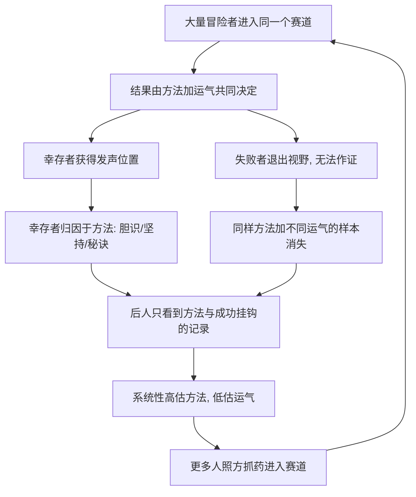

# 07｜沉默的证据：为什么成功学大多在误导你？

> 本文要解决的问题：为什么我们能看见成功者的故事，却永远看不见失败者的？这种「看不见」会怎样系统性地扭曲我们对成功的理解？

---

## 一、先说结论

塔勒布所说的「沉默的证据」，指的是那些无法开口的样本：淹死的人不能作证，倒闭的公司不写自传，失败的创业者不接受访谈。我们看到的世界，是经过「幸存者滤镜」过滤后的残片。基于这种残片去研究成功，结论注定偏斜：成功者说自己靠胆识、靠坚持、靠方法，而墓地里躺满了同样胆识、同样坚持、同样方法的人——他们只是运气不同。塔勒布的判断很直接：绝大部分成功学，本质是对幸存样本的误读，它系统性地高估了方法的作用、低估了运气的作用。

## 二、我们先理解一个问题

假设你想弄明白「怎样才能成功」，你会怎么做？标准答案是：研究成功的人——读传记、听访谈、拆解案例。

现在注意这个动作里藏着的一个采样错误：你采集的全部是「活下来的人」。这就像想研究「如何避免飞机坠毁」，却只去采访平安落地的乘客——他们当然都能告诉你「我系了安全带」，但安全带是不是生还的原因，要问那些没能落地的人，而他们开不了口。

如果失败者也在样本里，结论会变吗？这正是沉默的证据要回答的问题。而它最可怕的地方在于：你不会意识到自己少了数据，因为沉默的东西从来不显眼。

## 三、作者到底提出了什么观点？

塔勒布的观点可以拆成三层。

第一，我们面对的样本天然带着过滤网：历史、新闻、传记、案例库，全部是幸存者留下的记录。失败者不产生文献——不是因为他们的经验没价值，而是因为他们失去了讲述的位置。

第二，过滤造成系统性偏误，而且方向固定：它总是夸大「方法」的贡献。幸存者讲自己做了什么，听者看不到的是成千上万个做了同样的事却消失的人。塔勒布说，墓地里躺满了「做法相同但运气不同」的人——冒险本身不是成功的原因，冒险者池子里总会有几个活下来的。

第三，这个偏误滋养了整个产业：成功学、大师传记、「成功者必备的若干习惯」——全是对幸存样本的正向解读。它们不是完全没用，而是把概率事件读成了因果事件，把彩票中奖的经过写成了购彩指南。

## 四、把这个观点翻译成人话

用大白话说：**成功者写的回忆录，相当于彩票头奖得主写的购彩心得。**

再想一个更扎心的版本。一位企业家在自传里写：「我当年辞去稳定工作，押上全部积蓄，每天工作十六个小时，终于换来今天的公司。」读者热血沸腾。但在同一个城市，有五十个人在同一年做了完全相同的事——辞职、押上积蓄、每天十六小时——然后倒闭了。他们的自传在哪里？没有自传。出版社不出失败者的书，读者也不买。

所以书架上那一排「成功之道」，不是五十一个人里五十一份经验的抽样，而是其中一份经验的五十一次复印。

## 五、为什么会这样？

沉默证据制造偏误的机制大致是：

关键在于：偏误不在推理环节，而在数据上游。拿到一份「只有幸存者」的样本，统计学再严谨也只能得出扭曲的结论——垃圾进，垃圾出。塔勒布强调，这种缺失是结构性的而非偶然的：沉默的证据之所以沉默，是因为它的载体已经不在了，你没办法事后把墓地重新采样一遍。

## 六、举一个现实生活中的例子

第一个例子有两千年历史，是塔勒布在书中借西塞罗之口讲的。这是历史事实：无神论者迪亚戈拉斯被人带到神庙里，看那些还愿的画——画的都是海上遇险时向神祈祷、最后获救的人。意思很明白：祈祷灵验。迪亚戈拉斯问了一句载入史册的话：那些祈祷之后还是淹死的人，他们的画挂在哪里？淹死的人无法作画，无法作证。墙上的每一幅画都是「祈祷然后获救」的证据，而「祈祷然后淹死」的证据全部沉在海底——沉默，但数量可能多得多。

第二个例子在书店的成功学货架上。成功企业家的自传有一整套标准叙事：辍学或辞职、孤注一掷、被人嘲笑、坚持到底。这套叙事的问题不在于假，而在于不可分辨——失败的同行拿的是同一个剧本：同样辞职，同样孤注一掷，同样被嘲笑，同样坚持到底，只是结局没人书写。塔勒布所说的「墓地」就在这里：你若只读幸存者的版本，会以为剧本决定结局；把墓地算上，才知道剧本人人有份，结局归运气抽签。

第三个例子是《哈利·波特》。这是历史事实：罗琳的手稿被十二家出版社拒绝之后，才由布鲁姆斯伯里出版社接手——据说推动出版的还是编辑家的孩子读了喜欢。后人复盘这个故事，得到的教训永远是「是金子总会发光」「坚持就是胜利」。但请注意那十二次拒绝意味着什么：同一部手稿，差一点点就永远躺在抽屉里，成为沉默证据的一部分。我们今天能喝到「坚持」的鸡汤，恰恰是因为她熬过了第十三扇门——而同样好、却没能熬过第十三扇门的手稿有多少？没人知道，它们不开口。

## 七、回到书中重新理解

现在回头看，沉默的证据其实是叙述谬误的上游兄弟：叙述谬误负责把已有的材料编成因果，沉默证据负责让材料先天残缺——一半证据根本进不了生产线。

它也解释了为什么塔勒布对「读传记学成功」「研究伟大公司找基因」这类工程如此警惕。那些研究的方法论听上去无懈可击：选一批最成功的企业，提取共同特质。但只要样本是事后按「活下来的」筛选的，提取出的特质——敢冒险、敢下注、敢与众不同——很可能只是「冒险者的共同特质」，而其中绝大多数人，正在墓地里分享同样的特质。

塔勒布真正想换掉的是我们的度量衡：衡量一个方法，不能只看它产出了多少赢家，还要看有多少人用了它然后消失了。分子人人看得见，分母躺在墓地里——沉默的证据，沉默的是分母。

## 八、这个观点背后还有什么？

第一，运气和技能的分解难题。在出版、创业、投资这类极端斯坦领域，结果的运气占比极大；而沉默证据恰好遮住的就是运气的份额——我们永远看不到「条件相同、运气不同」的对照组。一些学者研究「运气—技能连续谱」，认为不同领域运气权重不同，但普遍承认：在赢家通吃的领域，运气常被严重低估。

第二，一个学界经典案例把这个逻辑演示得最干净。这是历史事实：二战期间，统计学家沃德受命分析返航轰炸机上的弹孔分布，以决定装甲该加在哪里。弹孔密集在机翼和机尾，直觉是加固这些部位；沃德说恰恰相反——该加固的是没有弹孔的引擎和座舱，因为被击中那些部位的飞机没能返航。看得见的弹孔是幸存者的自述，看不见的弹孔才是沉默的证据。

第三，沉默证据重新定义了「证据」本身。我们通常以为证据是「呈现在面前的东西」；塔勒布提醒，缺席本身也是证据——关键不是「我们看到了什么」，而是「这个样本是怎么被筛出来的」。

## 九、这个观点有问题吗？

有说服力的部分证据确凿。幸存者偏差在实证研究里反复被验证：剔除清盘基金的收益数据库会系统性高估行业回报；沃德的飞机案例成为统计学教材的标准一页；西塞罗的故事两千年后仍被引用，说明这种偏误古老且顽固。

但边界同样要划清。第一，一些学者认为塔勒布有把「运气被低估」推向「几乎全是运气」的嫌疑：连续创业成功者、长期业绩稳健者的存在，提示技能并非幻觉——关于运气与技能各占多少，学界存在不同解释，运气—技能连续谱的研究本身就反对「一刀切」。第二，不是所有成功研究都犯这个错：规范的案例研究会设失败者对照组，好的商业史会解剖尸体；塔勒布批判的更像大众成功学，而非全部经验研究。第三，「把失败者加回样本」在方法上极难：死者不开口，倒闭公司的数据散失，「采样墓场」是一个方向正确但成本高昂的指令。第四，建议层面偏弱：知道「运气比想象中大」之后，行动上该怎么办？接受运气并不直接导出策略，读者容易把诊断当成处方。

更准确的读法是：沉默证据揭露的是样本的构造缺陷——它不能告诉你成功者做对了什么，但能告诉你「照做就能成」这句话为什么先天可疑。

## 十、今天再看这个观点

以下部分是基于作者思想的现代延伸，不是作者原话。

社交媒体的算法推荐，可能是历史上最大的沉默证据发生器。「辞职做自媒体年入百万」「三十岁前财务自由」的帖子获得流量，而同样辞职、同样日更、同样押上积蓄却一无所成的人，不会出现在你的时间线上——算法的筛选比出版社残酷得多，它连失败者的存在都不显示。

延伸到职场与投资也一样：大厂晋升神话、明星基金业绩、创业成功故事，都是幸存样本的高光剪辑。塔勒布的框架提醒我们，看到任何「成功方法论」时先做一道算术：分母在哪里？有多少人照着做了然后沉没？那个数字通常查不到——而「查不到」本身，就是沉默证据存在的证明。

## 十一、这一篇真正应该记住什么？

1. 沉默的证据：失败者不开口，可见样本天生缺一半，且缺的正是对照组。
2. 幸存者叙事不可分辨——成功者的方法，墓地里人人都有；差别常常只在运气。
3. 评价方法看分母：不看它产出了几个赢家，看多少人用它然后消失。
4. 缺席也是证据：弹孔不在的地方才致命，样本被筛的方式比样本本身更重要。
5. 成功学的正确用法：当故事听可以，当指南用不行——它是概率，不是因果。

## 十二、留一个问题

下一次读到任何「成功者的七个习惯」式清单时，做一个思想实验：把同样的清单套在一千个失败者身上，它是不是同样吻合？如果是，这份清单解释的到底是成功，还是只是「参与这场游戏的方式」？

沉默的证据教会我们一件事：「没看到」不等于「不存在」——没看到淹死者的画，不代表祈祷有效；没看到失败者，不代表方法可靠。这个逻辑再往前推一步，就撞上一个更根本的不对称：看到一万次确认，也抵不过一次反例；证实与证伪之间有一道深刻的裂缝。塔勒布叫它「证实谬误」，那是下一个要拆的零件。
