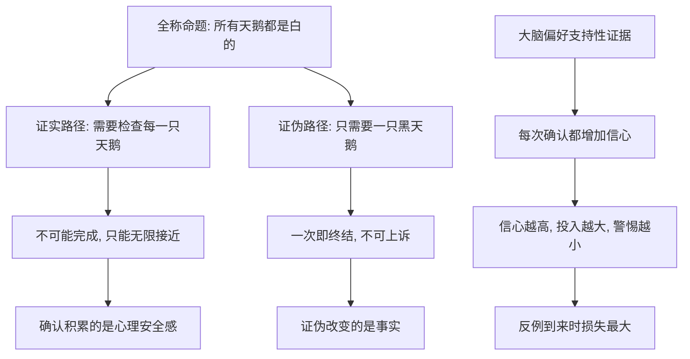

# 08｜证实谬误：为什么一万只白天鹅证明不了没有黑天鹅？

> 本文要解决的问题：为什么无论积累多少次「确认」，都挡不住一次反例——塔勒布所说的「证实谬误」到底是怎么回事？

---

## 一、先说结论

证实和证伪是不对称的：一万次确认只能增加信心，一次反例就能推翻全部。塔勒布认为，负面经验携带的信息量远大于正面经验——知道「什么是错的」比知道「什么是对的」可靠得多。我们的本能却恰好相反：不断收集「又确认了一次」的证据，把心理上的安全感误当成事实上的安全。证实谬误就是这台错觉机器的名字。

## 二、我们先理解一个问题

假设你想证明一个命题：「所有天鹅都是白色的」。

你开始观察。第一天，一只白天鹅；第一百天，还是白天鹅；第一万天，依然是白天鹅。每多观察一天，你的信心就涨一点。一万天之后，你几乎确信无疑了。

但请注意逻辑上发生了什么：你没有「证明」任何东西，你只是「还没有被推翻」。这两件事天差地别。要真正证明「所有天鹅都是白的」，你需要检查宇宙里过去、现在、未来的每一只天鹅——这是不可能完成的工程。而要推翻它，只需要一只黑天鹅。

然后那只黑天鹅出现了。一万天的积累，一秒钟归零。

这就是不对称的全部含义：证实是一场永远没有终点的马拉松，证伪是一记终点线的枪响。

## 三、作者到底提出了什么观点？

塔勒布把这种倾向称为「证实谬误」：我们热衷于寻找支持既有信念的证据，并把「没找到反例」直接换算成「没有反例」。

他在这里借用了哲学家卡尔·波普尔的框架。塔勒布认为，知识的增长靠的不是证实，而是证伪——一个命题被确认一千次，它的地位并没有比被确认一次时高多少；但它被推翻只需要一次。所以他会反复强调一个区分：「没有证据表明它存在」不等于「有证据表明它不存在」。前者只是空白，后者才是内容。我们每天把前者当后者用，于是安全感被系统性高估。

更微妙的是心理层面：确认性的证据让大脑舒适，因为它给已有的故事添砖加瓦；否定性的证据让大脑不适，所以我们本能地回避它、压低它、不主动去找它。塔勒布认为这不是懒，是认知结构的出厂设置。

## 四、把这个观点翻译成人话

用一句大白话说：「一直没出事」不等于「不会出事」，它只证明「出事的那一天还没来」。

一万次「没问题」买到的是安心，不是安全——安心是心理产品，安全是物理事实，两者的价格完全不同。而一次「出事了」是终审判决，不接受上诉。

放到生活里更好懂。一个插座用了十年没起火，证明不了它不会起火，只证明了过去十年它没起火。一个朋友十年都守信，证明不了他明天守信——这不是悲观，是逻辑上的老实：你手里的证据全是「尚未出事」，而你对它做的解读却是「不会出事」。

## 五、为什么会这样？

为什么这种不对称存在，又为什么我们总是看不见它？塔勒布的推理大致分两层：逻辑层和心理层。

逻辑层上，「所有」「从不」这类全称命题天然无法被有限观察证实——你永远查不完样本，但可以一次被推翻。这是冷酷的形式事实，跟聪明不聪明无关。

心理层上，还有一个成本不对称：收集确认便宜且愉悦——每找到一只白天鹅都是一次小小的自我奖励；而寻找反例昂贵且痛苦——你得主动设计「什么情况下我错了」的实验，等于花钱请人来推翻自己。于是整个认知经济都向证实倾斜：证实有即时回报，证伪只有延迟的、不愉快的回报。

最危险的是反馈链条：确认越多，信心越高，仓位越重，警惕越低——这意味着反例到来的那一刻，恰好是你暴露最大、最输不起的时刻。火鸡在被杀的前一天，对它处境的信心恰好处在一生中的最高点。

## 六、举一个现实生活中的例子

先看波普尔的证伪主义，这是塔勒布借用的思想地基。历史上的事实是：牛顿力学被两百多年的观测反复「证实」，精度足以送人上天——但一九一九年爱丁顿在日食观测中测到星光偏折与广义相对论吻合、与牛顿预言不符，牛顿体系的绝对地位就此终结。波普尔从中提炼出的主张是：科学理论永远无法被证实为真，只能暂时「未被证伪」；而一个理论之所以是科学的，恰恰因为它清楚声明了什么观察会杀死它。不可被推翻的理论不是更可靠，是根本没在冒险。

再看药品史上的罗非昔布事件。历史事实是：默克公司的止痛药罗非昔布（商品名万络）一九九九年获批上市，此后数年在全球广泛使用，数千万患者服用，「安全记录」一天天累积确认。二〇〇四年，一项长期研究的数据显示服用者心血管风险显著上升，默克当年宣布全球撤市。多年累积的「安全确认」，没能抵挡住那一组证伪数据——一次负面证据，终结了全部正面记录。这正是白天鹅与黑天鹅的逻辑在医药领域的重演。

最后一个例子没有数据，只有常识：信任。一个人需要几百次守信建立声誉，但一次背叛就能把它清零。没有人会说「他骗了我一次，但他之前诚实过一千次，所以统计上他仍然可信」——在信任这件事上，人人都懂证伪不对称；奇怪的是换到理论、药品、市场上，我们就忘了同一条逻辑。

## 七、回到书中重新理解

现在再看塔勒布为什么把证实谬误放在认知骗局的核心位置，就清楚了：它是黑天鹅问题的知识论根源。

黑天鹅之所以反复得手，正因为我们的证据收集系统天生偏向确认。每一天的平静都是对「一切正常」的一次确认，信心随之上涨；而那只黑天鹅在统计表上从未出现，于是被默认为不存在。「没有证据表明它存在」被默默改写成了「有证据表明它不存在」——改写完成的瞬间，陷阱就布好了。

所以塔勒布给出的知识姿势是反过来的：别数你的信念被确认了多少次，去问什么观察会杀死它。一个不知道自己怎么才会错的人，不是知道得多，是还没开始接受检验。

## 八、这个观点背后还有什么？

证实谬误背后还藏着三层东西。

第一，它重新定义了什么叫「可靠的知识」。塔勒布暗示：否定性知识比肯定性知识扎实。知道某种做法会致命，比知道某种做法「有效」可靠得多——因为前者经受过证伪的终审，后者只是还没等到它的黑天鹅。这也是为什么他后来会把「规避错误」置于「追求正确」之上。

第二，它暴露了「经验」这个字的歧义。经验主义者常以为经验越多越安全，塔勒布指出恰恰相反：经验越多，被单次证伪摧毁的总量越大。安全不来自经验的厚度，来自你对经验失效条件的清醒程度。

第三，它对「科学精神」给出了一个反直觉的定义：科学的尊严不在于积累了多少确认，而在于敢把最珍贵的理论摆在最容易被杀死的位置。一个学说主动交代「若出现某现象请判我死刑」，比一万次「又一次被验证」更有分量。

## 九、这个观点有问题吗？

有说服力的地方很硬：全称命题不可被有限证实、可被单次证伪，这在逻辑上无法反驳。波普尔框架也确实改写了科学哲学，「可证伪性」至今是区分科学与非科学最常用的标尺之一。罗非昔布式的案例——长期确认后一次性证伪——在药品、金融、工程史上反复重演。

但边界同样存在。第一，关于归纳是否真的一无是处，学界存在不同解释：一些学者认为贝叶斯式的更新已经回答了这个问题——每次确认确实在概率上提高了命题的可信度，只是永远到不了百分之百；塔勒布说「只增加信心」并没有否认这点，争议在于他把这份增量的实际价值压得过低。第二，这里有明显的过度简化处：现实中的命题大多不是「所有天鹅」式的全称命题，而是概率性的——「这种药让心血管风险上升百分之多少」不能被一只黑天鹅干净利落地证伪，只能靠证据逐渐累积出天平倾斜；证伪逻辑对这类命题并不直接适用。第三，其他解释同样成立：工具主义者干脆认为科学理论无所谓真假、只看好不好用，在这个框架里「证实还是证伪」根本是个假问题。第四，实践代价是真实的：如果真的只认反例、不认累积，流行病学、气候变化研究几乎无法运转——这些领域恰恰只能靠正面证据的缓慢堆积工作。

所以更准确的读法是：证伪不对称描述的是「终审判决」的逻辑，不是「日常审案」的流程。它告诉你什么样的证据能一锤定音，却不告诉你平日该如何一点点积累判断。

## 十、今天再看这个观点

以下部分是基于作者思想的现代延伸，不是作者原话。

放到今天，证实谬误有了新的基础设施。大数据让「确认」变得空前廉价：数据足够多的时候，你几乎能为任何结论找到支持它的相关性——「有数据支持」这句话因此大幅贬值。相应地，「什么样的数据会推翻它」成了更稀缺、更贵的问法。

推荐算法是另一个放大器。信息流只喂给你与既有观点一致的内容，等于把「寻找确认」外包给了机器：你不再需要主动找白天鹅，算法每天准时送货上门。信息茧房本质上就是工业化的证实谬误。

还有一层现代含义：人工智能时代，「长期稳定运行」的系统越来越多——自动驾驶、量化模型、内容审核——它们积累的每一小时「没出事」都是一次确认，而证伪它们的，可能是一次谁都没想到的极端场景。系统越稳定，越容易让人忘记证伪永远只需要一次。

## 十一、这一篇真正应该记住什么？

1. 证实与证伪不对称：一万次确认只能加温信心，一次反例可以终结命题。
2. 「一直没出事」只证明「还没出事」，不证明「不会出事」——前者是证据，后者是愿望。
3. 负面知识比正面知识可靠：知道什么会推翻你的理论，比知道什么支持它更重要。
4. 「没有证据表明存在」不等于「有证据表明不存在」——空白不是内容。
5. 问「什么观察会证明我错了」，比「再找一个支持我的证据」信息量大得多。

## 十二、留一个问题

下一次你想说「这事从来没出过问题」的时候，不妨换个问法：如果它明天出问题，会是以什么方式？——能答上来，说明你真的理解它；答不上来，说明你的信心只是确认次数的利息。

而证实谬误还不是唯一的陷阱。它骗的是你对「证据」的用法；还有一类更隐蔽的错误，骗的是证据之外的东西——连「概率」本身都是从一个有规则的游戏里借来的模型。赌场里的骰子可以算，真实世界连规则都会变。下一篇，我们看塔勒布所说的「游戏谬误」。
