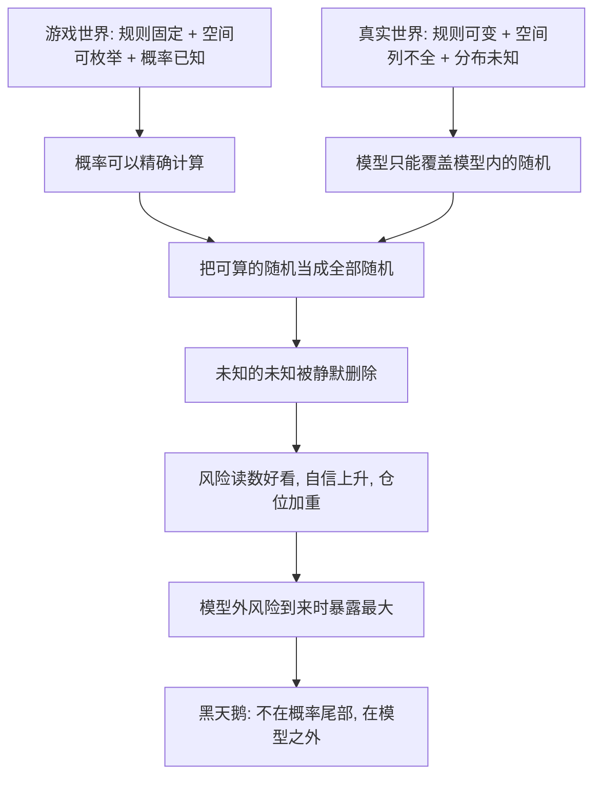

# 09｜游戏谬误：为什么赌场概率模型会害了真实世界？

> 本文要解决的问题：为什么在赌场里精确管用的概率方法，搬到真实世界反而成了风险的来源？

---

## 一、先说结论

赌场和游戏是被驯化的随机性：规则写死、结果空间可枚举、概率已知。真实世界是野生的随机性：结果列不全、分布不知道、规则中途会变。塔勒布把「用前者算后者」的错误称为游戏谬误——把可计算的随机冒充全部随机。真正的黑天鹅不住在模型的概率尾部，住在模型之外：你以为自己在算风险，其实只是在算「模型允许存在的那部分风险」。

## 二、我们先理解一个问题

抛一枚公平的硬币，正面概率百分之五十。这个百分之五十背后有一整套前提：硬币是公平的、只有正反两面、每次抛掷独立、规则不变。

现在假设连续抛出九十九次正面。问：第一百次正面的概率是多少？

教科书答案：仍是百分之五十——硬币没有记忆，每次抛掷独立。常识答案：不对，这硬币八成有问题，正面概率远不止一半。

受过概率训练的人选第一个，街头老手选第二个。塔勒布的问题来了：真实世界更像哪一边？如果你手里的世界是一枚会被人动手脚的硬币，那么「硬币无记忆」这套算术越精确，你死得越明白。

## 三、作者到底提出了什么观点？

塔勒布认为，人类学到的概率知识几乎全部来自「游戏」——骰子、扑克、轮盘、教科书里的摸球实验。这类随机性有三个特征：可能结果可以全部列举（样本空间可枚举）、每个结果的概率事先已知、规则不会中途改变。

真实世界的随机性三个特征全都不具备。你列不全所有可能的坏事，不知道各种坏事的真实概率，更没法保证游戏规则明天不改。塔勒布认为，把游戏世界的方法原样搬进现实世界——这就是游戏谬误，他用拉丁语词根称之为「卢迪谬误」。

它的杀伤力在于一次偷换：真实世界里有「已知的未知」（能列出、能估概率的风险）和「未知的未知」（连列都列不出的风险）。游戏模型只能处理前者，但用的人会把算出来的结果当成风险的全部——未知的未知被悄悄删除，删除痕迹不留。

## 四、把这个观点翻译成人话

用一句大白话说：骰子算得准，是因为骰子不会改规则；生活算不准，是因为生活会。

你能在赌场里算出「连开十次大」的概率，算不出「赌场明天换老板改规则」的概率——而后者才是真正的风险。模型里那个漂亮的数字，回答的是「在这个假设永远成立的世界里风险多大」；可惜我们不住在假设里。

再换一个说法：地图上海洋的面积是确定的，所以航海图好用；现实这片海连边界都会移动，而你还按固定地图开船——游戏谬误就是把会动的海当成了画死的海。

## 五、为什么会这样？

为什么游戏模型会系统性地漏掉真实风险？塔勒布的推理可以拆成四步。

第一层是枚举问题：赌场里坏结果屈指可数，现实里坏结果无法穷尽——你想不出清单，不代表清单很短。

第二层是分布问题：游戏里概率是印好的，现实里连概率分布长什么样都不知道。经济学家弗兰克·奈特早就区分过「风险」（可量化的不确定）与「不确定性」（不可量化的不确定）——历史事实上这是经济学界的经典区分，塔勒布借用它说明：模型只能消化前者，而生活里后者的分量更重。

第三层是规则问题：骰子不会中途改点数，但市场会改结构——监管转向、流动性消失、交易对手违约，每一次都是「游戏本身变了」。

第四层最要命，是激励问题：模型给出的数字越精确，使用者越自信；越自信，下注越大；于是模型之外的风险降临时，恰好撞上暴露最大的仓位。精确没有减少风险，它只是把风险挤出了视野。

## 六、举一个现实生活中的例子

塔勒布在书里写过一个流传很广的段子，两个人物：Fat Tony，一个没受过正规训练、靠街头直觉吃饭的布鲁克林人；Dr. John，一个一丝不苟、模型至上的精算式博士。

问题还是那个：假设硬币是公平的，连抛九十九次都是正面，第一百次正面的概率多大？

Dr. John 想都不想：百分之五十。题目说了硬币公平，每次抛掷独立，前九十九次不影响下一次——教科书答案，无可指摘。

Fat Tony 的回答大意是：不超过百分之一。他的推理完全在另一个层面——一个「公平」的硬币连续九十九次正面，那么「硬币公平」这个前提本身几乎肯定是假的，硬币一定被动了手脚。所以他赌的不是下一次抛掷，而是整个游戏有问题。

博士在模型内算概率，Tony 在怀疑模型本身。塔勒布认为，银行的风险官、学院的教授、用模型管理世界的人，绝大多数是 Dr. John——模型说一切正常，他们就相信一切正常，而现实里真正致命的问题从来不是「下一次的概率」，而是「这游戏还是原来那个游戏吗」。

再对照轮盘赌就看得更清楚。轮盘的输赢空间是完全可枚举的：欧式三十七格、美式三十八格，每格概率精确，规则印在桌上。这是随机性被驯化到极致的形态——它对赌场是良性的（稳赚），对赌徒是慢性的（稳定地输）。而真实金融世界连格子数都不知道：没人给你那张写满结果的表，格子本身还在漂移。拿轮盘的模型进这种世界，等于拿着一张画满格子的地图，走进一片没有格子的疆域。

## 七、回到书中重新理解

现在再看塔勒布为什么把游戏谬误单独列为一章，分量就出来了：它是所有认知骗局里唯一穿着数学外衣的。

叙述谬误骗的是你的故事，沉默证据骗的是你的样本，证实谬误骗的是你的证据用法——而游戏谬误骗的是你的算术。前面几种骗局你多少能觉察，游戏谬误有公式背书，看起来最科学，所以最难防。

它也回答了前一篇留下的问题：证伪不对称告诉我们「确认再多也会一次归零」，游戏谬误告诉我们「连那个概率都是借来的」——你不仅高估了证据，还低估了「衡量证据的尺子本身可能是错的」。黑天鹅不住在你算出来的百分之一尾部，住在「你为什么要用这个分布」的问号里。

## 八、这个观点背后还有什么？

游戏谬误背后还有三层东西。

第一，它是对「量化安全」的质疑。风险价值模型这类工具把不确定性降维成风险，给你一个干净的数字；塔勒布暗示，数字越干净，被删掉的未知越多——精确定量有时候是安慰剂的高级形态。

第二，它指出一个教育副作用：我们的概率训练全程在可枚举空间里进行——考试里的硬币、摸球、掷骰子。于是练出来的人带着可枚举的直觉走进不可枚举的世界，越用功的学生错得越自信。工具决定了你看世界的形状：拿着骰子模型的人，看什么都像骰子。

第三，它埋着一个反直觉的推论：游戏谬误的重灾区恰恰是专业人士。外行不会犯这个错——他根本没有模型可套。模型越多、越精、越贵的人，越容易把模型当现实，这是塔勒布对「专家」开火的技术理由之一。

## 九、这个观点有问题吗？

有说服力的地方有历史撑腰。一九九八年长期资本管理公司的崩盘是教科书案例：两位诺奖得主坐镇，模型精密到小数点后多位，但模型里没有「俄罗斯违约之后所有相关性一起变形」这个格子——历史事实是，这家公司最终在美联储协调下被救助收场。模型内的概率算得再准，也没算出规则会变。

但边界同样存在。第一，一些学者认为塔勒布把「模型内」与「模型外」的边界画得太硬：贝叶斯方法、模型平均、情景分析、压力测试，都在尝试把「模型本身不确定」这件事纳入框架——模型外并非绝对的真空地带。第二，这里有过度简化处：Fat Tony 式的怀疑也不是免费的。对一切模型保持怀疑听起来聪明，执行起来可能瘫痪决策；街头智慧自己的误判率同样很高，只是没人替它记账——幸存者偏差换个方向照样存在。第三，其他解释同样在场：关于风险与不确定性的区分，学界存在不同处理——有学派认为实践中一切不确定性最终都得折算成主观概率才能进入决策，奈特式边界无法维持，「规则不确定」只是概率估计得不够勤快。第四，拒绝模型的代价是真的：保险定价、桥梁设计、疫苗试验全靠模型运转，没有模型的世界不是更安全，是根本无法组织。

所以更准确的读法是：游戏谬误批判的不是用模型，是用模型定义现实的次序颠倒——模型应该服务判断，不该取代判断。问题不在骰子算术本身，在于拿它走出赌场之后忘了换工具。

## 十、今天再看这个观点

以下部分是基于作者思想的现代延伸，不是作者原话。

放到今天，游戏谬误的地盘不是在缩小，是在扩大。量化基金、算法交易、人工智能风控，把越来越多决策塞进「模型内随机」的容器；而模型外的风险并未相应变小——监管政策转向、流动性瞬间蒸发、不同算法之间的共振踩踏，恰恰都是「规则层面」的事件，不在任何模型的格子里。

信用评分是日常版游戏谬误：把一个会变、会挣扎、会突然遭遇黑天鹅的人，压缩成一个可枚举空间里的分数，然后按分数放贷、招聘、筛选。分数越普及，「人比分数大」这件事越容易被忘记。

疫情期间各类预测模型的集体失灵也是同构案例：模型内的参数可以拟合历史数据，但「人类行为会改变传播规则」这件事本身在模型外——规则一变，再精密的曲线都成了昨天的地图。

## 十一、这一篇真正应该记住什么？

1. 游戏世界：规则固定、空间可枚举、概率已知；真实世界：三样全无。
2. 模型只覆盖「模型内的随机」，黑天鹅住在模型之外，不住在概率尾部。
3. 连出九十九次正面之后，该怀疑的不是下一次的概率，是硬币——是模型本身。
4. 风险可以计算，不确定性不可以；把后者当前者处理，就是游戏谬误。
5. 模型该被使用，不该被相信——这个次序反了，数字越精确死得越整齐。

## 十二、留一个问题

想一想你工作里的那些「概率」：项目延期的概率、客户流失的概率、系统故障的概率——其中有多少是算出来的，又有多少其实是「我们希望它是百分之几」？这些数字背后的规则，是印好的，还是会变的？

而游戏谬误之下还埋着一层更深的问题。模型错了可以换模型，但「换一个模型」这个决定本身也由我们的判断做出——如果判断这台机器本身就高估了自己的成色呢？比模型错误更根本的，是我们对「自己知道多少」的系统性高估。塔勒布叫它认识论傲慢。下一篇，我们看它怎样让专家比外行错得更自信。
