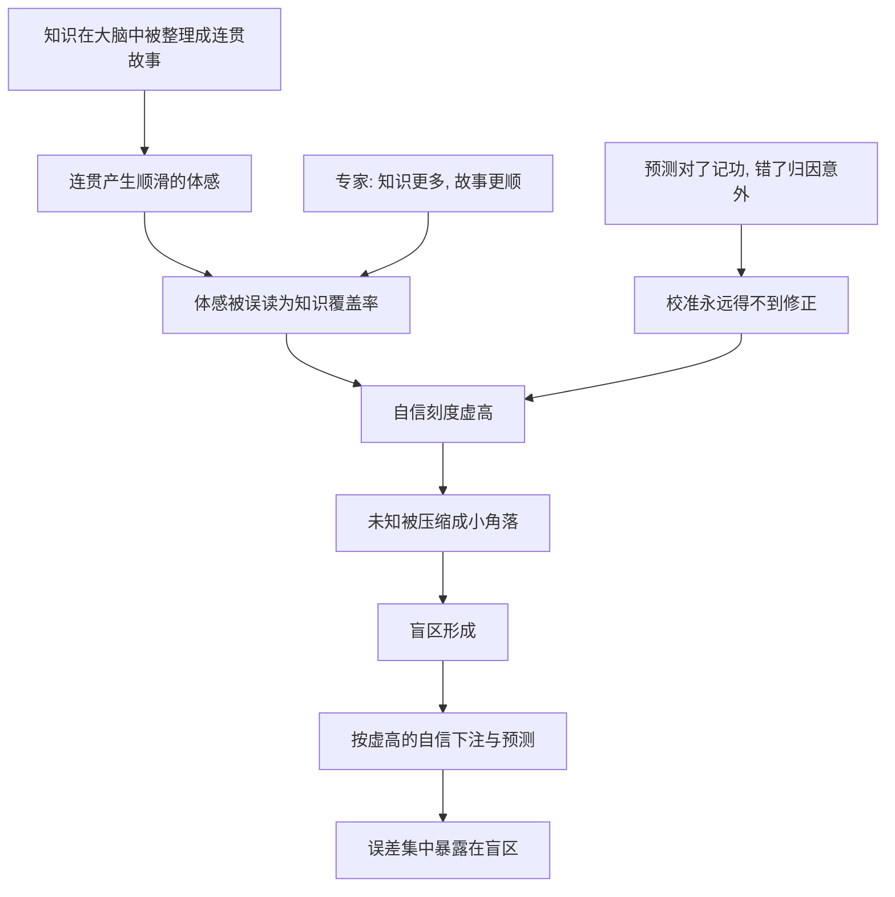

# 10｜认识论傲慢：为什么我们总高估自己知道的？

> 本文要解决的问题：为什么我们对「自己知道多少」的评估系统性地偏高——而且越专业，偏得越厉害？

---

## 一、先说结论

塔勒布把我们「高估所知、低估未知」的倾向称为认识论傲慢：我们以为自己知道的多于实际知道的，以为自己能把握的多于实际能把握的。悖论在于，这种偏差随知识增长——专家掌握着本领域的大量事实，于是更容易把「已知的那一块」外推成「全局尽在掌握」，盲区反而更大。认识论傲慢不是少数人的性格缺陷，是人类认知的默认设置，也是整个预测产业的地基。

## 二、我们先理解一个问题

先做一个思想实验。请你估一个数字——比如某支股票一年后的价格——并且给出「百分之九十八置信区间」：一个有百分之九十八把握能套住真值的上下限。

统计上，如果你校准良好，真值应该只有百分之二落在区间之外。塔勒布引用的心理学实验（哈佛研究者阿尔珀特与雷法上世纪六十年代末开始的研究）得到的结果是：实际落在区间外的比例常常高达百分之十五到三十——是应有水平的十倍上下。而且误差方向惊人地一致：区间画得太窄。

这说明什么？我们不是不知道自己不确定，而是严重低估自己有多不确定。每个人画的区间都比该画的窄得多——心里那个「我大概有数」的刻度，从一开始就是虚标的。

## 三、作者到底提出了什么观点？

塔勒布认为，认识论傲慢有三层结构。

第一层是校准失灵：人类对自己知识准确度的评估系统性偏乐观，置信区间永远偏窄，把握永远偏高。这不是个别失误，是普遍倾向。

第二层是傲慢随知识增长：知道的越多，越容易陷入「我知道」的错觉。外行清楚自己不懂，专家的麻烦在于——他懂的那部分是真的，于是由这部分真的知识生成的自信，被他误当成了对全局的把握。知识照亮了房间的一角，而他把照亮的地方当成了整个房间。

第三层是结构性而非道德性：塔勒布不认为傲慢是虚荣或愚蠢的产物，它是认知机器的运行方式——大脑用已经整理好的知识生成自信，自信这个读数和「知识覆盖率」根本不挂钩。所以它无法靠「谦虚一点」修好，只能靠认清机制来防范。

## 四、把这个观点翻译成人话

用一句大白话说：我们以为「不知道」是房间里的一个小角落，其实它是房间的大部分——而且灯越亮，我们越容易忘记没照亮的地方有多大。

知识带来一个隐蔽的副作用：已知的东西在大脑里被整理成连贯、顺滑的故事，故事的顺滑被误读成世界的简单。你对自己的专业越熟，讲起来越顺，那种顺滑的体感就越像「我全明白」——可顺滑是叙述的属性，不是现实的属性。

所以认识论傲慢最诚实的翻译是：我们的自信刻度出厂就是虚高的，而且读数随着知识量的增加继续虚高。问题不是知道得少，是不知道自己知道得少。

## 五、为什么会这样？

为什么高估所知是系统性而非偶然的？塔勒布的推理可以这样展开。

第一，自信的原料是连贯性而不是完备性。知识一旦被组织成故事，故事的完整性就顶替了证据的完整性——讲得通的东西被当成讲得全的东西。

第二，已知与未知的关系不是此消彼长。知识是存量，未知是边界外的海洋；存量翻倍不会让海洋减半——你新学到的每一块知识，都会带出新的「不知道自己不知道」。

第三，反馈机制缺席。预测对了记为眼光，预测错了归因意外——校准这台仪器永远收不到「你偏了」的信号，于是虚高的刻度十年如一日。

第四，职业激励加码。专家的岗位要求他语气坚定，说「我不知道」没有回报，说「我判断」才有职位、稿费和咨询费。制度奖励自信的姿态，不奖励诚实的刻度——傲慢因此还被职场筛选机制放大。

## 六、举一个现实生活中的例子

第一个例子是塔勒布反复敲打的一个观念：地图不等于疆域。这个提法出自哲学家科日布斯基，塔勒布借用它批评把模型当现实的倾向。地图为了可用，必须删掉疆域的绝大部分细节——删繁就简是它的功能，不是它的失误。但使用者的失误在于忘记删改发生过：拿着地铁线路图的人，很容易以为城市就是几条线和若干站点。金融模型、资产负债表、教科书理论全是地图；我们按地图行军，踩进地图没画的坑，然后奇怪地图上为什么没有坑。

第二个例子是预测误差与时间的关系。塔勒布认为，预测误差随预测时长急剧放大：预测第一年，误差还大体可控；预测第五年、第十年，误差可能数倍于第一年——因为变量会相互作用，误差会复利式累积。但诡异的地方在于，预测报告的自信语气不随时长打折：谈十年后的专家和谈下个季度的专家，用的是同样坚定的措辞。误差在爆炸，自信纹丝不动——这个剪刀差就是认识论傲慢的标准像。

第三个例子最扎心，因为它无处可逃：我们连自己的偏好都预测不准。今晚你决定明天午饭吃什么，明天那一刻你的胃口可能就变了；五年前你规划的人生路径，今天回头看多少还作数？塔勒布的意思是，一个连明天的自己想吃什么都拿不准的生物，却相信自己能预测市场走向和历史进程——这不是能力问题，是我们对自身能力的评估从根上就虚高了。

## 七、回到书中重新理解

现在再看塔勒布的篇章布局，认识论傲慢的位置就清楚了：它是「预测破产」部分的总开关。

前面拆解过的每一个认知骗局，最后都汇入这里。叙述谬误让已知显得连贯——连贯喂养自信；沉默证据让方法显得灵验——灵验喂养自信；证实谬误让信念显得被反复确认——确认喂养自信；游戏谬误让随机显得可算——可算喂养自信。四根管道输送的都是同一种燃料：「我知道」的体感。

所以认识论傲慢既是结果也是起因：它是前面所有谬误的汇流，又是下一次失手的发动机。塔勒布接下来要问的顺理成章——如果傲慢是普遍的，那些以预测为业的人，真实命中率到底多少？那是需要用数据而不是段子回答的问题。

## 八、这个观点背后还有什么？

认识论傲慢背后还藏着三层东西。

第一，它给「专家更可靠」的直觉划了一条裂缝：专家的弱点不在于知识是假的——他的知识往往比外行扎实——而在于自信的刻度错得更多。知识是真的，由知识生成的全局把握是虚的；前半部分的正确恰恰为后半部分的虚高背书。

第二，它把「谦虚」从美德降级成了技术。塔勒布要的不是态度上的谦和，是刻度上的校准——知道自己不知道，不是一种修养，是一种需要训练的技能：把置信区间画多宽、给预测打几折，都是可以练习和考核的。

第三，它区分了两种「不知道」：「这事我还没学到」是存量问题，补课能修；「这事原则上不可知」是结构问题，补什么都没用。认识论傲慢最深的错误不是答错，是把第二类问题当第一类处理——以为再读几份报告，不可知的东西就会变成已知。

## 九、这个观点有问题吗？

有说服力的地方有实验和数据托底：置信区间系统性偏窄在几十年心理学研究中被反复复现；专家预测失败的记录贯穿全书（下一篇会用泰特洛克的研究专门展开）。「傲慢集中在长周期、无反馈领域」这个判断，也与大量现实观察吻合。

但边界同样存在。第一，一些学者认为「过度自信」在实验中部分源于测量方式：区间估计题对普通人并不自然，心理学家格里格任泽一派的生态理性研究发现，把概率题换成频率表述后偏差明显缩小——傲慢可能有一部分是出题方式制造的，而非认知本身。第二，这里有过度简化处：并非所有领域的校准都差——气象预报员、桥牌选手、会计师在有即时反馈的领域里校准相当好；傲慢集中在无反馈、长周期的领域。塔勒布行文的火力覆盖「专家」整体，但他批判的真正靶心其实是「无反馈领域的专家」。第三，其他解释同样成立：关于专家判断失灵，学界存在不同解释——有学者把它归因于动机性偏差（夸大把握有职业回报、承认无知有职业代价）而非纯认知缺陷；两种解释开出的药方完全不同，前者要改激励，后者要改训练。第四，「越专家越傲慢」未必单调：真正的顶尖专家有时反而更谨慎——傲慢曲线可能先升后降，塔勒布的表述更像一条直线。

所以更准确的读法是：认识论傲慢是对「无反馈领域」的精准诊断，对「有反馈领域」会高估病情。它解释的是为什么市场预测年复一年地错，不解释为什么天气预报逐年变好。

## 十、今天再看这个观点

以下部分是基于作者思想的现代延伸，不是作者原话。

放到今天，认识论傲慢被工业化了。大语言模型对任何问题都输出流畅、连贯、语气坚定的答案——它把「我知道」的体感做成了流水线产品。一个永远自信的问答机器与人类提问者组合起来，等于给本就虚高的自信刻度又加了一层放大器：机器没有校准问题，因为它的自信根本不来自知识，来自语法。

信息过载是另一个放大器。读的越多感觉越懂，而「感觉懂」和「真的懂」的缺口随着阅读量一起扩大——摄入的知识被迅速织成故事，故事的顺滑再次冒充了覆盖的完备。

但也有反向的现代进展：预测锦标赛、校准训练、布赖尔评分这类工具，正在把「知道自己有多不知道」变成可测量、可练习、可考核的技能。认识论傲慢无法被说服消除，但可以被记分板逼退——这是塔勒布思想的一个乐观延伸。

## 十一、这一篇真正应该记住什么？

1. 我们系统性高估所知、低估未知——自信刻度与知识覆盖率脱钩。
2. 知识越多，故事越顺，自信越高，盲区越大——专家的傲慢是放大版，不是豁免版。
3. 地图不是疆域：模型是为可用而删改过的疆域，别把被删掉的部分当成不存在。
4. 预测误差随时长爆炸，自信却不打折——长周期预测的笃定语气最可疑。
5. 连明天想吃什么都预测不准的我们，给市场和历史的把握该先打一个问号。

## 十二、留一个问题

找一个你最近深信不疑的判断，问两个问题：什么样的证据会让你承认自己错了？你能想出来吗？——如果答案是「想不出来」，问题可能不在判断本身，在刻度。

而傲慢终究要在数据面前现形。塔勒布说专家高估自己，这话不能只靠逻辑取胜——得有人真的去数专家们的预测命中率。心理学家泰特洛克花了二十年，记录了近三百位专家的两万八千次预测。下一篇，我们看那份成绩单。
