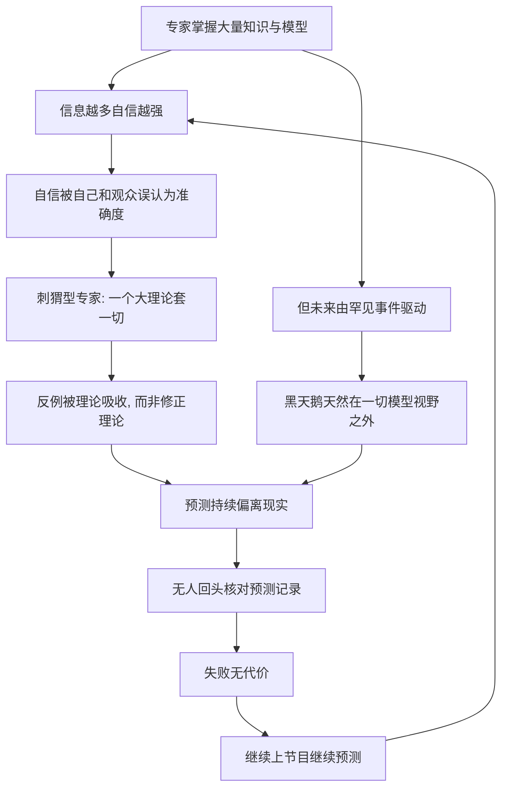

# 11｜专家的预测为什么和抛硬币差不多？

> 本文要解决的问题：为什么经济学家、战略家、政治分析师做出的长期预测，命中率并不比随机猜测高？

---

## 一、先说结论

塔勒布认为，专家在长期预测上的表现和抛硬币、掷飞镖相差无几——这不是讽刺，是有实证研究支撑的结论。心理学家泰特洛克追踪数百位专家、累计两万多个预测，发现其平均准确率与随机猜测基本持平。更糟的是，名气最大的「刺猬型」专家——那些用一个大理论解释一切的人——预测反而最差。而这套游戏之所以能一直玩下去，是因为几乎没有人真的为预测失败付出代价。

## 二、我们先理解一个问题

每年十二月，各大机构准时发布来年展望：股指会到什么点位、油价是涨是跌、谁会赢得选举、下一场危机在哪里。语气笃定，图表精美。

到了年底，几乎没有人回头对账。

如果你把十年前某本财经杂志的年度预测翻出来，逐条对照后来真实发生的事，会发现一个尴尬的事实：预测写得越斩钉截铁的，错得越离谱；而真正改写历史的那几件事，没有任何一条预测提到过它们。

其实我们心里隐约知道这一点。但每年预测照样发布，我们照样消费，专家照样上电视。这件事奇怪就奇怪在：一个人人都隐约知道不灵的产品，为什么永远不缺买家和卖家？要先弄清预测到底失败到什么程度，以及是谁在为这场游戏买单。

## 三、作者到底提出了什么观点？

塔勒布在这个问题上的观点分三层，层层递进。

第一层是实证判断：专家预测的准确度接近随机水平。他引用心理学家菲利普·泰特洛克的大规模研究——长期跟踪政治、经济领域的专业人士，要求他们对未来事件给出明确概率，事后再核对——结果是平均命中率与随机猜测相差无几。

第二层是结构判断：预测能力和名气不但不正相关，甚至负相关。塔勒布借用以赛亚·伯林的分类：刺猬型专家「知道一件大事」，用一个大理论解释一切；狐狸型专家「知道很多小事」，观点零散、随时修正。研究结果显示，刺猬型预测更差——但恰恰是他们上电视最多、声音最大。

第三层是制度判断：预测行业没有输的机制。预测错了无人追责，预测对了（哪怕只是蒙对一次）就可以吃一辈子。一个失败无代价的游戏，供给永远不会枯竭。

## 四、把这个观点翻译成人话

用一句大白话说：**那些西装革履告诉你明年会发生什么的人，成绩和扔硬币差不多——区别是他们扔完硬币，还能领通告费。**

刺猬和狐狸的差别，用生活语言讲是这样的。刺猬是那种「一把锤子看什么都像钉子」的人：学了供需理论，就把战争、婚姻、选举全解释成供需；学了地缘政治，就把流感、汇率、球赛都解释成地缘博弈。他们的话听起来特别有深度，因为万事都能塞进同一个叙事里——但正因为理论太完整，任何反例都能被它消化掉，而不是修正它。错得越狠，信得越深。

狐狸是反过来的：东拼西凑，承认「这件事我说不清」，观点之间甚至互相打架。听起来不过瘾，上不了热搜，但离现实更近。

所以你在屏幕上看到的专家阵容，本身就是被「谁更会讲故事」筛选过的——而会讲故事和会预测，在这个研究里几乎是两回事。

## 五、为什么会这样？

塔勒布的推理链条大致是这样的：

关键在两条线。一条是心理线：心理学研究反复发现，信息量增加主要提升的是自信，而不是准确率——专家知道得越多，越笃定，但命中率纹丝不动。另一条是结构线：未来真正重要的事是黑天鹅，而黑天鹅的定义就是「在既有经验与模型之外」——模型越精致，对它越失明。

而「无代价」这个底座保证了整个循环永续运转：预测失败没有惩罚，预测的产量就和预测的质量彻底脱钩。

## 六、举一个现实生活中的例子

泰特洛克的研究是心理学史上最硬核的实证工作之一。从二十世纪八十年代起，他招募了数百位以预测为业或以此为专长的人——政治学者、经济学家、记者、智库研究员、情报分析师——让他们对一系列重大问题给出明确概率：苏联会不会解体、某场选举谁赢、经济会不会衰退、地区冲突会不会升级。

他前后跟踪了将近二十年，累计收集两万多个可核对的预测判断。结果冷酷得出奇：平均而言，专家们的命中率只比「掷飞镖的黑猩猩」——也就是纯粹随机——好那么一丁点，预测的时间跨度拉得越长，就越接近纯随机。

更精彩的是研究里的分型结果。泰特洛克按认知风格把专家分成两类：刺猬型，抱着一个大理论不放（「一切都是利益博弈」「一切都是制度决定」），判断斩钉截铁；狐狸型，观点拼贴、保留大量「但」「也可能」。数据显示刺猬型预测明显更差——而恰恰是刺猬型在媒体上曝光最多、书卖得最好，因为笃定的语气、完整的叙事在电视上魅力无穷。狐狸型的「一方面……另一方面……」没人爱听。

塔勒布还特别爱引用专家们失败之后的反应：几乎没有人承认「我判断错了」，标准托辞是「我的预测只是时机没到」「要不是那次意外」「我大方向是对的」——理论永远正确，错的永远是现实不配合。

## 七、回到书中重新理解

现在再看塔勒布引用这个研究的用意，就清楚多了：他要拆的不是某几个专家，而是「预测—咨询—决策」这整条产业链的地基。

如果连训练有素、掌握内部信息、以此为终生职业的人都做不到比随机更好，那么建立在「有人能预测未来」这个假设上的一切——经济规划、战略报告、投研体系——就都建在浮冰上。问题不在于哪块浮冰更厚，而在于冰本身不承重。

塔勒布还把这个结果和认识论傲慢接上了：专家的失败不是知识不够，而是他们不知道自己不知道——并且知道得越多，越以为自己知道。泰特洛克的数据，等于给「高估所知」这件事提供了量化的判决书。

## 八、这个观点背后还有什么？

这个研究背后还藏着三层东西。

第一，它真正打击的不是「专家」这个职业，而是「预测」这个商品。如果准确率接近随机，买家每年付的咨询费买的是什么？塔勒布暗示：买的是确定性的安慰剂。组织需要「有人对明年负责」这个动作本身——预测的价值是情绪性的、程序性的，从来不是信息性的。

第二，刺猬现象暴露了预测市场的反向激励。媒体要的是果断、简洁、有大理论撑腰的声音；「这事很复杂，我说不准」没有传播力。也就是说，这个市场在系统性地把最差的预测者筛选到最高的位置上——名气不是准确度的指标，很可能是它的反指标。

第三，「无代价」是塔勒布全部批判的支点。他反复追问：谁核对过预测？证券公司、官方机构、战略智库年年预测年年错，职位、薪水、话语权毫发无损。一个游戏如果没有输家，就不会有进化。他后来把这条思路发展成「风险共担」原则——不承担后果的意见，不值得认真对待。

## 九、这个观点有问题吗？

有说服力的地方很明显：泰特洛克的研究样本大、时间长、方法干净——事前要求给出概率、事后严格对账，是社会科学里少有的经得起检验的成果。金融市场的历史记录也与之吻合：券商年度目标价与实际点位的偏差统计，常年难看得稳定。

但边界同样存在。第一，「和抛硬币差不多」是平均意义上的概括。一些学者认为，泰特洛克自己的数据里，狐狸型专家其实小幅跑赢了随机；而且预测并非铁板一块——短期、有快速数据反馈的领域（天气、部分选举民调）准确率明显更高。把结论延伸成「一切预测都无效」会过度解读：塔勒布批评的靶心是长期的、极端斯坦式的预测，不是明天下不下雨。

第二，刺猬与狐狸的二分本身也是一种简化。关于这一问题，学界存在不同解释：有研究者认为，真正决定预测好坏的不是人格类型，而是方法——是否使用基准概率、是否频繁更新、是否拆解问题。泰特洛克后来对「超级预测者」的研究，重点也从「什么人准」转向了「什么做法准」，暗示预测能力部分可训练，而非天生注定。

第三，「掷飞镖的黑猩猩」是个修辞性比喻。黑猩猩的飞镖是纯随机，而专家至少界定了选项的空间——说「完全一样」并不公平，准确的说法是：专家只比随机好一点点，远配不上他们表现出的自信。

第四，还有制度层面的反驳：预测的用处也许不在命中，而在迫使组织把隐含假设写成白纸黑字——就算猜错，「写下假设」这个动作对决策仍有价值。塔勒布的回应会是：问题在于人们把预测当行动依据，而不是当思考练习。

所以更准确的读法是：这个结论判的是「预测作为行动依据」的死刑，不是「思考未来」的死刑。

## 十、今天再看这个观点

以下部分是基于作者思想的现代延伸，不是作者原话。

放到今天，这个游戏不仅没有收敛，反而升级了。宏观预测依旧年复一年地失败——利率路径、地缘冲突、技术拐点，主流共识的命中率并不比二十年前更好看。而另一方面，泰特洛克自己主导的预测比赛研究发现，少数「超级预测者」能持续跑赢——但这并不推翻塔勒布，反而印证了他的区分：可训练的预测只存在于有快速反馈、可概率化表达、能频繁修正的窄领域里；对真正改写历史的那类事件，至今没有证据表明任何人能稳定预测。

人工智能又给这个问题加了一层：生产预测的成本趋近于零，预测供给爆炸式增长，但预测的黑箱性也在加深——核对一份人工智能生成的预测，比核对一个专家的预测更难。塔勒布式的追问在今天反而更锋利：这份预测，留下了可以事后对账的记录吗？

## 十一、这一篇真正应该记住什么？

1. 泰特洛克研究：数百位专家、两万多个预测，平均准确率与随机猜测相差无几，时间跨度越长越接近纯随机。
2. 刺猬型专家——一个大理论套一切——预测最差、曝光最高；狐狸型略好，但没人爱看。
3. 信息量增加主要提升自信，不提升准确率——专家的失败是认识论傲慢的实证版本。
4. 预测行业没有「输」的机制：错了无人核对，对了吃一辈子，游戏因此永续。
5. 与其说是专家不行，不如说是问题不行——未来由黑天鹅驱动，而黑天鹅在一切模型视野之外。

## 十二、留一个问题

下一次看到一位专家笃定地说「未来五年将如何如何」，先别急着信，也别急着不信，问一个更基本的问题：这个人过去十年的预测记录，在哪里可以查到？如果查不到，你消费的到底是预测，还是表演？

这就引出了更深一层的问题：专家预测失败，到底是因为人不行，还是因为这个问题本身在数学上就无解？换句话说——黑天鹅到底是「难预测」，还是「原则上不可预测」？如果是前者，我们该寄希望于更聪明的专家；如果是后者，整套打法都得换。下一篇，我们看塔勒布的答案。
