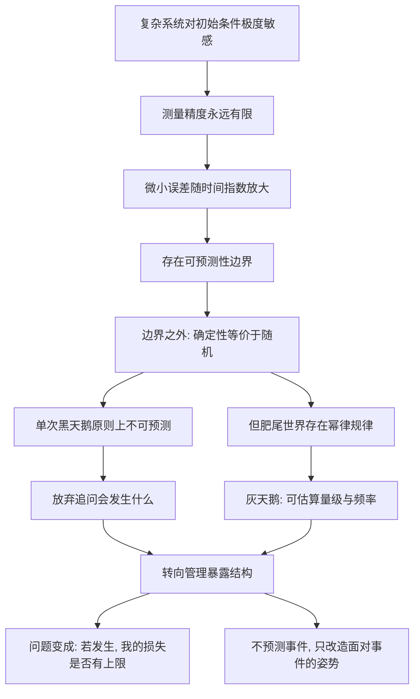

# 12｜黑天鹅到底能不能被预测？

> 本文要解决的问题：黑天鹅不可预测，是不是意味着我们在风险面前只能听天由命、什么都不用做了？

---

## 一、先说结论

塔勒布的答案分两层，缺一不可。对单次黑天鹅——它什么时候来、以什么形式来——原则上不可预测，这不是技术不够、数据不多，而是问题本身的数学性质决定的。但「你对黑天鹅的暴露结构」是完全可以管理的：你不知道海啸哪天来，但决定得了把房子建在沙滩上还是高地上。再加上曼德博的分形与幂律思路，一部分「灰天鹅」——罕见但服从统计规律的事件——可以做粗略的概率估算。一句话：我们预测不了事件，但能改造自己面对事件的姿势。

## 二、我们先理解一个问题

先看一个看似毫不相关的现象：天气预报。

三天内的预报相当准，五天开始打折，两周之后的预报基本等于猜，一年后的「天气预报」没有任何机构敢做。奇怪的是，气象方程是完备的——大气运动服从明确的物理定律，理论上只要知道此刻每个空气分子的位置和速度，就能推出未来任何一天的天气。设备年年升级，算力翻了无数倍，为什么两周始终是那道过不去的坎？

答案不是设备不行，是数学本身。这类系统对初始条件极度敏感：初始测量差一点点，误差随时间指数级放大，很快面目全非。而任何测量精度永远有限——你可以精确到小数点后六位，但方程不在乎第七位的差异吗？它在乎，而且会把这点差异放大成完全不同的未来。

于是出现一个反直觉的概念：**确定性不等于可预测。**方程是确定的，未来却算不出来——这中间隔着一条由数学划定的「可预测性边界」。天气尚且如此，变量纠缠、连方程都写不出来的人类社会呢？

## 三、作者到底提出了什么观点？

塔勒布在「能不能预测」这个问题上的态度有微妙的分层，最容易被误读成「那就什么都别干了」。

第一层，对单次黑天鹅：不可预测，而且是原则上不可预测。混沌系统与历史系统的性质决定了存在一个预测无法逾越的边界——这不是等更大的数据、更强的人工智能就能解决的工程问题，是数学问题。

第二层，对风险结构：完全可控。预测管的是「会发生什么」，暴露管的是「如果发生，我会怎样」——前者无解，后者在你手里。你知道不了地震的日期，但你选得了住不住在断裂带上、房子抗不抗震。

第三层，对一类特殊事件：有限可估。借助曼德博的分形与幂律思想，在肥尾世界里，一部分罕见事件虽然不能预测日期，却可以估算「这种量级的事大概多久来一次」——塔勒布称之为「灰天鹅」。这不是完美的预测，但比高斯分布给出的虚假精确诚实得多。

塔勒布把曼德博视为自己思想上的关键引路人：分形几何提供的不是水晶球，而是一种「粗线条但诚实」的数学语言——承认模型不完美，但方向是对的。

## 四、把这个观点翻译成人话

用一句大白话说：**你算不出哪天刮台风，但你决定得了屋顶修多牢。**

「预测」和「暴露」是两个完全不同的问题。预测问的是：未来会发生什么？——多半无解。暴露问的是：如果某件事发生，我扛不扛得住？——完全在你手里。塔勒布认为，人类把九成精力花在了无解的前者上，对可控的后者视而不见，这才是真正的悲剧。

「灰天鹅」的人话版是这样的：黑天鹅里其实有一小部分，罕见，但不算完全隐形。比如大地震没有精确时间表，但「震级每大一级，频率大约降一个量级」这类幂律关系在数据里是真实存在的。你不能预测那一天，但能为「这种量级」留一个座位——知道百年一遇不是「永远不会再来」。

所以塔勒布的立场既不是「一切皆可算」的狂妄，也不是「一切皆随机」的躺平，而是卡在中间：**日期算不出，量级估得出；事件管不了，姿势改得了。**

## 五、为什么会这样？

塔勒布的推理链条大致是这样的：

关键在两点。第一，不可预测是数学性质而非技术欠账——三体问题早在一百多年前就证明了：方程写得清清楚楚，长期行为照样算不出来。期待「更强的模型」解决它，是搞错了对手。第二，一旦接受不可预测，问题的形状就变了：从「猜未来」变成「调结构」，而后者是我们唯一有把握的领域。

## 六、举一个现实生活中的例子

先看混沌系统的经典样板。一九六一年，气象学家爱德华·洛伦兹在计算机上跑天气模拟，中途想重跑其中一段。为了省事，他把上次打印输出的数字手动输回去——打印精度只保留三位小数，他输入的是零点五零六，而机器内部存的其实是零点五零六一二七。初始条件差了不到千分之一，按理说结果应该差不多；结果系统跑出的天气轨迹很快面目全非，和原来那条毫无相似之处。

这个意外发现就是「蝴蝶效应」的起点：理论上，巴西一只蝴蝶扇动翅膀，可以在得克萨斯州引起一场龙卷风。方程没变，规则没变，只是起点差了看不见的一点点——长期预测因此成为不可能。

更早的伏笔埋在数学史里。早在洛伦兹之前半个多世纪，庞加莱研究三体问题——三个天体在相互引力下如何运动——就发现它没有通用的解析解，轨道对初始条件敏感到无法长期计算。牛顿方程写得清清楚楚，三个球怎么飞却算不出来。这是人类第一次正式撞见「确定性但不可预测」的东西：不可预测不是因为我们笨，是宇宙的这一部分本来就长这样。

再看曼德博这条线。数学家伯努瓦·曼德博研究棉花价格、金融数据、河流洪峰，发现真实世界到处是分形结构和幂律关系——极端事件不像高斯分布预言的那样「几乎不可能发生」，而是频繁得多、猛烈得多。顺着幂律，你可以做一种诚实的估算：百年一遇的洪峰不是「不会再来」，而是服从某种「量级越大、越罕见」的稳定关系。塔勒布把这种「罕见但可以被粗略框定」的事件称作灰天鹅——预测不了它哪天到，但在概率上给它留好了座位。他强调曼德博方法的珍贵之处恰恰在于不假装精确：它给肥尾世界提供了一套诚实的数学语言，而不是又一张会害死人的精确地图。

## 七、回到书中重新理解

这一篇是全书最容易被读歪的地方。很多人读到「黑天鹅不可预测」，顺手推出的结论是：那我们躺平算了。塔勒布恰恰站在对面——他的完整立场是「不可预测不等于不可准备」。

书里他的真实姿态是双重的：一只手拆掉几乎所有预测工具——高斯模型、专家判断、历史外推；另一只手却在曼德博那里保留了一块有限的、诚实的建模空间，更重要的是把整个问题的重心从「事件」挪到「暴露」。

所以预测的破产在书里不是终点，而是转向的起点。塔勒布要你把口头禅换掉：别问「接下来会发生什么」，改问「我对什么脆弱」。前一个问题你答不了，后一个问题你天天都能改进答案。

## 八、这个观点背后还有什么？

这个观点背后还藏着三层东西。

第一，它悄悄更换了风险问题的问法。传统风险管理问「坏事的概率是多少」，塔勒布问「坏事的后果是多少、我扛不扛得住」。概率不可靠的时候，后果结构才是抓得住的东西——这是一次从预测导向到暴露导向的范式转移。

第二，灰天鹅概念划出了「知识谦逊」和「彻底虚无」之间的地带。承认不可预测不等于扔掉数学——幂律不告诉你哪天，但告诉你极端事件有多极端、多频繁的量级感。塔勒布的立场是：诚实的粗糙胜过精确的虚假。

第三，它给「数据万能论」预置了一颗钉子。如果不可预测来自敏感依赖和系统的涌现结构，那么增加算力只是把边界往后推一点点，边界永远存在——这对一切「数据够大就能预测一切」的叙事都是釜底抽薪。

## 九、这个观点有问题吗？

有说服力的地方很硬：混沌系统的不可预测性有严格的数学基础，不是哲学姿态；曼德博的幂律分析在金融、地震、城市规模等大量数据上得到支持；「暴露可管理」在工程、保险实践中更是常识级操作。

但边界同样存在。第一，「原则上不可预测」不能被滥用成「所有领域都不可预测」。一些学者认为，塔勒布把混沌系统的结论外推到整个社会过于干脆——人口结构、消费习惯这类慢变量有相当的可预测性，而它们恰恰构成了大部分日常决策的基础。黑天鹅统治历史，不等于黑天鹅统治你的购物清单。

第二，灰天鹅概念本身有点滑：一件事算黑天鹅还是灰天鹅，往往要事后才分得清——事前你并不知道它是否在幂律的覆盖范围内。关于这一问题，学界存在不同解释：批评者认为这给理论留了过大的弹性，几乎不可证伪——预测不到的是黑天鹅，预测到量级的就追认为灰天鹅，怎么都是它对。

第三，幂律估算也有实践困难：肥尾分布的参数估计对样本极其敏感，用一百年数据估「千年一遇」本身就充满误差。塔勒布批评别人有模型风险，分形模型同样有自己的模型风险——只是错误的方向不同：它倾向于高估尾部，至少错得安全。

第四，「管理暴露而不预测」听起来无懈可击，但回避了一个细节：暴露判断本身依赖某种预测——你决定不住断裂带，是因为你相信「地震会来」，这仍是对事件可能性的估计，只是粒度更粗。彻底的「零预测」在实践中做不到，最多做到「预测得更谦逊」。

## 十、今天再看这个观点

以下部分是基于作者思想的现代延伸，不是作者原话。

人工智能时代让这个问题重新变得尖锐。一方面，机器学习在「高频率、有快速反馈、结果可枚举」的领域突飞猛进——翻译、推荐、蛋白质结构预测——容易让人产生「数据够大就能预测一切」的错觉。另一方面，按塔勒布的框架看，这些成功全部发生在「平均斯坦式」的问题里：重复、有边界、反馈快。真正的黑天鹅领域——地缘断裂、技术范式切换、大流行——并没有因为算力增加一千万倍而变得可预测。混沌的教训仍然成立：有些边界是数学画的，不是工程画的，工程越进步，越能精确地看清那条边界在哪。

同时，「暴露思维」正在被严肃的风险实践吸收：金融系统的压力测试、供应链的韧性工程、气候政策中的预防原则，本质上都是同一句话——不预测事件，改造姿势。

## 十一、这一篇真正应该记住什么？

1. 单次黑天鹅原则上不可预测——混沌系统证明这是数学性质，不是技术欠账。
2. 不可预测不等于不可准备：把问题从「会发生什么」换成「我对什么脆弱」。
3. 曼德博的分形与幂律给出折中：灰天鹅不能预测日期，但能估算量级与频率——诚实的粗糙胜过虚假的精确。
4. 暴露结构是可以管理的：你不知道海啸哪天来，但决定得了房子建在哪。
5. 预测的终点不是虚无，而是转向——它为「不预测、只布置姿势」的策略打开了门。

## 十二、留一个问题

检查一下自己：你现在的工作、资产、生活安排里，有哪些「暴露」是建立在「未来大致可预测」这个隐含假设上的？如果那个假设是错的，你的损失有上限吗？

塔勒布的回答不是让你去学更高明的预测术，而是给出一个反直觉的配置法：把绝大多数资源放在极度安全的地方，把一小撮押在极度冒险的地方——像一个杠铃，两头重、中间空。为什么「最保守加最激进」反而比「稳健中庸」更安全？这正是下一篇要拆的杠铃策略。
