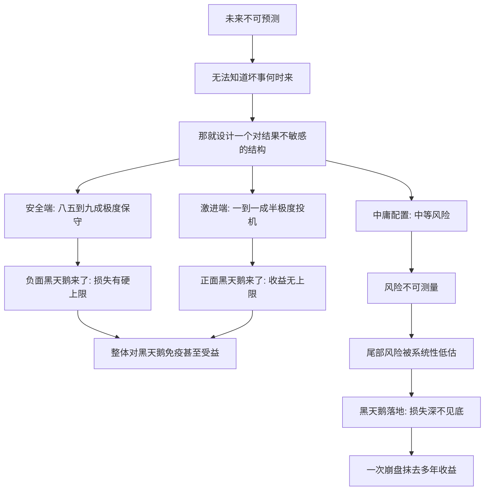

# 13｜杠铃策略：为什么最保守加最激进反而最安全？

> 本文要解决的问题：为什么把约九成资源放在极度安全处、一成押在极度投机上，反而比「中等风险」配置更能抵御黑天鹅？

---

## 一、先说结论

塔勒布提出的杠铃策略是：把约八五到九成的资源放在极度安全的资产上，保住底线、对负面黑天鹅近乎免疫；把剩下的一到一成半押在极高风险的投机上，对正面黑天鹅完全敞开。两头极端、中间清空——因为「中等风险」恰恰是最危险的地带：那里的风险算不清，暴雷时却足以致命。杠铃的本质不是理财技巧，而是一种姿态：不预测未来，只布置自己面对未来的姿势。

## 二、我们先理解一个问题

想象三个投资者，面对同一个不可预测的市场。

A 把钱全交给「稳健型理财」，宣传页上写着预期年化百分之五，波动很小。他不知道的是，底层资产是层层打包的次级贷款——穿西装的雷。

B 把九成资金放在国债级别的资产里，剩下一成买了十几张便宜的深度虚值期权，外加两个高风险的早期项目。平时那点投机钱眼看着一笔笔归零，朋友都说他精神分裂。

C 走主流路线，把钱均匀分散在一个「中等风险」的组合里——不上不下，看起来最像正常人。

然后二〇〇八年式的崩盘来了。A 发现自己所谓的稳健产品跌得比股票还狠；C 的组合缩水三成，修复要五年；B 的安全端毫发无损，投机端里那些保险型的押注反而翻了几百倍。

问题出在哪？出在「中等风险」这四个字的真实含义——它其实不是「风险中等」，而是「我们算不清它的风险」。算不清，不等于中等。

## 三、作者到底提出了什么观点？

塔勒布在书里给出的建议相当具体，可以拆成四层。

第一层是结构上的双峰：约八五到九成投入极度安全的资产——他举的标杆是国债级别的安全性——确保自己在任何情形下都不会出局；剩下的一到一成半投入高度投机的押注，期权、风投式的项目都在此列，亏损上限是本金，收益却没有上限。

第二层是逻辑上避开中间：中等风险资产的真正危险在于风险不可测量。「看起来波动不大」往往只是把尾部风险藏起来了；在肥尾世界里，「中等」是个统计幻觉。

第三层是哲学上放弃预测：杠铃不需要你对未来下任何判断。你不知道危机会不会来，也不需要知道——下跌被安全端封底，上涨被投机端打开，两边都是黑天鹅的朋友。

第四层是把这个原则推广到金融之外：职业、创作、人生安排，都可以用杠铃来组织。

## 四、把这个观点翻译成人话

用一句大白话说：**要么躲到绝对打不到你的地方，要么站到中了彩票的位置——就是别站在「可能挨一记不知道多重的拳头」的中间地带。**

先把「中庸」祛魅。你以为中等风险是谨慎，其实它只是「风险没被量出来」。高斯分布会给这类资产贴一个温和的波动率标签，可在肥尾世界里那个标签是错的——你以为自己买的是债券，实际买的是穿债券衣服的炸弹。中庸在这个问题上的本质是偷懒：不敢做两端的决断，拿一个平均值交差。

再看杠铃的人话版：先把「无论如何死不了」焊死，再去买「万一爆了呢」的彩票。亏的是可以数清楚的钱——本金就那么多；赚的是数不清楚的钱——收益没有顶。损失的形状是设计的，不是赌的。

## 五、为什么会这样？

塔勒布的推理链条大致是这样的：

机制的核心是损失函数的形状。杠铃把下行锁死、把上行放开——用术语说是「凸性」，用人话说是「亏有数，赚没数」。中庸配置正好相反：在肥尾世界里，它的上行是有限的（几个百分点的稳健收益），下行却深不见底。一边是不对称地赢，一边是不对称地输，时间拉长，结局早已写好——剩下的只是等黑天鹅来收账。

所以杠铃真正做的事，是把风险从「算不清」变成「算得清」：亏损上限被硬编码进结构里，不需要任何模型告诉你。

## 六、举一个现实生活中的例子

先看塔勒布自己建议的配置。他在书里给出的做法是：与其把钱交给「中等风险」的基金组合——历史上一再证明这类产品在危机中跌掉三四成——不如把约八五到九成放在国债类极安全的资产里，剩下的一到一成半撒向高度投机的方向：深度虚值的期权、早期风险投资式的押注。

这种组合的日常状态相当「难看」：投机端大部分归零或者小额亏损，账户常年跑输邻居家的基金；安全端只是稳定生息，毫无故事可讲。但黑天鹅落地的那一刻，剧本反转——安全端不动如山，投机端可能带来几十倍、上百倍的回报，一次兑现，覆盖十几年的等待成本还有富余。重点在于：这套结构从头到尾不需要预测危机会不会来、什么时候来。来了，受益；不来，也只损失那点事先就认亏的零花钱。

再看职业版杠铃。塔勒布建议，想在文学、科研这类正面黑天鹅领域活下来的人，最稳的走法是：白天做一份清闲而稳定的「无聊」工作——收入不高但旱涝保收，耗心不重；晚上把全部热情押在写作或研究上。这样，负面黑天鹅（失业、行业寒冬）打不死你，因为你的底线不靠梦想吃饭；正面黑天鹅（一本书爆红、一个成果突破）来临时你又恰好站在场内。反过来，「白天做高压金融工作、业余挤时间写作」就不是杠铃——主业的压力会吃掉创作的全部余量，最后两头落空，看似务实，实则站在最危险的中间。

## 七、回到书中重新理解

要注意杠铃策略在全书中的位置：它是「预测破产」之后拿出的第一个建设性方案。塔勒布用了大半本书拆掉预测——拆模型、拆专家、拆高斯分布——杠铃是他给出的正面回答：既然不知道未来，那就让「不知道」变得无害，甚至有利。

所以杠铃的重点根本不在那个百分比上，而在一个反直觉的排序：在不可预测的世界里，「极度保守加极度激进」的组合，风险反而低于「温和中庸」。因为前者把最坏的情形焊死了，后者把最坏的情形藏起来了。焊死的你看得见，藏起来的你算不出——而算不出的东西，在极端斯坦里迟早要你的命。

## 八、这个观点背后还有什么？

杠铃策略背后还藏着四层东西。

第一，它重新定义了「风险」。传统金融把风险等同于波动率，塔勒布把风险定义为「毁灭的可能性」。安全端不是没有波动，是没有出局的可能；激进端波动剧烈，但损失封顶。真正的风险从来不是晃，是死。

第二，它给「中庸」祛了魅。中庸在伦理上也许是美德，在风险上却常常是怯懦的化名——不做两端的决断，取个平均值交差。杠铃恰恰要求你在两个方向上同时做到极致，这比中庸需要多得多的纪律。

第三，它是「反脆弱」思想的雏形。塔勒布在后来的著作里把这个结构系统化了：安全端让你不被摧毁，激进端让你从波动中获益——合起来就是一种「越动荡越好」的形状。

第四，它暗含着对人性的算计。大多数人在牛市里忍不住加杠杆，在恐慌中割肉离场。杠铃用结构替代意志力：投机端天然满足赌博冲动，安全端让你在最黑暗的时刻敢拿住不撒手——因为你清楚地知道，最坏的部分永远不会坏到出局。

## 九、这个观点有问题吗？

有说服力的地方很硬：杠铃的数学基础扎实——在肥尾世界里，凸性结构（下行有限、上行开放）确实占优；二〇〇八年危机中「中等风险」产品的大面积暴雷，等于做了一次自然实验级的验证；职业杠铃在历史上也有大量先例——卡夫卡白天在保险公司当职员、晚上写小说，一边领薪水一边写出了二十世纪最重要的文学。

但边界同样存在。第一，「极度安全的资产」本身就是一个假设。一些学者认为，国债式的安全依赖对发行主体的信任，在恶性通胀、主权违约这类极端情形下，安全端同样会被击穿——历史上并非没有先例。「安全」永远是相对于某个世界状态而言的，没有绝对的安全端。

第二，投机端的执行难度被严重低估。买什么、什么时候买、怎么控制持续烧钱的成本，需要相当专业的一套手艺——期权买错了行权价和到期日，就是稳定地给市场交学费。「押注正面黑天鹅」听起来潇洒，普通人照搬往往只复制了亏损的那一头，复制不到爆发的那一头。

第三，机会成本是真实存在的。在长达十年的温和牛市里，杠铃的安全端拖累收益、投机端持续归零，账面会年复一年地跑输中庸配置——多数人撑不到黑天鹅兑现的那一天就放弃了。杠铃考验的不是智力，是忍耐，而忍耐恰恰是最稀缺的资源。

第四，「中间地带最危险」有过度简化之嫌。关于这一问题，学界存在不同解释：现代组合理论的支持者会认为，分散化本身没有错，错的是高斯分布的假设；把模型修正之后，「中间」未必是陷阱。塔勒布的回应则会是：在极端斯坦里，模型修正永远追不上真实的尾部——你修好的只是上一次的黑天鹅。

## 十、今天再看这个观点

以下部分是基于作者思想的现代延伸，不是作者原话。

今天，杠铃策略早已溢出金融领域。职业上，「主业保底线、副业博上限」成了流行叙事；创业上，「现金牛业务养探索业务」是组织版的杠铃；个人成长上，「大部分时间做确定性积累、小比例时间做高赔率尝试」也是同一个结构。

而极端投机泛滥的年代，反而凸显出杠铃的另一半最容易被遗忘——塔勒布的重点从来不是那一成半的豪赌，而是先用八九成确保自己永远有资格坐在牌桌上。只见激进、不见保守的「杠铃」，不过是赌徒给自己找的体面说法。杠铃的门槛不在赌技，在纪律：先把死不了焊死，再去碰运气——顺序不能反。

## 十一、这一篇真正应该记住什么？

1. 杠铃 = 约八五到九成极度安全 + 一到一成半极度投机，两头重、中间空。
2. 中庸地带最危险——「中等风险」的真实含义是「风险没被量出来」。
3. 杠铃的本质是损失函数设计：下行有硬上限，上行无上限，全程不需要预测。
4. 职业版同样成立：用清闲稳定的饭碗养高赔率的追求，别拿高压力主业挤压梦想。
5. 先保证永远死不了，再去碰运气——顺序不能反，少了安全端的激进只是赌博。

## 十二、留一个问题

盘点一下自己的配置——钱、时间、职业——你现在站在杠铃的哪个位置？是两头都有，还是恰好站在塔勒布所说的、那个「看起来稳妥实则最危险」的中间地带？

再往深想一层：杠铃激进端那一到一成半，押的到底是什么东西？塔勒布的答案是：正面黑天鹅。出版、科研、风险投资这类领域有个共同特点——一次的回报可以偿还所有沉默的岁月，等待本身就是策略。什么样的行业配得上这份等待？下一篇，我们看正面黑天鹅。
