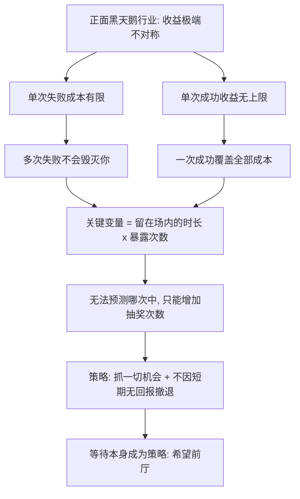

# 14｜正面黑天鹅：为什么有些机会值得你用一生去等？

> 本文要解决的问题：塔勒布所说的「正面黑天鹅」是什么，为什么在出版、科研、风险投资这类行业里，等待本身就是一种策略？

---

## 一、先说结论

黑天鹅不全是坏事。塔勒布把它分成两类：负面黑天鹅带来毁灭——崩盘、战争、失业；正面黑天鹅带来意外好运——一本书爆红、一项研究突破、一笔投资翻一千倍。正面黑天鹅行业的收益结构是极度不对称的：失败的成本小而有限，成功的回报大到没有上限，所以一次成功足以偿还全部失败。对应的策略也因此反常：你无法预测好运何时来，但你可以把自己持续暴露在它的射程之内——抓住一切机会、认识尽量多的人、绝不在短期没有回报时撤退。等待不是无奈，等待本身就是策略。

## 二、我们先理解一个问题

比较两种职业。

第一种是牙医。每看一个病人收一份钱，收入上限由工作时长决定——一天二十四小时是物理封顶。牙医的日子安稳，但不存在「某个月收入突然翻一百倍」的可能。

第二种是作家。写一本书花三年，可能只卖出八百本，版税不够付咖啡钱；也可能卖出八千万本，一本书超过牙医一辈子的收入。出版商给一个作者出书，同样如此：大部分书赔钱，偶尔一本把整个公司的亏损全部抹平还有富余。

问题来了：如果你选了第二种职业，头五年、十年都没有回报，该坚持还是撤退？

直觉会说撤退——努力了这么久没结果，说明此路不通。但塔勒布认为这个直觉恰恰是错的，因为它拿平均斯坦的尺子，去量极端斯坦的行业。

## 三、作者到底提出了什么观点？

塔勒布的观点可以拆成三层。

第一层：行业分两类。在回报与投入大致成正比的行业里，黑天鹅不存在，多劳多得；在正面黑天鹅行业里，回报由极少数极端事件决定，平时的努力只是在买门票。

第二层：正因为回报由尾部决定，策略的核心不是「提高每次成功的概率」——那做不到——而是「增加暴露在好运里的次数和时长」。塔勒布称之为最大化意外好运（serendipity）：去参加聚会、去认识人、去把作品递出去、让自己出现在一切可能发生意外相遇的地方。你无法安排惊喜，但你可以增加被惊喜砸中的面积。

第三层是对「等待」的重新命名。塔勒布把长期无回报的煎熬叫作「希望前厅」（antechamber of hope）：你坐在前厅里，门随时可能开，也可能十年不开。他的劝告是——如果你选定了一个正面黑天鹅行业，就别因为「暂时没有回报」而撤退，因为这种行业的回报结构决定了：回报不来则已，一来就是全部。

## 四、把这个观点翻译成人话

大白话版本：**你不能预测哪朵云会下雨，但你可以一直站在野外。**

再直白一点：在正面黑天鹅游戏里，「努力」和「回报」之间的线性关系被切断了。不是越努力越幸运，而是——你做的每件事都只是往抽奖箱里多放一张券，哪张会中没人知道，但箱子里没有券的人永远不会中。

所以塔勒布的建议听起来近乎鸡汤，其实很冷：去聚会、去社交、去投递、去出现——不是因为你预计某次聚会会带来机会，而是因为你无法预计，所以才要全去。把「这次有没有用」这种问题从脑子里删掉，因为正面黑天鹅的定义就是：事前你不可能知道哪次有用。

## 五、为什么会这样？

逻辑链条如下：

为什么在这类行业里「坚持」是理性而非固执？因为退出成本是隐性的：你退出那天恰好是开奖前一天的概率，和你坚持的任何一天一样大。在幂律分布的领域里，回报不按时间均匀发放——前九年颗粒无收、第十年一次结清，是这种行业的正常节奏，不是异常。

## 六、举一个现实生活中的例子

出版业是最标准的正面黑天鹅结构。一家出版社一年出几百种书，绝大多数赔本或持平，盈利几乎全部来自寥寥几本爆款——一本《哈利·波特》级别的作品，足以偿还几百次失败还有余。电影公司同理：一年投十几部片子，九部亏钱，一部票房奇迹养活整个片库。风险投资把这个结构推到极致：一只基金投几十个项目，多数归零，回报可能全部来自一两个百倍千倍的项目——从行业事实看，不少知名基金的绝大部分收益，事后都能追溯到极少数被投公司。这就是收益结构本身：多数项目亏损，一个大作偿还全部。

塔勒布本人在书里写过自己的「希望前厅」。他早年只身到纽约做交易、写书，多年间回报寥寥——用他的描述，周围人用文明的方式暗示他该放弃了：亲戚问你最近在忙什么，同行的收入稳步上涨，而你手里只有一个不知道什么时候兑现的可能性。他把那个阶段叫作希望前厅，并且坦白说坐在里面的滋味是煎熬——不是因为穷，而是因为人需要从「稳定可见的进展」里获得尊严，而正面黑天鹅行业恰恰不提供这种进展。

他的对策写在书里：抓住一切机会。有人约聚会就去，有场合能认识人就露面，有机会把想法递出去就递——不是相信某一次特定行动会有回报，而是相信「暴露在偶然之中的总面积」决定好运的最终产量。用塔勒布自己的意思说：你无法预测惊喜，只能最大化它撞上你的机会。

## 七、回到书中重新理解

现在再看塔勒布给正面黑天鹅行业的建议，会发现它是黑天鹅理论的镜像应用。

对负面黑天鹅，策略是收缩暴露——别让任何一次意外有杀死你的能力；对正面黑天鹅，策略反过来，是扩张暴露——让任何一次好运都有机会砸中你。两边共用一个前提：事件本身不可预测，能管理的只有你跟事件之间的暴露关系。

这也解释了为什么塔勒布反复强调「不要因为短期没有回报而撤退」。在平均斯坦里，没有回报是方法错了的信号；在极端斯坦里，没有回报只是尾部还没开奖的常态。把两个世界的信号系统搞混，是在正面黑天鹅行业里最典型的自杀方式——倒在开奖前夜。

## 八、这个观点背后还有什么？

第一，它修正了一个流行错觉：坚持就会成功。塔勒布并没有说坚持会成功——他说的是，在这类行业里，撤退保证失败，而坚持只是让成功保持可能。两者差别巨大：坚持是必要条件，不是充分条件。希望前厅里坐着的人，大部分最终也没等到门开。塔勒布的诚实之处就在于他不承诺结果，只分析结构。

第二，「希望前厅」点破了这类职业的真实成本：不是钱，是心理。当同行在领月薪、评职称时，你的进度条是空白。塔勒布观察到，这种行业淘汰人靠的不是能力筛选，而是多数人熬不过「长期无反馈」这一关。反过来看，能在前厅里坐得住本身就是一种竞争优势——它筛掉了所有需要确定性的人。

第三，它给运气正了名。主流叙事爱把成功归因于方法和努力，塔勒布却把运气重新放回中心：你控制不了运气来不来，只能控制自己暴露在多大的运气面积之下。这个表述既谦卑又主动——放弃对结果的掌控欲，但不放弃对姿势的掌控权。

## 九、这个观点有问题吗？

说服力是实打实的。风投行业的幂律回报是被大量数据反复验证的事实；出版、电影、音乐市场的头部集中也有清晰统计；塔勒布「主动暴露、留住底牌」的建议，在数学上等价于持有一篮子便宜彩票，逻辑上没有问题。

但边界同样清晰。第一，这个策略对「失败成本有限」这个前提依赖极重——塔勒布能坐在希望前厅里，前提是他有别的收入来源和退路；对没有安全垫的人，「用一生去等」可能意味着真实的贫困，而不是浪漫的前厅。第二，它有个隐蔽的幸存者视角：塔勒布自己是等到门开的人，所以能写书劝你坚持；希望前厅里坐了一辈子、门从未开的人没有写书。一些学者认为，正面黑天鹅叙事和成功学共享同一个沉默证据问题，只是换了个方向。第三，「抓一切机会」被过度简化时会变成无底线的忙碌——去所有聚会、认识所有人，也可能稀释掉把事情做深的时间；关于运气曝光与深耕能力各自贡献多少，学界存在不同解释，一些研究认为可重复的曝光本身也需要实力垫底，否则机会来了接不住。第四，正面黑天鹅的分布也许在变化：当所有人都学会「暴露给好运」，彩票可能涨价、中奖率可能摊薄——策略的普及会侵蚀策略本身。

所以更准确的读法是：正面黑天鹅是一则关于**收益结构**的分析，不是成功承诺书。它告诉你哪种座位值得坐，但不保证你赶上开奖。

## 十、今天再看这个观点

以下部分是基于作者思想的现代延伸，不是作者原话。

今天的创作者经济几乎是「希望前厅」的放大版：写作、短视频、独立开发、开源项目——入场成本被压到极低，一次爆红的上限被推到极高。塔勒布式策略在这里前所未有地可行：持续发布、持续曝光、等尾部开奖。但同一逻辑的另一面是：门票便宜意味着前厅里挤满了人，等待期可能比塔勒布写作的年代更长。

同时要警惕一个时代特有的陷阱：算法分发让「短期反馈」变得极其密集——阅读量、点赞、涨粉，每小时的数字都在撩拨你撤退或加码。用塔勒布的框架看，这些都是平均斯坦式的噪音信号。正面黑天鹅行业的正确姿势是盯着「还在不在场」，而不是盯着「这次火没火」。

## 十一、这一篇真正应该记住什么？

1. 正面黑天鹅行业 = 失败成本有限、成功回报无上限的极端斯坦领域，如出版、科研、风投。
2. 在这类行业里，一次成功覆盖全部失败——所以目标不是提高单次成功率，而是增加暴露的次数与时长。
3. 最大化意外好运：去聚会、去认识人、去递交——你无法预测哪次有用，所以全都要去。
4. 希望前厅的煎熬是入场费：长期无反馈是常态，不是失败的信号；因短期无回报撤退，是这个行业最常见的死法。
5. 坚持只是保持可能，不是承诺结果——坐得住是竞争优势，但坐本身不保证门开。

## 十二、留一个问题

如果你正坐在某个「希望前厅」里，不妨问自己：我想退出，是因为有了更好的去处，还是因为受不了进度条空白？这两个答案，一个理性，一个只是疲劳。

到这里，塔勒布的两套应对策略已经齐了：对负面黑天鹅，把毁灭挡在门外；对正面黑天鹅，把暴露面积撑到最大，然后在前厅里坐稳。但还剩一个更根本的问题没有解决——如果未来真的无法预测、结果真的要交给运气，我们该用什么样的心态去生活？塔勒布在全书的结尾，用一列错过的火车给出了他的答案。
