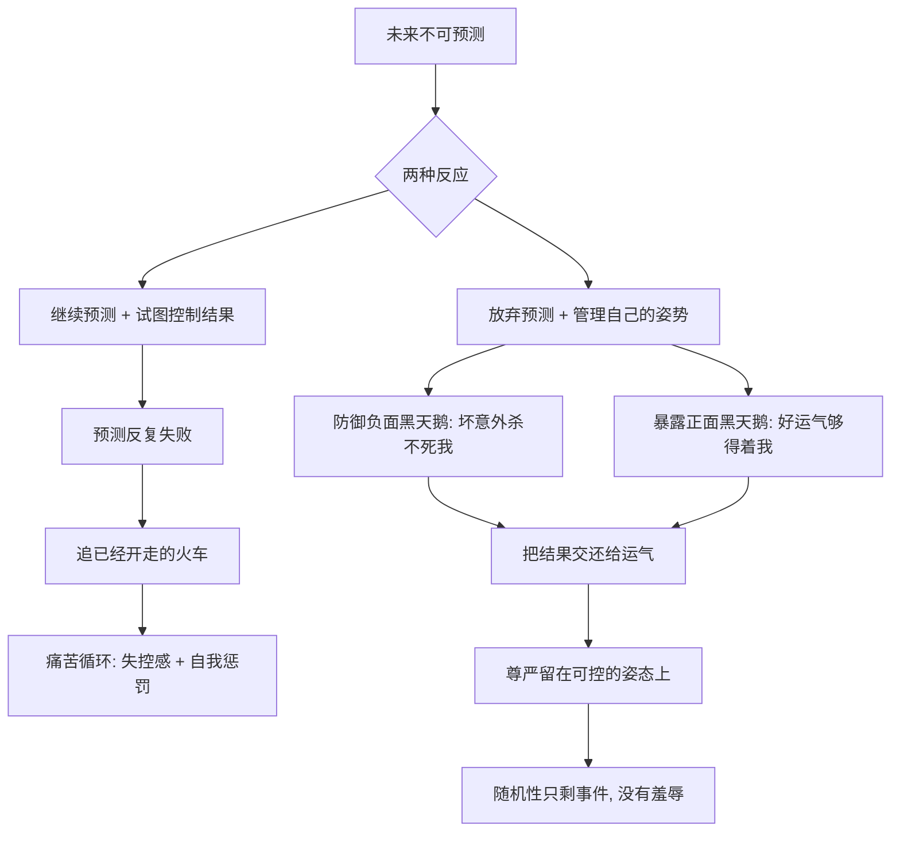

# 15｜既然无法预测，我们该如何生活？

> 本文要解决的问题：塔勒布在全书终点给出的生活态度是什么——当预测被判死刑之后，人应该怎样站立在一个由黑天鹅统治的世界里？

---

## 一、先说结论

接受不可预测，然后只做两件事：**防御负面黑天鹅**——让任何一次意外都杀不死你；**暴露给正面黑天鹅**——让任何一次好运都够得着你。至于心态，塔勒布在书末给出的答案是斯多葛式的：错过火车，只有当你去追它的时候才痛苦。放弃对结果的执念，把尊严放在自己的姿态上——结果归运气，尊严归自己。

## 二、我们先理解一个问题

先把这本书走到这一步的账算清楚。

黑天鹅不可预测——它罕见、影响巨大、只在事后可解释；我们的经验会骗人——火鸡用一千天证明了农场主的善意；我们的大脑会骗人——编故事、看不见失败者、把一万次确认当成证据、拿赌场的概率套真实世界；连专家也救不了我们——长期预测的准确率和抛硬币差不多。

到这里，一个自然的问题是：如果这些都成立，那人还能干什么？难道躺平认命，等运气发落？

这恰恰是塔勒布最反对的误读。不可预测不等于无可作为——它只意味着，「作为」的方向要从「预测世界」换成「改造自己面对世界的姿势」。全书最后一章要回答的就是这个姿势长什么样。

## 三、作者到底提出了什么观点？

塔勒布的答案分三层，一层比一层往里走。

第一层是行动原则：**不预测，做准备。** 既然算不出黑天鹅何时来，就别把资源花在算命上，转而花在结构上——负面向下封底（任何坏意外都不能致命），正面向上敞口（任何好运气都能接住）。杠铃策略管下半句的前半段，正面黑天鹅管后半段。

第二层是痛苦分析。塔勒布在书末写下一个意象：错过火车这件事本身并不制造痛苦，**只有当你拔腿去追它的时候，痛苦才出现**。火车开走了——这是事实；「我不该错过它」「如果早五分钟出门」——这是你追加的刑罚。大多数痛苦不是事件制造的，是「追逐已经无法改变的结果」这个动作制造的。

第三层是尊严归属。塔勒布借用了斯多葛学派的基本区分：世界上有些事归你管，有些事不归你管。结果、运气、别人的评价、宏观的走势——不归你管；你的准备、你的暴露结构、你应对意外的姿态——归你管。把尊严押在前者身上，等于把自己的情绪外包给随机性；收回到后者身上，随机性就只剩「事件」，没有「羞辱」。

## 四、把这个观点翻译成人话

大白话版本：**管不了天，就管好自己的伞和屋顶，然后站直。**

再换一种说法。塔勒布不是让你不努力，而是让你重新标定努力的落点：努力可以改变自己站在哪、穿什么、手里有什么牌，但改变不了骰子掷出几点。把「我必须赢」换成「我必须不输得掉底裤、并且一直在牌桌上」，把「结果必须如意」换成「姿势必须体面」——运气拿走它能拿走的，拿不走你对自己的交代。

「不追火车」的意思也不是错过就错过、毫不在意。它的意思是：火车开走之后，继续跑是纯粹的自我惩罚——车不会因为你跑就回来，你只会把自己累倒在站台上。正确动作是看看下一班车几点，或者干脆想想这趟车值不值得赶。

## 五、为什么会这样？

把塔勒布的心态逻辑画出来，大致是这样：

为什么追火车会制造痛苦？因为追逐隐含一个前提——「结果本来应该由我决定」。而黑天鹅理论已经证明这个前提是假的：极端事件不在你的模型里，就不在你的掌控里。承认这一点，痛苦就失去燃料；不承认，每一次意外都会被你体验成一次「个人失败」，于是你一边被随机性击打，一边替它补刀。

所以塔勒布说这是一种解放：不可预测听起来是坏消息，其实是赦免令——它免除了你「必须为一切结果负责」这项不可能完成的任务。

## 六、举一个现实生活中的例子

回到塔勒布书末那个意象本身。

想象你在站台上看火车关门、启动、离开。此时你面前有两条路：一条是拔腿狂奔，一边跑一边在心里重播「如果我早出门五分钟」「如果刚才不接电话」——车不会停，你只会越来越狼狈，最后扶着膝盖喘气，把一次错过升级成一场崩溃。另一条是停下，看表，查下一班车的时间，或者重新评估这趟行程的必要性。错过的事实完全一样，痛苦的天壤之别来自「追不追」。

把这个意象放大到人生尺度。没赶上那轮暴涨的股票、没买下那套后来翻番的房子、错过那次风口——这些「错过」在事实上都只是火车开走了。真正折磨人的是随后几年里反复去追：反复计算「如果我当初」，反复把今天的不顺归因于那一次错过，用想象出来的平行人生惩罚现实人生。塔勒布指出，这个追逐动作才是痛苦的来源，而不是错过本身。

这背后是斯多葛式态度的核心——塔勒布在书里明确援引了这一传统：把世界分成「归我管的」和「不归我管的」。火车开走不归你管，追不追归你管；市场崩盘不归你管，崩盘前你的仓位归你管；别人给不给你机会不归你管，你有没有出现在机会可能经过的地方归你管。结果那一栏填什么，交给运气；姿态那一栏怎么填，一分不让。这就是「结果归运气，尊严归自己」。

## 七、回到书中重新理解

现在回头看，会发现这个结尾不是鸡汤式的收尾，而是全书逻辑的必然终点。

《黑天鹅》前半部做的是认识论工作——拆掉你对「知道」的自信：你不知道会发生什么，也不知道自己不知道。但如果全书停在破坏上，留下的只是虚无。所以最后一章把工作从认识论切换到伦理学：既然「知道未来」这条路死了，问题就变成「不知道未来时怎么站立」。

塔勒布给出的站立方式，和他全书的批判严丝合缝：不要求你预测（预测已死），只要求你准备（防御加暴露）；不要求你掌控结果（结果归运气），只要求你掌控姿态（尊严归自己）。黑天鹅理论的最终产品不是一只更好的水晶球，而是一种站姿——在随机世界里不弯腰、不追车、不把命运的笔交给运气的站姿。

## 八、这个观点背后还有什么？

第一，这是一次斯多葛哲学的现代翻译。区分可控与不可控、把自我价值锚定在内在而非外在结果上——这是从爱比克泰德到塞内卡的古典资源，塔勒布做的只是把它接到了「极端斯坦」这个现代问题上。他认为，越是不确定的时代，越需要这种老派的态度，因为它不依赖任何对未来的预测。

第二，它是对现代「掌控文化」的反动。五年规划、目标管理、人生设计——现代叙事默认人生是个工程项目，路径可以画出来。塔勒布指出这套默认在黑天鹅世界里是幻觉：真正改写你人生的事件——遇见谁、撞上什么机会、赶上什么时代——都不在项目计划书里。承认这一点不是消极，是把精力从画图纸挪到加固地基。

第三，塔勒布在书末还留了一个更大的反转：**你自己就是一只黑天鹅。** 你的存在是无数个极小概率事件层层叠加的结果——一次相遇、一次迁移、一个偶然的决定，任何一环改写都没有今天的你。他用这个提醒收束全书：活着本身已是极端好运，既然如此，就更不该把自己抵押给下一次随机性的情绪。

## 九、这个观点有问题吗？

说服力是真的。心理学研究大体支持「把注意焦点放在可控因素上」能降低焦虑与无助感；塔勒布的痛苦分析——痛苦来自对不可改变之物的持续对抗——与认知行为疗法的思路方向一致；而「防御加暴露」的行动框架，在前面的讨论里已经站住了。

但争议和边界同样不能省略。第一，「不追火车」有处境前提：对错过末班车、错过签证、错过抢救窗口的人，追是理性的，痛苦是代价而不是幻觉——塔勒布自己有退路、有安全垫，把这套姿态普遍化之前要先问听者有没有不追的本钱。第二，斯多葛式抽离可能滑向事后合理化：把「我不在乎结果」当作不作为的借口、把「运气使然」当作不检查方法的挡箭牌——塔勒布的原意是姿态上抽离、行动上加倍，但口号流传时很容易只剩前半句。第三，「结果归运气」被过度简化时会抹掉一个中间地带：很多事的结果确实不可预测，但概率可以努力改变——复习提高通过率、深耕提高接住机会的能力；彻底不关注结果，可能同时放弃了这部分可争取的空间。第四，一些学者认为，「追火车的冲动」并非纯然有害——后悔和不甘是学习与行动的燃料，完全抽离对结果的在意可能削弱动机；关于斯多葛式态度与现代目标管理孰优，学界存在不同解释，更可能的分工是：用目标管理驱动过程，用斯多葛态度消化结果。

所以更准确的读法是：这是给「不可控部分」开的药方，不是给「可控部分」下的病危通知。塔勒布本人也不会承认生活全是运气——他只是坚持，该拼的是姿势和结构，不是预测和执念。

## 十、今天再看这个观点

以下部分是基于作者思想的现代延伸，不是作者原话。

「不追火车」在今天最需要防的是误读。在「内卷」与「躺平」的语境里，它很容易被读成躺平宣言——别追了，没用。但塔勒布的原意恰恰相反：他要求的是双向的积极——防御做到不留死角，暴露做到面足够宽——然后只对「结果必须如意」这个执念放手。躺平是连准备也放弃，那是另一种把命运交给运气，只是交得更彻底。

同时，这个时代把「追火车」做成了产业。信息流让所有人实时看到所有人赶上的车——别人的融资、别人的爆红、别人的风口——错过感和「追车冲动」被算法持续喂养。用塔勒布的框架看，这等于把全人类的追车痛苦批发化。他的处方在这里反而更锋利：看好自己的下一班车，而不是跑在别人的站台上。

## 十一、这一篇真正应该记住什么？

1. 预测已死，准备永生：防御负面黑天鹅，暴露给正面黑天鹅——这是全部行动纲领。
2. 错过火车只有追它才痛苦：大部分痛苦不是事件制造的，是对不可改变之物的追逐制造的。
3. 结果归运气，尊严归自己：把自我价值锚定在可控的姿态上，随机性就只剩事件、没有羞辱。
4. 你自己就是一只黑天鹅：存在本身是极端好运，不必再把情绪抵押给下一次随机。
5. 全书的最终产品不是水晶球，是站姿——不预测、做准备、不追车。

## 十二、留一个问题

回想你最近一次为「错过」而痛苦——那份痛苦里，有多少来自错过本身，又有多少来自你心里那个还在追火车的人？

而当整本书告诉你：未来不可预测、运气主导一切、专家的水晶球并不比你的亮——最后剩下的问题其实只有一个：你愿意把多大的尊严，押在自己控制不了的东西上？

## 系列收束

这个系列的开头，我们留下过一句话：**真正改变世界的，不是意料之中的累积，而是想不到的那一下。**

走完十五篇再回头看，这句话有了完整的轮廓。我们先认识那只天鹅——罕见、极端、事后才解释得通，历史被它而不是被趋势推动；然后分清两个世界——平均斯坦的温和与极端斯坦的暴烈，高斯钟形曲线管不了后者；接着拆掉大脑的四重骗局——编故事的冲动、看不见的失败者、一万次确认的不堪一击、赌场模型对真实世界的误伤；然后直面预测的破产——认识论傲慢让专家年复一年地错，而混沌与肥尾标出了可预测的边界；最后落到共处——杠铃守住下限，正面黑天鹅敞开上限，错过的火车不追。

塔勒布在书的末尾提醒：你的存在本身就是黑天鹅——无数次偶然叠加才有了读这本书的你。所以这本书最诚实的地方，恰恰在于它不提供答案。它拆掉的是你对确定性的抵押，还给你的是一道需要自己完成的题：下一次黑天鹅来的时候，没有人能告诉你它长什么样、从哪个方向来。但你可以现在就检查自己的姿势——底线守不守得住，暴露够不够宽，火车开走的时候，你站不站得稳。

这就是全部了。剩下的路，请带着你自己的理解走。
